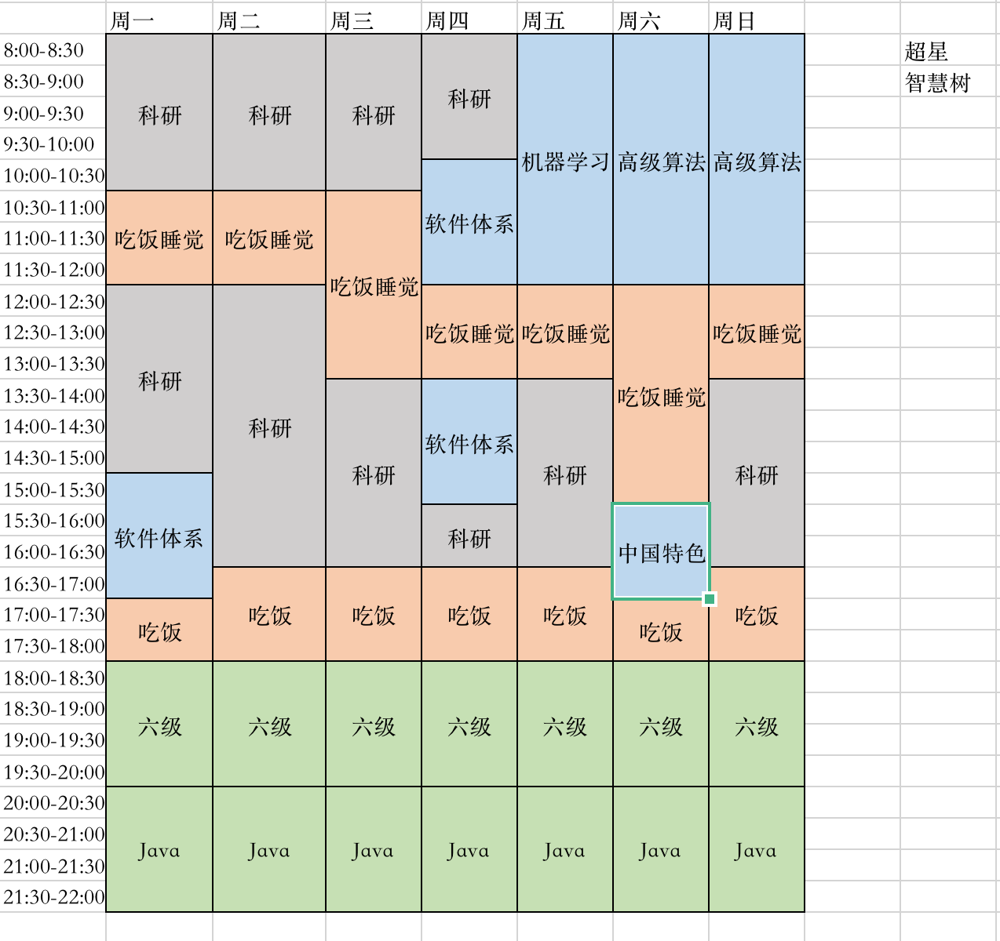

科研、上课、就业、考试

假设18点开始自己的。

1.  6级考试：每日2小时
2.  java学习：每日2小时

22点回寝。

六级共47P，47小时，需47天。约12月。

Java基础共200小时。考完六级后增加每日时常。

礼拜一，15-17上课。上午8-10.30，12-15，2.5+3=**5.5小时**

礼拜二，无课。上午8-10.30，12-16.30，2.5+4.5=**7小时**

礼拜三，无课。上午8-10.30，12-16.30，2.5+4.5=**7小时**

礼拜四，10-15上课。上午8-9.30，15.30-16.30，1.5+1.5=**3小时**

礼拜五，8-12上课。13-16.30，**3.5小时**

礼拜六，8-12上课。15-17上课。13-14.30，**1.5小时**

礼拜天，8-12上课。13-16.30，**3.5小时**

6-8周，每周共31小时科研学习。共28小时java+六级。

## 细节

礼拜一，8-10.30科研。10.30-12吃饭睡觉。12-15科研。15-17上课。18-20六级，20-22java。

礼拜二，8-10.30科研。10.30-12吃饭睡觉。12-16.30科研。16.30-18吃饭休息。18-20六级，20-22java。

礼拜三，8-10.30科研。10.30-12吃饭睡觉。12-16.30科研。16.30-18吃饭休息。18-20六级，20-22java。

礼拜四，8-10科研。10-15上课。15.30-16.30科研。16.30-18吃饭休息。18-20六级，20-22java。

礼拜五，8-12上课。13-16.30科研。16.30-18吃饭休息。18-20六级，20-22java。

礼拜六，8-12上课。13-14.30科研。15-17上课。17-18吃饭休息。18-20六级，20-22java。

礼拜天，8-12上课。13-16.30科研。16.30-18吃饭休息。18-20六级，20-22java。

##  new

