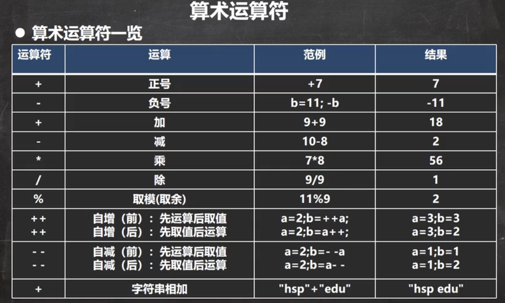
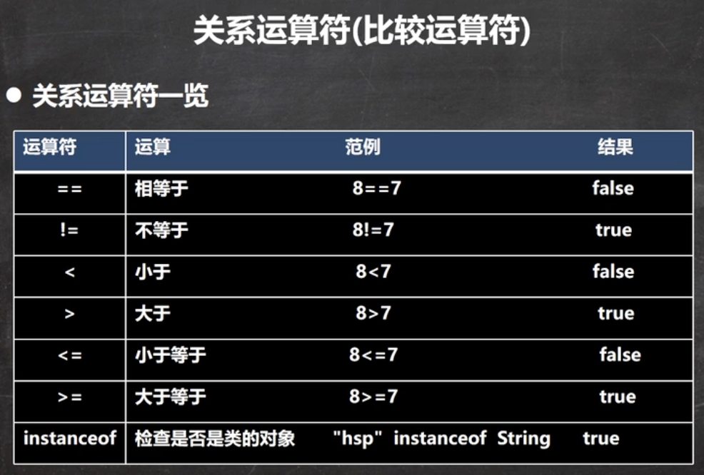
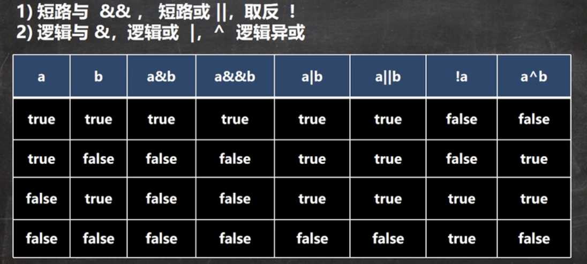
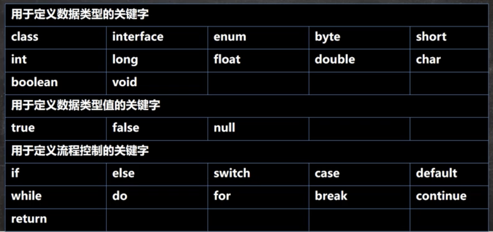

[课程](https://www.bilibili.com/video/BV1fh411y7R8?spm_id_from=333.999.0.0)

# 章1 Java概述

## java特点

1.  面向对象oop，封装，继承，多态

2.  健壮性，强类型机制、异常处理、垃圾回收机制

3.  跨平台性，即一个编译好的.class文件可以在多个系统下运行。

4.  解释型语言【js、php、java】，编译后的代码需要解释器来运行。

    编译型语言【c、c++】，编译后代码能直接执行。

## java运行机制及运行过程

### java核心机制-Java虚拟机JVM

1.  JVM是一个虚拟计算机，具有指令集并使用不同的存储区域。负责执行指令，管理数据、内存 、寄存器，包含在JDK中。
2.  对于不同的平台有不同的虚拟机。JVM for Linux/Windows/Mac。
3.  Java虚拟机机制屏蔽了底层运行平台的差别，实现一次编译，到处运行。

### 运行过程

编译指令：javac，将.java文件编译成.class文件。

运行指令：java，运行.class文件。

### 什么是编译

-   通过编译器将java源文件编译成JVM可以识别的字节码文件。
-   在该源文件目录下，通过javac编译工具对.java文件进行编译。
-   如果程序没有错误，没有错误提示信息，则会出现一个.class文件，称为字节码文件，是可以执行的java程序。

### 什么是运行

有了可执行的java程序，通过运行工具java.exe对字节码文件进行执行，本质是将.class文件装载到jvm机执行。

## JDK、JRE

### JDK

-   Java Development Kit，Java开发工具包。

-   JDK=JRE+Java开发工具（java，javac，javadoc，javap等）。

-   开发人员用JDK，安装了JDK就不用装JRE了。


### JRE

-   Java Runtime Environment，Java运行环境。

-   JRE=JVM+Java核心类库。
-   如果只想运行开发好的.class文件，只用安装JRE。

## 开发细节注意事项

1.  java严格区分大小写。
2.  每个语句以；结尾。
3.  大括号成对出现。
4.  一个源文件中只能有一个public类，其余类不限，如果有多个类，每个类编译后都对应一个.class文件。
5.  如果包含public类，则文件名必须按该类名命名。
6.  main方法可以放在非public类中，然后指定运行非public类，这样入口方法就是非public类的main方法。可以通过单独运行那个类

### 快速入门Hello World，Hello.java

需求说明：开发Hello.java程序，可以输出“hello world”。

开发步骤：

1.  将Java代码编写到名为Hello.java的文件中。
2.  通过javac命令对java文件进行编译，生成.class文件。
3.  通过java命令对.class文件进行运行。

```java
// 1、public class Hello，表示Hello是一个类，是一个公有类
// 2、Hello{}，表示一个类的开始和结束
// 3、public static void main(String[] args)，表示一个主方法
// 4、main(){}，表示方法的开始和结束
// 5、System.out.println("hello world")，表示输出到屏幕
// 6、;表示语句结束
public class Hello {
	// main方法
	public static void main(String[] args) {
		System.out.println("hello world～");
	}
}
```

------

# 章2 变量

### 变量

变量是程序的基本组成单位，变量的三个基本要素（类型+名称+值）

变量相当于内存中的一个数据存储空间的表示，通过变量名可以访问到变量值。

### 变量使用步骤，Var01.java

```java
// 声明变量
int a；
//赋值
a=60;
//使用，System.out.println(a);输出
System.out.println(a);
//也可以使用 int a = 60;
```

### 变量使用注意事项，Var02.java

1.  变量表示内存中的一个存储区域（不同的变量，类型不同，占用空间大小不同）
2.  该区域有自己的名称（变量名）和类型（数据类型）
3.  变量必须先声明，后使用
4.  该区域的数据可以在同一类型范围内不断变化
5.  变量在同一个作用域内不能重名
6.  变量三要素，变量=变量名+值+数据类型

### 快速入门，Var03.java

```java
public class Var02{
	public static void main(String[] args) {
		//记录人的信息
		int age = 30;
		double score = 88.9;
		char gender = '男';
		String  name = "king";
		//输出信息
		System.out.println("人的信息如下：");
		System.out.println(name);
		System.out.println(age);
		System.out.println(score);
		System.out.println(gender);
	}
}
```

### 程序中+号的使用，Plus.java

1.  当左右两边都是数值型时，则做加法运算
2.  当左右两边有字符串时，则做拼接运算
3.  运算顺序从左到右

```java
System.out.println(100+88);//188
System.out.println("100"+88);//10088
System.out.println(100+3+"hello");//103hello
System.out.println("hello"+100+3);//hello1003
```

## Java数据类型

每一种数据都定义了明确的数据类型，在内存中分配不同大小的内存空间。

-   基本数据类型
    -   数值型
        -   整数类型(byte[1],short[2],int[4],long[8])
        -   浮点类型(float[4],double[8]）
    -   字符型(char[2])
    -   布尔型(boolean[1])
-   引用数据类型
    -   类(class)
    -   接口(interface)
    -   数组([ ])

## 基本数据类型

## 整数类型

| 类型  | 占用存储空间 | 范围         |
| ----- | ------------ | ------------ |
| byte  | 1字节        | -128~127     |
| short | 2字节        | -2^15~2^15-1 |
| int   | 4字节        | -2^31~2^31-1 |
| Long  | 8字节        | -2^63~2^63-1 |

### 整型使用细节，IntDetail.java

1.  Java各整数类型有固定的范围和字段长度，不受具体操作系统的影响，以保证java程序的可移植性
2.  Java的整型常量默认为int型，声明long型常量需要加‘l’或‘L’
3.  Java程序中变量常声明为int，除非不足以表示大数，才使用long

## 浮点类型

Java的浮点类型可以表示一个小数。

| 类型         | 占用存储空间 | 范围                  |
| ------------ | ------------ | --------------------- |
| float单精度  | 4字节        | -3.403E38～3.403E38   |
| double双精度 | 8字节        | -1.798E308～1.798E308 |

### 说明

1.  浮点数=符号位+指数位+尾数位
2.  尾数部分可能丢失，造成精度损失

### 浮点型使用细节，FloatDetail.java

1.  与整数类型相似，Java浮点类型也有固定的范围和字段长度，不受操作系统影响。
2.  Java浮点型常量默认为double，声明float常量，需要加‘f’或‘F'。
3.  浮点型常量有两种表示形式
    1.  十进制形式：5.12，512.0f，.512
    2.  科学计数法形式：5.12e2（5.12乘10的2次方），5.12E-2
4.  通常情况使用double型，因为比float精度更高
5.  浮点数使用陷阱。2.7和8.1/3，小数运算会有精度问题，可以设置精度误差来判断是否相等。

## 字符类型

### 单个字符，Char01.java

单个字符用char，两个字节，可以存放汉字。

### 字符型使用细节，CharDetail.java

1.  字符常量是**单引号**括起来的单个字符，双引号表示字符串。
2.  可以用转义字符‘\’来将后面的字符变为特殊字符型常量
3.  char的本质是一个整数，输出时是unicode码对应的字符
4.  可以给char赋一个整数，输出时按照unicode字符输出
5.  char类型可以进行运算，相当于一个整数

## 布尔类型，Boolean01.java

1.  boolean类型，允许取值true或false
2.  占一个字节
3.  通常在流程控制中使用

### 使用细节

1.  不可以用0或非0的整数代替true或false

## 基本数据类型的转换

### 自动类型转换,AutoConvert.java

在进行赋值或者运算时，精度小的类型自动转换为精度大的数据类型

char>int>long>float>double

byte>short>int>long>float>double

### 自动类型转换使用细节，AutoConvertDetail.java

1.  当有多种类型的数据混合运算时，系统首先自动将所有数据转换成容量最大的数据类型，然后在进行计算
2.  当我们吧精度大的数据类型赋值给精度小的数据类型时，就会报错，反之会进行自动类型转换
3.  byte、short和char之间不会相互自动转换
4.  boolean不参与转换
5.  自动提升原则：表达式结果的类型自动提升为操作数中最大的类型。

### 强制类型转换，ForceConvert.java

将容量大的数据类型转换为容量小的类型，可能造成精度降低或译出

### 强制类型转换使用细节，ForceConvertDetail.java

1.  当进行数据从大到小转换时，需要强制转换
2.  强转符号只针对于最近的操作数有效，往往会使用小括号来提升优先级
3.  char类型可以保存int 的常量值，但不能保存int的变量值，需要强转
4.  byte、short、char类型在进行运算时，当作int类型处理

### 练习，Convert.java

```java
//判断是否能通过编译
//1.
short s = 12;
s = s - 9; //错误: 不兼容的类型: 从int转换到short可能会有损失
//2.
byte b =10;
b = b+11;//错误: 不兼容的类型: 从int转换到byte可能会有损失
b=(byte)(b+11);
//3.
char c ='a';
int i =16;
float d = .314F;
double result =c+i+d;
//4.
byte b2 =16;
short s2 =14;
short t =s2+b2;//错误: 不兼容的类型: 从int转换到short可能会有损失
```

## 基本数据类型和String类型的转换

在程序开发中，我们需要将基本数据类型转换成String类型。或者将String类型转换成基本数据类型。

-   基本类型转String，StringToBasic.java

    语法：将基本类型的值+“”即可

-   String转基本数据类型

    语法：通过基本类型的包装类调用parseXX方法

### 注意事项，StringToBasicDetail.java

在将String转为基本数据类型时，要确保String能够转成有效的数据，比如可以将“123”转为整数，但不能将“hello”转为整数

## 本章练习

```java
//1.程序阅读题，看看输出什么？
//Homework01.java
public class Homework01{
    public static void main(String[] args) {
    	int n1;
    	n1 = 13;
    	int n2;
    	n2 = 17;
    	int n3;
    	n3 = n1 + n2;
    	System.out.println("n3=" + n3);
    	int n4 = 38;
    	int n5 = n4 - n3;
    	System.out.println("n5=" + n5);
    }
}
//2.使用char类型分别保存\n \t \r \\ 1 2 3 ，并打印输出。 	
//Homework02.java
public class Homework02{
	public static void main(String[] args) {
		//使用char类型，分别保存 \n \t \r \\ 1 2 3 ，并打印输出
		char c1 = '\n';
		char c2 = '\t';
		char c3 = '\r';
		char c4 = '\\';
		char c5 = '1';
		char c6 = 'a';
		System.out.println(c1);
	}
}
//3.编程实现如下效果
//Homework03.java
//姓名 年龄 成绩 性别 爱好
//XX   XX  XX  XX   XX
//要求：1.用变量将姓名、年龄、成绩、性别、爱好储存
//2.使用+
//3.添加转义字符，使用一条输出语句输出

```

------

#  章3 运算符

### 运算符介绍

运算符是一种特殊的符号，用以表示数据的运算、赋值和比较

-   算数运算符
-   赋值运算符
-   关系运算符
-   逻辑运算符
-   位运算符
-   三元运算符

## 算数运算符

算数运算符是对数值类型的变量进行运算的，在Java程序中使用的非常多。



### 算数运算符的使用，ArithmeticOperator.java

1.  +、-、*、/、%、++、--
2.  自增++
    1.  作为独立的语句使用：前++和后++都等价于i=i+1
    2.  作为表达式使用：前++先自增后赋值，后++先赋值后自增
3.  取模的本质是 a % b = a - a / b * b

###  运算符练习，ArithmeticOperatorExercise01.java

```java
int i = 1;
i = i++;
System.out.println(i);

int j =1;
j = ++j;
System.out.println(j);
```

### 运算符练习2，ArithmeticOperatorExercise02.java

```java
//假如还有59天放假，问：合xx星期零x天
int week = 59 / 7;
int day = 59 % 7;
System.out.println(week + "星期" + day + "天");
```

## 关系运算符

-   关系运算符的结果都是boolean型的。
-   常用在if结构条件或循环结构的条件中



### 关系运算符的使用，RelationalOperator.java

```java
		int a = 9;
		int b = 8;
		System.out.println(a>b);
		System.out.println(a>=b);
		System.out.println(a<=b);
		System.out.println(a<b);
		System.out.println(a==b);
		System.out.println(a!=b);
```

## 逻辑运算符



## 赋值运算符

将某个运算后的值赋值给变量

基本赋值运算符 =

复合赋值运算符 += -= /= %=

a += b等价于 a = a + b

### 赋值运算符使用，AssignOperator.java

```java
int n1 = 10;
n1 += 4;
System.out.println(n1);//14

//复合赋值运算符会进行类型转换
byte b = 3;
b += 2;//等价于 b = (byte)(b + 2)
```

## 三元运算符

### 语法，TernaryOperator.java

条件表达式 ? 表达式1 : 表达式2;

如果条件表达式为true，运算后结果为表达式1；

如果条件表达式为false，运算后的结果是表达式2；

## 标识符的命名规则和规范

### 标识符概念

Java对各种变量、方法和类等命名时使用的字符序列称为标识符

### 标识符的命名规则

1.  由英文字母大小写、数字、下划线或$组成
2.  不可以数字开头
3.  不可以使用关键字和保留字
4.  Java严格区分大小写
5.  标识符不能包含空格

### 标识符的命名规范

1.  包名：所有字母都小写：aaa.bbb.ccc
2.  类名、接口名：所有单词首字母大写
3.  变量名方法名：第一个单词首字母小写，之后每个单词首字母大写
4.  常量名：所有字母都大写，多单词由下划线连接

### 关键字

被Java赋予了特殊含义用作专门用途的字符串



## 键盘输入语句，Input.java

在编程中需要接受用户的输入数据，可以使用键盘输入语句获取。

### 步骤

1.  导入该类的所在包，java.util.*
2.  创建该类对象
3.  调用功能

### 跳二进制、位运算

------

# 章4 控制结构

### 流程控制

程序运行的流程控制决定程序是如何执行的

-   顺序控制
-   分支控制
-   循环控制

## 顺序控制

程序从上到下的执行，中间没有判断和跳转

## 分支控制

### 单分支，If01.java

```java
//语法：
if(条件表达式){
	执行代码块;
}
```

当条件表达式为true时，执行{}中的代码，如果为false则不执行

### 双分支，If02.java

```java
//语法：
if(条件表达式){
	执行代码块1;
}
else{
	执行代码块2；
}
```

当条件表达式为true时，执行代码块1中的代码，如果为false则执行代码块2中的代码

### 多分支，If03.java

```java
//语法：
if(条件表达式1){
	执行代码块1;
}
else if(条件表达式2){
	执行代码块2;
}
...
else{
	执行代码块n;
}
```

如果条件表达式1为true时，执行代码块1中的代码

如果为false，判断条件表达式2是否成立，如果为true，执行代码块2中的代码，

如果为false，执行else的代码块

### 嵌套分支

在一个分支中又完整的嵌套了另一个完整的分支结构，里面的分支结构称为内层分支，外边的称为外层分支。

```java
if(){
	if(){}
	else{}
}
```

不要嵌套超过3层。

### switch分支，Switch01.java

```java
switch(表达式){
case 常量1:语句块;break;
case 常量2:语句块;break;
...
default: default语句块;
}
```

### switch使用细节，SwitchDetail.java

-   表达式数据类型，应和case 后的常量类型一致，或可以自动转换成互相比较的类型，比如输入是字符，常量是int
-   switch(表达式)中表达式的返回值必须是:(byte、short、int、char、enum、String)
-   case子句中的值必须是常量，不能是变量
-   default子句是可选的，当没有匹配的case时，执行default
-   break语句用来在执行完一个case分支后使程序跳出switch语句块，如果没有写break，程序会顺序执行到switch结尾

### switch练习，SwitchExercise.java

```java
import java.util.Scanner;
public class SwitchExercise {
    public static void main(String[] args) {
        //使用switch 把小写类型的char型转为大写
        //只转换a,b,c,d,e.其他为other
        Scanner scan = new Scanner(System.in);
        char input = scan.next().charAt(0);
        switch(input){
            case 'a':System.out.println('A');break;
            case 'b':System.out.println('B');break;
            case 'c':System.out.println('C');break;
            case 'd':System.out.println('D');break;
            case 'e':System.out.println('E');break;
            default:System.out.println("other");
        }
    }
}
```

### Switch练习2，SwitchExercise2.java

```java
import java.util.Scanner;
public class SwitchExercise2 {
    public static void main(String[] args) {
        //根据指定月份，打印该月份所属季节
        //3 4 5春季，6 7 8夏季，9 10 11秋季，12 1 2冬季
        Scanner scan = new Scanner(System.in);
        int input = scan.nextInt();
        if(input>12||input<1){
            System.out.println("输入错误");
        }
        else{
            switch((int)(input/3)){
                case 1:System.out.println("春季");break;
                case 2:System.out.println("夏季");break;
                case 3:System.out.println("秋季");break;
                default:System.out.println("冬季");
            }
        }
    }
}
```

## 循环控制

### for循环

```java
for(循环变量初始化;循环条件;循环变量迭代){
	循环操作;
}
```

for四要素

-   循环变量初始化
-   循环条件
-   循环操作
-   循环变量迭代

### 注意事项和细节

1.  循环条件是返回一个布尔值的表达式
2.  初始化和变量迭代可以写到其他地方，但两边的分号不能省略
3.  循环初始值可以有多条初始化语句，但要求类型一样，并且中间用逗号隔开，循环变量迭代也可以有多条，中间用逗号隔开

### for练习,ForExercise.java

```java
public class ForExercise {
    public static void main(String[] args) {
        //打印1～100之间所有9的倍数的整数，统计个数及总和
        int count = 0;
        int sum = 0;
        for(int i=1;i<=10;i++){
            if(i%9==0){
                count++;
                sum+=i;
            }
        }
        System.out.println(count+","+sum);
    }
}
```

### while循环

```java
循环变量初始化;
while(循环条件){
	循环体(语句);
	循环变量迭代;
}
```

### while注意事项和细节说明

1.  循环条件是返回一个布尔值的表达式
2.  while循环是先判断再执行语句

### while练习，WhileExercise.java

```java
public class WhileExercise {
    public static void main(String[] args) {
        //打印1-100间所有能被3整除的数
        int i=1;
        while(i<=100){
            if(i%3==0){
                System.out.println(i);
            }
            i++;
        }
    }
}
```

### Do while循环

```java
循环变量初始化;
do{
	循环体;
	循环变量迭代
}while(循环条件);
```

说明

1.  先执行再判断，也就是，至少执行一次
2.  最后有一个分号

### 多重循环控制

1.  将一个循环放在另一个循环体内，就形成嵌套循环
2.  嵌套循环就是把内层的循环当成外层循环的循环体

### 多重循环控制练习，MulForExercise.java

```java
public class MulForExercise {
    public static void main(String[] args) {
        //九九乘法表
        for(int i=1;i<10;i++){
            for(int j=1;j<=i;j++){
                System.out.print(j+"x"+i+"="+i*j+"  ");
            }
            System.out.println();
        }
    }
}
```

多重循环控制练习，MulForExercise2.java

```java
import java.util.Scanner;
public class MulForExercise2 {
    public static void main(String[] args) {
        Scanner scan = new Scanner(System.in);
        int input = scan.nextInt();
        //打印金字塔，接收一个整数表示层数
        for(int i=1;i<=input;i++){
            for(int j=0;j<i;j++){
                System.out.print("x");
            }
            System.out.println();
        }
        //换一种
        for(int i=1;i<=input;i++){
            for(int j=0;j<input-i;j++){
                System.out.print(" ");
            }
            for(int j=0;j<i;j++){
                System.out.print("x");
            }
            for(int j=0;j<i-1;j++){
                System.out.print("x");
            }
            System.out.println();
        }
        //空心金子塔
        for(int i=1;i<=input;i++){
            for(int j=0;j<input-i+1;j++){
                System.out.print(" ");
            }
            System.out.print("x");
            for(int j=0;j<i-1;j++){
                System.out.print(" ");
            }
            for(int j=0;j<i-2;j++){
                System.out.print(" ");
            }
            if(i!=1){
                System.out.print("x");
            }
            System.out.println();
        }
        for(int i=0;i<input*2+1;i++){
            System.out.print("x");
        }
        System.out.println();
    }
}
```

## 跳转控制语句

###  break语句

用于终止某个语句块的执行，一般使用在switch或循环中

### break细节

1.  break语句出现在多层嵌套的语句块中时，可以通过标签指明要终止的是哪一层语句块
2.  标签的使用
    1.  break可以指定退出哪层
    2.  label是标签，由程序员指定
    3.  break后指定哪个label就退出到哪里
    4.  尽量不要用标签
    5.  如果没有指定break，默认退出最近的循环体

### continue语句

用于结束本次循环，继续执行下一次循环

### return语句

使用在方法中，表示跳出所在方法。

## 本章练习

```java
public class Homework01 {
    //Homework01.java，
    //编程实现如下功能
    //某人有100000元，每经过一次路口，需要交费：
    //当现金>50000时，每次交5%
    //当现金<=50000时，每次交1000
    //计算该人可以经过多少次路口，要求使用while break方式完成
    public static void main(String[] args) {
        int acount=100000;
        int count=0;
        while(true){
            if(acount>50000){
                acount-=acount*5/100;
            }
            else{
                acount-=1000;
            }
            count++;
            if(acount<1000){
                break;
            }
        }
        System.out.println(count);
    }
}
import java.util.Scanner;

public class Homework02 {
    public static void main(String[] args) {
        //Homework02.java
        //实现判断一个整数，属于哪个范围：大于0，小于0，等于0
        Scanner scan = new Scanner(System.in);
        int input = scan.nextInt();
        if(input>0){
            System.out.println("大于0");
        }
        else if(input<0){
            System.out.println("小于0");
        }
        else{
            System.out.println("等于0");
        }
    }
}
public class Homework03 {
    public static void main(String[] args) {
        //Homework03.java
        //输出1-1000内水仙花数，水仙花数指一个三位数，各个位上数字立方和等于其本身
        //例如，153=1*1*1+5*5*5+3*3*3
        for(int i=99;i<1000;i++){
            int bai=i%100/10;
            int shi=i/10%10;
            int ge=i%10;
            if(bai*bai*bai+shi*shi*shi+ge*ge*ge==i){
                System.out.println(i);
            }
        }
    }
}
public class Homework04 {
    public static void main(String[] args) {
        //Homework04.java
        //输出小写的a-z和大写的Z-A
        for(int i=0;i<26;i++){
            System.out.print((char)(97+i));
        }
        System.out.println();
        
        for(int i=0;i<26;i++){
            System.out.print((char)(90-i));
        }
        System.out.println();
    }
}
public class Homework05 {
    public static void main(String[] args) {
        //Homework05.java
        //求1+（1+2）+（1+2+3）+...+（1+2+3+...+100）的结果
        int sum=0;
        for(int i=1;i<=100;i++){
            sum+=i;
            for(int j=1;j<i;j++){
                sum+=j;   
            }
        }
        System.out.println(sum);
    }
}
```

------

# 章5 数组、排序和查找

## 数组

  数组可以存放多个同一类型的数据，数组也是一种数据类型，是引用类型

### 快速入门，Array01.java

```java
//double[] 表示是double类型的数组
double[] a = {3,5,1,3.4,2,50};
double sum = 0;
for(int i=0;i<a.length;i++){
    sum+=a[i];
    System.out.println(a[i]);
}
System.out.println(sum);
```

### 使用方式

### 动态初始化1，Array02.java

```java
//数据类型 数组名[] = new 数据类型[大小]
//声明并开辟空间
int a[] = new int[5];
```

### 动态初始化2

```java
//先声明数组
int[] b;
//创建数组
//数组名 = new 数据类型[大小];
a = new int[10];
```

### 静态初始化

```java
//数据类型[] 数据名 = {元素值1,元素值2..}
int[] a={2,3,4,5,6};
```

### 数组使用细节

-   数组是多个相同类型数据的组合，实现对这些数据的统一管理
-   数组中的元素可以是任何数据类型，包括基本类型和引用类型，但不能混用
-   数组创建后，如果没有赋值，有默认值
-   数组下标从0开始
-   数组下标必须在指定范围内使用，否则报下标越界异常
-   数组属于引用类型，数组型数据是对象。

### 数组练习

```java
public class ArrayExercise {
    public static void main(String[] args) {
        //ArrayExercise.java
        //创建一个char类型的26个元素的数组，分别放置‘A'-'Z'，使用for循环访问所有元素并打印
        char[] array=new char[26];
        for(int i=0;i<26;i++){
            array[i]=(char)(65+i);
        }
        for(int i=0;i<26;i++){
            System.out.println(array[i]);
        }
    }
}

public class ArrayExercise2 {
    public static void main(String[] args) {
        //ArrayExercise2.java
        //求出数组int[]的最大值{4,-1,9,10,23},并得到对应下标
        int[] array={4,-1,9,10,23};
        int max=array[0];
        int index=0;
        for(int i=0;i<array.length;i++){
            if(max<array[i]){
                max=array[i];
                index=i;
            }
        }
        System.out.println("max="+max+",index="+index);
    }
}
```

### 数组赋值机制，ArrayAssign.java

基本数据类型赋值，值是具体的数据，相互不影响，赋值方式为值传递

数组在默认情况下是引用传递，赋的值是地址

### 数组拷贝，ArrayCopy.java

```java
public class ArrayCopy {
    public static void main(String[] args) {
        //要求数据空间是独立的
        int[] arr1={10,20,30};
        //先创建一个新的数组，开辟新数据空间
        int[] arr2=new int[arr1.length];
        //遍历arr1，把每个元素拷贝到对应位置
        for(int i=0;i<arr1.length;i++){
            arr2[i]=arr1[i];
        }
    }
}
```

### 数组反转,ArrayReverse.java

```java
public class ArrayReverse {
    public static void main(String[] args) {
    //ArrayReverse.java
        int[] arr={1,2,3,4,5,6};
        int temp;
        for(int i=0;i<arr.length;i++){
            temp=arr[i];
            arr[i]=arr[arr.length-i-1];
            arr[arr.length-i-1]=temp;
        }
        for(int j=0;j<arr.length;j++){
            System.out.print(arr[j]);
        }
        System.out.println();
    }
}

public class ArrayReverse2{
    public static void main(String[] args) {
        //ArrayReverse2.java
        //逆序赋值方式
        int[] arr={1,2,3,4,5,6};
        int[] arr2=new int[arr.length];
        for(int i=0;i<arr.length;i++){
            arr2[i]=arr[arr.length-1-i];
        }
        for(int i=0;i<arr2.length;i++){
            System.out.print(arr2[i]);
        }
            System.out.println();
    }
}
```

### 数组扩容，ArrayAdd.java

实现动态的给数组添加元素

```java
import java.util.Scanner;
public class ArrayAdd {
    public static void main(String[] args) {
        //原始数组使用静态分配 int[] arr ={1,2,3}
        //增加元素4，直接放在数组最后 arr={1,2,3,4}
        //用户可以通过如下方法来决定是否继续添加，添加成功，是否继续？y/n

        Scanner scan = new Scanner(System.in);
        int[] arr={1,2,3};
        while(true){
            System.out.println("输入添加的元素");
            int inputNum = scan.nextInt();
            int[] arrnew = new int[arr.length+1];
            for(int i=0;i<arr.length;i++){
                arrnew[i]=arr[i];
            }
            arrnew[arrnew.length-1]=inputNum;
            
            System.out.println("arrnew=");
            for(int i=0;i<arrnew.length;i++){
                System.out.print(arrnew[i]);
            }
            arr = arrnew;
            System.out.println("\n添加成功，是否继续？y/n");
            char input2 = scan.next().charAt(0);
            if(input2=='n'){
                break;
            }
        }
    }
}
```

## 排序

-    内部排序

    将所需要处理的所有数据都加载到内存中进行排序。包括（交换式排序、选择排序、插入排序）

-   外部排序

    数据量过大，无法全部加载到内存中，需要借助外部存储进行排序。包括（合并排序、直接合并排序）

### 冒泡排序，BubbleSort.java

```java
public class BubbleSort{
    public static void main(String[] args) {
        int[] arr = {24,69,80,57,13};
        int temp=0;
        for(int i=0;i<arr.length;i++){
            for(int j=i+1;j<arr.length;j++){
                if(arr[i]>arr[j]){
                  temp=arr[i];
                  arr[i]=arr[j];
                  arr[j]=temp;  
                }
            }
        }
        for(int i=0;i<arr.length;i++){
            System.out.println(arr[i]);
        }
    }
}
```

## 查找

顺序查找

二分查找

## 二维数组

### 快速入门，TwoDimensionalArray01.java

```java
public class TwoDimensionalArray01 {
    public static void main(String[] args) {
        /* 
        二维数组输出
        0 0 0 0 0 0
        0 0 1 0 0 0
        0 2 0 3 0 0
        0 0 0 0 0 0
        */

        // 1、从定义形式上看 int[][]
        // 2、原来的一位数组的每个元素是一位数组
        int[][] arr = {{0,0,0,0,0,0},{0,0,1,0,0,0},
                        {0,2,0,3,0,0},{0,0,0,0,0,0}};
        //输出二维图形
        for(int i=0;i<arr.length;i++){
            for(int j=0;j<arr[i].length;j++){
                System.out.print(arr[i][j]+" ");
            }
            System.out.println();
        }
    }
}
```

### 动态初始化1

```java
// 类型[][] 数组名 = new 类型[大小][大小]
int a[][]=new int[2][3];

```

### 动态初始化2

```java
//先声明 类型 数组名[][]
//再开辟空间
int[][] a;
a = new int[2][3]
```

### 动态初始化3

```java
int[][] arr = new int[3][];//创建二维数组，确定一维数组的个数
for(int i =0;i<arr.length;i++){
	//给每个一维数组开空间
	arr[i] = new int[i+1];
}
```

### 静态初始化

```java
//类型 数组名[][] ={{值1、值2},{值3、值4}}
int[][] arr = {{1,1,1},{2,2,2}};
```

### 练习，杨辉三角，Yanghui.java

```java
public class Yanghui {
    public static void main(String[] args) {
        /* 
            1
            11
            121
            1331
            14641
        */
        int[][] yanghui = new int[6][];
        yanghui[0]=new int[1];
        yanghui[0][0]=1;
        for(int i=1;i<yanghui.length;i++){
            yanghui[i] = new int[i+1];
            for(int j=0;j<i+1;j++){
                if(j==0||j==i){
                    yanghui[i][j]=1;
                }
                else{
                    yanghui[i][j]=yanghui[i-1][j-1]+yanghui[i-1][j];
                }
            }
        }
        for(int i=0;i<yanghui.length;i++){
            for(int j =0;j<yanghui[i].length;j++){
                System.out.print(yanghui[i][j]+" ");
            }
            System.out.println();
        }
    }
}
```

### 使用细节

声明方式

```
int[][] y
int[] y[]
int y[][]
```

## 本章作业

```java
import java.util.Scanner;

public class Homework1 {
    public static void main(String[] args) {
        // 已知升序的数组，要求插入一个元素，该数组顺序依然是升序
        // 比如[10,12,45,90]添加23后，数组为[10,12,23,45,90]
        int[] arr = { 10, 12, 45, 90 };
        int[] newarr = new int[arr.length + 1];
        Scanner scan = new Scanner(System.in);
        int input = scan.nextInt();
        int temp = newarr.length-1;
        for (int i = 0; i < arr.length; i++) {
            if (arr[i] > input) {
                temp = i;
                break;
            }
        }
        for (int j = 0; j < temp; j++) {
            newarr[j] = arr[j];
        }
        newarr[temp] = input;
        for (int j = temp+1; j < newarr.length; j++) {
            newarr[j] = arr[j - 1];

        }
        for (int i = 0; i < newarr.length; i++) {
            System.out.print(newarr[i] + " ");
        }
    }
}
```

------

# 面向对象

## 类与对象

对象由**属性**和**行为**构成

创建对象

```java
//先声明再创建
Cat cat;
cat = new Cat();
// 直接创建
Cat cat = new Cat();
```


### 快速入门，Object01.java

```java
public class Object01 {
    public static void main(String[] args) {
        //实例化一只猫
        //new Cat() 创建一只猫
        // Cat cat1=new Cat();把创建的猫赋给cat1
        //cat1 就是一个对象
        Cat cat1 = new Cat();
        cat1.name="小白";
        cat1.age=3;
        cat1.color="白色";
        //实例化第二只猫
        Cat cat2 = new Cat();
        cat2.name="小花";
        cat2.age=100;
        cat2.color="花色";

        //怎么使用
        System.out.println("第1只猫的信息"+cat1.name+" "+cat1.age+" "+cat1.color);
        System.out.println("第2只猫的信息"+cat2.name+" "+cat2.age+" "+cat2.color);
    }
}

//定义一个猫类
class Cat{
    //属性
    String name;//名字
    int age;//年龄
    String color;//颜色
    //行为
}
```

### 属性/成员变量

从概念上看，成员变量=属性=field（字段）

属性是类的一个组成部分，一般是基本数据类型，也可以是引用类型

### 属性细节

1.  属性的定义语法同变量。访问修饰符 属性类型 属性名;

    访问修饰符 public protected 默认、private

2.  属性的定义类型可以为任意类型

3.  属性如果不赋值，有默认值

### 内存分配机制

思考：

```java
//定义一个人类Person(名字，年龄)
Person p1 = new Person();
p1.age=10;
p1.name="小明";
Person p2 = p1;//把p1赋给p2
System.out.println(p2.age);
```

p2.age究竟是多少？

## 成员方法

### 快速入门，method01.java

### 方法调用

1.  当程序执行到方法时，就会开辟一个独立的空间
2.  当方法执行完毕，或者执行到return语句，就会返回
3.  返回到调用方法的地方
4.  返回后，继续执行方法后面的代码
5.  当main方法执行完毕，整个程序退出

### 成员方法的好处

-   提高代码的复用性
-   可以将实现的细节封装起来，然后供其他用户来调用即可

### 成员方法的定义

```java
访问修饰符 返回数据类型 方法名(参数列表){
    方法体;
    return 返回值;
}
```

1.  访问修饰符：public protected 默认 private
2.  参数列表：表示成员方法输入
3.  数据类型：表示成员方法输出，void表示没有返回值
4.  方法主体：表示为了实现某一功能代码块
5.  return语句不是必须的

### 注意细节,MethodDetail.java

返回值

1.  一个方法最多有一个返回值,怎么返回多个返回值，可以返回数组
2.  返回类型可以为任意类型，包含基本类型或引用类型
3.  如果方法要求有返回数据类型，则方法体中最后的执行语句必须为return值，而且要求返回值类型必须和return的值类型一致或兼容
4.  如果方法是void，则方法体中可以没有return语句，或者只写return ;

参数列表

1.  一个方法可以有0个参数，也可以有多个参数，中间用逗号隔开
2.  参数类型可以为任意类型，包含基本类型或引用类型
3.  调用带参数的方法时，一定对应着参数列表传入相同类型或兼容类型
4.  方法定义时的参数称为形式参数，方法调用时的参数称为实际参数。

方法调用

1.  同一个类中的方法调用：直接调用即可
2.  跨类中的 方法A类调用B类方法：需要通过对象名调用

### 练习，MethodExercise01.java

编写类AA，有一个方法：判断一个数时奇数odd还是偶数，返回boolean

### 成员方法传参机制

基本数据类型
