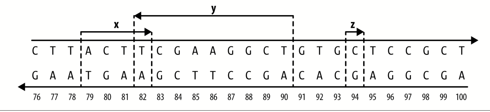

### Part III. Practice: Bioinformatics Data Skills

好的，一上来我们就看到了有关Unix data tools和R语言的介绍，先跳过，详细R语言学习转[R语言基础](/note/2021/09/11/r语言基础)，开始第九部分，

### **working with range data**

幸运的是，对于生物信息学家来说，地球上每一个生命分支的每个基因组都由染色体序列组成，这些染色体序列可以用同样的方式在计算机上表示：作为一组核苷酸序列（基因组变异和组装不确定性除外）。每个单独的序列代表一个参考DNA分子，它可能对应于完全组装的染色体，或部分组装基因组中的支架或重叠。尽管核苷酸序列是线性的，但它们也可能代表已切割的生物圆形染色体（例如，带有质粒或线粒体）。除了包含核苷酸序列（生命的As、Ts、Cs和Gs）外，这些参考序列还充当我们描述基因组中所有东西位置的坐标系。此外，由于这些染色体序列的单位是单个碱基对，因此我们无法用更精细的分辨率来确定基因组上的位置。

**使用这个坐标系，我们可以将基因组上的位置或区域描述为线性染色体序列上的一个范围。为什么这很重要？许多类型的基因组数据与特定的基因组区域相关，该区域可以表示为包含染色体上连续位置的范围。注释数据和基因组特征（如基因模型）、遗传变异（如SNP和插入/删除）、转座因子、结合位点以及统计数据（如成对多样性和GC含量）都可以表示为线性染色体序列上的范围。从全基因组重新测序、RNA-Seq、ChIP-Seq和亚硫酸氢盐测序等实验中获得的测序读取比对数据也可以表示为范围。一旦我们的基因组数据被表示为染色体上的范围，我们就可以使用大量的范围操作来处理诸如查找和计算重叠、计算覆盖率、查找最近的范围以及从特定范围提取核苷酸序列等任务。一旦我们将数据表示为范围，并将我们的问题重新塑造为一个范围操作可以解决的问题，诸如找到哪些SNP与编码序列重叠，或计算与外显子重叠的读取比对数等具体问题就有了简单、通用的解决方案**。

正如我们将在本章中看到的，已经有软件库（如R的Genomic Ranges）和命令行工具（bedtools）实现了范围操作以解决我们的问题。在幕后，这些实现依赖于特殊的数据结构（如区间树）来提供极快的范围操作，这使得它们不仅是解决许多问题的最简单方法，也是最快的方法。

### 基因组范围和坐标的速成班

那么范围究竟是什么呢？范围是整数区间，表示序列（如染色体）上连续位置的子序列。我们使用整数区间，因为碱基对是离散的，我们不能有像50403503.53这样的分数基因组位置。范围本身仅指定沿着单一序列的一个区域，如染色体；要指定基因组区域或位置，我们需要三条必要的信息：

**染色体名称**

这也称为序列名（允许未完全组装的序列，如支架或重叠）。每个基因组都是由一组染色体序列组成的，所以我们需要指定一个范围中的哪一个。不幸的是，在整个生物学中，染色体名称没有标准的命名方案（这会让你头疼）。染色体名称的示例（格式不同）包括“chr17”、“22”、“chrX”、“Y”和“MT”（用于线粒体）或“HE667775”或“scaffold_1648”等支架。这些染色体名称始终与某些特定的基因组组装版本有关，并且可能因版本而异。

**范围**

例如，114414997至114693772或3173498至3179449。范围是我们在染色体序列上指定单个子序列的方式。每个范围由开始位置和结束位置组成。与染色体名称一样，在生物信息学中没有标准的方法来表示一个范围。范围的技术细节非常重要，因此我们将在下一步更详细地讨论它们。

**链**

因为染色体DNA是双链的，所以特征可以位于正向（正）或反向（负）链上。染色体上的许多特征是链特异性的。例如，由于蛋白质编码外显子只有在翻译到合适的链上时才具有生物学意义，因此我们需要指定这些特征位于哪个链上。

这三个组分构成一个基因组范围（也称为基因组间隔）。请注意，因为参考基因组是范围的坐标系，所以范围完全链接到特定的基因组版本。换句话说，基因组位置是相对于参考基因组的，所以在处理和谈论范围时，我们需要指定它们相对于的基因组版本。

为了了解线性序列上的范围是什么样的，图9-1描绘了沿着一段染色体的三个范围。范围x和y相互重叠（一个碱基对重叠），而范围z不重叠任何其他范围（并且仅跨越一个碱基对）。范围x和z都位于正向DNA链上（注意箭头的方向性），它们的基本核苷酸序列分别为ACTT和C；范围y位于反向链上，其核苷酸序列为AGCTTCGA。



figure9-1

尽管代表和处理基因组范围带来了便利，但不幸的是，我们需要注意一些棘手的细节。首先，生物信息学数据格式（参考见表9-1）和软件程序使用两种不同的量程系统：

•基于0的坐标系，具有半闭半开的间隔。•基于1的坐标系，具有闭合的间隔。

使用基于0的坐标系时，序列的第一个基是位置0，最后一个基的位置是序列的长度-1。在这个基于0的坐标系中，我们使用半闭半开的间隔。诚然，这些半闭半开区间起初可能有点不直观。在解释这些区间时，最容易从数学中借用一些符号。对于某些开始和结束位置，半闭半开区间写为[start，end]。括号表示区间范围内包含一个位置（换句话说，区间在此端闭合），而括号表示区间范围内不包含一个位置（区间在此端打开）因此，像[1,5]这样的半封闭半开放区间包括位置1,2,3和4处的基底（如图9-2所示）。你可能想知道为什么我们会使用一个不包括末端位置的系统，但我们将在讨论基于1的坐标系之后讨论这个问题。事实上，如果你熟悉Python，你已经见过这种类型的区间系统：Python的字符串（和列表）索引为0，并使用半闭半开的间隔对字符串的部分进行索引：

```
>>>"CTTACTTCGAAGGCTG"[1:5]
'TTAC'
```

第二个flavor是1-based的。正如您可能已经猜到的，对于1-based的系统，序列的第一个基数被赋予位置1。因为位置的计算和自然数一样，所以序列中的最后一个位置总是等于它的长度。对于我们在生物信息学中遇到的基于1的系统，范围表示为闭合区间。在我们前面看到的符号中，这只是[开始，结束]，意味着开始和结束位置都包含在我们的范围内。如图9-2所示，覆盖0-based的范围[1,5]的相同基数也包含在基于1的范围[2,5]中。R对其向量和字符串使用基于1的索引，使用substr（）提取字符串的一部分使用闭合间隔：

```
substr("CTTACTTCGAAGGCTG",2,5)
'TTAC'
```

### 小结

这段是在讲坐标系的区间。简单说就是python的索引相对于直接下标要减1，然后举了几个library的例子，是0-based还是1-based。

粗略的看了一下之后的内容，是对数据进行一系列处理，我觉得需要看一下相关的中文教程来学习。


### 从这里到哪里去？

生物信息学数据技能是为熟悉脚本和一点Unix的读者设计的，但在如何将这些技能应用于日常生物信息学问题方面就不太熟悉了。在本书中，我们看到了许多其他工具，并学习了解决生物信息学中几乎任何问题的重要技能（以及运行的工具，如对齐器、汇编程序等）。你将从这里走向何方？

首先，我建议你学习更多的统计和概率。这一点怎么强调都不为过。在学习了本书中的技能并根据真实世界的数据加以磨练之后，成为一名精通生物信息学的下一步是学习统计学和概率。实践技能主要是计算能力；将过剩的基因组学数据转化为有意义的生物学知识，关键取决于你使用统计学的能力。同样，理解概率论并掌握将其应用于生物学问题的技能，可以为你提供一种全新的解决问题的方法。即使在您自己的工作中应用简单的概率方法，也可以将您从令人不快的启发式方法中解放出来，并且通常工作得更好。此外，许多新的创新生物信息学方法是建立在概率模型的基础上的，熟悉潜在的概率力学对于理解这些方法为什么有效以及在哪些条件下可能无效至关重要。

其次，我建议学习计算机科学的一些基本主题，特别是算法和数据结构。在生物信息学中，我们不断地需要处理大量的数据，而采用不必要的计算效率低下的方法太容易了。通常，研究人员需要更多的计算能力来并行化代码，如果编写效率更高，这些代码可以很容易地在桌面计算机上运行。幸运的是，设计高效的软件和脚本只需要对算法和数据结构有一些基本的了解。我还建议学习用于对齐器和汇编程序的专门生物信息学算法；对这些算法有深入的了解可以帮助您理解生物信息学软件的局限性，并选择正确的工具（如果您愿意，可以开发自己的工具！）。

有关这些主题的更多说明，请参阅本章GitHub上的自述文件。我已经在那里收录了我最喜欢的关于这些主题的书籍，并将继续添加其他我发现的书籍。最后，在你成为一名熟练的生物信息学家的道路上，我能给你的最后一条建议是使用源代码。换句话说，阅读代码，阅读大量代码（尤其是从比你更熟练的程序员那里）。开发编程技能90%是关于多年来编写、调试和与代码搏斗的经验。但在这个过程中，阅读和学习他人的代码就像一条秘密捷径。虽然一开始盯着别人数十万行复杂的代码看可能会让人望而生畏，但同时，你可以增强自己快速理解代码的能力，同时学习一个比你更聪明的程序员的技巧。随着时间的推移，阅读他人代码的练习将奖励您更好的编程技能。

