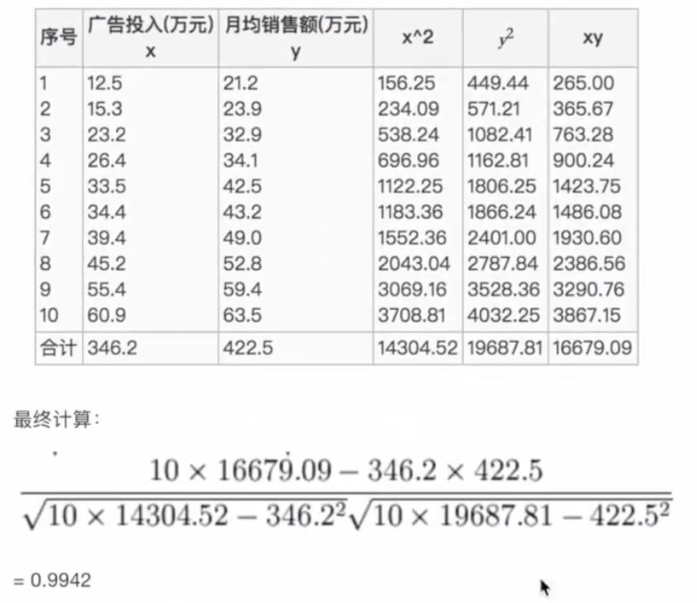

## 可用数据集

-   sklearn数据集
-   [Kaggle网址](https://www.kaggle.com/datasets)
-   [UCI数据集网址](http://archive.ics.ucl.edu/ml/)

### sklearn包含

分类、回归、聚类、降维、模型选择、特征工程

### scikit-learn数据集

sklearn.datasets

-   加载获取流行数据集

-   datasets.load_*()

    #获取小规模数据集，数据包含在datasets中

-   datasets.fetch_*(data_home=None)

    #获取大规模数据集，第一个参数data_home表示数据集下载的目录，默认是~/scikit_learn_data/

```python
#加载并返回鸢尾花数据集
sklearn.datasets.load_iris()
#sklearn数据集返回介绍
#load和fetch返回的数据类型datasets.base.Bunch
#data：特征数据数组，是二维numpy.ndarray
#target：标签数组，是一维numpy.ndarray
#DESCR：数据描述
#feature_names：特征名
#target_names：标签名
```

## 数据集划分

### 划分成两个部分

1.  训练数据：用于训练、构建模型
2.  测试数据：在模型检验时使用，用于评估模型是否有效

### 划分比例

1.  训练集：70% 80% 75%
2.  测试集：30% 20% 25%

### sklearn数据集划分api

```python
sklearn.model_selection.train_test_split(arrays,*options)
#x数据集的特征值
#y数据集的标签值
#test_size 测试集的大小
#random_state 随机数种子
#return 训练集特征值，测试集特征值，训练集目标值，测试集目标值
x_train,x_test,y_train,t_test=train_test_split(iris.data,iris.target,test_size=0.2,random_state=22)
```

训练集特征值，测试集特征值，训练集目标值，测试集目标值

x_train，x_test，y_train，y_test

## 特征工程

数据和特征决定了机器学习的上限，而模型和算法只是逼近这个上限

pandas：数据清洗、数据处理

sklearn：特征工程

### 特征提取

将任意数据转化为可用于机器学习的数字特征

-   字典特征值提取
-   文本特征提取
-   图像特征提取

特征提取api

```python
sklearn.feature_extraction
```

### 字典特征提取

```python
#对字典数据进行特征值化
sklearn.feature_extraction.DictVectorizer(sparse=True,...)#将sparse设为False返回正常矩阵
DictVectorizer.fit_transform(X)
#X:字典或包含字典的迭代器
#返回值:sparse矩阵,稀疏矩阵，节省内存
DictVectorizer.inverse_transform(X)
#X:数组或者矩阵
#返回值:转换之前数据格式
DictVectorizer.get_feature_names()#返回类别名称
```

应用场景：特征比较多

1.  将数据集的特征转化为字典类型
2.  dictVectorizer转换
3.  数据本身是字典类型

### 文本特征提取

单词作为特征

CountVectorizer，统计每个样本特征词的个数

```python
sklearn.feature_extraction.text.CountVectorizer(stop_words=[])#返回词频矩阵，stop_words以列表形式传入停用词，可以搜索停用词表
CountVectorizer.fit_tansform(X)
#X:文本或者包含文本字符串的可迭代对象
#返回值:sparse矩阵
CountVectorizer.inverse_transform(X)
#X:数组或者sparse矩阵
#返回值:转换之前的数据格式
CountVecotrizer.get_feature_names()
#返回单词列表
```

此处有中文文本提取及Tf-idf（词频）未学习，[链接](https://www.bilibili.com/video/BV1nt411r7tj?p=10&spm_id_from=pageDriver)

### sparse矩阵转换

1.   字典特征值提取时，可以在实例化DictVectorizer时设置sparse属性为False
2.   如果矩阵是sparse类型，可以用.toarray()转换


## 特征预处理

### 什么是特征预处理？

通过一些转换函数将特征数据转换成更加适合算法模型的特征数据过程。

### 为什么要归一化/标准化？

特征的单位或者大小相差较大，或者某特征的方差相比其他的特征要大出几个数量级，容易影响目标结果，使一些算法无法学习到其他特征

要将数据进行无量纲化，将数据转换成同一规格

## 归一化

通过对原始数据进行变换，把数据映射到（默认为0，1）之间

公式
$$
X'=(x-min)/(max-min)
$$

max为一列的最大值，min为一列的最小值

$$
X''=X'*(mx-mi)+mi
$$

X''为最终结果，mx，mi分别为指定区间，默认mx=1，mi=0

###  特征预处理api

```python
sklearn.preprocessing.MinMaxScaler(feature_range=(0,1))
MinMaxScalar.fit_transform(X)
#X:numpy ndarray格式的数据[n_sample,n_features]
#返回值:相同形状的array
```

## 标准化

将原始数据进行变换，把数据变换到均值为0，标准差为1 的范围内，在已有样本足够多的情况下比较稳定。

**公式**
$$
X'=(x-mean)/σ
$$
作用于每一列，mean为平均值，σ为标准差

标准差：集中程度

对于归一化来说：如果出现异常点，影响了最大值最小值，那么结果显然会发生改变

对于标准化来说：如果出现异常点，由于有一定数据量，少量的异常点对于平均值影响并不大，从而方差改变较小

### 标准化api

```python
sklearn.preprocessing.StandardScaler()
#处理之后，对每列来说所有数据都聚集在均值为0附近，标准差为1
StandardScaler.fit_transform(X)
#X:numpy ndarray格式的数据[n_samples,n_features]
#返回值：转换后形状相同的array
```

##  降维

降维是指在某些限定条件下，降低随机变量个数，得到一组“不相关”主变量的过程

降低随机变量的个数

### 特征选择

数据中包含冗余或相关变量，旨在从原有特征中找出主要特征。

方法

-   **filter过滤**：主要探究特征本身特点、特征与特征和目标值之间关联
    -   方差选择法：低方差特征过滤
    -   相关系数
-   **embedded嵌入**：算法自动选择特征
    -   决策树：信息熵、信息增益
    -   正则化：L1、L2
    -   深度学习：卷积等

## 过滤式

### 低方差特征过滤

删除低方差的一些特征，再结合方差大小来考虑这个方式的角度。

-   特征方差小：某个特征大多样本的值比较相近
-   特征方差大：某个特征很多样本的值都有差别

### api

```python
sklearn.feature_selection.VarianceThreshold(threshold=0.0)
#删除所有低方差特征，threshold临界值
Variance.fit_transform(X)
#X:numpy array格式的数据[n_samples,n_features]
#返回值:训练集差异低于threshold的特征将被删除。默认值是保留所有非零方差特征，即删除所有样本中具有相同值的特征。
```

### 相关系数

皮尔逊相关系数，反映变量之间相关关系密切程度的统计指标

**公式**
$$
r=\frac{n\sum xy-\sum x \sum y}{\sqrt{n\sum x^2-(\sum x)^2}\sqrt{n\sum y^2-(\sum y)^2}}
$$
计算过程



**特点**

相关系数的值介于-1与+1之间，即-1<=r<=+1，性质如下：

-   当r>0时，表示两变量正相关，r<0时，两变量为负相关
-   当|r|=1时，表示两变量完全相关，当r=0时，表示两变量间无相关关系
-   当0<|r|<1时，表示两变量存在一定程度的相关。且|r|越接近1，两变量间线性关系越密切，|r|越接近0，表示两变量的线性相关越弱
-   一般可按三级划分：|r|<0.4为低度相关，0.4<=|r|<0.7为显著性相关，0.7<=|r|<1为高度线性相关

当相关性很高时：

1.  选取其中一个
2.  加权求和
3.  主成分分析

### api

```python
from scipy.stats import pearsonr
r=pearsonr(data["pe_ratio"],data["pb_ratio"])
#x:(N,) array_like
#y:(N,) array_like    
```

### 主成分分析PCA

定义：高维数据转化为低维数据的过程，在此过程中可能会舍弃原有数据、创造新的变量

作用：尽可能降低原数据的复杂度

应用：回归分析或聚类分析

过程：找到一个合适的直线，通过矩阵运算得出主成分分析结果

### api

```
sklearn.decomposition.PCA(n_components=None)
#将数据分解为较低维数空间
#n_components:小数表示保留百分之几的信息，整数表示减少到多少特征
PCA.fit_transform(X)
#X:numpy ndarray格式数据[n_samples,n_features]
#返回值：转换后指定维度的array
```

### 案例：探究用户对物品类别的喜好细分降维

数据如下：

order_products_prior.csv：订单与商品信息

字段：**order_id**，**product_id**，add_to_cart_order，reordered

products.csv：商品信息

字段：**product_id**，product_name，**aisle_id**，department_id

orders.csv：用户的订单信息

字段：**order_id**，**user_id**，eval_set，order_number，...

aisles.csv：商品所属具体物品类别

字段：**aisle_id**，aisle

1、需要将user_id 和 aisle放在一个表中——合并表

2、找到user_id和aisle——交叉表和透视表

3、特征有大量冗余——PCA降维

### 

