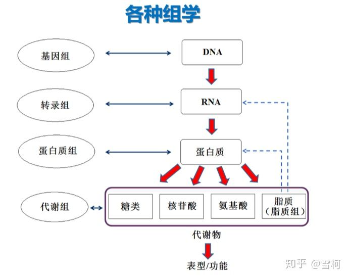
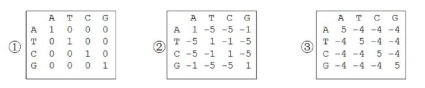

[资料来源](https://zhuanlan.zhihu.com/p/262198184)

### 测序概念

[测序讲解](https://www.bilibili.com/video/BV1oa4y1H7CU?p=5)

**Sanger测序**：优点，方便简单，分辨率高，测序片段长，流程细致，结果直观可视，缺点，测序试剂昂贵，通量低。

RNA-seq：通过测定所有RNA的序列，统计所有RNA的数量，衡量基因表达水平

**1、高通量测序（High-throughput sequencing，HTS）**：是对传统Sanger测序（一代测序技术）革命性的改变, 一次对几十万到几百万条核酸分子进行序列测定, 因此在有些文献中称其为下一代测序技术(next generation sequencing，NGS ), 同时高通量测序使得对一个物种的转录组和基因组进行细致全貌的分析成为可能, 所以又被称为深度测序(Deep sequencing)。

**2、下一代测序（Next Generation Sequencing，NGS）**：也叫做二代测序或者高通量测序。是指相对于Sanger为主的第一代测序技术来说的，其特点是测序产量高，读长短，价格便宜。现在通常所说的二代测序技术，主要包括ABI的solid测序，罗氏的454测序技术、Life 公司的Ion Torrent测序技术和illumina公司的Hiseq、miseq测序技术等。当前最主要的是指illunina测序。

**3、全基因组测序 （Whole Genome Sequecing，WGS）**：是指利用高通量测序平台对人类不同个体或群体进行全基因组测序，并在个体或群体水平上进行生物信息分析的技术手段。全基因组测序可全面挖掘 DNA 水平的遗传变异，包括较大的结构性变异，为筛选疾病的致病及易感基因，研究发病及遗传机制，以及推断种群迁徙和进化等提供重要信息。全基因组测序可以检测人基因组上SNP突变，INDEL突变之外，还可以用于检测拷贝数变异CNV和结构变异SV，融合基因，病毒整合位点检测，非编码区突变检测等。

**4、全外显子组测序（Whole Exon Sequencing，WES）**：也就是只测序基因组上的外显子区域。目前主要用于人基因组的研究，也包括一些小鼠等。人类基因组中约有180,000个外显子，占人全部基因组的1%，约30M。外显子测序是利用探针杂交富集外显子区域的DNA序列，然后通过高通量测序，主要用于研究基因组上编码区域的信息。WES只包含了基因组上外显子的信息，而WGS则覆盖了所有的遗传信息。相比于WGS，WES可以进行大样本高深度的测序。

**5、转录组测序**：转录组即特定细胞在某一功能状态下所能转录出来的所有RNA的总和，包括mRNA和非编码RNA。转录组研究是基因功能及结构研究的基础和出发点，通过新一代高通量测序，能够全面快速地获得某一物种特定组织或器官在某一状态下的几乎所有转录本及基因序列，已广泛应用于基础研究、临床诊断和药物研发等领域。

转录组是对某一个体/组织/细胞在某一时间或状态下所有基因表达情况进行检测的结果。通过与对照组进行比对，发掘在某一特定条件下行使功能的特定基因。

**6、全基因组重测序**：全基因组重测序是对已知基因组序列的物种进行不同个体的基因组测序，并在此基础上对个体或群体进行差异性分析。全基因组重测序的个体，通过序列比对，可以找到大量的单核苷酸多态性位点（SNP），插入缺失位点（InDel，Insertion/Deletion）、结构变异位点（SV，Structure Variation）位点。SBC可以协助客户，通过生物信息手段，分析不同个体基因组间的结构差异， 同时完成注释。

**7、Chip-seq**：染色质免疫共沉淀技术（ChromatinImmunoprecipitation，ChIP）也称结合位点分析法，是研究体内蛋白质与DNA相互作用的有力工具，通常用于转录因子结合位点或组蛋白特异性修饰位点的研究。将ChIP与第二代测序技术相结合的ChIP-Seq技术，能够高效地在全基因组范围内检测与组蛋白、转录因子等互作的DNA区段。

**8、Hi-C测序**：Hi-C技术源于染色体构象捕获（Chromosome Conformation Capture, 3C）技术，利用高通量测序技术，结合生物信息分析方法，研究全基因组范围内整个染色质DNA在空间位置上的关系，获得高分辨率的染色质三维结构信息。Hi-C技术不仅可以研究染色体片段之间的相互作用，建立基因组折叠模型，还可以应用于基因组组装、单体型图谱构建、辅助宏基因组组装等，并可以与RNA-Seq、ChIP-Seq等数据进行联合分析，从基因调控网络和表观遗传网络来阐述生物体性状形成的相关机制。

**9、单细胞测序（Single-cell sequencing**）：单细胞测序是指DNA研究中涉及测序单细胞微生物相对简单的基因组，更大更复杂的人类细胞基因组。

**10、亚硫酸氢盐测序（Bisulfite sequencing，BS-seq ，methseq）：**先使用亚硫酸氢盐处理DNA，然后上机测序来确定甲基化模式，用亚硫酸氢盐处理DNA可将胞嘧啶残基（C）转化为尿嘧啶（U），但5-甲基胞嘧啶残基（5mC）对其有抗性，并不会发生转变。

**11、ATAC-seq：**该技术利用DNA转座酶技术实现染色质可及性分析，DNA转座酶可将自身结合的一段序列随机插入到基因组中。紧密包裹的染色质DNA不会受到转座酶打断，而开放区域的染色质DNA可以被转座酶随机插入并打断。然后将这些打断后的DNA收集在一起进行后续的建库、测序、分析、即可得到开放染色质的信息。另外两种研究开放染色质区域的技术如下：

1.   DNase-seq: 染色质开放区域的DNA是可以被DNaseI内切酶切割的，然后我们再对切割完的DNA片段进行测序，再将测序结果比对到全基因组上就能得知被切掉的区域位置。但这种方法耗时耗力，而且重复性较差。

2.   MNase-seq: 它和DNase技术互补，主要是利用外切酶将含有核小体包裹的区域切割下来并测序，反向比较获得开放性染色质区域。缺点与DNase差不多。

### 组学概念

**12、功能基因组学(functional genomics)：**又往往被称为后基因组学（Postgenomics），它利用结构基因组所提供的信息和产物，发展和应用新的实验手段，通过在基因组或系统水平上全面分析基因的功能，使得生物学研究从对单一基因或蛋白质得研究转向多个基因或蛋白质同时进行系统的研究。这是在基因组静态的碱基序列弄清楚之后转入对基因组动态的生物学功能学研究。研究内容包括基因功能发现、基因表达分析及突变检测。基因的功能包括：生物学功能，如作为蛋白质激酶对特异蛋白质进行磷酸化修饰；细胞学功能，如参与细胞间和细胞内信号传递途径；发育上功能，如参与形态建成等。采用的手段包括经典的减法杂交，差示筛选，cDNA代表差异分析以及mRNA差异显示等，但这些技术不能对基因进行全面系统的分析，新的技术应运而生，包括基因表达的系统分析（serial analysis of gene expression,SAGE），cDNA微阵列（cDNA microarray），DNA 芯片（DNA chip）和序列标志片段显示（sequence tagged fragmentsdisplay）。

**13、比较基因组学(comparative genomics)：**比较基因组学(ComparativeGenomics)是基于基因组图谱和测序基础上，对已知的基因和基因组结构进行比较，来了解基因的功能、表达机理和物种进化的学科。利用模式生物(model organism)基因组与人类基因组之间编码顺序上和结构上的同源性，克隆人类疾病基因，揭示基因功能和疾病分子机制(Molecular Mechanisms)，阐明物种进化关系，及基因组的内在结构。

**14、表观遗传学：**表观遗传学是研究基因的核苷酸序列不发生改变的情况下，基因表达了可遗传的变化的一门遗传学分支学科。表观遗传的现象很多，已知的有DNA甲基化（DNAmethylation），基因组印记（genomicimpriting），母体效应（maternaleffects），基因沉默（genesilencing），核仁显性，休眠转座子激活和RNA编辑（RNA editing）等。

**15、蛋白质组学：**蛋白质组学，是以蛋白质组为研究对象，研究细胞、组织或生物体蛋白质组成及其变化规律的科学

**16、基因组学：**基因组学是对生物体所有基因进行集体表征、定量研究及不同基因组比较研究的一门交叉生物学学科。基因组学主要研究基因组的结构、功能、进化、定位和编辑等，以及它们对生物体的影响。

**17、代谢组学：**代谢组学利用高通量、高灵敏度与高精确度的现代分析技术，对细胞、有机体分泌出来的体液中的代谢物的整体组成进行动态跟踪分析，借助多变量统计分析方法，来辩识和解析被研究对象的生理、病理状态及其与环境因子、基因组成等的关系。“代谢组学”是一种整体性的研究策略，其研究策略有点类似于通过分析发动机的尾气成分，来研究发动机的运行规律和故障诊断等的“反向工程学”的技术思路。由于代谢组学着眼于把研究对象作为一个整体来观察和分析，也被称为“整体的系统生物学”。

### 关于序列比对

**18、替换打分矩阵：**替换记分矩阵是反映残基之间相互替换率的矩阵。也就是说，它描述了残基两两相似的量化关系，DNA 序列的替换记分矩阵主要有三种。一个是等价矩阵，另一种是转换-颠换矩阵，还有一种叫 BLAST 矩阵

**19、Needleman-Wunsch** ：经典的全局比对算法是 Needleman-Wunsch 算法。1970 年，Needleman 和 Wunsch 首先将动态规划法应用于两条序列的全局比对，后来这个算法就称为 Needleman-Wunsch 算法。今天，所有比对软件使用的算法都是从这个经典算法衍生出来的。

**20、MEME：**MEME 是一款寻找序列基序（motif）的软件。在核酸或蛋白质序列中存在一些有特定模式的序列片段，这些片段称为序列的基序（motif）。序列的基序与生物功能密切相关，MEME 是 The MEME Suite 在线软件套装中的一员（ [http://meme-suite.org/）。MEME](https://link.zhihu.com/?target=http%3A//meme-suite.org/%EF%BC%89%E3%80%82MEME) 的使用非常简单，只需要将待分析的序列上传即可。而且，上传的序列为原始序列，不需要提前为它们做多序列比对。你也可以指定返回排名前几的基序。MEME 的等待时间稍长，大约 10 分钟以上，所以最好留下邮箱。

**20、WebLogo：**寻找保守区域：序列标识图 WebLogo序列标识图就是序列的 logo，它是以图形的方式依次绘出序列比对中各个位置上出现的残基，每个位置上残基的累积可以反应出该位置上残基的一致性。每个残基对应图形字符的大小与残基在该位置上出现的频率成正比。但图形字符的大小并不等于频率百分比，而是经过简单统计计算后转化的结果。如果某一列非常保守，字母高度就高。反之，如果某一列没有什么特征，各种残基都有出现，杂乱无章，那么就会看到一堆比较矮的字母摞在一起

**21、TCOFFEE：**TCOFFEE 是一个非常流行的多序列比对工具。TCOFFEE 与 CLUSTAL 系列在所使用的算法上类似，准确度上比 CLUSTAL 系列略高，但计算耗时也比 CLUSTAL 系列略高。最关键的是 TCOFFEE 有很多种变形，也就是说它有更多的功能。许多网站都提供 TCOFFEE的在线使用，比如 EMBL 的多序列比对工具里就有 TCOFFEE。但是这次，我们从 TCOFFEE的网站（ [T-COFFEE Multiple Sequence Alignment Server](https://link.zhihu.com/?target=http%3A//tcoffee.crg.cat/)）做多序列比对。

**21、BLAST：**BLAST 实际上是综合在一起的一组工具的统称，它不仅可用于直接对蛋白质序列数据库和核酸序列数据库进行搜索，而且可以将待搜索的核酸序列翻译成蛋白质序列后再进行搜索，或者反之，以提高搜索效率。因此 BLAST 可以分为 BLASTp，BLASTn，BLASTx，tBLASTn和 tBLASTx。

BLASTp 也就是用蛋白质序列搜索蛋白质序列数据库，

BLASTn 是用核酸序列搜索核酸序列数据库，这是最直接也是最常用的两种 BLAST。

BLASTx 是将核酸序列按 6 条链翻译成蛋白质序列后搜索蛋白质序列数据库

tBLASTn 是用蛋白质序列搜核酸序列数据库，核酸数据库中的核酸序列要按 6 条链翻译成蛋白质序列后再被搜索

tBLASTx。它是将核酸序列按 6 条链翻译成蛋白质序列后搜索核酸序列数据库，核酸数据库中的所有核酸序列也要按 6 条链翻译成的蛋白质序列后再被搜索

### 树

**19、进化树**：英文Evolutionary Trees。在生物学中，用来表示物种之间的进化关系，又称“系统树”、“系谱树”。生物分类学家和进化论者根据各类生物间的亲缘关系的远近，把各类生物安置在有分枝的树状的图表上，简明地表示生物的进化历程和亲缘关系。

**20、分子树(molecular tree)**：依据分子数据构建的反映分子系统发育的树。

**30、系统发生树（英文：Phylogenetic tree）**：又称为演化树（evolutionary tree），是表明被认为具有共同祖先的各物种间演化关系的树。是一种亲缘分支分类方法（cladogram）。在树中，每个节点代表其各分支的最近共同祖先，而节点间的线段长度对应演化距离（如估计的演化时间）。

### 计算距离

**31、MP 最大简约法（maximal parsimony）**：假设4种核苷酸或者20中氨基酸可以突变为与其自身不同的任何一种，这样对于任何一个给定的拓朴结构，可以推断每个位点的祖先状态。对这一拓朴结构，可以计算出用来解释整个进化过程所需核苷酸或者氨基酸的最小替代数。对所有可能正确的拓朴结构进行这种计算，并挑选出所需替代数最小的拓朴结构作为最优系统树。

**32、NJ 邻接法（neighbour joining）**：是距离法中的一种，这种方法并不检验所有可能的拓朴结构，但在物种聚合时要应用最小进化原则。

**33、ML 最大似然法（ maximal likelihood ）**：在ML法中，以一个特定的替代模型分析既定的一组序列数据，使所获得的每一个拓朴结构的拟自然率最大，挑选出其中拟自然率最大的拓朴结构作为最终树。

### 测序基础

**34、测序深度和覆盖度：**测序深度（Sequencing Depth）：测序得到的碱基总量（bp）与基因组大小（Genome）的比值，它是评价测序量的指标之一。测序深度与基因组覆盖度之间是一个正相关的关系，测序带来的错误率或假阳性结果会随着测序深度的提升而下降。重测序的个体，如果采用的是双末端或Mate-Pair方案，当测序深度在10~15X以上时，基因组覆盖度和测序错误率控制均得以保证。

**35、DNA甲基化：**DNA甲基化是指在DNA甲基化转移酶的作用下，在基因组CpG二核苷酸的胞嘧啶5"碳位共价键结合一个甲基基团。

**36、基因组注释：**基因组注释(Genomeannotation) 是利用生物信息(bioinformation)学方法和工具,对基因组所有基因的生物学功能进行高通量注释,是当前功能基因组学(functional genomics)研究的一个热点。基因组注释的研究内容包括基因识别和基因功能注释两个方面。基因识别的核心是确定全基因组序列中所有基因的确切位置

**37、index \*：\***测序的标签，用于测定混合样本，通过每个样本添加的不同标签进行数据区分，鉴别测序样品。

**38、碱基质量值 ：**（Quality Score 或 Q-score ）是碱基识别（ Base Calling ）出错的概率的整数映射。碱基质量值越高表明碱基识别越可靠，碱基测错的可能性越小。

**39、Q30 ：**碱基质量值为 Q30 代表碱基的精确度在 99.9% 。

**40、FPKM**（Fragments Per Kilobase of transcript per Million fragments mapped ） 每 1 百万个 map 上的 reads 中 map 到外显子的每 1K 个碱基上的 fragment 个数。

**41、TPM：**TPM与FPKM最大的区别在于消除两种影响的次序：在TPM中先消除基因长度的影响，再消除测序深度的影响。计算TPM的过程也可以分为三个步骤：

1.  将每个read counts除以对应基因的长度（外显子区域的长度，单位为kb），此时得到每千个碱基包含的reads数，即（reads per kilobase, RPK）；
2.  将一个样本中的RPK加起来的总数除以$10^6$，得到"per million"缩放系数（这是两种方法计算结果不同的主要来源，因为这里的总数是消除了基因长度的影响之后得到的RPK，而不是原始read counts之和）；
3.  用RPK除以"per million"缩放系数，得到TPM。

**42、FC（Fold Change ）：**即差异表达倍数。

**43、FDR （False Discovery Rate ）：**即错误发现率，定义为在多重假设检验过程中，错误拒绝 (拒绝真的原 (零)假设 )的个数占所有被拒绝的原假设个数的比例的期望值。通过控制 FDR 来决定 P 值的阈值。

**44、P 值（P-value ）：**即概率，反映某一事件发生的可能性大小。 统计学根据显著性检验方法所得到的 P 值，一般以 P<0.05为显著， P<0.01 为非常显著，其含义是样本间的差异由抽样误差所致的概率小于 0.05 或 0.01 。

**45、可变剪接（ Alternative splicing ）：**有些基因的一个 mRNA 前体通过不同的剪接方式 （选择不同的剪接位点） 产生不同的 mRNA 剪接异构体，这一过程称为可变剪接 (或选择性剪接， alternative splicing) 。可变剪接是调节基因表达和产生蛋白质组多样性的重要机制，是导致真核生物基因和蛋白质数量较大差异的重要原因。在生物体内，主要存在7 种可变剪接类型： A）Exon skipping ；B）Intron retention ；C) Alternative 5' splice site ；D) Alternative 3' splice site ；E) Alternative first exon ；F) Alternativelast exon ；G) Mutually exclusive exon 。

**46、外显子跳跃（ Exon skipping ）：**外显子在前体 mRNA 剪接形成成熟 mRNA 过程中被跳过，最终没有出现在某些成熟 mRNA 上，这种剪接机制被称为外显子跳跃。

**47、内含子保留（ Intron retention ）：**前体 mRNA 在剪接形成成熟 mRNA 的过程中， 部分内含子被保留下来， 这种剪接机制被称为内含子保留。

**48、5' 或 3'端可变剪接：**前体 mRNA 在剪接形成成熟 mRNA 的过程中， 5'端或 3'端边界发生不同方式的剪接，这种剪接机制被称为 5'或 3'端可变剪接。

**49、基因结构优化：**由于使用的软件或数据本身的局限性，导致所选参考基因组的注释往往不够精确，需要对原有注释的基因结构进行修正，这一过程称为基因结构优化。

**50、基因间区 (intergenic) ：**指基因与基因之间的间隔序列，不属于基因结构，不直接决定氨基酸，可能通过转录后调控影响性状的区域。

**51、UTR:(UntranslateRegions) ：**非翻译区域。是信使 RNA（mRNA ）分子两端的非编码片段。 5'-UTR 从 mRNA 起点的甲基化鸟嘌呤核苷酸帽延伸至 AUG 起始密码子， 3'-UTR 从编码区末端的终止密码子延伸至多聚 A 尾巴（ Poly-A ）的前端。

**52、ORF （open reading frame ）：**开放阅读框或开放读码框。是结构基因的正常核苷酸序列，从起始密码子到终止密码子的阅读框可编码完整的多肽链，其间不存在使翻译中断的终止密码子。

**53、CDS （Coding sequence ）：** 是编码一段蛋白产物的序列，是结构基因组学术语。 DNA 转录成 mRNA ，mRNA 经剪接等加工后翻译出蛋白质，所谓 CDS 就是与蛋白质序列一一对应的 DNA 序列，且该序列中间不含其它非该蛋白质对应的序列，不考虑 mRNA 加工等过程中的序列变化，总之，就是与蛋白质的密码子完全对应。

**54、插入片段大小（ insert size ）：**通过检测双端序列在基因组上的起止位置，可以得到插入片段的实际长度，决定了测序的长度，是信息分析的重要参数。

**55、分子标记：**是遗传标记的一种，直接在 DNA 分子上检测遗传变异。分子标记能对不同发育时期的个体、组织器官甚至细胞作检测， 数量极多， 遍及整个基因组， 多态性高， 遗传稳定， 不受环境及基因表达与否的影响。目前常见分子标记主要有 SNP 、InDel 、SSR 等。

**56、SNP （Single Nucleotide Polymorphism ）：**即单核苷酸多态性，主要是指在基因组水平上由单个核苷酸的变异所引起的 DNA 序列多态性。 SNP所表现的多态性只涉及到单个碱基的变异，这种变异可由单个碱基的转换 (transition) 或颠换 (transversion)所引起，也可由碱基的插入或缺失所致。但通常所说的 SNP 并不包括后两种情况。

**57、SSR （Simple Sequence Repeat ，SSR）：**即简单重复序列， 又叫微卫星序列， 指的是基因组中由 1-6 个核苷酸组成的基本单位重复多次构成的一段 DNA，广泛分布于基因组的不同位置，长度一般在 200bp 以下。

**58、转换(transition) ：**同类型（嘌呤和嘌呤，或嘧啶和嘧啶）碱基之间的相互替换称为转换。

**59、颠换(transversion) ：**不同类型（嘌呤和嘧啶）碱基之间的相互替换称为颠换。

**60、RNA 编辑（ RNA editing ）：** 是指在 mRNA 水平上改变遗传信息的过程。 具体来说， 指基因转录产生的 mRNA 分子中， 由于核苷酸的缺失，插入或置换，基因转录物的序列不与编码序列互补，使翻译生成的蛋白质的氨基酸组成，不同于基因序列中的编码信息现象。

**61、 差异表达转录本（ DifferentiallyExpressed Transcript ，DET）：**指表达水平存在显著差异的转录本。

**62、差异表达基因（ Differentially Expressed Gene ，DEG） ：**指在两个不同条件（如对照与处理、野生型和突变型、不同时间点、不同组织等）下，表达水平存在显著差异的基因，称之为差异表达基因。

**63、生物学重复（ Biological Replicates ）：**可以定义为使用来自不同抽提的 RNA 样本进行杂交，例如，同一来源独立制备的样本，或者不同来源的样本（不同组织或者一个细胞系的不同培养物）。

**64、 技术重复：**使用同一个抽提的 RNA 进行实验称为技术重复。与生物学重复相比，技术重复不是完全独立的，取平均值不能去除共有的系统偏差。

**65、皮尔逊相关系数 r（Pearson ’s Correlation Coefficient ）：**用于度量两个变量 X 和 Y 之间的相关（线性相关），其值介于 -1 与 1 之间。其中， 1 表示变量完全正相关， 0 表示无关， -1 表示完全负相关。在高通量测序中，将皮尔逊相关系数作为生物学重复相关性的评估指标。越接近 1，说明两个重复样品相关性越强。

**66、Contig ：**高通量测序中利用软件将具有一定长度 overlap 的 reads 连成更长的片段，这些通过 reads overlap关系得到的不含 N 的组装片段称之为 Contig 。

**67、Scaffold ：**高通量测序中 reads 经过拼接获得 Contigs ，Contig 经过确定先后顺序用 N 连接起来组成 Scaffold 。

**68、Contig N50 ：**Reads 拼接后会得到长度不同的 Contigs 。将所有 Contigs 的长度相加后获得一个 Contig 的总长度。之后将所有 Contig 按照序列长度由短到长进行排序， 如获得 Contig1 ，Contig2 ，Contig3 ⋯⋯.. 。将 Contig按照这个顺序一次相加，当相加的长度达到 Contig 总长度的一半时，最后一个加上的 Contig 长度即为Contig N50 。

**69、component ：**TRINITY 软件拼接过程中， 由于 contig 的构造方法，使得各个 contig 之间不可能共享 k 个以上序列，因此这些 inchwormcontigs 不能很好的表征各种可变剪切形式和同源基因等情况，软件中 “chrysalis ” 这一步骤将那些有重叠的 contigs 聚类，构成 components 。component 就成为一组可变剪切 isoform 或同源基因可能的表征的集合。

**70、de Bruijn graph ：**使用 TRINITY 软件拼接时，在 “chrysalis ”步骤中会将 component 通过 overlap 关系构建成 de Bruijn 图，便于获取可变剪切的序列。

**71、数字基因表达谱（ DigitalGene Expression Profile ，DGE ）：**利用新一代高通量测序技术和高性能的计算分析技术，能够全面、经济、快速地检测某一物种特定组织在特定状态下的基因表达情况。

**72、small RNA ：**对长度在 18-40bp 的短 RNA 进行序列、结构、表达、功能上的分析，主要进行 miRNA ，siRNA ，piRNA 几种类型 sRNA 的分析；可与 mRNA 关联分析。

**73、ncRNA （non-coding RNA ）：**非编码 RNA 。指不编码蛋白质的 RNA 。其中包括 rRNA ，tRNA ，snRNA ，snoRNA 和 microRNA 等多种已知功能的 RNA，及未知功能的 RNA 。其共同特点是都能从基因组上转录而来，不需要翻译成蛋白即可在 RNA 水平上行使各自的生物学功能。

**74、降解组测序（ Degradome Sequencing ）：**利用高通量测序平台，针对 miRNA 介导的剪切降解片段进行深度测序，从中筛选 miRNA 作用的靶基因，并结合生物信息学分析确定降解片段与 miRNA 的精确配对信息。该技术能从细胞或组织中准确高效的筛选出 miRNA 的靶基因，为研究 miRNA 与其对应的靶基因的相互关系提供准确、 高效的筛选手段。

**75、lncRNA （long noncoding RNA ）：**长链非编码 RNA 。在长度 200-100000nt 之间，不具有编码蛋白功能的转录本。

**76、正链/负链（ plus strand/minus strand ） ：**对于一个基因来说， DNA 的两条链中有一条链作为 RNA 合成时的模板， 这条链叫负链， 另一条叫正链。

**77、反义链 /有义链（ antisense strand/sense strand ）：**在双链 DNA 中，用来转录 mRNA 的 DNA 链称为模板链 (template strand) ，不用于转录的链则称为非模板链（ nontemplate strand ）。根据碱基互补配对原则，转录出的 mRNA 链的碱基序列与非模板链的碱基序列一致，惟一不同的是，非模板链中的 T mRNA 链中全部置换成了 U。正是由于非模板链的碱基序列实际上代表了 mRNA 的碱基序列（只不过在 mRNA 中 T 换成了 U），因此非模板链又被称为编码链（ coding strand ）,有义链（ sense strand ）和克里克链 (crick strand) ，而用来转录 mRNA 的 DNA 链被称为非编码链（ anticoding strand ）或反义链（ antisense strand ）或沃森链 (watson strand) 。

**78、链特异性（ strand specific ）：**链特异性建库，可以确定转录本来自正链还是负链。以便更加准确的获得基因的结构以及基因表达信息。并且可以更好的发现新的基因。（研究表明：很多基因组区域具有正负链的转录本，反义转录是真核基因的一个特征，是一种重要的调控方式。对于原核以及低等真核生物的基因组，常常具有重叠基因。

**79、GO （Gene Ontology ）：**基因本体联合会 （Gene Ontology Consortium ）所建立的数据库， 旨在建立一个适用于各种物种的，堆积因何蛋白质功能进行限定和描述的，并能随着研究不断深入而更新的语言词汇标准。 GO 是多种生物本体语言中的一种，提供了三层结构（分子功能、生物学途径、细胞组件）的系统定义方式，用于描述基因产物的功能。

**80、 BSR(Bulked Segregant RNA sequencing) ：**将转录组测序与集群分离分析相结合，在转录组范围内开发 SNPs ，筛选与性状紧密连锁的 SNPs ，进行功能基因的定位，同时进行基因差异表达分析等转录组常规分析的技术。

**81、Nr(NCBI non-redundant protein sequences) ：**是 NCBI 官方的蛋白序列数据库， 它包括了 GenBank 基因的蛋白编码序列， PDB(Protein Data Bank)蛋白数据库、SwissProt 蛋白序列及来自 PIR（Protein Information Resource ）和 PRF（Protein Research Foundation ）等数据库的蛋白序列。根据 nr 注释信息我们能得到 GO 功能注释。

**82、KEGG(Kyoto Encyclopedia of Genes and Genomes) ：**是系统分析基因产物和化合物在细胞中的代谢途径以及这些基因产物的功能的数据库。它整合了基因组、化学分子和生化系统等方面的数据 ,包括代谢通路（ KEGG PATHWAY ）、药物（ KEGG DRUG ）、疾病（KEGG DISEASE ）、功能模型 （KEGG MODULE ）、基因序列 （KEGG GENES ）及基因组 （KEGG GENOME ）等等。 KO（KEGG ORTHOLOG ）系统将各个 KEGG 注释系统联系在一起， KEGG 已建立了一套完整 KO 注释的系统，可完成新测序物种的基因组或转录组的功能注释。

**83、Rfam 是 ncRNA 注释库：**包含 rRNA ，tRNA ，snoRNA ，snRNA 等类型非编码 RNA。详见 [Rfam: Home page](https://link.zhihu.com/?target=http%3A//rfam.xfam.org/) 。

### 其他重要的概念

**84、表达谱**：基因表达谱(geneexpression profile)：指通过构建处于某一特定状态下的细胞或组织的非偏性cDNA文库,大规模cDNA测序,收集cDNA序列片段、定性、定量分析其mRNA群体组成,从而描绘该特定细胞或组织在特定状态下的基因表达种类和丰度信息,这样编制成的数据表就称为基因表达谱

**85、计算生物学**：计算生物学是指开发和应用数据分析及理论的方法、数学建模、计算机仿真技术等。当前，生物学数据量和复杂性不断增长，单单依靠观察和实验已难以应付。因此，必须依靠大规模计算模拟技术，从海量信息中提取最有用的数据。

**86、染色质可及性或者开放性**：真核生物中核小体是染色质的基本结构单位。DNA不是游离存在的，DNA与组蛋白结合后形成核小体，核小体进一步折叠压缩后最终形成染色质。DNA的复制、转录过程都需要将DNA的高级结构解开，类似于解压缩，但是只有一部分会被解开，这部分解开的区域被称为开放染色质(Accessible Chromatin)，开放染色质允许调控因子(**转录因子等**)结合的特征称为染色质的可及性 (Chromatin Accessibility)。
