# Protein Secondary Structure Prediction Based on Generative Confrontation and Convolutional Neural Network

基于**生成对抗**和**卷积神经网络**的蛋白质二级结构预测

## Abstract

In the field of bioinformatics, the prediction of protein secondary structure is a challenging task, and it is extremely important for determining the structure and function of proteins. In this paper, the generation of adversarial network and convolutional neural network model are combined for protein secondary structure prediction. Firstly, generate a confrontation network to extract protein features, and then combine the extracted features with the original PSSM data as the input of the convolutional neural network to obtain prediction results. Testsets CASP9, CASP10, CASP11, CASP12, CB513 and PDB25 obtained 87.06%, 87.24%, 87.31%, 87.39%, 88.13% and 88.93%, which are 3.88%, 4.6%, 7.97%,5.85%, 5.78%, 4.25% higher than one using the convolutional neural network alone. The experimental results show that the feature extraction ability of generating adversarial networks is very significant.

在生物信息学领域，蛋白质二级结构的预测是一项具有挑战性的任务，对于确定蛋白质的结构和功能至关重要。本文将对抗网络和卷积神经网络模型相结合，对蛋白质二级结构进行预测。首先生成对抗网络提取蛋白质特征，然后将提取的特征与原始PSSM数据相结合，作为卷积神经网络的输入，得到预测结果。测试集CASP9、CASP10、CASP11、CASP12、CB513和PDB25获得87.06%、87.24%、87.31%、87.39%、88.13%和88.93%，比单独使用卷积神经网络的测试集分别高出3.88%、4.6%、7.97%、5.85%、5.78%和4.25%。实验结果表明，生成对抗网络的特征提取能力非常显著。

## Introduction

Protein is one of the important biological macromolecules, which is indispensable to almost all life activities. With the completion of the Human Genome Project, scientists never stopped to study the structure of proteins. The classification information of protein structure should be solved in the field of protein research, and it is also very important in the field of bioinformatics [1]. Protein secondary structure prediction is a key step in tertiary structure prediction and it is a prerequisite for understanding and predicting tertiary structure. The improved accuracy of protein secondary structure prediction not only enables us to understand the complex relationship between protein sequence and protein structure, but also helps to analyze protein functions and manufacture drugs [2], so protein secondary structure prediction is a challenging task and of great significance. Using biological methods to determine the structure of proteins is expensive and time-consuming, therefore, we can predict the secondary structure of proteins with the help of computers.

蛋白质是重要的生物大分子之一，几乎在所有生命活动中都不可或缺。随着人类基因组计划的完成，科学家们从未停止过对蛋白质结构的研究。蛋白质结构的分类信息是蛋白质研究领域需要解决的问题，在生物信息学领域也是非常重要的[1]。蛋白质二级结构预测是三级结构预测的关键步骤，是理解和预测三级结构的前提。蛋白质二级结构预测精度的提高，不仅使我们能够理解蛋白质序列与蛋白质结构之间的复杂关系，而且有助于分析蛋白质功能和制备药物[2]，因此蛋白质二级结构预测是一项具有挑战性和重大意义的任务。利用生物学方法来确定蛋白质的结构既昂贵又耗时，因此，我们可以借助计算机来预测蛋白质的二级结构。

In the field of bioinformatics, many computational methods have been used to predict the secondary structure of proteins. such as common machine learning algorithms including support vector machine [3], nearest neighbor algorithm [4] and Bayesian algorithm [5] etc. However, the feature extraction of machine learning depends on experience, which makes the feature extraction of data difficult. With the development of science and technology and the enhancement of computing power, people gradually pay attention to deep learning models [6]–[7][8][9]. It can learn features from original data without relying on expert experience. Protein secondary structure prediction was applied to convolutional neural networks (CNN) [10] and recurrent neural networks (RNN) [11] to improve prediction accuracy. The SPIDER3 [12]method utilized long-term and short-term memory bidirectional recurrent neural networks to capture longer amino acid sequence information, resulting in an accuracy rate of more than 80%. The SPOT-1D [13] method is the newer protein secondary structure prediction method at present, and it is an improvement of SPIDER3. On the basis of the SPIDER3 method, a residual convolutional network was combined to obtain better results. Ma *et al.* [14] proposed a method based on data segmentation and semi-random subspace. The accuracy of testing the 3-state on the 25PDB and CB513 datasets was 86.38% and 84.53%. The MUFOLD [15] method used a network named Deep3I, which is composed of two nested initial modules that can perform convolution operations, convolution and a fully connected dense layer, and effectively processing the local and global between amino acid residues interaction. Guo *et al.*[16] fused asymmetric convolutional neural networks and BiLSTM models, and performed eight class of protein secondary structure predictions. DeepCNF [17]combines deep neural networks and conditional neural fields to predict for 3- and 8-state secondary structure.

在生物信息学领域，许多计算方法被用来预测蛋白质的二级结构。例如常见的机器学习算法，包括**支持向量机**[3]、**最近邻算法**[4]和**贝叶斯算法**[5]等。但是，机器学习的特征提取依赖于经验，这使得数据的特征提取很困难。随着科学技术的发展和计算能力的提高，人们逐渐关注深度学习模型[6]-[7][8][9]。它可以从原始数据中学习特征，而无需依赖专家经验。蛋白质二级结构预测应用于**卷积神经网络（CNN）[10]和递归神经网络（RNN）**[11]，以提高预测精度。SPIDER3[12]方法利用长期和短期记忆双向递归神经网络捕获更长的氨基酸序列信息，准确率超过80%。SPOT-1D[13]方法是目前较新的蛋白质二级结构预测方法，是SPIDER3的改进。在SPIDER3方法的基础上，结合剩余卷积网络以获得更好的结果。Ma等人[14]提出了一种基于数据分割和半随机子空间的方法。在25PDB和CB513数据集上测试3态的准确率分别为86.38%和84.53%。MUFOLD[15]方法使用了一个名为Deep3I的网络，该网络由两个嵌套的初始模块组成，可以执行卷积运算、卷积和完全连接的密集层，并有效地处理氨基酸残基之间的局部和全局相互作用。郭等人。*[16]融合了不对称卷积神经网络和BiLSTM模型，并进行了八类蛋白质二级结构预测。DeepCNF[17]将深度神经网络和条件神经场结合起来，预测3态和8态二级结构。

In recent years, generative adversarial network [18], [19], as a newer deep learning model, has significant effects in feature extraction and image denoising. Based on the above reasons, this paper integrates GAN and CNN neural networks, and proposes protein secondary structure prediction based on generative adversarial networks and convolutional neural networks. The generate adversarial network can extract the characteristics of amino acid residues through the game between the generator and discriminator, and the extracted features are fused with the original protein features and then send them to the convolutional neural network to predict protein secondary structure.

近年来，生成对抗网络[18]，[19]作为一种较新的深度学习模型，在特征提取和图像去噪方面有着显著的效果。基于上述原因，本文将GAN和CNN神经网络相结合，提出了基于生成对抗网络和卷积神经网络的蛋白质二级结构预测方法。生成对抗网络可以通过生成器和鉴别器之间的博弈来提取氨基酸残基的特征，并将提取的特征与原始蛋白质特征进行融合，然后发送到卷积神经网络进行蛋白质二级结构预测。

## Model and Data

### A. Model Structure

Protein secondary structure is based on protein sequence to predict the type of structure corresponding to amino acid residues, PSI-BLAST’s position-specific scoring matrix (PSSM) [20] is used to represent protein sequences and contains abundant biological evolution information. The PSI-BLAST parameter is set to a threshold of 0.001 and 3 iterations to obtain a 20*M PSSM matrix, where M is the length of the amino acid sequence and 20 represents the number of amino acid types. The definition of protein structure DSSP [21] contains eight structural types, namely H (αhelix), B (β turn), E (fold), G (3-helix), I (5-helix), T (Corner), S (curl) and L (ring). In the experiment of this paper, G, H and I are replaced by H, B and E are replaced by E, and replace other structures with C.

蛋白质二级结构基于蛋白质序列预测氨基酸残基对应的结构类型，PSI-BLAST的位置特异性评分矩阵（PSSM）[20]用于表示蛋白质序列，包含丰富的生物进化信息。将**PSI-BLAST**参数设置为阈值0.001，并进行3次迭代，以获得20*M PSSM矩阵，其中M是氨基酸序列的长度，20代表氨基酸类型的数量。蛋白质结构DSSP[21]的定义包含八种结构类型，即H（α螺旋）、B（β转）、E（折叠）、G（3-螺旋）、I（5-螺旋）、T（角）、S（卷曲）和L（环）。在本文的实验中，用H代替G、H和I，用E代替B和E，用C代替其它结构。

In this paper, generative confrontation network and convolutional neural network were used to predict the secondary structure of proteins. Firstly, the data was preprocessed, and the PSSM matrix was divided according to the sliding windows of 13 and 19 to obtain the input data of the network. Its prediction model is shown in Figure 1.

本文采用生成对抗网络和卷积神经网络预测蛋白质的二级结构。首先对数据进行预处理，根据滑动窗口13和19划分PSSM矩阵，得到网络的输入数据。其预测模型如图1所示。

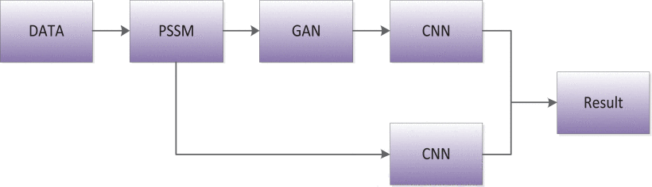

### B. Datasets

In this paper, the ASTRAL [22] and CullPDB [23] datasets were used as the training set of the model. The CullPDB dataset was selected based on the percentage identity cutoff of 25%, the resolution cutoff of 3 angstroms, and the R-factor cutoff of 0.25. ASTRAL dataset had 6,892 proteins, with less than 25% sequence identity. We removed the protein with the same protein name in ASTRAL and CullPDB. There are a total of 15696 proteins. The test set used CASP [24]–[25][26] data set, including CASP9, CASP10, CASP11 and CASP12. In addition, the CB513 [27] and PDB25 [28]data sets are also used as the test set of the model, and the number of protein sequences of test sets is shown in Table 1.

本文使用ASTRAL[22]和CullPDB[23]数据集作为模型的训练集。CullPDB数据集的选择基于25%的身份截止值、3埃的分辨率截止值和0.25的R因子截止值。ASTRAL数据集有6892个蛋白质，序列同源性不到25%。我们移除了ASTRAL和CullPDB中具有相同蛋白质名称的蛋白质。总共有15696种蛋白质。测试集使用CASP[24]-[25][26]数据集，包括CASP9、CASP10、CASP11和CASP12。此外，CB513[27]和PDB25[28]数据集也被用作模型的测试集，测试集的蛋白质序列数量如表1所示。

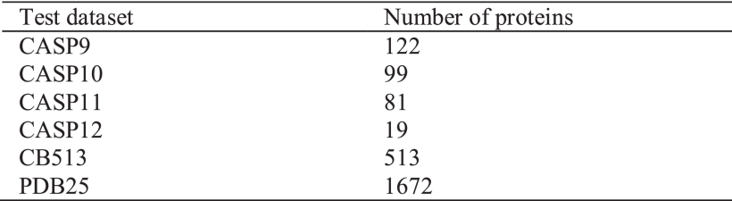

## Model Principle and Result Evaluation

模型原理与结果评价

### A. Generative Adversarial Network

In 2014 Ian Goodfellow proposed Generative Adversarial Network [29], papers [18], [19] use generative adversarial networks for image denoising and feature extraction, which proves that generative adversarial networks have good characteristics. Generative adversarial network consists of two parts: generator and discriminator. The generator can learn the distribution characteristics of real data, in order to generate data similar to real protein data, while the discriminator is to judge whether the data is generated by the generator or the real data, which is actually a binary classification problem. From the perspective of game theory, in order to improve the generating ability of the generator and the discriminating ability of the discriminator, they need to be optimized continuously, but eventually they reach the Nash equilibrium. The generator and discriminator can be represented by G and D respectively, and the generative adversarial network model is shown in Figure 2.

2014年伊恩·古德费罗提出生成对抗网络[29]，论文[18]，[19]使用生成对抗网络进行图像去噪和特征提取，证明生成对抗网络具有良好的特性。生成性对抗网络由两部分组成：生成器和鉴别器。生成器可以学习真实数据的分布特征，以生成与真实蛋白质数据相似的数据，而鉴别器则是判断数据是由生成器生成还是由真实数据生成，这实际上是一个二元分类问题。从博弈论的角度来看，为了提高发生器的生成能力和鉴别器的识别能力，需要不断优化，但最终达到纳什均衡。生成器和鉴别器可以分别用G和D表示，生成对抗网络模型如图2所示。

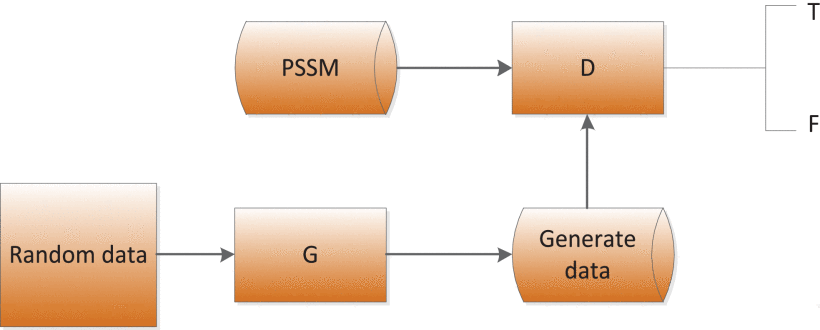

The learning process of GAN is the process of confrontation between D and G, D classifies the input protein matrix PSSM, D can discriminate the generated data from the real data, if the generated data is false, then D(G(z))=0, and if the real data is true, then D(x)=1 . When such a situation occurs, G needs to constantly adjust and optimize its parameters, so that the generated data is closer to the real data and D cannot judge whether the data is real or generated by G, namely D(G(z))=1. The process of confrontation between G and D is called a minimax game, its loss function is defined as follows.

GAN的学习过程是D和G对抗的过程，D对输入的蛋白质矩阵PSSM进行分类，D可以区分生成的数据和真实数据，如果生成的数据为假，则D（G（z））=0，如果真实数据为真，则D（x）=1。当出现这种情况时，G需要不断调整和优化其参数，使生成的数据更接近真实数据，而D无法判断数据是真实的还是由G生成的，即D（G（z））=1。G和D之间的对抗过程称为极小极大对策，其损失函数定义如下。
$$
\begin{align*}&\hspace {-0.5pc}\min \limits _{G} \max \limits _{D} V\left ({{D,G} }\right)=\mathop E\nolimits _{x\sim p_{data} \left ({x }\right)} \left [{ {\log D\left ({x }\right)} }\right] \\& \qquad\qquad\qquad\quad {{+\,\mathop E\nolimits _{z\sim p_{z} \left ({z }\right)} \left [{ {\log \left ({{1-D\left ({{G\left ({z }\right)} }\right)} }\right)} }\right]}}\tag{1}\end{align*}
$$
In the formula, x represents the real protein data, z represents the random data input to G, G (z) represents the fake data generated by the G network, and D(x ) represents the probability that the D network judges whether the real data is true. For D, the closer this value is to 1, the better. And D(G(z)) is the probability that the D network judges whether the protein data generated by G is true, the generator wants its own data to be closer to the real data, so G wants D(G(z)) to be as large as possible, at this time V(D,G) will become smaller, thus we see that the first symbol of [equation (1)](https://ieeexplore.ieee.org/document/#deqn1) is min. The stronger the discriminator is, the bigger D(x ) should be, the smaller D(G(x)) should be, and then V(D,G) should be larger, so [equation (1)](https://ieeexplore.ieee.org/document/#deqn1) is to find the maximum value for D.

在公式中，x表示真实蛋白质数据，z表示输入到G的随机数据，G（z）表示G网络生成的伪数据，D（x）表示D网络判断真实数据是否真实的概率。对于D，该值越接近1，效果越好。D（G（z））是D网络判断由G生成的蛋白质数据是否为真的概率，生成器希望自己的数据更接近真实数据，因此G希望D（G（z））尽可能大，此时V（D，G）将变小，因此我们看到[等式（1）](https://ieeexplore.ieee.org/document/#deqn1)是最小值。鉴别器越强，D（x）应该越大，D（G（x））应该越小，然后V（D，G）应该越大，因此[等式（1）](https://ieeexplore.ieee.org/document/#deqn1)就是找到D的最大值。

In the generated confrontation model in this paper, the convolutional network is introduced into the G and D networks in order to improve the feature extraction capability of the generated confrontation network and to improve the prediction accuracy of protein secondary structure. The G network uses deconvolution for upsampling, and the activation function uses ReLU function. The D network uses a convolutional layer with a step size of 1, and the activation function uses a ReLU function. The features extracted from the generated adversarial network are combined with the PSSM matrix and the deep convolutional neural network is used to predict the secondary structure of the protein. The generator model is shown in Figure 3.

在本文生成的对抗模型中，为了提高生成对抗网络的特征提取能力和蛋白质二级结构的预测精度，在G和D网络中引入了卷积网络。G网络使用反褶积进行上采样，激活函数使用ReLU函数。D网络使用步长为1的卷积层，激活函数使用ReLU函数。从生成的对抗网络中提取的特征与PSSM矩阵相结合，并使用深度卷积神经网络预测蛋白质的二级结构。发电机模型如图3所示。

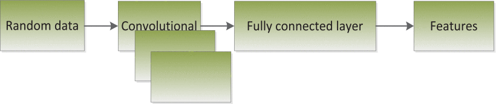

### B. Convolutional Neural Network

In recent years, as a popular deep learning algorithm, convolutional neural network has been applied to image processing [30], computer vision [31] and other fields. The method based on convolutional neural network [8], [9], [31] has been applied to protein secondary structure prediction, and has achieved remarkable results. Compared with the traditional neural network, it has the characteristics of weight sharing and local perception, which can reduce the network parameters and speed up the calculation. The structure diagram of the convolutional neural network model is shown in Figure 4.

近年来，卷积神经网络作为一种流行的深度学习算法，已被应用于图像处理[30]、计算机视觉[31]等领域。基于卷积神经网络[8]、[9]、[31]的方法已应用于蛋白质二级结构预测，并取得了显著的效果。与传统的神经网络相比，它具有权值共享和局部感知的特点，可以减少网络参数，加快计算速度。卷积神经网络模型的结构图如图4所示。

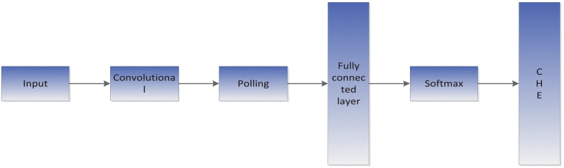

The convolution layer performs feature extraction on the input protein data through the convolution kernel. The process of convolution is to perform an operation on the input protein matrix according to the size of the convolution kernel to generate a feature map with the same number of convolution kernels. The feature map is obtained by multiplying the input matrix and the weight and adding the offset, so that:

卷积层通过卷积核对输入的蛋白质数据进行特征提取。卷积的过程是根据卷积核的大小对输入蛋白质矩阵进行运算，生成具有相同数量卷积核的特征映射。通过将输入矩阵与权重相乘并添加偏移量，获得特征图，以便：
$$
\begin{equation*} F_{k}^{i} =f\left ({{\sum \limits _{h} {P_{h}^{i-1}} \ast W_{k}^{i} +b} }\right)\tag{2}\end{equation*}
$$
In the formula, f is the activation function ReLU, Pi−1h represents the feature map obtained by the convolution kernel of the input data and the previous layer, Wik is a convolution kernel of the i-th layer, k represents the number of convolution kernels, i represents the number of convolution layers, b represents the offset parameter.

在公式中，f是激活函数ReLU，Pi−1h表示由输入数据的卷积核和前一层获得的特征映射，Wik是第i层的卷积核，k表示卷积核的数量，i表示卷积层的数量，b表示偏移参数。

The pooling layer does not perform any learning and is often referred to as a nonlinear down-sampling form. The result of the pooling layer processing is to reduce the feature dimension and parameters to reduce the amount of calculation, increase the calculation speed, and also effectively reduce the overfitting. In addition, it has the characteristics of unchanged translation, which increases the robustness. In order to adjust the weights for training, the paper uses a back propagation algorithm using gradient descent algorithm.

池层不执行任何学习，通常被称为非线性下采样形式。池层处理的结果是减少特征维数和参数，减少计算量，提高计算速度，同时有效地减少过拟合。此外，它具有平移不变的特点，增加了鲁棒性。为了调整训练权重，本文采用了一种基于梯度下降算法的反向传播算法。

The fully connected layer and the softmax layer are used as the output layer of the convolutional neural network. Each neuron of the fully connected layer must be connected to the neuron of the previous layer to output three types of protein secondary structures. The Softmax function layer uses the activation function to solve the classification problem of three types of protein structures. Its functions are defined as:

卷积神经网络的输出层采用全连接层和softmax层。完全连接层的每个神经元必须连接到前一层的神经元，以输出三种类型的蛋白质二级结构。Softmax功能层使用激活函数来解决三类蛋白质结构的分类问题。其功能定义如下：
$$
\begin{equation*} P\left ({{t_{r} /x} }\right)=\frac {P\left ({{x/t_{r}} }\right)P\left ({{t_{r}} }\right)}{\sum \limits _{j=1}^{D} {P\left ({{x/t_{j}} }\right)P\left ({{t_{j}} }\right)}}=\frac {e^{o_{r}}}{\sum \limits _{j=1}^{D} {e^{o_{j}}}}\tag{3}\end{equation*}
$$
where, P(x/tr) is the conditional probability of a given class sample, P(tr ) is the prior probability of the protein structure class. The Softmax function is regarded as a multi-class extension of the logistic Sigmoid function [28].

其中，P（x/tr）是给定类别样本的条件概率，P（tr）是蛋白质结构类别的先验概率。Softmax函数被视为logistic Sigmoid函数的多类扩展[28]。

### C. Result Evaluation

结果评价

Generally, accuracy (Q3) and segment overlap measure (SOV) [32] are widely used to evaluate the performance of protein secondary structure prediction.

通常，准确度（Q3）和片段重叠度量（SOV）被广泛用于评估蛋白质二级结构预测的性能。

According to DSSP [21] regulations, we convert G, H, I into H, E, B into E, and other structures into C. Then Q3 represents the ratio of the number of correctly predicted amino acids in the three states to the entire amino acid sequence. The following formula is the definition of Q3:

根据DSSP规定，我们将G、H、I转换为H、E、B转换为E，将其他结构转换为C。然后Q3表示三种状态中正确预测的氨基酸数量与整个氨基酸序列的比率。以下公式是Q3的定义：
$$
\begin{equation*} Q_{3} =\frac {S_{C} +S_{E} +S_{H}}{S}\times 100\%\tag{4}\end{equation*}
$$
where SC represents the number of accurately predicted protein structures of class C,SE represents the number of accurately predicted protein structures of class E,SHrepresents the number of accurately predicted protein structures of class H, S represents the total number of amino acids. The accuracy of each secondary structure can be calculated as:

式中，SC表示准确预测的C类蛋白质结构数量，SE表示准确预测的E类蛋白质结构数量，S表示准确预测的H类蛋白质结构数量，S表示氨基酸总数。每个二级结构的精度可计算为：
$$
\begin{equation*} Q_{i} =\frac {S_{i}}{S},\quad i\in \left \{{{C,H,E} }\right \}\tag{5}\end{equation*}
$$
where Qi idenotes the total number of the amino acid residues which are observed in the state i.

其中，记录了在状态i中观察到的氨基酸残基总数。

Sov is a measure based on the ratio of overlapping fragments. It is assumed that all observed structural fragments are marked as Sab , and all predicted fragments are marked as Spr , and Sa is a fragment with the same state of Sab and Spr . The length of any observed residue is defined as length(Sab ), for any pair of fragments in Sa , the actual length is minov (Sab , Spr ), and the total length of at least one residue is maxov(Sab , Spr ). Based on the above definition, the Sov calculation formula is as follows:

Sov是基于重叠碎片比率的度量。假设所有观察到的结构碎片都标记为Sab，所有预测片段标记为Spr，Sa是Sab和Spr状态相同的片段。任何观察到的残基的长度定义为长度（Sab），对于Sa中的任何一对碎片，实际长度为minov（Sab，Spr），且至少一个残基的总长度为maxov（Sab，Spr）。根据上述定义，Sov计算公式如下：
$$
\begin{align*} Sov\!=\!\frac {100}{n_{Sov}}\sum \limits _{Sa} \!{\left [{\! {\frac {\min ov\left ({{S_{ab},S_{pr}} }\right)\!+\!\sigma \left ({{S_{ab},S_{pr}} }\right)}{\max \textrm {ov}\left ({{S_{ab},S_{pr}} }\right)}length\left ({{S_{ab}} }\right)} \!}\right]}\!\!\!\! \\\tag{6}\end{align*}
$$
Among them, the factor σ (Sab, Spr) is added, which allows the changes at the boundary of the observed fragment in the protein structure, which is defined as:

其中，增加了因子σ（Sab，Spr），该因子允许在蛋白质结构中观察到的片段的边界处发生变化，其定义为：
$$
\begin{align*} \sigma \left ({{S_{ab},S_{pr}} }\right)\!=\!\min \begin{cases} \left ({{\max ov\left ({{S_{ab},S_{pr}} }\right)-\min \left ({{S_{ab},S_{pr} } }\right)} }\right) \\ \min ov\left ({{S_{ab},S_{pr}} }\right) \\ \text {int}\left [{ {len\left ({{S_{ab}} }\right)} }\right]/2 \\ \text {int}\left [{ {len\left ({{S_{pr}} }\right)} }\right]/2 \\ \end{cases}\!\! \\\tag{7}\end{align*}
$$
NSov is the sum of the number of residues observed in all overlapping fragments in Saplus the Sab fragment that does not have the same predicted state.

NSov是在SABLUS中所有重叠片段中观察到的残基数量的总和，即Sab片段不具有相同的预测状态。

## Experimental Results

实验结果

The experimental environment parameters of this paper are as follows: processor Intel(R) Xeon(R) Glod 5118 CPU 2.30GHz, graphics accelerator card RTX 2080Ti, operating system Linux, using Keras 2.3 version to build the model.

本文的实验环境参数如下：处理器Intel（R）Xeon（R）Glod 5118 CPU 2.30GHz，图形加速卡RTX 2080Ti，操作系统Linux，使用Keras 2.3版本构建模型。

In order to evaluate the accuracy of the model in this article, six public test sets were used: CASP9, CASP10, CASP11, CASP12, CB513 and PDB25. In order to verify the effectiveness of generating adversarial networks, two different experiments were conducted to predict the secondary structure of three types of proteins. The first experiment is to use the convolutional neural network model for protein secondary structure prediction. The second experiment is to use the generated confrontation network to perform feature extraction on the protein data and then use the convolutional neural network to predict the protein secondary structure. In this paper, the length of sliding windows are 13 and 19, respectively, and the size and dimensions of the convolution kernel of the convolution layer are 11*11*270, 11*11*160 for the window length of 13 and 19*19*290, 16*16*170 for the window length of 19.

为了评估本文中模型的准确性，使用了六个公共测试集：CASP9、CASP10、CASP11、CASP12、CB513和PDB25。为了验证生成对抗网络的有效性，我们进行了两个不同的实验来预测三种蛋白质的二级结构。第一个实验是**利用卷积神经网络模型预测蛋白质二级结构**。第二个实验是**使用生成的对抗网络对蛋白质数据进行特征提取**，然后使用卷积神经网络预测蛋白质的二级结构。本文中滑动窗口的长度分别为13和19，卷积层的卷积核的大小和尺寸分别为11*11*270、11*11*160（窗口长度为13）和19*19*290、16*16*170（窗口长度为19）。

In order to verify the influence of the number of iterations on the feature extraction generated by the confrontation network, the unit of iteration times is ten thousand times. In this paper, the protein data under the 13 and 19 windows are verified, and the experimental results are shown in Table 2 and Table 3.

为了验证迭代次数对对抗网络生成的特征提取的影响，迭代次数的单位为10000次。本文对13和19窗口下的蛋白质数据进行了验证，实验结果如表2和表3所示。

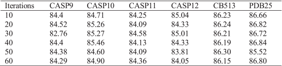

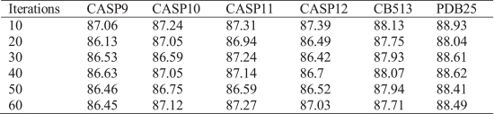

It can be seen from Table 2 and Table 3 that the accuracy rate is higher when the length of sliding window is 19, because more protein feature information can be contained using the window, length of 19 and with the increase of the number of iterations between the generator and the discriminator in the generation confrontation network, the accuracy rate shows a downward trend, and a better result is obtained when the number of iterations is 100,000. In the GAN training process, with the increase in the number of iterations, the discriminator can’t distinguish the quality of the generated data, making the generated data and the original data very different. Therefore, the greater the number of iterations, the lower the Q3 accuracy. In the generative confrontation network, in order to verify the effect of the number of layers, size and number of convolutions in the G network on the generated features, we adjust the hyperparameters. We test on the CASP10 data set, and the experimental results are shown in Table 4 Table 5 and Table 6. We use convolution kernel sizes of 3, 5, and 7, respectively, the number of convolution kernels are 128, 256, 512, and the number of convolution layers are 1, 2, and 3. For example, when the number of convolutional layers is 2, filter size is 3, the network structure is 3*3, 3*3.

从表2和表3可以看出，滑动窗口长度为19时，准确率更高，因为使用长度为19的窗口可以包含更多的蛋白质特征信息，并且随着生成对抗网络中生成器和鉴别器之间迭代次数的增加，准确率呈下降趋势，当迭代次数为100000次时，获得了更好的结果。在GAN训练过程中，随着迭代次数的增加，鉴别器无法区分生成数据的质量，使得生成的数据与原始数据有很大的差异。因此，迭代次数越多，第三季度的精度越低。在生成对抗网络中，为了验证G网络中层数、卷积大小和卷积数对生成特征的影响，我们调整了超参数。我们在CASP10数据集上进行了测试，实验结果如表4、表5和表6所示。我们使用的卷积核大小分别为3、5和7，卷积核的数量分别为128、256、512，卷积层的数量分别为1、2和3。例如，当卷积层数为2时，滤波器大小为3，网络结构为3×3，3×3。

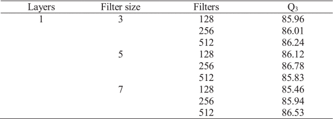

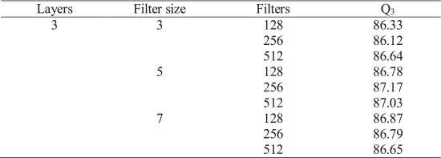

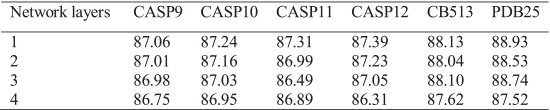

In convolutional neural networks, in order to get the best network structure, we adjust the number of convolutional layers to get the best Q3 accuracy. Such as, when the number of convolutional layers is 2, the network structure is 19*19, 19*19, 16*16, 16*16. As can be seen in Table 2, when the number of network layers is 1, the Q3 accuracy is the highest.

在卷积神经网络中，为了获得最佳的网络结构，我们调整卷积层数以获得最佳的Q3精度。例如，当卷积层的数目为2时，网络结构为19×19、19×19、16×16、16×16。如表2所示，当网络层数为1时，Q3精度最高。

We use convolutional neural network to predict protein structure, and the results are shown in Table 8.

我们使用卷积神经网络预测蛋白质结构，结果如表8所示。

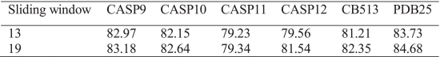

By comparing Table 2, Table 3 and Table 8, it can be found that the features extracted from the generated adversarial network are fused with the PSSM matrix to predict the secondary structure of three types of proteins, and the Q3 accuracy is greatly improved compared with the convolution neural network alone. It can be seen from the experiments in this paper that the feature extraction of the generated confrontation network is very effective, as shown in Table 9, which is improved by 3.88%, 4.6%, 7.97%, 5.85%,5.78% and 4.25% on the CASP9, CASP10, CASP11, CASP12, CB513, and PDB25 data sets, respectively. It proves the superiority of the feature extraction ability of generating adversarial networks.

通过比较表2、表3和表8，可以发现，从生成的对抗性网络中提取的特征与PSSM矩阵融合，预测三类蛋白质的二级结构，与单独使用卷积神经网络相比，Q3的准确度大大提高。从本文的实验可以看出，生成的对抗网络的特征提取非常有效，如表9所示，在CASP9、CASP10、CASP11、CASP12、CB513和PDB25数据集上分别提高了3.88%、4.6%、7.97%、5.85%、5.78%和4.25%。证明了特征提取能力在生成对抗网络中的优越性。

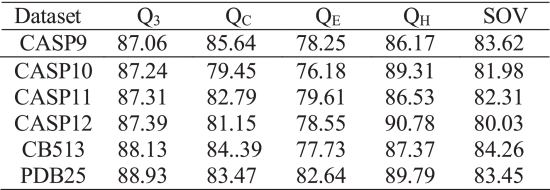

The model in this paper is compared PSIPRED [33], RaptorX-SS8 [34] and DeepCNF [17], PSRM [14], MUFOLD-SS [15] models. As shown in Table 10, the accuracy of predicting the secondary structure of three types of proteins was used as an index to evaluate the model in this paper. PSIPRED uses a two-layer feedforward neural network, RaptorX-SS8 uses a conditional neural field, and DeepCNF is a combination of a deep neural network and a conditional neural field. The results of PSIPRED, RaptorX-SS8, and DeepCNF on the test set are all taken from the literature [17].

本文中的模型与PSIPRED[33]、RAPTROX-SS8[34]和DeepCNF[17]、PSRM[14]、MUFOLD-SS[15]模型进行了比较。如表10所示，本文以预测三种蛋白质二级结构的准确性作为评价模型的指标。PSIPRED使用两层前馈神经网络，RAPTRORX-SS8使用条件神经场，而DeepCNF是深度神经网络和条件神经场的组合。PSIPRED、RAPTROX-SS8和DeepCNF在测试集上的结果均取自文献[17]。

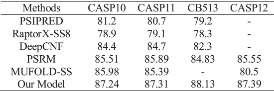

## Conclusion

As shown in Figure 5, compared with PSIPRED, RaptorX-SS8, DeepCNF, PSRM and MUFOLD-SS methods, our model has achieved better results on the CASP10 and CASP11 datasets. Experimental results show that our model is an effective method for predicting secondary structure.

如图5所示，与PSIPRED、RAPTROX-SS8、DeepCNF、PSRM和MUFOLD-SS方法相比，我们的模型在CASP10和CASP11数据集上取得了更好的结果。实验结果表明，该模型是预测二级结构的有效方法。

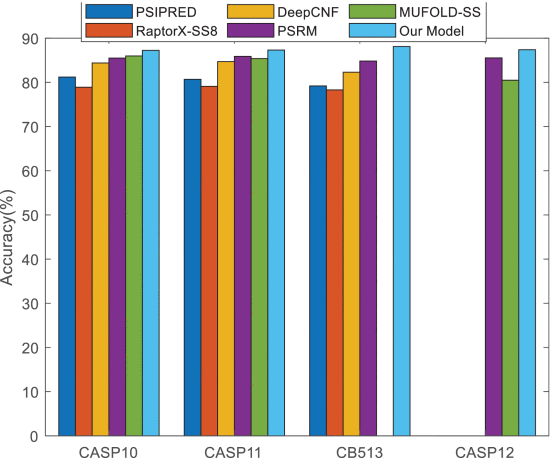

Protein secondary structure prediction is a work of great significance in the field of bioinformatics, and is necessary to fully understand the function and structure of proteins. In this paper, the generative adversarial network and convolutional neural network model are combined to predict protein secondary structure. The generative adversarial network extracts the protein sequence features, and then uses the PSSM matrix as the input of the convolutional neural network to predict the protein secondary structure. Compared with the prediction results of only convolutional neural network, the feature extraction ability of the generated adversarial network is relatively strong, which can achieve very significant effects and has good scalability.

蛋白质二级结构预测是生物信息学领域的一项重要工作，是全面了解蛋白质功能和结构的必要条件。本文将生成对抗网络和卷积神经网络模型相结合，对蛋白质二级结构进行预测。生成对抗网络提取蛋白质序列特征，然后使用PSSM矩阵作为卷积神经网络的输入，预测蛋白质的二级结构。与仅卷积神经网络的预测结果相比，生成的对抗网络的特征提取能力较强，可以达到非常显著的效果，具有良好的可扩展性。
