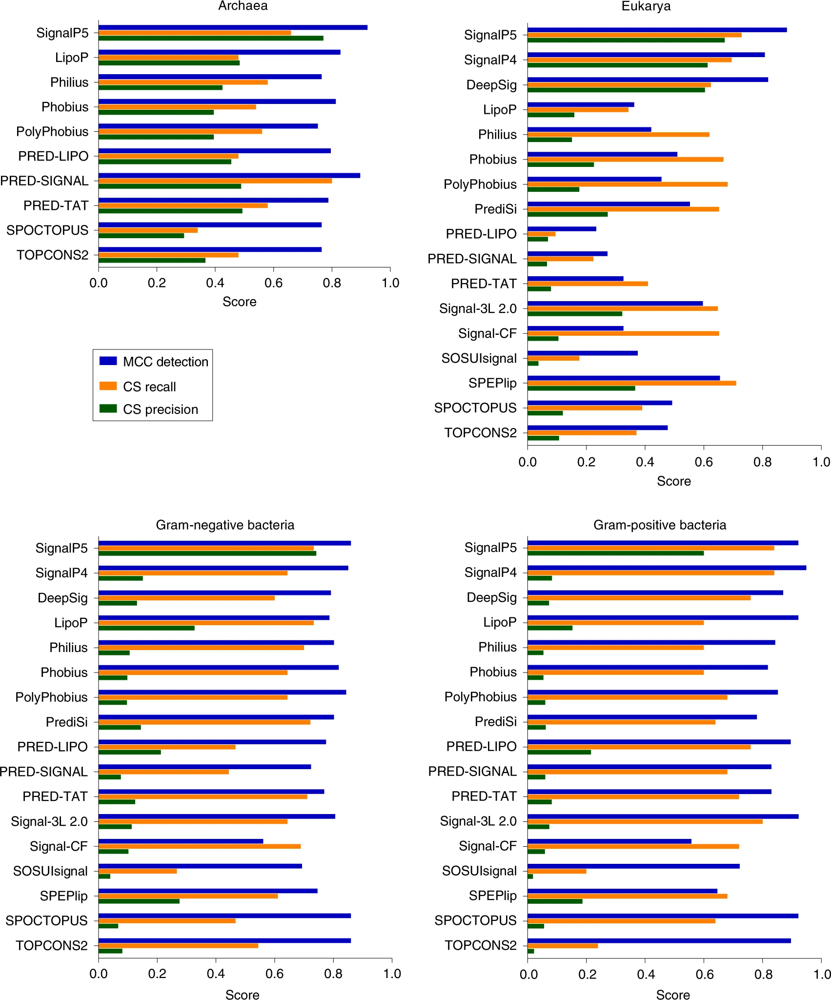
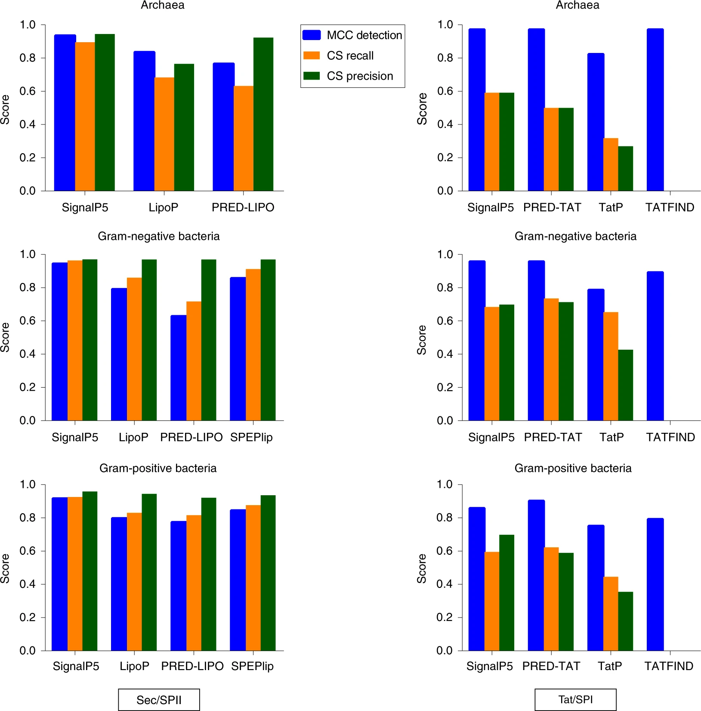

# SignalP 5.0 使用深度神经网络改进信号肽预测

## abstract

Signal peptides (SPs) are short amino acid sequences in the amino terminus of many newly synthesized proteins that target proteins into, or across, membranes. Bioinformatic tools can predict SPs from amino acid sequences, but most cannot distinguish between various types of signal peptides. We present a deep neural network-based approach that improves SP prediction across all domains of life and distinguishes between three types of prokaryotic SPs.

信号肽 (SP) 是许多新合成蛋白质的氨基末端的短氨基酸序列，这些蛋白质将蛋白质靶向进入或穿过膜。生物信息学工具可以从氨基酸序列预测 SP，但大多数无法区分各种类型的信号肽。我们提出了一种基于深度神经网络的方法，该方法可以改善所有生命领域的 SP 预测，并区分三种类型的原核 SP。

## Main

Signal peptides (SPs) are found in many nascent polypeptides in virtually all organisms and target proteins to membrane-embedded export machines in Bacteria[1](https://www.nature.com/articles/s41587-019-0036-z#ref-CR1), Archaea[2](https://www.nature.com/articles/s41587-019-0036-z#ref-CR2) and Eukarya[3](https://www.nature.com/articles/s41587-019-0036-z#ref-CR3). SPs are found in secreted and transmembrane (TM) proteins, as well as in proteins inside organelles in eukaryotic cells. The general secretory pathway (Sec) directs protein translocation across the plasma membrane in prokaryotes and the endoplasmic reticulum membrane in eukaryotes. Bacteria, Archaea, chloroplasts and some mitochondria also have a Tat (twin-arginine translocation) pathway that recognizes generally longer and less hydrophobic SPs containing two consecutive arginines (R-R) in the amino-terminal region[4](https://www.nature.com/articles/s41587-019-0036-z#ref-CR4). Unlike the Sec pathway, which transports proteins in an unfolded state, the Tat pathway can translocate folded proteins across the lipid membrane bilayer.

信号肽（SPs）存在于几乎所有生物体中的许多新生多肽中，并将蛋白质靶向细菌中的膜嵌入输出机器。SP 存在于分泌和跨膜 (TM) 蛋白质中，以及真核细胞细胞器内的蛋白质中。一般**分泌途径 (Sec)** 指导蛋白质易位穿过原核生物的质膜和真核生物的内质网膜。细菌、古生菌、叶绿体和一些线粒体也具有 **Tat（双精氨酸易位）途径**，该途径识别通常较长且疏水性较低的 SP，在氨基末端区域含有两个连续的精氨酸 (R-R)。与以未折叠状态运输蛋白质的 Sec 途径不同，Tat 途径可以跨脂膜双层转运折叠的蛋白质。

During or after membrane translocation, a signal peptidase removes the SP. Most SPs are removed by signal peptidase (SPase) I (LepB in Bacteria), which has orthologs in Archaea and Eukarya. In Eukarya, the SPase I ortholog is the only signal peptidase in the endoplasmic reticulum membrane. Bacterial lipoproteins are cleaved by a second signal peptidase, signal peptidase II (or Lsp), which cleaves SPs that contain a conserved carboxy-terminal ‘lipobox’. This motif contains a cysteine immediately after the cleavage site (CS)[5](https://www.nature.com/articles/s41587-019-0036-z#ref-CR5) in both Bacteria and Archaea (although the actual SPase II has not been identified in Archaea[6](https://www.nature.com/articles/s41587-019-0036-z#ref-CR6)) and is vital for membrane anchoring[7](https://www.nature.com/articles/s41587-019-0036-z#ref-CR7). Bacterial type IV pilins are cleaved by a third signal peptidase, SPase III (prepilin peptidase or PilD in Bacteria, PibD in Archaea)[8](https://www.nature.com/articles/s41587-019-0036-z#ref-CR8). Of note, Sec substrates can be processed by SPase I, SPase II or SPase III, but Tat substrates are only processed by SPase I or SPase II.

在膜易位期间或之后，信号肽酶会去除 SP。大多数 SP 被信号肽酶 (SPase) I（细菌中的 LepB）去除，它在古细菌和真核生物中有直系同源基因。在真核生物中，SPase I的直系同源基因是内质网膜中唯一的信号肽酶。细菌脂蛋白被第二个信号肽酶、信号肽酶 II（或 Lsp）切割，后者切割含有保守羧基末端“脂质盒”的 SP。该基序在细菌和古细菌中的裂解位点 (CS)5 之后立即包含一个半胱氨酸（尽管实际的 SPase II 尚未在古细菌 6 中被鉴定），并且对于膜锚定 7 至关重要。 IV型细菌菌毛蛋白被第三种信号肽酶SPase III（细菌中的prepilin肽酶或PilD，古细菌中的PibD）8裂解。值得注意的是，**Sec 底物可以由 SPase I、SPase II 或 SPase III 处理，但 Tat 底物只能由 SPase I 或 SPase II 处理**。

Many algorithms to predict SPs and their cleavage sites from amino acid (AA) sequences have been developed. SignalP was among the first publicly available methods[9](https://www.nature.com/articles/s41587-019-0036-z#ref-CR9). Version 1 (ref. [9](https://www.nature.com/articles/s41587-019-0036-z#ref-CR9)) was based on artificial neural networks, version 2 (ref. [10](https://www.nature.com/articles/s41587-019-0036-z#ref-CR10)) introduced hidden Markov models, version 3 (ref. [11](https://www.nature.com/articles/s41587-019-0036-z#ref-CR11)) improved cleavage site predictions, and version 4 (ref. [12](https://www.nature.com/articles/s41587-019-0036-z#ref-CR12)) improved discrimination of signal peptides and TM helices. SignalP versions 1 through 4 can only predict Sec-translocated SPs cleaved by SPase I. Specialized methods are available to predict Tat translocation or SPase II cleavage, some of which only apply to one type of SP and cannot differentiate between all three classes (Supplementary Table [1](https://www.nature.com/articles/s41587-019-0036-z#MOESM1)).

已经开发了许多从氨基酸 (AA) 序列预测 SP信号肽 及其切割位点的算法。 SignalP 是首批公开可用的方法之一。版本 1（参考文献 9）基于**人工神经网络**，版本 2（参考文献 10）引入了**隐马尔可夫模型**，版本 3（参考文献 11）改进了切割位点预测，版本 4（参考文献 12）改进了信号识别肽和TM螺旋。 SignalP 版本 1 到 4 只能预测由 SPase I 切割的 Sec 易位 SP。可使用专门的方法来预测 Tat 易位或 SPase II 切割，其中一些仅适用于一种类型的 SP，无法区分所有三个类别（补充表） 1）。

Here, we present SignalP 5.0, a deep neural network-based method combined with conditional random field classification and optimized transfer learning for improved SP prediction. The deep recurrent neural network architecture is better suited to recognizing sequence motifs of varying length, such as SPs, than traditional feed-forward neural networks. The conditional random field imposes a defined grammar on the prediction and obviates the need for the post-processing step used in earlier versions of SignalP. Finally, the transfer learning makes it possible to obtain good performance on small divisions of the data set, notably the archaeal sequences (Online [Methods](https://www.nature.com/articles/s41587-019-0036-z#Sec2)).

在这里，我们提出 SignalP 5.0，这是一种基于**深度神经网络**的方法，结合**条件随机场**分类和**优化的迁移学习**，以改进 SP 预测。与传统的前馈神经网络相比，深度循环神经网络架构更适合识别不同长度的序列基序，例如 SP。条件随机场对预测施加了定义的语法，并消除了对早期版本 SignalP 中使用的后处理步骤的需要。最后，迁移学习可以在数据集的小部分获得良好的性能，特别是古菌序列（在线方法）。

SignalP 5.0 distinguishes three types of signal peptides in prokaryotes: Sec substrates cleaved by SPase I (Sec/SPI), Sec substrates cleaved by SPase II (Sec/SPII), and Tat substrates cleaved by SPase I (Tat/SPI). SignalP 5.0 cannot identify Tat substrates cleaved by SPase II, although these are known to exist[13](https://www.nature.com/articles/s41587-019-0036-z#ref-CR13). We were unable to construct a sufficiently large data set of SPase III-cleaved proteins for training a machine learning method, therefore our algorithm cannot identify Sec substrates processed by SPase III.

SignalP 5.0 在原核生物中区分了三种类型的信号肽：由 SPase I (Sec/SPI) 裂解的 Sec 底物、由 SPase II (Sec/SPII) 裂解的 Sec 底物和由 SPase I (Tat/SPI) 裂解的 Tat 底物。 SignalP 5.0 **无法识别由 SPase II 切割的 Tat 底物**，尽管已知这些底物存在13。我们无法构建足够大的 SPase III 切割蛋白质数据集来训练机器学习方法，因此我们的算法**无法识别由 SPase III 处理的 Sec 底物。**

We trained and tested SignalP 5.0 on Eukarya, Archaea, Gram-positive bacteria and Gram-negative bacteria and on four types of proteins: Sec/SPI, Sec/SPII, Tat/SPI and ‘Other’ (globular proteins without SP and TM proteins with an experimentally verified TM segment within the first 70 AAs). Our training data comprised 20,758 proteins (Supplementary Table [2](https://www.nature.com/articles/s41587-019-0036-z#MOESM1)). We clustered the training set using CD-HIT[14](https://www.nature.com/articles/s41587-019-0036-z#ref-CR14) at 20% sequence identity. The data set was homology-partitioned into five sets. Each set had the same distribution of organisms and types of proteins. For each protein, the AAs were encoded using the normalized BLOSUM62 (ref. [15](https://www.nature.com/articles/s41587-019-0036-z#ref-CR15)) matrix such that each position in the sequence became a vector of length 20 containing the AA substitution probabilities. The labels for each AA were: Sec/SPI signal, Tat/SPI signal, Sec/SPII signal, outer region, inner region, TM in–out, TM out–in, SPI CS and SPII CS (Online [Methods](https://www.nature.com/articles/s41587-019-0036-z#Sec2)).

我们在真核生物、古细菌、革兰氏阳性菌和革兰氏阴性菌以及四种类型的蛋白质上训练和测试了 SignalP 5.0：Sec/SPI、Sec/SPII、Tat/SPI 和“其他”（不含 SP 和 TM 蛋白的球状蛋白质）在前 70 个 AA 中具有经过实验验证的 TM 片段）。我们的训练数据包含 20,758 种蛋白质（补充表 2）。我们使用 CD-HIT14 以 20% 的序列同一性对训练集进行聚类。数据集被同源划分为五组。每组具有相同的生物体分布和蛋白质类型。对于每种蛋白质，使用归一化的 BLOSUM62（参考文献 15）矩阵编码 AA，这样序列中的每个位置都成为长度为 20 的向量，其中包含 AA 替换概率。每个 AA 的标签是：Sec/SPI 信号、Tat/SPI 信号、Sec/SPII 信号、外部区域、内部区域、TM in-out、TM out-in、SPI CS 和 SPII CS。

We benchmarked SignalP 5.0 against 18 SP prediction algorithms that are available either as web-servers or standalone packages (Supplementary Table [1](https://www.nature.com/articles/s41587-019-0036-z#MOESM1)). One method, Signal-BLAST[16](https://www.nature.com/articles/s41587-019-0036-z#ref-CR16), essentially carries out a BLAST[17](https://www.nature.com/articles/s41587-019-0036-z#ref-CR17) database look-up, rather than a prediction from scratch, and we found that most proteins in our benchmark data sets were correctly predicted because they were identical to a protein in Signal-BLAST’s reference database. As this would make its performance artificially high, Signal-BLAST was excluded from our benchmark (Supplementary Note [1](https://www.nature.com/articles/s41587-019-0036-z#MOESM1)).

我们针对 18 个 SP 预测算法对 SignalP 5.0 进行了基准测试，这些算法可作为 Web 服务器或独立软件包使用。一种方法 Signal-BLAST16 本质上是执行 BLAST17 数据库查找，而不是从头开始预测，我们发现我们的基准数据集中的大多数蛋白质都被正确预测，因为它们与 Signal-BLAST 参考中的蛋白质相同数据库。由于这会人为地提高其性能，因此我们的基准测试排除了 Signal-BLAST（补充说明 1）。

Prediction performance of all SP detection algorithms was measured using the Matthews correlation coefficient (MCC)[18](https://www.nature.com/articles/s41587-019-0036-z#ref-CR18), in which both true and false positive and negative predictions are counted at the sequence level. We used precision and recall to assess CS predictions, where precision is defined as the fraction of CS predictions that are correct, and recall is the fraction of real SPs that are predicted as the correct SP type and have the correct CS assigned.

使用 Matthews 相关系数 (MCC)18 测量所有 SP 检测算法的预测性能，其中在序列级别计算真假阳性和阴性预测。我们使用精度和召回率来评估 CS 预测，其中精度定义为正确的 CS 预测的分数，而召回率是被预测为正确的 SP 类型并分配了正确的 CS 的真实 SP 的分数。

SignalP 5.0 achieved an overall MCC of 0.938, 0.907, 0.890 and 0.966 for predicting Sec/SPI SPs for Archaea, Gram-negative bacteria, Gram-positive bacteria and Eukarya, respectively. When tested on Sec/SPII SPs, SignalP 5.0 achieved MCCs of 0.956, 0.960 and 0.957 for Archaea, Gram-negative and Gram-positive bacteria, respectively. Finally, on Tat/SPI SPs, SignalP 5.0 had MCCs of 0.977, 0.981 and 0.868 for Archaea, Gram-negative and Gram-positive bacteria, respectively (Supplementary Table [3](https://www.nature.com/articles/s41587-019-0036-z#MOESM1)). In Supplementary Table [4](https://www.nature.com/articles/s41587-019-0036-z#MOESM1), we demonstrate the discrimination performance of SignalP 5.0 on the different types of signal peptides with a confusion matrix, which shows the numbers of real and predicted examples in each class of sequences. Regarding CS precision, the performance of SignalP 5.0 varies between 0.630 and 0.970, whereas its CS recall varies between 0.579 and 0.970 (Supplementary Table [5](https://www.nature.com/articles/s41587-019-0036-z#MOESM1)).

SignalP 5.0 分别实现了 0.938、0.907、0.890 和 0.966 的总体 MCC，用于预测古细菌、革兰氏阴性细菌、革兰氏阳性细菌和真核生物的 Sec/SPI SP。在 Sec/SPII SP 上进行测试时，SignalP 5.0 对古细菌、革兰氏阴性菌和革兰氏阳性菌的 MCC 分别为 0.956、0.960 和 0.957。最后，在 Tat/SPI SP 上，SignalP 5.0 对于古细菌、革兰氏阴性和革兰氏阳性细菌的 MCC 分别为 0.977、0.981 和 0.868（补充表 3）。在补充表 4 中，我们展示了 SignalP 5.0 对具有混淆矩阵的不同类型信号肽的区分性能，该矩阵显示了每类序列中真实和预测示例的数量。关于 CS 精度，SignalP 5.0 的性能在 0.630 和 0.970 之间变化，而其 CS 召回率在 0.579 和 0.970 之间变化（补充表 5）。

To demonstrate the reliability of SignalP 5.0, we studied the probability distribution of correct and incorrect predictions. Prediction confidence was assessed by examining the probabilities of the most likely class predicted by the model from the AA sequences (Supplementary Note [2](https://www.nature.com/articles/s41587-019-0036-z#MOESM1) and Supplementary Fig. [1](https://www.nature.com/articles/s41587-019-0036-z#Fig3)).

为了证明 SignalP 5.0 的可靠性，我们研究了正确和错误预测的概率分布。通过检查模型从 AA 序列预测的最可能类别的概率来评估预测置信度（补充说明 2 和补充图 1）。

A common problem in CS prediction is that experimental data used to train prediction algorithms can have erroneous or uncertain annotations. To account for this uncertainty, we considered a window of one, two and three AAs around the annotated CS position, assuming that, if the annotation was incorrect, the correct position should be nearby. We reported a correct prediction if the predicted CS was within that window. The same was done for all other methods that were used in our benchmark (Supplementary Note [2](https://www.nature.com/articles/s41587-019-0036-z#MOESM1) and Supplementary Fig. [2](https://www.nature.com/articles/s41587-019-0036-z#Fig4)).

CS 预测中的一个常见问题是用于训练预测算法的实验数据可能具有错误或不确定的注释。为了解决这种不确定性，我们考虑了在注释的 CS 位置周围有一个、两个和三个 AA 的窗口，假设如果注释不正确，正确的位置应该在附近。如果预测的 CS 在该窗口内，我们报告了正确的预测。我们的基准测试中使用的所有其他方法也是如此（补充说明 2 和补充图 2）。

To construct an independent benchmark set for comparing SignalP 5.0 against all other prediction methods, we carried out a 20% homology reduction with CD-HIT between our training data set and the data set used for training the most recently published method, DeepSig[19](https://www.nature.com/articles/s41587-019-0036-z#ref-CR19) (which used the SignalP4 training data set). The result was a reduced benchmark data set of 8,811 proteins (derived from the 20,758 proteins of the training data set). Although the benchmark set is independent with regards to eukaryotic and bacterial Sec/SPI data, this is not the case for the Sec/SPII, Tat/SPI and archaeal data sets, for which many proteins were directly obtained from the training data sets of specialized predictors. In Supplementary Table [2](https://www.nature.com/articles/s41587-019-0036-z#MOESM1), we report the constitution of the data sets for each organism type and category, both for training and for comparison.

为了构建一个独立的基准集来将 SignalP 5.0 与所有其他预测方法进行比较，我们在我们的训练数据集和用于训练最近发布的方法 DeepSig19（使用了SignalP4 训练数据集）。结果是减少了 8,811 个蛋白质的基准数据集（来自训练数据集的 20,758 个蛋白质）。尽管基准集独立于真核和细菌 Sec/SPI 数据，但 Sec/SPII、Tat/SPI 和古细菌数据集并非如此，其中许多蛋白质直接从专门的训练数据集中获得。预测因子。在补充表 2 中，我们报告了每种生物类型和类别的数据集构成，用于训练和比较。

Given that some methods were designed for a specific type of SP, and not all methods run on all organisms, we carried out three separate benchmarks (Sec/SPI, Sec/SPII and Tat/SPI SPs). Furthermore, because SignalP 5.0 is the only method capable of simultaneously predicting all types of SPs, each benchmark was run twice: first with only the respective SP type as the ‘positive’ data set and TM and globular proteins as the ‘negative’ data set and then adding the two remaining SP types to the ‘negative’ data set. Importantly, the performance of SignalP 5.0 was measured on a cross-validated mode, unlike the methods specialized for archaeal, Sec/SPII or Tat/SPI prediction, which contained some (or many) of the proteins of the benchmark already in their respective training data sets.

鉴于某些方法是为特定类型的 SP 设计的，并非所有方法都适用于所有生物体，因此我们进行了三个独立的基准测试（Sec/SPI、Sec/SPII 和 Tat/SPI SP）。此外，由于 SignalP 5.0 是唯一能够同时预测所有类型 SP 的方法，因此每个基准测试运行两次：首先将各自的 SP 类型作为“阳性”数据集，将 TM 和球状蛋白作为“阴性”数据集然后将剩余的两个 SP 类型添加到“负”数据集。重要的是，SignalP 5.0 的性能是在交叉验证模式下测量的，这与专门用于古细菌、Sec/SPII 或 Tat/SPI 预测的方法不同，后者包含一些（或许多）基准的蛋白质已经在各自的训练中数据集。

Benchmark results are summarized in Figs. [1](https://www.nature.com/articles/s41587-019-0036-z#Fig1)–[2](https://www.nature.com/articles/s41587-019-0036-z#Fig2) and Supplementary Tables [7](https://www.nature.com/articles/s41587-019-0036-z#MOESM1)–[12](https://www.nature.com/articles/s41587-019-0036-z#MOESM1). SignalP 5.0 has the best SP discrimination across all organisms in the Sec/SPI benchmark, with the exception of Gram-positive bacteria, for which it ranks second after SignalP 4.1 (Supplementary Table [7](https://www.nature.com/articles/s41587-019-0036-z#MOESM1) and Fig. [1](https://www.nature.com/articles/s41587-019-0036-z#Fig1)). It also has the highest CS recall in Eukarya and Bacteria, and the second highest CS recall in Archaea after PRED-SIGNAL[20](https://www.nature.com/articles/s41587-019-0036-z#ref-CR20), which is a specialized method trained only on archaeal sequences. Finally, of all of the methods tested, SignalP 5.0 achieved the highest CS precision across all organisms (Supplementary Table [8](https://www.nature.com/articles/s41587-019-0036-z#MOESM1) and Fig. [1](https://www.nature.com/articles/s41587-019-0036-z#Fig1)).

基准测试结果总结在图 1 和图 3 中。 1-2 和补充表 7-12。 SignalP 5.0 在 Sec/SPI 基准测试中对所有生物体的 SP 区分度最高，但革兰氏阳性菌除外，它在 SignalP 4.1 之后排名第二（补充表 7 和图 1）。它还在 Eukarya 和 Bacteria 中拥有最高的 CS 召回率，在古细菌中第二高的 CS 召回率，仅次于 PRED-SIGNAL20，这是一种仅在古细菌序列上训练的专门方法。最后，在所有测试的方法中，SignalP 5.0 在所有生物体中实现了最高的 CS 精度（补充表 8 和图 1）。

The performance of the otherwise successful methods Philius[21](https://www.nature.com/articles/s41587-019-0036-z#ref-CR21), Phobius[22](https://www.nature.com/articles/s41587-019-0036-z#ref-CR22) and SPOCTOPUS[23](https://www.nature.com/articles/s41587-019-0036-z#ref-CR23) on eukaryotic data was poorer than reported previously[12](https://www.nature.com/articles/s41587-019-0036-z#ref-CR12). The reason for this discrepancy is that, in the current benchmark data set, the number of eukaryotic SPs is much lower than in the previous study[12](https://www.nature.com/articles/s41587-019-0036-z#ref-CR12) (210 here versus 3,462 in the previous study), which makes the eukaryotic part of the evaluation data set more imbalanced. Finally, the performance of TOPCONS2 (ref. [24](https://www.nature.com/articles/s41587-019-0036-z#ref-CR24)), which is the only consensus method tested in our benchmark, is high in Bacteria, but not in Archaea or Eukarya, for which it ranks below average. For CS predictions, it is clear that a consensus method is not ideal, but we note that CS prediction was not in the intended scope of this tool (Supplementary Tables [7](https://www.nature.com/articles/s41587-019-0036-z#Sec13) and [8](https://www.nature.com/articles/s41587-019-0036-z#MOESM1) and Fig. [1](https://www.nature.com/articles/s41587-019-0036-z#Fig1)).

否则成功的方法 Philius21、Phobius22 和 SPOCTOPUS23 在真核数据上的性能比以前报道的要差。造成这种差异的原因是，在当前的基准数据集中，真核 SP 的数量远低于之前的研究 12（此处为 210，而之前的研究为 3,462），这使得评估数据集中的真核部分更多不平衡。最后，TOPCONS2（参考文献 24）的性能是在我们的基准测试中测试的唯一共识方法，它在细菌中的性能很高，但在古生菌或真核菌中的性能却低于平均水平。对于 CS 预测，显然共识方法并不理想，但我们注意到 CS 预测不在该工具的预期范围内（补充表 7 和 8 以及图 1）。

In the Sec/SPII SPs benchmark, SignalP 5.0 had superior performance across all metrics for all organisms, outperforming methods that were designed and optimized specifically for this particular type of SP (Supplementary Tables [9](https://www.nature.com/articles/s41587-019-0036-z#Sec13) and[10](https://www.nature.com/articles/s41587-019-0036-z#MOESM1) and Fig. [2](https://www.nature.com/articles/s41587-019-0036-z#Fig2)).

在 Sec/SPII SP 基准测试中，SignalP 5.0 在所有生物体的所有指标上都具有卓越的性能，优于专门为这种特定类型的 SP 设计和优化的方法（补充表 9 和 10 以及图 2）。

SignalP 5.0 performs as well as PRED-TAT[25](https://www.nature.com/articles/s41587-019-0036-z#ref-CR25) and TATFIND[26](https://www.nature.com/articles/s41587-019-0036-z#ref-CR26) for predicting Tat/SPI SPs in Archaea and Gram-negative bacteria, although PRED-TAT has better prediction performance in Gram-positive bacteria. PRED-TAT achieved the highest CS recall in Bacteria, while SignalP 5.0 displayed the best CS prediction in Archaea. SignalP 5.0 demonstrated superior CS precision compared with PRED-TAT in Archaea and Gram-positive bacteria, although PRED-TAT achieved the highest CS precision in Gram-negative bacteria. TATFIND does not make CS predictions, and therefore could not be evaluated. When including Sec/SPI and Sec/SPII SPs in the ‘negative’ data set, SignalP 5.0 performs as well as PRED-TAT in Archaea and has the highest CS prediction scores in Gram-negative and Gram-positive bacteria (Supplementary Tables [11](https://www.nature.com/articles/s41587-019-0036-z#MOESM1)–[12](https://www.nature.com/articles/s41587-019-0036-z#MOESM1) and Fig. [2](https://www.nature.com/articles/s41587-019-0036-z#Fig2)).

SignalP 5.0 在预测古细菌和革兰氏阴性细菌中的 Tat/SPI SP 方面的性能与 PRED-TAT25 和 TATFIND26 一样好，尽管 PRED-TAT 在革兰氏阳性细菌中具有更好的预测性能。 PRED-TAT 在细菌中实现了最高的 CS 召回，而 SignalP 5.0 在古细菌中显示了最好的 CS 预测。 SignalP 5.0 在古细菌和革兰氏阳性细菌中表现出优于 PRED-TAT 的 CS 精度，尽管 PRED-TAT 在革兰氏阴性细菌中实现了最高的 CS 精度。 TATFIND 不进行 CS 预测，因此无法进行评估。当在“阴性”数据集中包含 Sec/SPI 和 Sec/SPII SP 时，SignalP 5.0 在古细菌中的表现与 PRED-TAT 一样好，并且在革兰氏阴性和革兰氏阳性细菌中具有最高的 CS 预测分数（补充表 11– 12 和图 2)。

We used SignalP 5.0 to analyze two well-annotated reference proteomes of *Escherichia coli*(strain K12) and *Saccharomyces cerevisiae* (strain ATCC 204508/S288c) (Baker’s yeast). In both cases, SignalP 5.0 detected all but one experimentally verified Sec/SPI SP. SignalP 5.0 also found new SPs with high probability, and these may be interesting candidates for verification (Supplementary Note [3](https://www.nature.com/articles/s41587-019-0036-z#MOESM1)).

我们使用 SignalP 5.0 分析了两个注释良好的大肠杆菌（K12 菌株）和酿酒酵母（ATCC 204508/S288c 菌株）（面包酵母）参考蛋白质组。在这两种情况下，SignalP 5.0 检测到除了一个经过实验验证的 Sec/SPI SP 之外的所有内容。 SignalP 5.0 还以高概率发现了新的 SP，这些可能是有趣的验证候选者（补充说明 3）。

In conclusion, SignalP 5.0 can predict proteome-wide SPs across all organisms, and classify them into Sec/SPI, Sec/SPII and Tat/SPI SPs, in many cases better than specialized predictors.

总之，SignalP 5.0 可以预测所有生物体的蛋白质组范围的 SP，并将它们分类为 Sec/SPI、Sec/SPII 和 Tat/SPI SP，在许多情况下比专门的预测器更好。

## Methods

### Sequence data

For eukaryotic and bacterial Sec/SPI signal peptides, we relied on the UniProt Knowledgebase release 2018_04 (ref. [27](https://www.nature.com/articles/s41587-019-0036-z#ref-CR27)). Only reviewed entries (that is, from UniProtKB/SwissProt) were used, and hypothetical proteins were not included. We discarded protein sequences shorter than 30 AAs and we only considered signal peptides that had experimental evidence (ECO: 0000269) for the cleavage site. Gram-positive bacteria were defined as Firmicutes plus Actinobacteria. We did not include Tenericutes (*Mycoplasma* and related genera) since they do not seem to have a type I signal peptidase at all[28](https://www.nature.com/articles/s41587-019-0036-z#ref-CR28). Gram-negative bacteria were defined as all other Bacteria. All sequences were shortened to the 70 N-terminal AAs. For archaeal Sec/SPI signal peptides, we added the (few) experimentally verified proteins from SwissProt to the ones from the PRED-SIGNAL method.

对于真核和细菌 Sec/SPI 信号肽，我们依赖于 UniProt 知识库版本 2018_04（参考文献 27）。仅使用了经过审查的条目（即来自 UniProtKB/SwissProt），并且不包括假设的蛋白质。我们丢弃了短于 30 个 AA 的蛋白质序列，我们只考虑了具有实验证据（ECO：0000269）切割位点的信号肽。革兰氏阳性菌被定义为厚壁菌门加放线菌门。我们没有包括 Tenericutes（支原体和相关属），因为它们似乎根本没有 I 型信号肽酶 28。革兰氏阴性菌被定义为所有其他细菌。所有序列都缩短为 70 个 N 端 AA。对于古菌 Sec/SPI 信号肽，我们将来自 SwissProt 的（少数）经过实验验证的蛋白质添加到来自 PRED-SIGNAL 方法的蛋白质中。

For Tat/SPI signal peptides, we relied on a combination of the training set of the PRED-TAT method (which had experimentally verified Tat proteins for Gram-negative and Gram-positive bacteria) together with the ‘Tat signal profile’ (PS51318) entry from the PROSITE database[29](https://www.nature.com/articles/s41587-019-0036-z#ref-CR29). The status of PROSITE matches against SwissProt entries is manually assessed during the curation process. SwissProt curators evaluate the quality of the match according to the match score, the likelihood of the protein to contain such a domain and the appearance in other members of the protein family. The ‘positive’ status does not necessarily mean that the presence of the domain has been experimentally proven, but rather that the protein most probably contains such a domain according to the evaluation of the curators. For Archaea, we used proteins that were identified in the literature as being Tat/SPI (from the PRED-SIGNAL data sets) together with proteins belonging to the PS51318 entry of PROSITE.

对于 Tat/SPI 信号肽，我们依赖 PRED-TAT 方法的训练集（已通过实验验证了革兰氏阴性和革兰氏阳性细菌的 Tat 蛋白）与“Tat 信号谱”（PS51318）的组合PROSITE 数据库中的条目29。 PROSITE 与 SwissProt 条目的匹配状态是在策展过程中手动评估的。 SwissProt 策展人根据匹配分数、蛋白质包含此类域的可能性以及蛋白质家族其他成员的出现来评估匹配的质量。 “阳性”状态并不一定意味着该域的存在已被实验证明，而是根据策展人的评估，蛋白质最有可能包含这样的域。对于古细菌，我们使用了文献中鉴定为 Tat/SPI（来自 PRED-SIGNAL 数据集）的蛋白质以及属于 PROSITE 的 PS51318 条目的蛋白质。

A similar strategy was followed for the collection of the Sec/SPII data set, for which we used the respective PROSITE entry (‘prokaryotic membrane lipoprotein lipid attachment site profile’, PS51257), together with experimentally verified lipoproteins, taken from the PRED-LIPO[30](https://www.nature.com/articles/s41587-019-0036-z#ref-CR30) data sets. It should be noted that there was no overlap between the lists from these two PROSITE entries (that is, we found no examples of proteins that belonged to the Tat/SPII group).

对 Sec/SPII 数据集的收集采用了类似的策略，为此我们使用了各自的 PROSITE 条目（“原核膜脂蛋白脂质附着位点轮廓”，PS51257），以及来自 PRED-LIPO30 的经实验验证的脂蛋白数据集。应该注意的是，这两个 PROSITE 条目的列表之间没有重叠（也就是说，我们没有发现属于 Tat/SPII 组的蛋白质示例）。

We must stress here that, as it can be seen from Supplementary Table [1](https://www.nature.com/articles/s41587-019-0036-z#MOESM1), the number of Sec/SPI signal peptides is relatively low compared to the Tat/SPI and Sec/SPII types. This is due to the fact that, for Tat/SPI and Sec/SPII signal peptides, we relied mainly on the PROSITE annotation and the PRED-TAT, PRED-SIGNAL and PRED-LIPO data sets, whereas for Sec/SPI signal peptides, we used the annotation from UniProt. In 2014, UniProt adopted a new evidence ontology. Before the change, an annotation was regarded as experimental if it lacked qualifiers such as ‘Potential’, ‘Probable’ or ‘By similarity’; after the change, only annotations with a specific literature reference are annotated as being experimental (evidence code ECO:0000269). If we compare the number of experimental Sec/SPI SPs between the current version of SwissProt and the 2014_09 version (the last before adopting the new scheme), then we observe 1,371 eukaryotic, 280 Gram-negative and 118 Gram-positive Sec/SPI SPs that have lost their ‘experimental’ status (that is, are missing the ECO: 0000269 annotation). SignalP 5.0 identifies 1,338 out of 1,371 (97.59%) of the eukaryotic Sec/SPI SPs and, of them 1,089 with a correct CS position (79.43%). In Gram-negative bacteria, the corresponding numbers are 222 out of 280 (79.29%) for identification of Sec/SPI SPs and 195 out of 280 (69.64%) for correct CS prediction. Finally, in Gram-positive bacteria, 105 out of 118 (88.98%) of them were correctly identified, and 85 out of 118 (72.03%) were found to have the same CS as the annotated one. These results are quite close to the overall performance of SignalP 5.0, indicating that these proteins could be correct SPs; however, we could not trust their experimental status, which is why we did not include them.

我们必须在这里强调，从补充表 1 中可以看出，与 Tat/SPI 和 Sec/SPII 类型相比，Sec/SPI 信号肽的数量相对较少。这是因为，对于 Tat/SPI 和 Sec/SPII 信号肽，我们主要依赖 PROSITE 注释和 PRED-TAT、PRED-SIGNAL 和 PRED-LIPO 数据集，而对于 Sec/SPI 信号肽，我们使用了 UniProt 的注释。 2014 年，UniProt 采用了新的证据本体。在更改之前，如果注释缺少“潜在”、“可能”或“相似性”等限定词，则该注释被视为实验性的；更改后，只有具有特定参考文献的注释才会被注释为实验性的（证据代码 ECO：0000269）。如果我们比较当前版本的 SwissProt 和 2014_09 版本（采用新方案之前的最后一个版本）之间的实验 Sec/SPI SP 数量，那么我们观察到 1,371 个真核生物、280 个革兰氏阴性和 118 个革兰氏阳性 Sec/SPI SP失去了“实验性”状态（即缺少 ECO: 0000269 注释）。 SignalP 5.0 可识别 1,371 个真核 Sec/SPI SP 中的 1,338 个（97.59%），其中 1,089 个具有正确的 CS 位置（79.43%）。在革兰氏阴性细菌中，对应的数字是 280 个中的 222 个（79.29%）用于识别 Sec/SPI SP，280 个中的 195 个（69.64%）用于正确的 CS 预测。最后，在革兰氏阳性菌中，118 种细菌中有 105 种（88.98%）被正确识别，118 种细菌中有 85 种（72.03%）被发现具有与注释相同的 CS。这些结果与 SignalP 5.0 的整体性能非常接近，表明这些蛋白质可能是正确的 SP；然而，我们不能相信他们的实验状态，这就是我们没有包括他们的原因。

For TM proteins, we relied on the TOPDB[31](https://www.nature.com/articles/s41587-019-0036-z#ref-CR31) database, which contains topological models of TM proteins based on either structural data (where there is interplay with the PDB_TM[32](https://www.nature.com/articles/s41587-019-0036-z#ref-CR32)database) or other experimental techniques, such as fusion with reporter enzymes, glycosylation studies, protease accessibility, immunolocalisation, etc. If a TM protein was found to also contain an SP, then this protein was classified under the SP data set.

对于 TM 蛋白，我们依赖于 TOPDB31 数据库，该数据库包含基于结构数据（其中与 PDB_TM32 数据库相互作用）或其他实验技术（例如与报告酶融合、糖基化研究、蛋白酶可及性）的 TM 蛋白拓扑模型、免疫定位等。如果发现 TM 蛋白也含有 SP，则将该蛋白归类在 SP 数据集下。

Finally, we collected a globular proteins data set, again from UniProt 2018_04, i.e. proteins with a subcellular location annotated as cytosolic (cytosolic, nuclear, mitochondrial, plastid, and/or peroxisomal in Eukarya) and not belonging to the secretory pathway with experimental evidence (note that UniProt uses the term ‘cytoplasm’ for cytosol).

最后，我们再次从 UniProt 2018_04 收集了一个球状蛋白质数据集，即具有注释为细胞质（真核生物中的细胞质、核、线粒体、质体和/或过氧化物酶体）的亚细胞位置的蛋白质，并且不属于具有实验证据的分泌途径（注意 UniProt 使用术语“细胞质”来表示细胞质）。

### Methods for comparison

In addition to the previous version of SignalP (SignalP 4.1), 17 other methods were selected for comparison of predictive performances (Supplementary Table [1)](https://www.nature.com/articles/s41587-019-0036-z#MOESM1). Most of the methods were downloaded and run locally on our computers or through their respective websites[33](https://www.nature.com/articles/s41587-019-0036-z#ref-CR33)–[37](https://www.nature.com/articles/s41587-019-0036-z#ref-CR37). For the methods Signal-3L 2.0 (ref. [38](https://www.nature.com/articles/s41587-019-0036-z#ref-CR38)), Signal-BLAST, Signal-CF[39](https://www.nature.com/articles/s41587-019-0036-z#ref-CR39) and SPEPlip[40](https://www.nature.com/articles/s41587-019-0036-z#ref-CR40), we wrote Perl scripts to automate the process of submitting a sequence and collecting the results. Signal-BLAST was eventually excluded from the benchmark (Supplementary Note [1](https://www.nature.com/articles/s41587-019-0036-z#MOESM1)).

除了之前版本的 SignalP（SignalP 4.1）之外，还选择了 17 种其他方法来比较预测性能（补充表 1）。大多数方法都是在我们的计算机上本地下载并运行的，或者通过他们各自的网站33-37。对于 Signal-3L 2.0（参考文献 38）、Signal-BLAST、Signal-CF39 和 SPEPlip40 方法，我们编写了 Perl 脚本来自动化提交序列和收集结果的过程。 Signal-BLAST 最终被排除在基准之外（补充说明 1）。

### SignalP 5.0 model architecture

SignalP 5.0 has three main novelties compared to previous versions: a powerful deep learning architecture[41](https://www.nature.com/articles/s41587-019-0036-z#ref-CR41); optimization using transfer learning[42](https://www.nature.com/articles/s41587-019-0036-z#ref-CR42) between multiple prediction tasks; and conditional random field classification[43](https://www.nature.com/articles/s41587-019-0036-z#ref-CR43),[44](https://www.nature.com/articles/s41587-019-0036-z#ref-CR44).

与以前的版本相比，SignalP 5.0 具有三个主要创新点：强大的深度学习架构41；在多个预测任务之间使用转移学习进行优化；和条件随机场分类43,44。

#### Deep learning model

The deep learning model (Supplementary Fig. [3](https://www.nature.com/articles/s41587-019-0036-z#Fig5)), is composed of three primary components: one-dimensional convolutions akin to learnable non-linear PSSMs, capturing short range correlations; bidirectional long-short term memory (LSTM)[45](https://www.nature.com/articles/s41587-019-0036-z#ref-CR45) cells capturing long range sequence dependencies; and a conditional random field for predicting the class labels.

深度学习模型（补充图 3）由三个主要部分组成：类似于可学习非线性 PSSM 的一维卷积，捕获短程相关性；双向长短期记忆 (LSTM)45 单元捕获长程序列依赖性；以及用于预测类别标签的条件随机场。

#### Transfer and multimodal learning

Deep learning models require relatively large amounts of data in order to train the models without overfitting and, as described above, we collected a data set substantially larger than data sets previously used to successfully train deep learning models on protein sequences (for example, see refs. [46](https://www.nature.com/articles/s41587-019-0036-z#ref-CR46),][47](https://www.nature.com/articles/s41587-019-0036-z#ref-CR47)). However, some of the categories still had limited amounts of data available (Supplementary Table [2](https://www.nature.com/articles/s41587-019-0036-z#MOESM1)). To improve performance in organism groups with little data (notably Archaea), SignalP 5.0 uses transfer learning between taxonomic groups as well as multimodal learning predicting several related tasks using the same model. We trained a single unified model for Archaea, Gram-positive bacteria, Gram-negative bacteria and Eukarya, which improves performance on the low-data task, as the model can learn generally useful features across all taxonomic groups. To inform the model about which taxonomic group a protein belongs to, we input an additional four-dimensional indicator vector into the LSTM cells of the model. To further improve performance, we employ multimodal learning, predicting both the individual AA labels as well as the global signal peptide type. Overall, transfer learning and multimodal learning means that, instead of having eight models, each specialized to one group and one task, we use a single model that works for all the groups and performs both predictions at once.

深度学习模型需要相对大量的数据来训练模型而不会过度拟合，并且如上所述，我们收集的数据集比以前用于成功训练蛋白质序列深度学习模型的数据集大得多（例如，参见参考文献. 46,]47)。但是，某些类别的可用数据量仍然有限（补充表 2）。为了提高数据很少的生物群（特别是古细菌）的性能，SignalP 5.0 使用分类群之间的迁移学习以及使用相同模型预测多个相关任务的多模态学习。我们为古细菌、革兰氏阳性菌、革兰氏阴性菌和 Eukarya 训练了一个统一模型，这提高了低数据任务的性能，因为该模型可以学习所有分类组中普遍有用的特征。为了告知模型蛋白质属于哪个分类组，我们将额外的四维指示向量输入模型的 LSTM 单元。为了进一步提高性能，我们采用多模态学习，预测单个 AA 标签以及全局信号肽类型。总体而言，迁移学习和多模态学习意味着，我们不再使用八个模型，每个模型专门针对一个组和一项任务，而是使用一个适用于所有组并同时执行两种预测的模型。

#### Conditional random field

The conditional random field models a joint distribution of the sequential labels *y* = *y*1 *… y**T*given the input sequence *x* = *x*1 *… x**T* using the following restricted form:

在给定输入序列 x = x1 … xT 的情况下，条件随机场使用以下限制形式对序列标签 y = y1 … yT 的联合分布进行建模：
$$
p\left( {y|x} \right) = \frac{1}{{Z\left( h \right)}} = \mathop {\prod}\limits_{t = 1}^T {\exp \left( {\psi _{y_t}\left( {h_t} \right)} \right)} \mathop {\prod}\limits_{t = 1}^{T - 1} {\exp \left( {\varphi _{y_t,y_{t + 1}}} \right)}
$$
where *h* = *h*1 *… h**T* is the output of the core neural network model directly below the conditional random field, *Z*(*h*) is the normalization constant of the distribution *p*(*y*|*x*), *ψ*(*h**t*) is a linear model which takes *h**t* as input and has the number of classes *C* outputs and *φ**t* is a trainable transition matrix with *C* *×* *C* parameters:

其中 h = h1 … hT 是条件随机场正下方的核心神经网络模型的输出，Z(h) 是分布 p(y|x) 的归一化常数，ψ(ht) 是一个线性模型，它采用ht 作为输入并具有 C 类输出的数量，而 φt 是具有 C × C 参数的可训练转移矩阵：
$$
\psi \left( {h_t} \right) = W_\psi h_t + b_\psi
$$

$$
\varphi _{y_t,y_{t + 1}} = W_\varphi
$$

Owing to the chain structure, inference can be carried out exactly using dynamic programming in *O*(*TC*2)[48](https://www.nature.com/articles/s41587-019-0036-z#ref-CR48). During training, where (*x*,*y*) is observed, we need to compute *Z*(*h*) for each training sequence as part of the likelihood *p*(*y*|*x*). During prediction, where only *x* is observed, we can calculate either the most probable sequence argmax*y* *p*(*y*|*x*) (using the Viterbi decoding algorithm) or the marginal probabilities *p*(*y**t*|*x*), *t* = 1, ..., *T*. To make a single global prediction of whether a signal peptide is present or not in a protein, we take the average of the marginal probabilities across the sequence (nine classes: Sec/SPI signal, Tat/SPI signal, Sec/SPII signal, outer region, inner region, TM in-out, TM out-in, Sec SPI/Tat SPI cleavage site and Sec/SPII cleavage site) and perform an affine linear transformation into four classes (Sec/SPI, Sec/SPII, Tat/SPI, Other),
$$
l_s = W_s\left[ {\frac{1}{T}\mathop {\sum}\nolimits_{t = 1}^T {p\left( {y_t|x} \right)} } \right]
$$
 so as to get the logit of a categorical distribution over the presence or not of a signal peptide. To predict the location of the cleavage site, we use Viterbi decoding, since this ensures that a predicted sequence of signal peptide positions is always followed by prediction of a cleavage site.

由于链式结构，可以在 O(TC2)48 中使用动态规划准确地进行推理。在训练期间，观察到 (x,y)，我们需要计算每个训练序列的 Z(h) 作为似然 p(y|x) 的一部分。在预测期间，仅观察到 x，我们可以计算最可能的序列 argmaxy p(y|x)（使用 Viterbi 解码算法）或边缘概率 p(yt|x), t = 1, ..., T. 为了对蛋白质中是否存在信号肽进行单一全局预测，我们取整个序列的边际概率的平均值（九类：Sec/SPI 信号、Tat/SPI 信号、Sec/SPII 信号） 、外部区域、内部区域、TM in-out、TM out-in、Sec SPI/Tat SPI 切割位点和 Sec/SPII 切割位点）并执行仿射线性变换为四类（Sec/SPI、Sec/SPII、Tat /SPI, 其他),

以获得信号肽存在与否的分类分布的对数。为了预测切割位点的位置，我们使用维特比解码，因为这确保了预测的信号肽位置序列总是跟随切割位点的预测。

#### Neural network structure and optimization details

In this section, the neural network structure is described in more detail. The model is described sequentially going from the protein sequence input to predictions in which the output of a layer is used as input for the next:

在本节中，将更详细地描述神经网络结构。该模型按顺序描述，从蛋白质序列输入到预测，其中一层的输出用作下一层的输入：

1.  

    1D convolution with 32 filters and a kernel width of three.

    具有 32 个滤波器和内核宽度为 3 的 1D 卷积。

2.  

    Bidirectional LSTM with 64 hidden units in the forward and backward models. To include the taxonomic group information in the model, a 4D group indicator vector is concatenated to the input of the LSTM cells as illustrated in Supplementary Fig. [3](https://www.nature.com/articles/s41587-019-0036-z#Fig5).

    在前向和后向模型中具有 64 个隐藏单元的双向 LSTM。为了在模型中包含分类组信息，将 4D 组指示向量连接到 LSTM 单元的输入，如补充图 3 所示。

3.  

    1D convolution with 64 filters and kernel widths five.

    具有 64 个滤波器和内核宽度为 5 的一维卷积

4.  

    1D convolution with nine filters (matching the number of position-specific classes) and a kernel width of one.

    具有九个过滤器（匹配特定位置类的数量）和内核宽度为 1 的一维卷积。

5.  

    Conditional random field for predictions. We calculate both the individual marginal probabilities of the labels at each position using the forward–backward algorithm and the global most likely label assignment for the entire sequence using Viterbi decoding. To predict the global label of the protein sequence, we average the marginal probabilities across the sequence producing a 9 × 1 vector. We linearly map that vector to a 4 × 1 vector followed by a softmax function producing the global label prediction.

    用于预测的条件随机场。我们使用前向-后向算法计算每个位置标签的个别边际概率，并使用维特比解码计算整个序列的全局最可能标签分配。为了预测蛋白质序列的全局标签，我们对整个序列的边际概率进行平均，产生一个 9 × 1 的向量。我们将该向量线性映射到一个 4 × 1 向量，然后是一个产生全局标签预测的 softmax 函数。

We used ReLu activation functions in all fully connected and convolutional layers and dropout was used to avoid overfitting[49](https://www.nature.com/articles/s41587-019-0036-z#ref-CR49). The loss function consists of the sum of two terms, one for the individual AA label predictions and one for the global protein label prediction. Both terms are the cross entropy between the predicted label distribution and the true observed label. All parameters were optimized using stochastic gradient descent (SGD) on the loss function with mini batches of size 128 and a learning rate of 0.005. We optimized hyperparameters using Bayesian optimization[50](https://www.nature.com/articles/s41587-019-0036-z#ref-CR50) and fivefold nested cross validation. The inner four folds were used to train four different models, each using three folds as training data and one fold as validation data, identifying thus the best set of hyperparameters (learning rate, LSTM hidden units, number of convolutional filters, convolutional filter width). After optimization, the fifth fold was used to assess the test performance and the procedure was repeated using each of the five folds as the test set. The advantage of this approach is that we obtain an unbiased test performance for the whole data set at the expense of having to train 5 × 4 models. All the experiments were run using the Tensorflow library[51](https://www.nature.com/articles/s41587-019-0036-z#ref-CR51).

我们在所有全连接层和卷积层中使用 ReLu 激活函数，并使用 dropout 来避免过度拟合 49。损失函数由两项之和组成，一项用于单个 AA 标签预测，一项用于全局蛋白质标签预测。这两项都是预测标签分布和真实观察标签之间的交叉熵。所有参数都使用随机梯度下降 (SGD) 对损失函数进行了优化，小批量大小为 128，学习率为 0.005。我们使用贝叶斯优化 50 和五重嵌套交叉验证来优化超参数。内部四折用于训练四个不同的模型，每个模型使用三折作为训练数据，一层作为验证数据，从而确定最佳超参数集（学习率、LSTM 隐藏单元、卷积滤波器数量、卷积滤波器宽度） .优化后，使用第五折来评估测试性能，并使用五折中的每一个作为测试集重复该过程。这种方法的优点是我们以必须训练 5 × 4 个模型为代价，获得了对整个数据集的无偏测试性能。所有实验均使用 Tensorflow 库 51 运行。

The incorporation of the aforementioned techniques improves the performance of SignalP 5.0 on both the signal type and the cleavage site prediction. Supplementary Table [6](https://www.nature.com/articles/s41587-019-0036-z#MOESM1) shows a comparison of the performance on the total training set (20,758 proteins) of the model using conditional random field and the organism group information, the model without the group information and the model without conditional random field. The four models achieve similar performances, although there are some differences worth mentioning. Regarding signal peptide detection, the conditional random field does not improve the performance considerably. However, its use is beneficial for the cleavage site prediction, for which the difference in performance is significantly higher. Regarding the use of transfer learning, it is clear that the models without this feature are those with the worst performance on the signal peptide detection. For instance, on archaeal proteins, the model has a performance of 0.913, whereas for the model that uses transfer learning, the performance climbs to 0.966.

上述技术的结合提高了 SignalP 5.0 在信号类型和切割位点预测方面的性能。补充表 6 显示了使用条件随机场和有机体组信息的模型、没有组信息的模型和没有条件随机场的模型在总训练集（20,758 个蛋白质）上的性能比较。这四个模型实现了相似的性能，尽管存在一些值得一提的差异。关于信号肽检测，条件随机场并没有显着提高性能。然而，它的使用有利于切割位点预测，其性能差异明显更高。关于迁移学习的使用，很明显，没有这个特征的模型是那些在信号肽检测上表现最差的模型。例如，在古细菌蛋白质上，该模型的性能为 0.913，而对于使用迁移学习的模型，性能攀升至 0.966。

## Code availability

SignalP 5.0 is available at http://www.cbs.dtu.dk/services/SignalP/. The web version of SignalP 5.0 is free for all users, while the standalone package is free for academic users (and can be provided upon request) but is licensed for a fee to commercial users.

SignalP 5.0 可从 http://www.cbs.dtu.dk/services/SignalP/ 获得。

## Data availability

The data sets used for training and testing SignalP 5.0 can be downloaded from http://www.cbs.dtu.dk/services/SignalP/data.php.

用于训练和测试 SignalP 5.0 的数据集可以从 http://www.cbs.dtu.dk/services/SignalP/data.php 下载。
