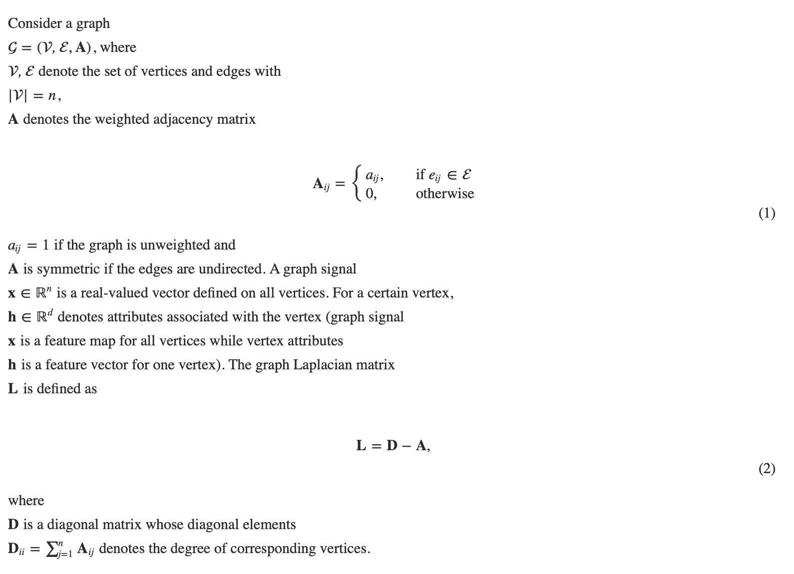

[原文](https://academic.oup.com/bib/article/21/3/919/5498046)

## Introduction

药物开发是一个昂贵且耗时的过程，其中正在测试数千种化合物并进行实验以找出安全有效的药物。药物开发的一般过程包括如图 1 所示的步骤。现代药物开发旨在加快中间步骤，从而通过在药物开发中利用机器学习工具来降低成本，通常是在药物发现和临床前研究阶段。简而言之，分子化合物通过一系列渐进的测试进行过滤，这些测试确定了它们在后期阶段的特性、有效性和毒性。机器学习越来越多地用于在早期更好地预测分子特性，可以显着减少后期过程（例如临床试验）的负荷，节省大量资源和时间。

目前，机器学习在药物开发中的应用包括但不限于：生物活性或物理化学预测，通过使用广泛采用的定量构效（性质）关系（QSAR/QSPR）模型；预测药物-蛋白质和药物-药物对的相互作用；从头分子设计，产生具有理想药理特性的分子结构；合成预测，预测合成反应的产物。由于传统机器学习方法只能处理固定大小的输入，大多数早期药物发现都使用特征工程，即生成和使用特定于问题的分子描述符。通常，在这些任务中使用一组特定于问题的分子描述符作为特征。常用的描述符包括： (1) 分子指纹，通过一系列代表特定子结构存在的二进制数字对分子结构进行编码； (2) 来自量子/物理化学和微分拓扑的描述符，由统计学家和化学家处理； (3) 简化的分子输入行输入系统 (SMILES) 字符串，它唯一地表征分子的结构并将其表示为线符号。给定预定义的预测器（即输入变量），然后通过机器学习算法构建和学习分类或预测模型。

药物研发过程：

近年来，越来越多的大型化学数据库可用于药物研究。因此，在将深度神经网络应用于药物开发方面的新尝试已经兴起。深度学习 [1] 取得了显着的成功，并在过去十年中被广泛应用于自然语言处理 [2] 和计算机视觉 [3] 等领域的学习任务。

深度学习的优势在于它能够从大规模数据中学习输入特征和输出决策之间的复杂关系。它在药物发现和分子信息学方面的应用仍处于起步阶段，但已经显示出巨大的潜力。几种常用的深度架构已被用于与药物相关的工作 [4-7]，并且与传统的机器学习方法相比取得了实质性的改进。但是，由于以下原因，深度模型仍然存在局限性。

首先，大多数当前的深度模型仍然基于手工制作的特征或预定义的描述符，无法直接从原始输入中学习结构信息。其次，现有架构不太适合像分子这样的结构化数据。在这些架构的特征提取过程中，既没有考虑也没有充分利用内部的结构信息。因此，更合适的架构对于进一步提高深度学习在药物发现中的潜力至关重要。

结构化数据，例如图像，已被卷积神经网络 (CNN) 成功处理，卷积神经网络是一种特殊的深度神经网络架构。 CNN 揭示了图像相关任务的最新性能，因为它可以通过卷积算子从原始图像中自动提取任务相关特征 [8]。对于这些由原子和化学键组成的药物和小分子，我们有不同的类型结构，即图，对于它们来说，其中每个原子是一个节点，每个化学键是一个边。一个直接的尝试是对分子图类似地调整卷积过程。但是，与图像不同的是，图具有不规则的形状和大小；节点上没有空间顺序，其邻居也是位置相关的。因此，常规网格状结构上的传统卷积不能直接应用于图。事实上，现实世界中大量的结构数据往往以图而非图像的形式形成，这意味着开发处理不规则结构的方法非常重要且迫切需要。

文献中一直致力于将卷积算子泛化到[**非欧几里得结构化数据**](https://blog.csdn.net/imsuhxz/article/details/91361977/)上，从而产生了所谓的图卷积网络 (GCN)。 GCN 已被确立为药物相关任务的最先进方法，其方式是 **(1) 它通过考虑数据的结构来提取特征**，以及 **(2) 它能够从原始输入而不是手工特征中自动提取特征这可能会因为领域专家的偏见而错过重要信息。**当前新兴的 GCN 遵循两个主流。一种可以概括为**spatial GCN**，它通过将图中所有相邻节点的所有特征向量相加，直接在空间域中制定卷积；另一种称为**谱 GCN**，它根据谱图理论定义了图谱域中的卷积。最近的工作 [10, 11] 也表明，频谱卷积可以表征为空间卷积的一种特殊情况。但是，由于理论基础不同，我们在下面的部分中仍然将它们视为单独的卷积操作。在两个域中都定义了卷积，生成 GCN 利用卷积过程来编码隐藏表示并生成分子图。

在本次调查中，我们特别关注 GCN 的最新进展及其在药物发现中的应用，而不是像之前的调查那样在一般深度学习的背景下进行介绍 [12-14]。因此，我们的评论侧重于与药物相关的应用，包括最近的应用，旨在帮助读者深入了解新开发的药物发现深度架构的当前进展。我们在表 1 中总结了最相关的论文。此外，我们还提供了这些研究中使用的所有数据源的摘要，并在后面的部分可供公众访问。

| Author                   | Dataset                                         | Architecture | Highlight                                                    |
| ------------------------ | ----------------------------------------------- | ------------ | ------------------------------------------------------------ |
| 分子性质和活性           |                                                 |              |                                                              |
| Niepert *et al*. [27]    | NCI                                             | Spatial      | Proposed a general approach to extract locally connected regions from graphs which is analogue to traditional CNN and applied to molecular activity classification task |
| Duvenaud *et al*. [28]   | HCEP                                            | Spatial      | Proposed graph convolution to extract neural fingerprints and tested on molecular property prediction tasks |
| Kearnes *et al.* [29]    | PCBA, MUV, Tox21                                | Spatial      | Proposed a weave module network that considering both atom and bond features in the convolution operator and applied to molecular activity classification tasks |
| Schutt *et al*. [30]     | QM                                              | Spatial      | Proposed deep tensor network on predicting molecular chemical properties |
| Gilmer *et al*. [10]     | QM9                                             | Spatial      | Proposed a unified framework called message passing network and explored extensions to model molecular properties |
| Schutt *et al*. [31]     | QM9, MD17, ISO17                                | Spatial      | Proposed a continuous graph convolution operator based on radial basis functions and applied to predict molecular energies and atomic forces |
| Li *et al*. [32]         | Tox21, ToxCast, MUV, PCBA, HIV, FreeSolv        | Spatial      | Proposed a graph level representation for molecular property prediction |
| Liu *et al*. [33]        | ADME                                            | Spatial      | Application of spatial graph convolution on molecular ADME property prediction |
| Altae-Tran *et al*. [34] | Tox21, SIDER, MUV                               | Spatial      | Application of spatial graph convolution for limited data on molecule ADME property prediction by leveraging few shot learning |
| Li *et al*. [35]         | ESOL, NCI, ADME, Tox21, ClinTox, SIDER, Toxcast | Spectral     | Proposed adaptive graph convolution framework in which the graphs are updated through iterations and applied to molecular property prediction |
| Shang *et al*. [36]      | Tox21, HIV, FreeSolv, Lipophilicity             | Spectral     | Incoporate edge attention into spectral graph convolution framework and applied to molecular property prediction |
| Ryu *et al*. [37]        | ZINC, QM9, HCEP                                 | Spectral     | Incoporate edge attention into spectral graph convolution framework and applied to molecular property prediction |
| Pham *et al*. [38]       | PCBA                                            | Spatial      | Combine GCN and memory network to predict molecular activity |
| 交互预测                 |                                                 |              |                                                              |
| Gao *et al*. [39]        | BindingDB                                       | Spatial      | Utilized graph convolution networks to obtain molecule representations from raw molecules and used for drug-target |
| itnik *et al*. [40]      | STRING, STITCH, SIDER, OFFSIDES                 | Spatial      | Utilized graph convolution networks to obtain molecule representations in a multi-model network consist of drugs and proteins and used for DDI prediction |
| Asada *et al*. [41]      | DrugBank                                        | Spatial      | Enhancing DDI extraction from texts by using molecular structure information |
| Ma *et al*. [42]         | TWOSIDES, SIDER, OFFSIDES, CPI, TTD             | Spectral     | Integrate different data sources and predict DDI via spectral graph convolution approaches |
| 综合预测                 |                                                 |              |                                                              |
| Jin *et al*. [43]        | USPTO                                           | Spatial      | Utilized graph convolution to identify reaction outcomes in chemical reactions |
| 再次药物设计             |                                                 |              |                                                              |
| Simonovsky *et al*. [44] | QM9, ZINC                                       | VAE          | Incorporate graph convolution into variational auto-encoder to generate small molecule graphs |
| Li *et al*. [45]         | ChEMBL                                          | Spatial      | Utilized GCNs to express probabilistic dependencies among a graph’s nodes and edges for generating molecule graphs |
| Li *et al*. [46]         | ChEMBL                                          | Spatial      | Utilized GCNs to generate larger molecules based on sequential generation |
| Jin *et al*. [47]        | ZINC                                            | Spatial      | Incorporate graph convolution and junction tree into variational auto-encoder to generate more valid molecule graphs based on substructures |

剩下的内容组织如下：我们在GraphConvolution原理部分提供了图卷积的理论支持，在GCN在药物发现部分的应用中提供了GCN的详细架构及其应用。公共数据源的信息在药物发现和分子生物信息学部分的数据库中进行了总结。讨论部分讨论了当前方法之外的挑战和可能性。

### 图卷积原理

处理图或网络的数据形式有许多重要的实际问题，如社交网络、知识图、蛋白质相互作用网络、分子图等。 然而，将深度学习应用于这些图数据并非易事，因为其独特的图的特征[15]。最近，神经网络模型对这种结构化图数据的泛化引起了极大的关注 [15, 16]。在过去的几年里，许多论文重新讨论了将神经网络泛化到任意结构的图上的问题 [17-22]，其中一些在以前被例如主导的领域取得了非常有希望的结果。基于内核的方法、基于图的正则化技术等。在下面的小节中，我们介绍了图的表示和图卷积的两种方式，即空间卷积和谱卷积。空间卷积 GCN 是一种可微的消息传递模式，它在局部图邻域到任意图上进行操作。对于社交网络、知识图和分子图等图，它比谱卷积更受欢迎。谱卷积GCN的思想是利用谱理论实现对拓扑图的卷积操作。它通常用于处理数据，如图像和视频。

### 图定义

### 空间卷积

在为结构化数据推广判别嵌入的早期尝试中，戴等人。 [23] 提出了 structure2vec，一种用于嵌入图形结构化数据的潜在变量模型，在图形模型中使用近似推理算法。作者表明，推理算法的解决方案意味着一个传播方程，其中节点的表示是邻域边缘（节点）和来自邻居的消息的函数。后来，大部分 GCN 都建立在这个概念之上，并进行了广泛的修改，称为空间卷积。

空间卷积旨在直接在顶点域中构造卷积。关键思想是通过聚合来自其相邻节点的信息（递归地）来更新某个节点的表示。它与 Weisfeiler-Lehman 算法 [24] 不谋而合，通常用于测试两个图是否同构，其中节点标签通过相邻节点的排序标签集重复增加。这种传播的基本机制是首先将邻域信息视为图子结构，然后通过将不同（或相同）子结构递归投影到不同（或相同）特征空间中，通过可微函数对此类子结构进行建模 [25]。在邻居和中心节点之间流动的信息也称为消息 [10]。消息向中心节点传递的方式产生了表征网络架构的不同传播规则。

传播规则可以概括为两个阶段——消息传递阶段和读出阶段，如[10]中所述的等式（3）和（4）所示。

### 谱卷积

谱卷积定理 [26] 对图上定义的信号追求类傅里叶基础，通常关注图拉普拉斯矩阵 L 的性质

### 傅里叶变换

经典的傅立叶变换将时域中的信号分解为其频域，作为一组基函数的线性组合。基函数的权重可以通过以下等式获得：

### 图傅立叶变换

看原文

### GCN在药物发现中的应用

在本节中，我们回顾了先前关于与计算药物开发和发现相关的主要应用的研究。通过 GCN 计算药物开发和发现的不同任务的开源代码如表 2 所示。

| Author                        | Application                | Code                                           |
| ----------------------------- | -------------------------- | ---------------------------------------------- |
| Li *et al*. [32]              | Drug discovery             | github.com/microljy/graph_level_drug_discovery |
| Shang *et al*. [36]           | Drug property prediction   | github.com/Luckick/EAGCN                       |
| Ryu *et al*. [37]             | Drug property prediction   | github.com/seongokryu/augmented-gcn            |
| Gao *et al*. [39]             | DTI                        | github.com/IBM/InterpretableDTIP               |
| Feng *et al*. [48]            | DTI                        | github.com/simonfqy/PADME                      |
| Zitnik *et al*. [40]          | DDI                        | github.com/marinkaz/decagon                    |
| Ma *et al*. [42]              | DDI                        | github.com/matenure/mvGAE                      |
| Fout *et al*.                 | PPI                        | github.com/fouticus/pipgcn                     |
| Jin *et al*.                  | Synthesis prediction       | github.com/wengong-jin/nips17-rexgen           |
| Simonovsky and Komodakis [44] | *De novo* molecular design | github.com/tkipf/gae                           |
| Li *et al*. [45]              | *De novo* molecular design | github.com/shllln/GenerativeGraph              |
| Li *et al*. [46]              | *De novo* molecular design | github.com/kevinid/molecule_generator          |
| Jin *et al*. [47]             | *De novo* molecular design | github.com/wengong-jin/icml18-jtnn             |
| Olivecrona *et al*. [49]      | *De novo* molecular design | github.com/MarcusOlivecrona/REINVENT           |

### 定量结构活性/性质关系预测

QSAR (QSPR) 预测生物活性（化学性质）和分子描述符之间的关系。这个问题的机器学习方法已经在文献[50-52]中得到了广泛的探讨。对于大多数与药物相关的计算方法，一个基本问题是要处理什么类型的输入表示。手工制作的特征不能完全编码分子图的结构信息。此外，那些预定义的输入不是数据/任务驱动的，导致预测能力较低。因此引入 GCN 以应对上述限制。

### 生物性质和活性

杜维诺等人。 [28]首先提出了一种使用神经网络生成可微分和数据驱动指纹的方法。在这项研究中，规则圆形指纹中的哈希函数（编码分子中每个原子的子结构）被平滑函数取代。在这里，圆形指纹被设计为以对原子重新标记不变的方式编码分子中存在哪些子结构 [53]。因此，学习了一个实值向量来表示一个分子而不是一个二元向量，称为神经指纹。分子的最终表示是通过聚合所有原子的表示获得的，经过一个能够解释学习特征的 softmax 层。编码过程是卷积的，因为邻域信息被聚合以更新中心原子，并且对具有相同邻域大小（范围从 1 到 5）的原子及其相邻原子应用相同的局部过滤器。作者评估了生成的几种药物特性的指纹，包括溶解度、药物功效和有机光伏效率，神经指纹优于传统的圆形指纹。此外，这些表示是可解释的，因此与预测密切相关的特征更容易被分子结构中的某些片段激活。然而，一个不足在于，与建立在预先计算的指纹之上的模型相比，训练指纹和预测模型需要更多的时间，尤其是对于大型数据集。

除了节点特征或标签，边缘信息也很重要，也可以在图卷积中进行编码。卡恩斯等人。 [29] 提出了一个图卷积框架来学习考虑节点和边缘特征的数据驱动任务的分子表示。具体来说，每一层都包含原子表示和成对（边缘）表示。跨不同层的所有关系模块都发生了传播：原子到原子（A →
A), 原子对 (A →P), 对原子 (P →A) 和对对对 (P →P)，形成一个 Weave 模块。每一层都遵循这样的编织模块架构，而在最后一个卷积层，只有原子表示用于下游任务。跨相同表示的转换（A →A, P →P) 是通过神经网络实现的。对于跨不同表示的转换 (A →P, P →A)，在特征转换后使用了额外的顺序不变聚合操作。作者从 259 个数据集评估了他们的生物活动方法，这些数据集由 PCBA [54]、Rohrer 和 Baumann [55] 构建的“最大无偏验证”数据集、有用诱饵的增强目录 [56] 和训练集组成对于 Tox21 挑战 [57]，在同时预测活动的多任务环境中。输入是具有原子特征和原子对特征的分子图。然后将所提出的方法与使用 RDKit 生成的摩根指纹的基线方法进行比较。提出的 WeaveNet 并没有始终优于现有技术，但提供了一种方法，除了节点特征之外，还结合了边缘特征。

类似的应用可以在 Liu 等人中找到。 [33] 作者使用 GCN 开发了一个吸收、分布、代谢和排泄 (ADME) 特性预测系统。卷积算子类似于编织模块。对于每个原子，邻域信息首先通过一个全连接层进行转换，然后使用不同的归约算子进行聚合和减少。然后通过连接所有归约算子（包括最大值、求和和平均值）的结果来形成中心原子的表示。然后将简化的表示与原子输入特征相结合。还对五个选定的 ADME 终点的多任务方案进行了评估：人类微粒体清除、人类 CYP450 抑制、水平衡溶解度、孕烷 X 受体诱导和生物利用度，与基于规则的预测模型相比，提议的 Chemi-Net 实现了改进.

为了获得分子表示，大多数以前的研究总结或平均原子级表示，但忽略了分子的图结构。李等人。 [32] 介绍了一种使用 GCN 生成图级表示的替代方法。作者通过引入一个虚拟超级节点实现了他们的目标，假设该超级节点通过有向边连接到图中的所有节点。节点级传播遵循传统的空间图卷积。对于虚拟超级节点，使用图中的所有节点及其自身更新表示，并与附加权重矩阵相关联。作者在生物活性分类和分子特性预测方面评估了所提出的方法。

以前的框架都建立在空间图卷积上，而频谱图卷积由于以下原因在 QSAR (QSPR) 任务中使用较少。分子由不同大小的不同原子组成，因此最终具有不同的拓扑结构。在光谱 GCN 中导出的光谱受制于一个特定的图，因此它不能转移到其他图。然而，仍然有关于在绕过约束的与药物相关的任务中使用光谱 GCN 的研究。

早期的谱 GCN 固定图结构未经训练，因此无法从拓扑结构中学习。李等人。 [35] 构建了图卷积，它接受灵活的图输入并为每个输入图学习额外的拓扑信息。图邻接矩阵通过参数距离度量更新，其中调整距离度量的权重是在训练过程中学习的。然后基于残差方案更新拉普拉斯算子，其中在每次迭代时，将一小部分学习到的拉普拉斯算子添加到原始拉普拉斯算子矩阵中。传播遵循传统的谱图卷积。这种自适应设置允许输入具有唯一的图拉普拉斯算子，以便每个化合物都有其唯一的卷积滤波器。作者通过对多个分子数据集的多任务预测验证了所提出的方法，并表明学习到的额外拓扑有助于提高预测精度。

除了节点特征之外，即使对于相同的分子，边属性也可能导致不同的图表示。使用谱图卷积联合学习边缘权重和节点特征在以前的文献中没有被探索过。因此，尚等人。 [36] 提出了基于边缘注意力的图卷积网络来处理多关系图。在多关系图中，每个边缘特征（二元或分类）都被视为一个关系。每个关系都包含一个字典，其中包含要为每个关系类别学习的值。字典在所有图形中共享，因此所提出的方法对输入大小不敏感。卷积遵循一跳谱卷积，在最后一个（预测）层之前连接或加权平均不同关系的表示。作者在四个不同的数据集上评估了分类和回归任务。尽管由于字典设置，所提出的方法适用于各种输入大小，但仅当边缘属性是二进制或分类变量时才可行。

相同的原子通常根据其局部化学环境具有不同的分子特性。然而，之前的研究在不考虑其化学环境的情况下，对所有原子和键都具有同等重要性。为了解决这个问题，Ryu 等人。 [37] 引入了注意力机制来区分不同环境中的原子并提取决定分子特性的结构信息。给定一个中心节点，在聚合之前为每个邻居乘以一个注意力权重。注意权重由中心节点和邻居节点通过耦合矩阵的表示确定。传播遵循一跳频谱卷积。该网络包含六个卷积层和三个全连接层，并在三个数据集上进行了分子性质预测任务的验证。此外，作者还提供了全面的可解释结果，以比较所提出的方法和一般 GCN。例如k-means聚类下原子特征向量的PC分析；两种方法在不同性质下的分子之间的比较，表明注意力机制导致了更合理和可解释的结果。

### 将 GCN 与其他学习架构相结合

GCN 最初受到传统卷积网络的启发，因此出现了类似于传统 CNN 的泛化 GCN 的研究。尼珀特等人。 [27] 在他们的工作中提出了这样的框架。核心挑战是像在传统 CNN 中一样定义一个接受域，但对于任意图。作者通过首先使用图标记程序从图中选择固定长度的节点序列来实现这一点。如果它们在图中的结构角色相似，则来自两个不同图中的节点被分配到相似的位置。给定选定的节点序列，然后通过广度优先搜索为每个节点组装邻域。之后，通过对组装的邻域进行归一化来构建节点的感受野。归一化过程旨在找到一个标签，使得向量空间和图空间中两个图之间的预期距离最小。每个顶点属性对应一个输入通道。基于生成的感受野，任意函数或架构可用于下游任务。例如，作者在几个分子生物活性分类任务中使用了两个卷积层，然后是一个密集层和一个 softmax 层。

最近还有一项工作是通过结合图卷积来利用记忆网络对分子进行建模。在 [38] 中，Pham 等人。提出了用于分子建模的图记忆网络。内存网络由控制器和外部内存组成，其中内存单元对每个节点的表示进行编码，控制器迭代地从内存中读取和写入。图的表示是使用注意机制的所有记忆单元的加权总和。每个存储单元的表示按照空间图卷积范式进行更新。控制器是使用跳过连接实现的。由于分子活性预测中的分子数量通常有限，为了呈现有限数据带来的过拟合，作者使用多任务方案来评估他们的方法。总共有九个生物测定活性测试，每个任务都有一个常数向量作为输入查询来表示不同的任务。

深度架构需要大量的训练数据才能显着提高预测能力，而且通常某些任务可能包含的数据不足，无法做出有意义的预测。通过将一次性学习与 GCN 相结合，Altae-Tran 等人。 [34] 证明，通过结合图 CNN，可以显着改善对小分子的合适距离度量的学习。目的是利用训练任务中的信息为测试任务构建强分类器，使用不同任务组中分子之间学习表示的相似性，即查询分子的标签是基于支持分子的标签的加权和在他们的距离上。在所提出的方法中，分子表示是通过图卷积层获得的。用于生成任务驱动的相似性度量的嵌入是通过迭代长短期记忆 (LSTM) 以残差网络方式实现的。在每次迭代中，通过细心的 LSTM 框架将一小部分添加到当前表示中。在获得相似性度量后，可以立即得出对分子标签的最终预测。作者在几个著名的分子特性数据集上评估了他们的方法。此外，通过将经过训练的模型转移到另一个数据集，作者表明一次性模型在推广到其他不相关系统方面的能力有限。

### 交互预测

现代药物疗法寻找用于疾病治疗的化合物依赖于几种类型的相互作用：（1）配体（可以是上市前化合物或现有药物的小分子）和蛋白质（靶标）之间的相互作用，（2）蛋白质和蛋白质之间的相互作用准确定位通路调节方法中的相互作用界面和 (3) 药物相互作用 (DDI) 以检测潜在的不良反应并寻找现有药物的新用途。因此，相互作用预测在药物开发中也至关重要。然而，由于昂贵的实验测定以及药物和蛋白质之间复杂的相互作用在小型临床环境中的罕见性，这种相互作用的鉴定很困难。基于当今大型药物数据库的可用性，计算方法能够在相对较短的时间内对潜在相互作用进行大规模测试。传统的计算方法聚合药物和目标特征或相似性度量，以使用标准机器学习算法识别相互作用 [59-62]。 GCN 的出现使分子的可学习表示成为可能，从而为使用深度学习框架检测药物和目标之间的相互作用提供了新的范式。

### 配体-蛋白质（药物-靶标）相互作用

预测配体（上市前化合物或现有药物）和蛋白质（靶标）之间的相互作用是药物发现中的一个基本问题。然而，由于以下原因，仍然存在一些挑战。首先，可合成配体的化学空间是难以处理的，因此预测仍然是一个悬而未决的问题。其次，传统方法通常将交互预测视为二元分类问题，无法处理冷目标问题 [63, 64]，即目标蛋白从未出现在训练集中，这在实践中非常普遍。第三，大多数传统方法虽然有效，但缺乏生物学解释，而它在生物信息学领域很重要。

因此，为了解决这些局限性，Feng 等人。 [48] 提出了一个基于深度神经网络的框架，来预测化合物和蛋白质之间的实值相互作用强度，而不是二元类标签。它的优越性在于通过GCNs学习每种药物的分子结构，使得药物的表征内部编码了更丰富的化学信息，而不是将每种药物仅仅作为知识图谱（KGs）中的一个节点。对药物分子结构进行编码可以计算药物和蛋白质之间的实值相互作用强度。本研究以分子结构和蛋白质信息为输入，能够解决冷靶点（和冷药）问题。 Lau 和 Dror [65] 为晶体数据开发了几种新颖的图卷积方法，表明通过图卷积学习的潜在特征在其他蛋白质配体下游回归/分类应用中是有效的。

高等人。 [39] 提出了一个端到端的深度框架，可以解释预测药物-靶点相互作用。由氨基酸序列组成的蛋白质的表示是通过 LSTM 递归神经网络学习的，而药物分子的神经指纹 [28] 是通过图卷积层获得的。引入了一种双向注意机制来跟踪药物原子与每个氨基酸成分相互作用的可能性，从而实现可解释性。然后使用注意力权重将原子聚合为分子表示（药物），将氨基酸聚合为蛋白质（目标）表示。最后，将基于注意力的表示输入到分类器中以进行预测。除了氨基酸序列，基因本体信息也被用来推导蛋白质嵌入。学习到的相互作用可以追溯到原子水平和氨基酸水平，以查看药物和靶标的哪一部分对相应的相互作用贡献最大。

很明显，上述交互预测的性能取决于这些知识图的质量，即这些 KG 中现有边的有效性。然而，许多现实世界的知识图往往包含来自不同质量的多个来源的关系。例如，从非结构化文本（如医学文献）中提取的药物-靶标相互作用不如手动策划的可靠。因此，需要一种方法可以使噪声更便宜的数据有效地用于更准确的预测。为此，尼尔等人。 [66] 通过为网络添加注意力参数来学习在训练期间信任边缘的程度，以减轻噪声边缘的影响，从而为 GCN 引入了注意力机制。它不仅提高了干净数据集的性能，而且还很好地适应了 KG 中的噪声。

### 蛋白质-蛋白质相互作用

虽然与药物设计没有直接关系，但蛋白质-靶标相互作用为开发调节蛋白质通路的药物提供了靶标结合位点信息。这种交互也可以使用图卷积网络来预测。在[67]中揭示了一个成功的应用。给定两个蛋白质，每个蛋白质都被送入一个两层图卷积网络，每个原子都学习嵌入。然后通过原子嵌入的串联获得成对表示，然后是一个完全连接的层来分类来自两种蛋白质的两个原子是否相互反应。实验中使用的特征是手工制作的，包括基于序列的特征和从结构计算的特征。因此，该应用程序旨在通过考虑传播步骤中的蛋白质结构，从现有特征中提取信息。

### 药物相互作用

当两种药物共同给药且一种药物的作用受到另一种药物的影响时，就会发生 DDI。 DDI 预测不仅有助于预防不良反应，还有助于发现药物的新用途（例如有益的 DDI 为药物组合提供指导，可以在治疗过程中视为新药），提供有关药物开发过程的额外信息。因此，尽管 DDI 预测与狭义药物开发有间接关系，但我们仍将其纳入本节。齐特尼克等人。 [40] 提出了一个基于 GCN 的框架，以在多药副作用水平上进一步识别 DDI，即不同类型的 DDI，为药物联合治疗提供额外的指导。所提出的框架 Decagon 的特点是多模式网络中的多关系链接预测。它包含一个图卷积编码器和一个张量分解解码器。编码器考虑了具有两种类型实体的图：药物和蛋白质；和三种类型的相互作用：蛋白质 - 蛋白质相互作用（PPI），药物 - 蛋白质相互作用（DTI）和DDI。每个副作用都表示为不同类型的边缘。编码器遵循空间卷积约定，将不同的权重分配给具有不同关系类型的节点和邻居。每一层都被认为是一阶邻域，而更多的邻域则涉及堆叠层。编码器将每个节点映射到一个嵌入，而解码器旨在从学习到的表示中重建边缘标签。在解码阶段，使用张量分解方法为每个节点对计算关系分数。通过最小化交叉熵损失来优化整个模型。作者将他们的方法与张量分解模型和基于深度学习的方法（如 DeepWalk [68]）进行了比较，并取得了显着的改进。

为了从异构数据源中学习更全面、更准确的药物相似性，Ma等人。 [42] 提出了一种使用具有注意机制的图自动编码器的多视图药物相似性集成框架。每个视图都表示为通过来自数据源的特征获得的相似性矩阵。不同的视图通过注意力机制聚合，其中可学习的注意力权重与每个视图相关联。注意权重被对角化以降低计算复杂度。然后将融合的相似性内核输入自动编码器框架以提取信息表示。传播遵循 [22] 中的谱图卷积。作者评估了针对 DDI 发生和具有不同关系类型的 DDI 的 DDI 识别任务所提出的方法。

结构信息也可以与其他数据类型结合以提高预测性能。浅田等。 [41] 提出了一个从文本中提取 DDI 的框架。给定一个包含药物提及的文本语料库，目标是将药物-药物对分类为不同类型的相互作用（机制、效果、建议、整体和无相互作用）。传统方法使用CNN提取特征来预测药物-药物关系[69]。作者首先通过预训练用于 DDI 识别（二进制）的 GCN 将药物结构信息纳入框架。之后，来自固定 GCN 的药物嵌入与来自 CNN 的文本嵌入连接，输入到一个全连接层以预测交互类型。药物结构来自 DrugBank，文本文档来自 DDIExtraction 2013 共享任务 [70]。结果表明，结构信息有助于从文本中提取 DDI。

### 综合预测

预测有机反应结果是设计产生特定目标分子的反应序列的基本步骤。它包括两个步骤：候选生成和过滤。候选生成的最新解决方案基于反应模板，该模板指定了可以应用的分子子图模式和相应的图转换。模板要么是手工制作的，要么是从反应数据库中生成的 [71-73]，存在覆盖率和效率问题。此外，匹配过程很昂贵，使得当前的方法仅适用于小数据集和有限的反应类型。在 [43] 中，Jin 等人。提出了一种利用图神经网络进行反应预测的无模板方法。输入是预定义的原子和键特征。利用图卷积，该网络通过预测反应物分子中每个原子对的反应性分数，学会了在不使用模板的情况下识别反应中心。前向传播遵循空间图卷积。得分最高的原子对用于生成候选产品。然后建立了第二个网络，用于对候选人进行排名以找到真实的反应结果。作者为候选生成和排名阶段提出了两种模型。在模型生成的候选集中发现真实产物的反应比例用作反应中心识别的评估指标。覆盖精度用于候选排名。结果表明，所提出的方法大大优于基于模板的方法。

在化学领域，逆合成是设计化合物生产的标准方法。原理是，从思想上倒退，化合物被分解成更小的成分，直到获得基本成分。这种分析提供了“烹饪配方”，然后用于在实验室中从起始材料开始生产目标分子。虽然理论上很容易，但该过程在实践中存在困难。就像在国际象棋中一样，在每一步或每一步中，您都有多种可能性可供选择。然而，在化学中，可能的走法比国际象棋要多几个数量级，而且问题要复杂得多。计算机辅助的逆合成将是一种非常有价值的工具；然而，过去的方法进展缓慢，结果质量不令人满意。为此，Segler 等人。 [74] 提出了一种基于深度学习的新计算机辅助合成规划 (CASP) 方法，该方法采用蒙特卡洛树搜索来有效地发现逆合成路线，现在专注于将发现付诸行动。与传统的CASP方法相比，这种新方法大量借鉴了深度神经网络和强化学习的思想，是对传统CASP方法的重要改进。与计算机科学界基于 GCN 的方法相比，Segler 等人提出的这种新方法的设计。借用了大量的化学知识，体现了对化学反应的深刻理解。

### 从头分子设计

药物开发的最终目标是发现具有所需药理特性的新化学结构。然而，由于几乎无限的搜索空间，现实中的药物设计既困难又昂贵[75]。因此，从头分子设计旨在利用计算方法来自动化分子生成过程。早期研究利用基于规则的方法来减少搜索空间并生成分子 [76, 77]。深度学习中的生成模型能够基于 SMILES 字符串有效生成分子 [49, 78]。然而，SMILES 和指纹过于简单，无法传递分子结构的拓扑信息，导致学习准确率相对较低。分子图直观简洁地表达具有二维拓扑信息的分子。因此，它们在化学教育和化学信息学中被广泛采用。事实上，已经在努力开发基于分子图的 DL 模型。 GCN 作为 CNN 的扩展，引入了分子的新表示，从而能够直接实现生成分子图而不是管道实现生成中间表示，为分子生成提供了新的思路。 GCN 受益于 CNN 架构的优势；与完全连接的多层感知器模型相比，它使用更少的参数，以高精度执行，但计算成本相对较低。它还可以通过分析相邻原子之间的关系来识别决定分子特性的重要原子特征。分子图中相邻原子之间的信息传播设计是一种简单有效的编码分子结构信息的方法[28]。

西蒙诺夫斯基等人。 [44] 提出了用于生成小分子图的变分自编码器。编码器由变分后验定义，解码器由生成分布定义，每个都包含可学习的参数。编码器的输入是图邻接矩阵、边缘特征张量和节点特征。作者使用边缘条件卷积作为编码器。解码器在预定义数量的节点上输出一个概率全连接图，可以从中抽取离散样本。通过最小化负对数似然的上限来训练模型。用于对齐生成的图和地面实况的近似图匹配促进了自编码器的重建能力。作者将基于 GCN 的 VAE 与传统的基于字符的生成器 [79] 和基于语法的生成器 [80] 进行了比较，并展示了生成更多化学有效分子的建议方法。然而，由于其预定义的节点数总是等于或大于实际分子大小，因此所提出的模型仅用于生成小图；此外，输出是密集表示，使得参数和匹配复杂度快速增长。

Li 等人探索了一种顺序生成原子并扩展图的概率方法，而不是一次生成整个图。 [45]。生成过程可以看作是添加节点或边并选择一个节点与新节点连接的一系列决策。这些决定是根据 GCN 描述的概率做出的。该网络是通过最大化图上分布的预期联合对数似然及其节点和边的排序来学习的。生成模型可用于实现条件生成。典型的输入用于调节生成过程。作者评估了所提出的生成特定拓扑图和分子图的方法。结果表明，与具有 LSTM 架构的模型相比，所提出的方法生成了更有效的图。然而，可扩展性对于所提出的方法来说仍然是一个挑战，因为大图需要更多的传播步骤来确保信息流，并且训练此类图模型比训练 LSTM 网络更困难。 Li等人采用了类似的框架。 [46]。在每一步，都会对图形转换（追加、连接、终止）进行采样和执行。使用 GCN 对每个转换的采样概率进行参数化。转换映射被表示为解码方案。作者探索了两种解码策略，一种被参数化为马尔可夫过程，另一种使用分子级循环单元来增加模型的可扩展性。

以原子方式生成分子图的一个主要缺点是产生低质量的中间体。金等人。 [47]通过利用子结构作为有效成分提出了一种两阶段分子图生成方法，因此显着提高了生成分子的质量。该方法首先生成一个连接树结构来表示子图组件，这些子图组件用作构建块。在第二阶段，子图被组装成一个分子图。该图由标准 GCN 编码。通过平均所有节点表示获得最终的图形表示。树结构使用消息传递网络进行编码，其中消息通过门控循环单元构建。最终的树表示是从树根编码的。在解码过程中，首先解码一棵树，然后通过枚举和排序子图从连接树解码出图。作者从三个方面评估了所提出的方法：（1）分子重建和有效性：从潜在表示重建输入分子，并在从先验分布采样时解码有效分子； (2) 贝叶斯优化：测试模型如何产生具有所需特性的新分子； (3) 受约束的分子优化：修改给定的分子以改善指定的性质，同时约束与原始分子的偏离程度。将所提出的方法与最先进的基于 SMILES 的 VAE [80, 81] 进行了比较，并显示出显着的改进。

### 用于药物发现和分子生物信息学的数据库

到目前为止，我们已经介绍了 GCN 在药物发现中的应用。在本节中，我们在表 3 中对调查论文使用的数据库进行了总结。我们将它们分成与药物应用相对应的组。我们还包括多个数据库，这些数据库从多个来源集成并可供开放访问。

表看原文

分子性质和活性

生物性质和活性

PubChem [54] 是一个大型公共数据库，包含化学分子及其对生物测定的活性。它由三个主要通道组成：PubChem BioAssay (PCBA)、PubChem Compound 和 PubChem Substance。物质包括所有贡献者报告的化合物及其信息。化合物源自 Substance，由 Substance 中化学结构的标准化表示组成。 BioAssay 包含来自 125 万个高通量筛选程序的生物活性结果。 PubChem 化合物 ID 通常在不同的化学数据库中用于相同化合物的参考。

最大无偏验证 (MUV) [55] 数据集是 PCBA 的一个子集，使用精细的最近邻分析生成，并且在模拟偏差和人工富集方面是无偏的。它包含大约 90,000 种化合物的 17 项具有挑战性的任务，专为验证虚拟筛选技术而设计。这些数据集中的正样本被选择为在结构上彼此不同。

ChEMBL [82] 是一个具有类似药物特性的生物活性分子数据库。它包含分子化合物的结合、功能和 ADMET（吸收、分布、代谢、排泄和毒性）信息，这些信息是从主要发表的文献中手动导出的，然后进一步标准化。该数据库为超过 100 万种化合物和 5200 个蛋白质靶标提供了 540 万次生物活性测量。

ZINC [83, 84] 包含专门为虚拟筛选准备的市售化合物的精选集合。它提供与来自 20 多种资源的分子相关的信息，例如化学结构、生物活性和目标信息。它包含超过 2 亿种随时可用的 3D 格式的化合物。

NCI [85] 是一个化合物数据库，用于筛选针对不同癌细胞系的活性。它包括大约 25 万个分子的生物测试数据和化学结构。 HIV 数据集由 Drug Therapeutics Program [86] 使用 AIDS 抗病毒筛选产生，也是 NCI 数据库的一部分，在该数据库中检查化合物是否具有抗 HIV 活性的证据。对筛选结果进行评估并将其分为三类：确认有效、确认无效和确认中度活跃。该数据集包含 43850 种化合物的筛选结果以及结构信息。

Tox21 [57]、ToxCast [87] 和 ClinTox [63] 是包含分子毒性信息的数据集。 Tox21，被称为 21 世纪毒理学计划，是联邦机构之间的一项合作，旨在开发创新的测试方法，以更好地预测物质如何影响人类和环境。它包含对 12 个生物目标的定性毒性测量，包括核受体和应激反应途径。 ToxCast 是环境保护局提供的一个数据集，用于开发有效的方法来优先排序、筛选和评估化学品。它使用高通量筛选方法和计算毒理学方法包含来自广泛来源的 1800 种化学品的毒理学数据。 ClinTox 是 MoleculeNet [63] 基准数据的一部分，其中包括因毒性原因未能通过临床试验的药物化合物和 FDA 批准的药物化合物。它包含 1491 种药物化合物的两个分类任务。

FreeSolv [88] 是一个关于水中小分子的实验和计算水合自由能的数据库。这些值来自使用分子动力学模拟的炼金术自由能计算。它目前包含 643 个分子的分子特性数据及其化学结构。 ESOL [89] 是另一个包含数千种低分子量化合物的水溶解度数据的数据集。

量子化学性质

清洁能源项目数据库 (CEPDB) [90] 是哈佛清洁能源项目的数据库，这是一项虚拟的高通量筛选计划，旨在确定有前景的碳基太阳能电池材料的新候选材料。该项目建立了一个自动化的计算机框架来研究有机光伏的潜在候选结构。该数据库提供了来自 DFT 模拟的信息，涉及 230 万个候选分子基序，其中包括已知和虚拟化合物。

Quantum Machine (QM) [30, 91–96] 是一个包含分子及其量子力学特性（例如原子能量和力）的数据库。它包括来自多个来源的数据，旨在加速机器的开发，该机器可以根据第一原理快速准确地模拟量子化学系统。自 2013 年以来，它已经发布了 QM7、QM8、QM9 和 MD 数据集。

交互数据库

副作用资源 (SIDER) [97] 是一个数据库，其中包含有关已上市药物及其记录的药物不良反应 (ADR) 的信息。该信息是从公共文件和包装说明书中提取的。目前，数据库中有 1430 种药物和 5868 个副作用 (SE)，有 139756 个药物-SE 对。还提供了药物适应症数据集以减少误报。

标签外副作用 (OFFSIDES) [98] 是一个包含 1332 种药物的 438801 个标签外副作用和 10097 个不良事件的数据库。标签外表示未列在 FDA 官方药物标签上的副作用。这些信息是使用不良事件报告系统收集的，该系统收集患者、医生和公司的报告。由同一实验室生成的 TWOSIDES [98] 是成对药物的多药副作用资源。它只包含由药物组合而不是任何单一药物引起的副作用。与 OFFSIDES 一样，信息是通过不良事件报告系统生成的。该数据库包含 59 220 对药物与 1301 起不良事件之间的 868 221 个显着关联。

相互作用化学物质搜索工具 (STITCH) [99] 是一个数据库，它将 430 000 种化学物质和超过 9 600 000 种蛋白质的数据源集成到单一资源中。它提供了化学物质和不同相互作用目标之间的结合亲和力，从而形成了化学-化学相互作用和化学-蛋白质相互作用的全球网络。蛋白质空间与蛋白质-蛋白质网络数据库 STRING [100] 共享。所有交互都与表示网络实体之间链接强度的置信度分数相关联。

DrugBank [101, 102] 是一个综合数据库，包含有关药物的详细分子信息。数据库中有两种药物，FDA 批准的小分子药物和生物技术药物。它还提供有关目标、适应症和途径的信息。每种药物的数据字段都超链接到其他数据库（PubChem、ChEBI、PDB、KEGG 等）。最新版本包含 11680 个药物条目和 5129 个与这些药物条目相关联的非冗余蛋白质（即药物靶点/酶/转运蛋白/载体）序列。

治疗靶点数据库 (TTD) [103-106] 包含有关文献中描述的已知治疗蛋白和核酸靶点的信息。除靶标外，还提供相应药物信息、靶标疾病情况和通路信息。序列和结构信息也可通过与其他数据库的交叉链接获得。目前该数据库包含3101个靶点和34019种药物。

对接基准数据库（DBD5）[107] 是一个基准数据库，其中包含一组不同的蛋白质对接测试用例。这些复合物是来自蛋白质数据库 (PDB) 的结构子集选择。它包括单独结晶的受体和配体 PDB 以及用于测试蛋白质对接算法的共结晶复合 PDB。

BindingDB [108] 是一个数据库，用于测量药物靶蛋白和小药物样分子相互作用的结合亲和力。该数据库包含 1 454 892 个结合数据，包含 7082 个蛋白质靶点和 652 068 个小分子。

综合数据库

USPTO [109] 是一个包含化学反应物反应信息的数据库。这些反应摘自美国专利商标局 (USPTO) 的专利申请。总共提取了 424 621 个精确的原子映射反应并将其包含在数据库中。

集成基准数据库

MoleculeNet [63] 是为测试分子特性的机器学习方法而设计的基准。它建立在多个公共数据库的基础上，涵盖了超过 700 000 种针对一系列不同特性进行测试的化合物。数据集分为四类：生理学、生物物理学、物理化学和量子力学。它包含上述数据库的子集，包括 QM、Toxicity 数据集（Tox21、ToxCast.ClinTox）、生物活性数据集（PCBA、MUV、HIV）、生物特性数据集（ESOL、FreeSolv）和交互数据集（SIDER）。它还包含其他数据集，例如 BBBP、血脑屏障渗透的二进制标签；亲油性，辛醇/水分配系数实验结果； BACE，一组人β抑制剂的结合结果
-分泌酶 1;和 PDBbind，生物分子复合物的结合亲和力。

Decagon [40] 提供了蛋白质靶标和药物分子及其相互作用的预处理数据。该网络由来自多个数据源的 DTI、PPI 和 DDI 组成。通常，DTI 是从 STITCH 数据库中提取的； DDI 来源于 TWOSIDES 数据库； PPI 是从人类 PPI 网络和 STRING 数据库中集成的。 SIDER 和 OFFSIDES 的药物副作用也包括在内。

为了提高从头分子设计生成模型评估的一致性，Brown 等人。 [110] 介绍了一个基于一套标准化基准的评估框架 GuacaMol。基准任务包括测量模型的保真度以重现训练集的属性分布、生成新分子的能力、化学空间的探索和开发以及各种单目标和多目标优化任务。基准测试框架可作为开源 Python 包使用。

波利科夫斯基等人。 [111] 介绍了用于药物发现的 MOSES (https://github.com/molecularsets/)，它实现了几种流行的分子生成模型，并包括一组评估生成分子的多样性和质量的指标。 MOSES 旨在规范分子生成研究，促进新模型的共享和比较。此外，它还提供了现有最先进模型的大规模比较，并详细阐述了生成模型当前面临的挑战，这些挑战可能为新研究提供沃土。该平台应该允许对新的生成模型进行公平和全面的比较。

## 讨论

正如最近的一篇评论论文 [112] 所总结的那样，GCN 的特点是对建模结构化数据施加关系归纳偏差。 GCN 的出现及其在分子生物信息学等领域的成功应用描绘了结合深度学习的力量，深度学习假设最小先验，结构化方法对输入和模型施加严格限制。从更广泛的意义上讲，GCN 适用于任何可以表示为图的数据结构，因此在各种实际应用中具有巨大的意义。

在药物发现领域，深度学习能够在相对较短的时间内大规模预测化学性质和活性，自动化并加快药物发现过程。与传统方法相比，图卷积网络的引入通过本质上考虑分子结构提供了更准确的预测。此外，当与注意力等其他机制结合时，图卷积网络会生成生物可解释的结果，例如，在交互预测中。

然而，尽管图卷积网络最近取得了成功，但为了充分释放图卷积网络在药物发现方面的潜力，挑战仍然存在。在此，我们总结了以下小节中的挑战和机遇。

数据库挑战和机遇

深度模型需要大量数据才能学习输入和目标之间的复杂关系。尽管大型数据库变得可用，但由于以下原因仍然存在不足。首先，对于某些分子特性（例如溶解度、毒性），可用数据要么有限，要么分散为不同的小数据集。除了收集更多的数据，一个统一的平台可以更好地整合不同的数据源，对于交叉参考和获取更充足的数据也是必不可少的。其次，现有数据库主要管理正样本。例如，在交互网络中，如果两个实体交互，它们被包含在数据库中，而非交互对的信息往往被忽略。这不仅会导致不平衡问题，还会导致控制信息根本不可用的情况。当前的计算方法要么设计新目标，要么手动生成负样本以应对限制，而识别负样本实际上很困难。因此，官方策划的负样本对于使用机器学习方法进行更准确的预测很重要。第三，可以向数据库中添加更多指定和详细的信息。例如，即使对于交互对，交互也可能具有不同的功能。当一种药物与另一种药物相互作用时，其作用可能是协同作用或拮抗作用，而实际上只记录到拮抗作用 [113]。事实上，协同 DDI 效应是有益的，因此它可以为患者护理中的药物组合提供重要指导 [114]。

方法论的挑战和机遇

分子化合物，尤其是蛋白质，是 3D 形状的实体，其中 3D 空间中的折叠结构极大地影响了它们的功能 [115]。当前的图卷积主要在平面 2D 图上运行，其中忽略了三维空间中的结构信息。已经有一些尝试在 3D 结构上开发卷积算子 [116-118]，将图卷积网络扩展到 3D 结构绝对是一个值得探索的方向。

另一方面，高阶结构在 2D 图上较少关注和探索，但它实际上可能提供额外的信息。例如，在疾病-蛋白质网络分析 [119] 中，作者发现疾病通路并不对应于单个连接良好的组件，而高阶网络结构（基序）为疾病通路的发现提供了额外的信息。蒙蒂等人。 [120] 研究了模体的谱图卷积，并在引文网络数据上进行了验证。基于motif的图卷积的探索及其在药物发现中的应用尚未得到很好的建立，因此是一个很有前途的未来方向。

现有的图卷积对规则图进行操作，而对于某些关系，可以形成超图。例如，不同的药物可能共享相同的 ADR、目标或适应症，这些可以转换为超图。文献中尚未研究如何在超图上定义适当的卷积以提取有用的信息。

网络设计挑战和机遇

目前图卷积网络通常用于两种场景。在第一种情况下，每个数据点都表示为一个图，其中预测发生在图级别，例如分子性质和活性预测。在第二种情况下，只呈现一个图，每个数据点表示图中的一个节点，例如药物-靶点相互作用网络。第一个旨在为每个实体提取结构信息，而第二个旨在在实体之间传播关联信息。

可以进行的一个改进是结合两个场景并构建端到端框架，同时利用低级结构信息和全局网络结构信息。对于第二种情况，通常在交互网络中最多出现两个实体，而实际上，药物发现涉及两个以上的实体，额外的实体有助于提供额外的信息。例如，在更大的网络中，实体可能是药物、目标、疾病甚至 ADR（关系）。然而，文献中没有很好地考虑用于具有两种以上模态的多模态网络的图卷积。一个可能的原因是，尽管图卷积网络适用于任何可以表示为图的数据，但是，图表示对于现有数据并不总是明确的。例如，分子自然是图形，而患者记录则不是，尽管它们可以经过精心设计以形成某些图形。在用于药物发现的多模型网络的情况下，具有三种或更多类型的实体通常更复杂，因此设计合适的图以应用卷积框架至关重要。

可解释性的挑战和机遇

由于深度神经网络的复杂性，它总是受到缺乏可解释性的批评。然而，在生物信息学和健康相关领域，可解释性在评估计算模型和更好地理解潜在机制时非常重要。因此，设计允许解释或可视化复杂关系的微妙架构对于 GCN 在药物发现中的应用来说既是挑战也是机遇。以前的研究 [39, 67] 使用注意力机制或节点对分数成功地显示了药物和蛋白质实体（DTI 和 PPI）之间的相互作用复合物。需要其他机制来进一步提高学习模型的可解释性。
