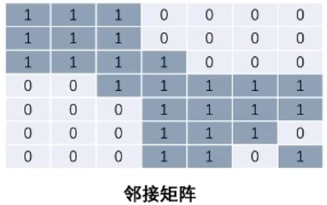

[蛋白质相互作用预测 - 侯庆振博士 | 钰沐菡 公益公开课](https://www.bilibili.com/video/BV1164y1y7vL?from=search&seid=13858011544777560174&spm_id_from=333.337.0.0)

**蛋白质构象疾病**：若蛋白质的折叠发生错误，尽管其一级结构不变，但蛋白质的构象发生改变，仍可能影响其功能，严重时可导致疾病发生。

**蛋白质折叠**：蛋白质从一个序列经过精确的折叠，形成特定的三维结构，才能行使具体作用。alphaFold解决的问题是通过蛋白质序列对蛋白质结构进行预测。蛋白质折叠完成后，结构上总体的能量是稳定的，但具体到每个位点，能量是存在差异的，有些位点比较稳定，通常起支撑作用，某些不稳定的，通常是功能所必须的。

**蛋白质-蛋白质相互作用**（protein-protein interaction, PPI）：蛋白质很少单独起作用，必须和其他蛋白相互结合，形成一个复合体或是形成一个网络结构。

**蛋白质功能**：相互作用、催化作用、配体结合、活性位点

**如何进行蛋白质结构和功能的预测**：

1.  序列->结构：
    1.  同源序列比对：从已知序列的功能来推测其他序列的功能，BLAST、PSI-BLAST、HMM
    2.  从头计算：如果没有同源序列，alphaFold、I-TASSER、Rosetta
2.  结构->功能：
    1.  完整结构推测：FATCAT、VASTandFAST
    2.  功能结构域结构比对：PROCAT

**蛋白质相互作用预测**：

1.  数据库：去看视频，讲了数据库怎么用，总结了蛋白质相互作用的数据库

2.  基于序列的蛋白质相互作用预测：

    1.  基于结构域方法：Motif/Domain-based approach 两个蛋白结构域模式与已知相互结合蛋白的结构域相同。
    2.  基于蛋白质序列特征：将序列分成n个片段，用机器学习方法整合片段序列特征，预测结合或非结合的蛋白质。
    3.  利用同源信息：许多具有重要功能的基因在不同物种间是保守的，从序列相似性推测功能相似性。
    4.  密码子偏好性：相互作用蛋白密码子偏好性类似，区别非相互作用蛋白。
    5.  比较基因组学的方法：序列中功能相关的重要特征在进化中是保守的。
        1.  进化树，如果比较两个序列的进化树是类似的，则推测这两个基因是共进化的，可能就是相互作用的。
        2.  进化谱，用于识别功能相关的蛋白，功能相关蛋白通常相互作用。
        3.  基因融合，功能相关的融合基因，通常是相互作用的。
        4.  基因序列，如果蛋白质的基因序列在不同的物种之间是保守的，蛋白质很可能相互作用。
    6.  基于功能的预测方法：gene ontology
    7.  基因共表达：gene co-expression based method

3.  基于结构的蛋白质相互作用预测：

    蛋白质对接：不预测蛋白是否结合，提供蛋白质相互作用的结构细节。

    蛋白质对接步骤：

    1.  对三维空间进行sampling，生成一系列的对接结构
    2.  打分软件对decoys结构打分，选取合理结构

    MEGADOCK：一种快速，大规模蛋白质对接筛选的方法。根据对接结果，计算PPI- SCORE，预测蛋白相互作用

    分子动力学模拟（MD simulation）：可以对PPI的结构和功能方面进行详细分析，从而对PPI机制提供有价值的见解。

    PRISM：比较输入蛋白与已知相互作用蛋白对接结果的蛋白表面相似性，预测相互作用

    PrePPI：利用homology modeling对序列进行建模，根据序列结构相似性匹配到已知结构上，最后用多种信息进行预测。

4.  基于网络拓扑的预测方法：

    依据现存的蛋白相互作用拓扑学结构和两个蛋白的网络拓扑学特征，预测两个蛋白相互作用

5.  综合多种特征的方法：

    机器学习方法整合多种信息

------

**药物-蛋白质相互作用（DPI）**：蛋白质作为生命活动的体现者，参与绝大多数的生物学过程，因此蛋白质成为了抗击病原体的最重要的靶标。比如病菌入侵人体往往需要病菌表面的识别分子与人体细胞表面相应的受体蛋白相互作用，如果能找到一种药物分子抑制这种结合，就能阻止病原菌的入侵。为了能设计出高效的药物分子，最好的方法就是根据蛋白的三维结构设计相应的药物分子，然后通过实验的方法验证药物效果，这就是所谓“基于结构的药物设计”。

举例说明，很多人源病毒在人体细胞中复制时都会有其自身特有的DNA复制酶，抑制DNA复制酶的活性就可以抑制病毒的复制从而控制病情。如果我们已知病毒DNA复制酶的三维结构，我们就可以依据其活性位点所在的环境设计特异性结合其酶活性位点的小分子药物，卡住活性位点使其酶活丧失，达到控制病毒增殖的目的。在具体实验中，往往会设计很多小分子，再通过实验手段验证其中哪些有效，进一步开发临床用药。所以，研究药物分子与蛋白质相互作用为我们特异性的寻找药物指示了方向，提供了手段，让药物设计更加高效，特异，可控。

------

视频-[药物的相互作用](https://www.bilibili.com/video/BV1ZA411K7qm?from=search&seid=13296128110039077674&spm_id_from=333.337.0.0)

**联合用药**（Concomitant drugs ）：是指为了达到治疗目的而采用的两种或两种以上药物同时或先后应用，其结果主要是为了增加药物的疗效或为了减轻药物的毒副作用，但是有时也可能产生相反的结果。所以合理的联合用药，应以提高疗效和降低不良反应为基本原则。

**药物相互作用**：是指病人联合用药后产生的复合效应，可使药效加强或副作用减轻，也可使药效减弱或出现不应有的毒副作用。

------

资料-[图神经网络入门](https://www.zhihu.com/people/liu-cai-quan-40/answers)

视频-[图神经网络介绍-Introduction to GNN](https://www.bilibili.com/video/av62661713?from=search&seid=6134263793308325331)

### **图的相关知识**

**无向图**
$$
G=(V,E)
$$

$$
V=\{v_1,v_2,v_3,v_4,v_5,v_6,v_7,v_8,v_9,v_{10},v_{11}\}
$$

$$
E=\{(v_1,v_2),(v_2,v_3),(v_2,v_6),(v_3,v_7)...\}
$$

$$
|V|=11,|E|=11
$$
**有向图**

**Walk**

从一个点沿着一条边走到另一个点

**Trail**

x->y trail is a walk with no repeated edge

不重复边

**Path**

x->y path is a walk with no repeated vertex.

不重复点

**Cycle**

x->x path is a cycle.

不重复点

**Circuit**

x->x trail is a circuit.

不重复边，v10出发回到v10

**Degree**

The number of edges connected to the vertex.

deg(v1)=5

**regular graph**

a graph in which each vertex has the same degree.

**complete graph**

a graph in which each pair of vertcies is connected by a edge.

 **Simple graph**

a graph without self-loop or multiple edge.

点和点之间只有一条边，没有self-loop

**Multigraph**

a graph with multiple edges.

**Pseudograph** ['sjudoʊˌgrɑf]

a non-simple graph in which both self loops and multiple edges are permitted.

**Hypergraph**

allow an edge connected to multiple vertcies.
$$
E=\{(v_1,v_2,v_3),(v_2,v_3),(v_3,v_5,v_6),(v_4)\}
$$

------

### Graph Neural Network

视频-[图神经网络](https://www.bilibili.com/video/BV1rf4y1v7cU?from=search&seid=3049841254738316942&spm_id_from=333.337.0.0)

**图嵌入，graph embedding**

**图游走类模型**：在图上进行游走，得到多条游走序列

**Word2vec**：图游走类模型最开始参考的就是NLP领域中的Word2vec模型。Word2vec的思想是：词的语义由其上下文决定。

**Skip Gram模型**：根据中心词预测上下文，使用SkipGram不是为了得到准确的预测，而是为了获得hidden layer的参数w。

**Skip Gram整体架构**：

input层：center word的onehot向量

hidden层：对应center word的低维向量

output层：softmax层

**Negative Sampling**：负采样方法优化softmax，如果要计算词表内所有单词的概率，那计算量会很大。将中心词和上下文设置为正样本，选取一定的负样本，就不需要计算所有词的概率，只需要对这几个样本进行分类。将softmax层变成了多个sigmoid层，从而减少计算量。

**Word2vec整体架构**：Sentences->Skip Gram+Negative Sampling

------

**Word2vec运用到图嵌入领域**：思想是图中的节点会受到邻居节点的影响。

**DeepWalk模型**：将NLP的思想运用到图嵌入领域：将节点看成NLP中的单词，节点序列看成NLP中的句子。

DeepWalk的游走方式是Random Walk，在无向图上游走，根据最大步长获得游走序列。这些游走序列就可以类比为NLP中的句子。

随机游走的本质就是**可以回头的DFS**

一般的随机游走可以表示为：
$$
P(c_i=x|c_{i-1}=v)=
\begin{cases}
\frac{\pi_{vx}}{Z},&{if(v,x)\in E}
\\ 0,& {otherwise}
\end{cases}
\\ c_i-下一个选择的节点x
\\ c_{i-1}-当前节点v
\\ \pi_{vx}-原始概率分布，Z-归一化
$$

$$
\\\frac{\pi_{vx}}{Z}=\frac{1}{|N(v)|}
\\|N(v)|-当前节点邻居节点的个数
\\对{\pi_{vx}}进行归一化，概率值就是\frac{1}{|N(v)|}
$$

**DeepWalk整体架构**：Graph->Random Walk+Skip Gram+Negative Sampling

图游走算法和Word2Vec的区别主要在于RandomWalk，将Graph通过RandomWalk提取序列之后的步骤和Word2Vec是一样的。

------

**Node2vec模型**：对DeepWalk的改进，DeepWalk直接使用DFS，但图是一个复杂结构，需要考虑更多因素。

 **Bias random walk**：

$$
\pi_{vx}=\alpha_{pq}(t,x)*w_{vx}
\\w_{vx}-边的权值
$$

$$
\alpha_{pq}(t,x)=
\begin{cases}
\frac{1}{p}&\text{if}&d_{tx}=0\\
1&\text{if}&d_{tx}=1\\
\frac{1}{q}&\text{if}&d_{tx}=2
\end{cases}
\\d_{tx}-当前节点v的一阶邻居节点到节点t的距离
$$

其中p和q是算法中的超参数，通过调整p和q来调整游走的程度。

-   p：控制随机游走以多大的概率goback
-   q：控制随机游走偏向DFS还是BFS
    -   q较大时(q>1)，倾向于BFS或goback
    -   q较小时(q<1)，倾向于DFS
-   当p=q=1时，$\pi_{vx}=w_{vx}$

当dtx=0时，就是访问上一个已经访问过的节点，概率是1/p，决定是否要回到上一个访问过的节点，如果p很小，那访问的概率就会很大。

如果dtx=1时，就是从t访问好v之后，以概率p=1去访问到节点t距离为1的节点v的一阶邻居节点，也就是x1。类似于BFS。

如果dtx=2时，就是以1/q的概率去访问x2、x3，类似于BFS。

**Node2vec整体架构**：Graph->Biased Random Walk+Skip Gram+Negative Sampling

------

**同构图**：在图里面，节点的类型和边的类型只有一种的图，举个例子，像社交网络中只存在一种节点类型，用户节点和一种边的类型，用户-用户之间的连边。

**异构图**：在图里面，节点的类型+边的类型>2的一种图，举个例子，论文引用网络中，存在着作者节点和paper节点，边的关系有作者-作者之间的共同创作关系连边，作者-论文之间的从属关系，论文-论文之间的引用关系。

异构图定义：G=(V,E,T)

**不考虑节点类型的异构随机游走，缺点**：

1.  偏向于出现频率高的节点类型
2.  偏向于相对集中的节点（度数高的节点）

DeepWalk和Node2vec适合同构图，在异构图上使用DeepWalk和Node2vec会导致不能让出现频率低的节点充分得到训练。

### Metapath2vec模型

**meta path**：元路径，在图中选取的由节点类型构成的组合路径

元路径A-P-A表示两个作者之间共同完成一篇论文的关系。

元路径A-P-C-P-A表示两个作者在同一个会议上发表了两篇论文。

元路径O-A-P-C-P-A-O表示两个作者属于两个组织，在同一个会议上发表了两篇论文。

选取的元路径在图中都是有意义的。

 只要首位节点类型相同，就能继续游走，当达到最大停止长度或找不到复合要求的节点，就停止游走。

**metapath2vec整体框架**：Graph->Meta path based Random Walk+Skip Gram+Negative Sampling

**问题**：metapath2vec在随机游走时考虑节点类型，但在负采样时没有考虑节点类型。

**metapath2vec++**：负采样时考虑节点类型。

A1-P2-A4-P3-A4

正样本（A4，P3）

负样本（A4，P5）,（A4，P9）

------

### GCN图卷积网络 Graph Convolution Network

图游走类模型先训练得到节点的embedding，利用embedding来做下游任务，如分类。embedding就是从原始数据提取出来的feature。

图神经网络是端到端的训练过程，边训练embedding边做具体任务，如分类。

### 如何从图像卷积类比到图结构卷积

图像卷积：将一个像素点周围的像素按照不同的权重叠加起来

图结构卷积：将一个节点周围的邻居按照不同的权重叠加起来

### 如何用消息传递实现图卷积网络

图卷积网络计算公式：
$$
H^{l+1}=\sigma(\widetilde{D}^{-\frac{1}{2}}\widetilde{A}\widetilde{D}^{-\frac{1}{2}}H^{(l)}W^{(l)})
$$
核心公式：
$$
\widetilde{D}^{-\frac{1}{2}}\widetilde{A}\widetilde{D}^{-\frac{1}{2}}H^{(l)}
\\\widetilde{A}-邻接矩阵
\\\widetilde{D}^{-\frac{1}{2}}-与度矩阵相关
\\H^{(l)}-第l层的特征矩阵
$$

对角线都标1，是因为给每个节点添加了一个自环边

度矩阵：将邻接矩阵每一行求和，然后放到度矩阵的对角线上，表示一个节点与之相连的边的条数。

简化公式：
$$
H^{l+1}=\sigma(\widetilde{A}H^lW^l)
$$

$\widetilde{A}H^l$的含义是**消息传递**：将节点的邻居信息存到这个节点自身

**如何用消息传递实现图卷积网络**：

1.  发送send：边上的源节点，向目标节点发送特征
2.  接受recv：目标节点对收到的特性进行聚合

**核心公式的含义**：$\widetilde{A}H^l$将邻居的特征接受、聚合，但并不是所有邻居都有用，邻居的重要性要通过**度**来衡量。也就是要用$\widetilde{D}^{-\frac{1}{2}}$给边加权，d越大，信息量越小，$\frac{1}{\sqrt{d}}$越小。

### 如何用多层图网络完成节点分类任务

GCN算法流程：

1.  第一步：$\widetilde{D}^{-\frac{1}{2}}\widetilde{A}\widetilde{D}^{-\frac{1}{2}}H^{(l)}$ 节点间进行特征传递

2.  第二步：对每一个节点进行一层DNN

    $H^{l+1}=\sigma(\widetilde{D}^{-\frac{1}{2}}\widetilde{A}\widetilde{D}^{-\frac{1}{2}}H^{(l)}W^{(l)})$

    $\sigma$是激活函数，W是可学习的权重

3.  重复L次，实现多层图卷积网络

4.  获取$H^L$作为最终节点表示，用分类器进行分类

------

### GAT图注意力网络 Graph Attention Network

GCN中边的权重与节点的度相关，是不可学习的

GAT中边的权重变成节点间的函数，权重与两个节点相关性有关，是可学习的。

**Attention计算方法**
$$
\alpha_{ij}=\frac
{\exp(LeakyReLU({\vec{a}^T[W\vec{h_i}||W\vec{h_j}])})}
{\sum_{k\in{N_i}}\exp(LeakyReLU{(\vec{a}^T[W\vec{h_i}||W\vec{h_k}])})}
$$
$\alpha_{ij}$相当于f()

得到$\alpha_{ij}$之后，对特征进行加权求和的聚合
$$
\vec{{h_i^\prime}}=\sigma(\sum_{j\in{N_i}}\alpha_{ij}W\vec{h_j})
$$

------

GCN、GAT都是基于邻居聚合的模型，称为Spatial GNN，大部分的Spatial GNN可以用message passing实现

基于消息传递的Graph Neural Network通用公式
$$
h_l^t(v)=f(h_l^{(t-1)},F\{h_l^{(t-1)}(u)|u\in{N(v)}\})
\\h_l^{(t-1)}(u)|u\in{N(v)}-邻居消息发送
\\v-目标节点
\\u-邻居节点
\\F-聚合函数，Mean/Max/Sum
$$
**Message Passing流程**

1.  邻居发送消息
2.  F看作是目标接受信息的方式
    1.  GCN的F：基于度的加权求和
    2.  GAT的F：基于Attention的加权求和

------

### 图采样 

**mini batch训练**

1.  传统深度学习

    单batch为若干个样本

    样本之间无依赖，多层样本计算量固定

2.  图神经网络

    单batch为若干个节点

    节点之间相互依赖，多层节点计算量爆炸

**什么是图采样**

在一张图中进行采样得到子图，并不是随机采样节点，一个节点的表示由它的邻居决定

### GraphSAGE

**邻居采样**

假设模型层是两层，需要聚合一阶邻居和二阶邻居。如果学习零号节点的表示，从零号节点采样他的一阶邻居。

在已经采样的一阶邻居基础上继续进行采样，使得节点能够聚合到远距离的信息

**邻居聚合**

在聚合时，从二阶邻居开始，往前聚合。

**节点预测**

特征聚合完毕后，取出要预测的节点，进行label的分类。

**邻居采样优点**

1.  极大减少训练计算量
2.  允许泛化到新连接关系

### PinSAGE

通过多次随机游走，按游走经过的频率选取邻居，根据邻居的重要性来进行采样。

在零号节点开始游走，得到多条游走序列，根据出现频率选取邻居。10号11号并不是0的真实邻居，但选他们作为虚拟邻居的好处是，可以从10号聚合到更远处的邻居，能够快速聚合多阶的信息

------

### 邻居聚合

经典的聚合函数

-   Mean
-   Max
-   Sum

评估聚合表达能力指标：**单射（一对一映射）**

单射可以保证对聚合后的结果可区分

### 基于单射的Graph Isomorphism Net GIN模型

 在中心节点加了个自连边，给自连边加权

聚合函数

 

