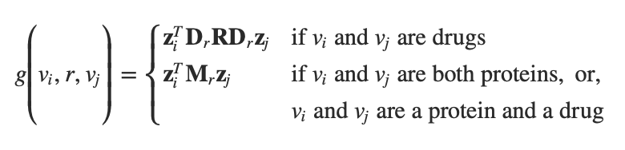

[原文](https://academic.oup.com/bioinformatics/article/34/13/i457/5045770)

## Abstract

### Motivation

联合用药，称为多药疗法，通常用于治疗复杂疾病或并存疾病的患者。然而，多药疗法的一个主要后果是患者产生不良副作用的风险更高。多药副作用的产生是因为药物之间的相互作用，其中一种药物的活性可能会发生变化，如果与另一种药物一起服用，这种变化可能是有利的，也可能是不利的。药物相互作用的知识通常是有限的，因为这些复杂的关系是罕见的，并且通常在相对较小的临床试验中没有观察到。因此，发现多药副作用仍然是一个重要的挑战，对患者死亡率和发病率具有重大影响。

### Results

在这里，我们介绍了Decagon，一种模拟多药副作用的方法。该方法构建了蛋白质-蛋白质相互作用、药物-蛋白质靶点相互作用和多药副作用的多模态图谱，这些副作用表现为药物-药物相互作用，其中每种副作用都是不同类型的边缘。Decagon是专门为处理具有大量边类型的多模态图谱而开发的。我们的方法开发了一种新的图卷积神经网络，用于多模网络中的多关系链路预测。与仅限于预测简单药物-药物相互作用的方法不同，Decagon可以预测特定药物组合临床表现的确切副作用（如果有）。Decagon准确预测了多药副作用，比基线高出69%。我们发现，它能自动学习表明患者同时出现多种药物副作用的表征。此外，Decagon模型特别适合具有强大分子基础的多药副作用，而对于主要的非分子副作用，由于在边缘类型之间有效共享模型参数，它实现了良好的性能。Decagon提供了利用大量药物基因组学和患者群体数据标记并优先考虑多药副作用的机会，以便通过正式的药理学研究进行后续分析。

### 可用性和实施

[源代码和预处理数据集](http://snap.stanford.edu/decagon)

## Introduction

大多数人类疾病都是由复杂的生物过程引起的，这些生物过程对任何单一药物的活性都具有耐药性（Jia*等人，2009年；Han*等人，2017年）。对抗疾病的一个有希望的策略是多药疗法，这是一种组合疗法，包括同时使用多种药物，也称为药物组合（Bansal*等人，2014年）。药物组合由多种药物组成，每种药物通常在患者群体中作为单一有效药物使用。由于药物组合中的药物可以调节不同蛋白质的活性，因此药物组合可以通过克服潜在生物过程中的冗余来提高治疗效果（Sun等人，2015年）。例如，Venetoclax和Idasanutlin的联合用药最近被证明在治疗急性髓系白血病方面具有优越的抗白血病疗效（Pan*等人，2017年）。在这里，这两种药物以相互作用的方式发挥作用：Venetoclax抑制抗凋亡Bcl-2家族蛋白，而Idasanutlin激活p53通路，因此，这两种药物的组合通过同时针对互补机制提高生存率（Pan*等人，2017年）。

虽然使用多种药物可能是治疗许多疾病的良好实践（Liebler和Guengerich，2005年；Tatoneti*等人，2012年），但多种药物对患者的主要后果是药物-药物相互作用产生副作用的风险更高*。多药副作用*很难手动识别，因为它们很罕见，几乎不可能测试所有可能的药物对，并且通常在相对较小的临床试验中未观察到副作用（Bansal*等，2014；Tatoneti*等，2012）。此外，在医疗保健系统中，多药被认为是一个日益严重的问题，影响到近15%的美国人口（Kantor*等人，2015年），在美国，治疗多药副作用每年花费超过1770亿美元（Ernst和Grizzle，2001年）。

*可以进行体外*实验和临床试验以确定药物-药物相互作用（Li*等人，2016年；Ryall和Tan，2015年），但药物-药物相互作用候选物的系统组合筛选仍然具有挑战性和昂贵（Bansal*等人，2014年）。因此，研究人员试图从科学文献和电子病历中收集药物-药物相互作用（Perca*等人，2012年；Vilar*等人，2017年），并通过网络建模、分子靶点特征分析发现了它们（Chen*等人，2016a；Huang*等人，2014b；Lewis*等人，2015；Sun*等人，2015；Takeda*等人，2017），基于统计关联的模型和半监督学习（Chen*等人，2016b；Huang*等人，2014a；Shi*等人，2017；Zhao*等人，2011）（参见第7节中的相关工作）虽然这些方法有助于在细胞水平上得出描述药物相互作用的广泛规则，但它们不能直接指导药物联合治疗的策略。

特别地，这些方法通过表示相互作用的总体概率/强度的分数来描述药物-药物相互作用，但无法预测副作用的确切类型。更准确地说，对于药物i和j，这些方法预测它们的组合是否会在没有相互作用的情况下超出预期之外的加性反应(additive response)，并产生超出预期的夸张反应(exaggerated response) Sij。也就是说，他们的目标是回答一个问题：Sij≠?{}⁠, 其中，*Sij*是所有多药副作用的集合，具体归因于药物对*i*，*j*，但不是单独归因于任何一种药物。然而，回答一对药物 i、j 是否会与给定的 r 型副作用相互作用更为重要和有用，r∈?Sij⁠。尽管确定精确的多药副作用对于改善患者护理至关重要，但它仍然是一项尚未通过预测建模进行研究的具有挑战性的任务。

### 1.1 Present study

在这里，我们开发了“Decagon”，一种预测药物副作用的方法。我们通过构建蛋白质-蛋白质相互作用、药物-蛋白质相互作用和药物-药物相互作用（即副作用；图1）的大型两层多模态图，对问题进行建模。每种药物-药物相互作用都用不同的边缘类型标记，这表示副作用的类型。然后，我们开发了一个新的多关系边缘预测模型，该模型使用多模态图谱预测药物-药物相互作用及其类型。我们的模型是一个在多关系环境下运行的卷积图神经网络。

来自基因组和患者群体数据的多药副作用示例图。多模态图谱由964种不同的多药副作用编码的蛋白质-蛋白质相互作用、药物-蛋白质靶点和药物-药物相互作用组成（即边缘类型ri，i=1，…，964）。副信息以额外的蛋白质和药物特征向量的形式整合到模型中。突出显示的环丙沙星网络邻居（节点C）表明该药物以四种蛋白质为靶点，并与其他三种药物相互作用。图中显示的信息表明，环丙沙星（节点C）与强力霉素（节点D）或辛伐他汀（节点S）合用会增加心动过缓副作用（r2型副作用）的风险，与莫匹罗星（M）合用会增加胃肠道出血副作用的风险。我们使用图形表示法开发了Decagon，一种多药副作用的图形卷积神经模型。Decagon预测药物对和副作用（红色显示）之间的关联，目的是识别副作用，而副作用不能归因于药物对中的任何一种药物

为了激励我们的模型，我们首先进行探索性分析，得出两个重要的观察结果（第3节）。首先，我们发现共同处方药物（即药物组合）往往比随机药物对具有更多共同的靶蛋白，这表明药物靶蛋白信息包含用于药物组合建模的有价值的信息。第二，我们发现重要的是考虑蛋白质-蛋白质相互作用的图谱，以便能够模拟具有共同副作用的药物的特性。这些观察结果推动了“Decagon”的发展，以预测哪些药物对将相互作用，以及相互作用/副作用的确切类型（第4节）。

*Decagon*开发了一种新的**图形自动编码器方法**（Hamilton*等人。*，2017a），该方法允许我们为多模态图形上的链路预测开发端到端可训练模型。相比之下，以前用于生物学中链接预测任务的基于图形的方法（例如，Chen*等人。*2016b；Huang*等人。*2014b；Zong*等人。*2017）采用了两阶段管道，通常由图特征提取模型和链接预测模型组成，两者都是单独训练的。此外，*Decagon*的关键区别特征是*多关系链接预测*能力，使我们能够捕获不同边缘（副作用）类型的相互依赖性，并识别图中任意两个药物节点之间存在的所有可能边缘类型中的哪一种。这与简单链路预测方法（Trouillon*等人，2016年）形成鲜明对比，后者仅预测节点对之间的边的存在，对于建模大量不同的边/副作用类型也至关重要。*

*我们将*Decagon*的性能与**多关系张量因式分解**的最新方法（Nickel*等，2011；Papalexakis*等，2017）、**图形表示学习方法**（Perozzi*等，2014；Zong*等，2017）和建立的**链接预测机器学习**方法进行了对比，我们将其用于多药副作用预测任务*Decagon*的表现优于其他方法高达69%，预测性能平均提高20%，在具有强大分子基础的副作用类型上获得更大的提高（第6节）。对于一些新的预测，我们在生物医学文献中找到了支持证据，表明“Decagon”在识别极有可能是真阳性的预测方面表现得特别好。综上所述，这项研究首次显示了模拟药物组合副作用的能力，并为组合药物疗法的发展开辟了新的机会。

## Datasets

我们将多药副作用识别问题描述为药物和蛋白质两种节点类型的两层多模态图/网络中的多关系链接预测问题。我们构建了两层多模式网络，如下所示（图1）。蛋白质-蛋白质相互作用网络描述蛋白质之间的关系。药物-药物相互作用网络包含964种不同类型的边缘（每种副作用类型一种），并描述了哪些药物对导致哪些副作用。最后，药物-蛋白质链接描述特定药物的靶向蛋白质。

We continue by describing the datasets used to construct the network. Preprocessed versions of all datasets are available through this study’s website: http://snap.stanford.edu/decagon.

我们继续描述用于构建网络的数据集。所有数据集的预处理版本可通过本研究网站获得：http://snap.stanford.edu/decagon.

### 2.1 Protein–protein and drug–protein interactions

我们使用了Menche*等人（2015）和Chatr Aryamontri*等人（2015）编制的人类蛋白质-蛋白质相互作用（PPI）网络，并结合Szklarczyk*等人（2017）和Rolland*等人（2014）提供的其他PPI信息。该网络包含在人体内实验记录的物理相互作用，如代谢酶耦合相互作用和信号相互作用。网络未加权且无方向性，有19个 085蛋白质和719 402物理相互作用。

我们从STITCH（化学品相互作用搜索工具）数据库中获得了蛋白质和药物之间的关系，该数据库集成了各种化学和蛋白质网络（Szklarczyk*等人，2016年）。在这项研究中，我们只考虑了小化学物质（即药物）和已通过实验验证的靶蛋白之间的相互作用。8934 种蛋白质和 519 022 种化学物质之间存在超过 8 083 600 种相互作用。

### 2.2 Drug–drug interaction and side effect data

**药物-药物相互作用和副作用数据**

我们还从数据库中提取了详细的个别药物和药物组合的副作用。SIDER（副作用资源）数据库包含286个 通过从药物标签文本中挖掘不良事件，获得超过1556种药物和5868种副作用的399种药物副作用关联（Kuhn*等人，2016）。我们将其与OFFSIDES数据库集成，后者详细介绍了非标签487 530 1332种药物与10种药物之间的关联 097副作用（Tatoneti*等人，2012年）。越位数据库是使用收集医生、患者和制药公司报告的不良事件报告系统生成的。我们消除了副作用同义词，并使用副作用词汇表来构建所有数据集。这一预处理很重要，因为如果某些副作用完全相关，预测问题就会容易得多。综合这些数据集后，每种药物的平均副作用为159个，最常见的副作用是恶心、呕吐、头痛、腹泻和皮炎。

我们从 TWOSIDES 中提取了多种药物副作用信息，其中详细介绍了 63 473 种药物组合中的 1318 种副作用类型，考虑到组合中任一药物的单独作用，这些副作用比预期的要大（Tatonetti 等人，2012 年）。与 OFFSIDES 一样，TWOSIDES 也是由不良事件报告系统生成的。常见的副作用，如低血压和恶心，发生在超过三分之一的药物组合中，而健忘症和肌肉痉挛等其他副作用只发生在少数药物组合中。总体而言，它包含 4 651 131 个药物组合副作用关联。在这项研究中，我们专注于预测 964 种常见的多药副作用类型，每种类型至少在 500 种药物组合中发生。

连接不同数据库使用的实体词汇后的最终网络有 645 个药物和 19 085 个蛋白质节点，由 715 612 个蛋白质-蛋白质、4 651 131 个药物-药物和 18 596 个药物-蛋白质边连接。

## 3 Data-driven motivation for *Decagon* approach

**数据驱动的Decagon方法的动机**

在这里，我们对两层多模图（图1）的结构进行了三次观察，这对“Decagon”模型的设计具有重要意义。

首先，我们观察到在药物组合中某些副作用的发生频率有很大的差异。我们发现，已知超过53%的多药副作用发生在<3%的已记录药物组合中（如脑动脉栓塞、肺脓肿、肉瘤、胶原紊乱）。相比之下，更频繁的副作用（如呕吐、体重增加、恶心和贫血）发生频率更高。由于与每种副作用相关的药物对数量差异很大，可用于预测不同副作用类型的独立训练模型的药物对数量有限。因此，多药副作用预测成为一项具有挑战性的任务，特别是在预测较少见的副作用时，因此，开发一种端到端的方法非常重要，以便模型能够共享信息并同时从所有副作用中学习。

其次，我们观察到，在共同处方的药物对（即药物组合）中，多药副作用不会相互独立地出现，这表明对多种副作用的联合建模有助于预测任务。为了量化副作用之间的共同发生，我们计算给定副作用与其他副作用共同发生的药物组合的数量，然后使用随机共同发生的空模型进行置换测试。正如表 1 中高血压和恶心的例证，我们发现大多数最常见的副作用在药物组合中作为副作用与恶心/高血压共同发生的频率方面要么显着过高，要么没有充分体现，在α= 0.05时。这一观察结果表明存在可能导致副作用的共同病理生理学的机制，类似于在疾病合并症中观察到的情况（Lee 等，2008）。例如，我们发现高血压与焦虑显着共同发生，但与发烧的共同发生频率低于随机机会（表 1）。这些关系适用于副作用数据集。我们得出的结论是，预测模型应该利用副作用之间的依赖关系，并能够重新使用了解的关于一种副作用的分子基础的信息，以更好地了解另一种副作用的分子基础。

**Table 1.**

联合用药中50种最常见副作用的高血压和恶心的共同发生率，并附有实例说明

| Polypharmacy side effect *S *多药副作用S | Overrepresented co-occurrence 多人同时发生                | Underrepresented co-occurrence代表性不足共同发生           | **Insignificant co-occurrence***无意义共同发生** |
| ---------------------------------------- | --------------------------------------------------------- | ---------------------------------------------------------- | ------------------------------------------------ |
| Hypertension高血压                       | 44% (hyperglycemia, anxiety, dizziness)高血糖、焦虑、头晕 | 48% (fever, sepsis, dermatitis)发烧、败血症、皮炎          | 8% (cough, tachycardia)咳嗽、心动过速            |
| Nausea恶心                               | 54% (diarrhea, insomnia, asthenia)腹泻、失眠、乏力        | 34% (edema, anemia, neutropenia)水肿、贫血、中性粒细胞减少 | 12% (fever, dyspnea)发烧、呼吸困难               |

注：绝大多数副作用在与恶心/高血压的药物组合中出现的频率明显过高或过低，α=0.05⁠，经过 Bonferroni 修正。

第三，我们探讨了药物对靶向蛋白质与副作用发生之间的关系。让*Ti*代表一组与药物*i*相关的靶蛋白，然后计算给定药物对的靶蛋白之间的Jaccard相似性（*i*，*j*）。我们进行了几项观察：

1.  超过 68% 的药物组合的共同靶蛋白为零，这表明使用蛋白质-蛋白质相互作用信息“连接”不同药物靶向的不同蛋白质非常重要。
2.  随机药物对在靶向蛋白质中的重叠比联合处方药物小（图2，浅灰色），*P*-值 = 5e−120⁠, 2-样本Kolmogorov-Smirnov（KS）试验。
3.  我们发现，在不同的副作用中，这种趋势是不平等的。例如，与肋骨骨折（图2，紫色）相比，具有共同靶蛋白的药物组合更容易出现高血压。根据2个样本的KS试验，超过150个副作用出现在与其他真实药物组合显著不同的组合中（Bonferroni校正后α=0.05），表明这些副作用具有强大的分子基础。

基于这一发现，我们得出结论，重要的是，模型考虑蛋白质如何相互作用，并能够建模更长的链（间接）的相互作用。

fraction of drug pairs药物对的比例

随机药物对、所有药物组合和与特定副作用相关的药物组合的靶蛋白之间的相似性。根据给定药物对（i，j）中的药物i和j是否共享靶蛋白、共享少于50%的靶蛋白或共享>50%的靶蛋白（即Jaccard（Ti，Tj）=0， 0<0.5和0.5≤Jaccard（Ti，Tj）≤分别为1；Ti是i的一组靶蛋白）。我们观察到，大多数药物对中的药物，尤其是随机药物对（即通常不合用的药物，深灰色）没有共同的靶蛋白

## 4 Graph convolutional *Decagon* approach

**图卷积Decagon方法**

我们在编码药物、蛋白质和副作用关系的多模态图上将多药副作用建模作为多关系链接预测问题。更准确地说，这些关系由图G=(V,R)表示,具有N个节点（例如蛋白质、药物）vi∈V，带标签的边（关系）（vi，r，vj）⁠, 其中R是边的类型（关系类型），包括：

1.  两种蛋白质之间的物理结合

2.  药物与蛋白质之间的靶关系

3.  两种药物之间特定类型的副作用。

    如第2节所述，我们考虑药物之间的964种不同的关系类型（即副作用）。

此外，我们允许以附加节点特征的形式包含边信息。不同的节点（药物、蛋白质）可以有不同数量的节点特征，由real-valued特征向量x1、x2、…、xN分配给图中的每个节点。

**多药副作用预测任务**。多药副作用预测任务考虑了识别药物对和副作用之间关联的问题。重要的是，这些关联仅限于那些不能单独归因于两种药物的关联。使用图G，任务是预测药物节点之间的标记边。即给定一对药物（vi，vj），我们的目标是确定边缘eij=（vi，r，vj）的可能性
类型 r⁠, 这意味着使用药物组合（vi，vj）与人类患者群体中r型多药副作用有关。

为此，我们开发了一种直接作用于图G的非线性多层图卷积神经网络模型Decagon。Decagon有两个主要组成部分：

1.  编码器：在 G 上运行的图卷积网络并为G中的节点生成embedding（图3A；第4.1节）
2.  解码器：使用这些embeddings来建模多药副作用的张量分解模型（图3B；第4.2节）。

Decagon模型体系结构概述。

（A） Decagon编码器。所示为单个图节点的每层更新（图1中的示例输入图，代表环丙沙星的药物节点）。

1.  来自相邻节点$N_r^c$的隐藏状态激活被收集，然后分别为每个关系类型 r 进行转换(即胃肠道出血、心动过缓和药物靶点关系）。
2.  由此产生的representation被累加，并通过一个非线性的激活函数（ReLU）在（k+1）层中产生节点vc的隐藏状态 $h^{(k+1)}_c$⁠。
3.  每个节点的更新与整个图中的共享参数并行计算。

（B） 对于每个关系，Decagon解码器采用成对嵌入（例如，隐藏节点表示zc和zs表示环丙沙星和辛伐他汀），并为图中的每个（潜在）边生成分数。所示为多药副作用关系类型的解码器。

（C） 一批的神经网络计算输入图中六个药物节点的embedding。在Decagon中，神经网络因节点而异，但它们都共享同一组特定于关系的可训练参数[即编码器和解码器的参数]。也就是说，具有相同着色模式的矩形共享参数，具有黑白着色模式的薄矩形表示密集连接的神经层。

### 4.1 Graph convolutional encoder

**图卷积编码器**

我们首先描述了图形编码器模型，该模型以图形*G*和附加节点特征向量**x**i作为输入⁠, 并为图中的每个节点（药物、蛋白质）生成一个d维的embedding。

我们提出了一个编码器模型，该模型有效地利用了图中跨区域的信息共享，并为每种关系类型分配了单独的处理通道。其思想是，*Decagon*学习如何在图形中转换和传播由节点特征向量捕获的信息。每个节点的网络邻域定义了不同的神经网络信息传播体系结构，但这些体系结构共享定义信息共享和传播方式的函数/参数。我们学习卷积算子，它们在图的不同部分和不同的关系类型之间传播和转换信息。该模型受最近一类直接在图形上运行的卷积神经网络的启发（Defferard*等，2016；Kipf和Welling，2016）。对于给定节点，Decagon*对其相邻节点的特征向量执行变换/聚合操作。这样，*Decagon*只考虑节点的一阶邻域，并在图中的所有位置应用相同的变换。随后，这些操作的连续应用有效地在*K*阶邻域上卷积信息（即，节点的嵌入取决于最多*K*步的所有节点），其中*K*是神经网络模型中卷积层的连续操作数。

在每一层中，*Decagon在图的edge传播潜在节点特征信息，同时考虑边缘的类型（关系）。该神经网络模型的单层采用以下形式：

可以通过使用适当的激活函数链接多个层来构建更深层次的模型。为了达到节点vi的最后embedding$z_i\in{R^d}$，我们计算他的表示为：$z_i=h_i^K$。整个编码器采用以下形式。我们按照公式1中的定义堆叠*K*层，使前一层的输出成为下一层的输入。第一层的输入是节点特征向量，$h_i^0=x_i$ 或者，如果不存在任何特征，则为图中的每个节点提供一个唯一的onehot向量。

### 4.2 Tensor factorization decoder

**张量分解译码器**

到目前为止，我们介绍了*Decagon*的编码器。编码器将每个节点$vi\in{V}$映射到一个embedding，是一个real-value的向量representations $z_i\in{R^d}$, 其中*d*是节点representations的维度。我们继续描述*Decagon*的解码器组件。

解码器的目标是通过学习到的节点embedding和对每个标签的不同处理来重建*G*中的标记edges。具体来说，解码器通过函数*g*对三元组（vi，r，vj）进行评分，该函数的目标是分配分数g(vi，r，vj)，该分数表示药物*vi*和*vj*通过关系或副作用类型*r*相互作用的可能性。对Decagon编码器zi和zj返回的节点i和j使用embedding，解码器通过分解运算预测候选edge（vi，r，vj）：

然后应用 sigmoid 函数 σ 来计算边缘概率

接下来，我们通过区分以下两种情况来解释*Decagon'*s解码器：

1.  等式2中的解码器g假设药物-药物相互作用的全局模型，其在多药副作用中的变化和重要性由副作用特定的对角因子描述。在这里，**R**是一个形状为d*d的可训练参数矩阵，它通过所有可能的多药副作用来建模global药物-药物相互作用。此外，在Decagon中，代表不同多药副作用的每个关系r都与对角d×d矩阵Dr相关联，Dr模拟zi中每个维度对副作用r的重要性。*在另一种观点中，这个解码器可以看作是三向张量的张量分解，其中两个模式由药物相同形成，第三个模式具有药物组合的多药副作用。然而，*Decagon*的一个显著特征是依赖编码器。而经典张量分解使用在训练中直接优化的节点表示，我们在一种端到端的方式，其中节点嵌入与张量分解一起优化。
2.  当*vi*和*vj*不是两个药物节点时，解码器*g*采用双线性形式对节点embedding的边进行解码。更准确地说，在这种情况下，解码函数*g*与形状为d*d的可训练参数矩阵Mr相关联，该矩阵对zi和zj中每两个维度之间的交互进行建模⁠. 然后使用双线性形式计算预测的边缘概率，然后应用sigmoid函数。

基于等式（2）中节点类型的不同边缘解码器的使用至关重要，原因有以下两个：

首先，Decagon 解码器可以看作是不同关系类型之间有效参数共享的一种形式。特别是，涉及药物对的关系类型使用相同的全局药物-药物相互作用模型（即矩阵 R），其中包含适用于所有药物相关关系类型的模式。我们希望这种解码参数化可以缓解罕见副作用的过度拟合，因为参数在罕见（例如鼓膜炎或鼻息肉）和频繁（例如低血压或贫血）副作用之间共享。

其次，我们想要一个高分 g(vi,r,vj)表示药物组合 (vi, vj) 和不能单独归因于 vi 或 vj 的副作用 r 之间的关联。为了捕捉多药组合，Decagon 允许通过 R 在 i 和 j embedding中的任何两个维度之间进行非零交互，这一点很重要。

综合起来，Decagon 模型的可训练参数有：

1.  特定关系类型的神经网络权重矩阵 Wr
2.  特定于关系类型的参数矩阵 Mr
3.  全局副作用参数矩阵 R
4.  副作用特定的对角参数矩阵 Dr.

因此，Decagon编码器和解码器形成了一个端到端的可训练模型，用于多模态图中的多关系链接预测。

### 4.3 *Decagon* model training

decagon模型训练

在模型训练期间，我们使用交叉熵损失优化模型参数：

为了鼓励模型来分配更高的概率给观察到的边缘（vi,r,vj）而不是随机的非边。与之前的研究一样，我们通过负采样来估计模型。对于图中的每个药物-药物边(vi,r,vj)（正采样），我们通过随机选择节点 vn来采样一个随机边 (vi,r,vn)（即负采样）。这是通过将边（vi，r，vj）中的节点vj替换为根据采样分布Pr随机选择的节点vn来实现的.考虑到所有边，decagon的最终损失函数为：

最近的研究结果表明，通过端到端学习，图形结构化数据的建模通常可以得到显著改进（Defferard*等，2016年；Gilmer*等，2017年），因此，我们采用端到端优化方法，对所有可训练参数进行联合优化，并通过*Decagon'*s编码器和解码器传播损失函数梯度。

为了优化模型，我们使用Adam优化器（Kingma和Ba，2014）以0.001的学习率对模型进行最多100个epochs的训练（训练迭代），并提前停止，窗口大小为2，即如果连续两个epochs的验证损失没有减少，我们停止训练。我们使用Glorot和Bengio（2010）中描述的初始化初始化权重，并相应地规范化节点特征向量。为了使模型能够很好地推广到未观测到的边缘，我们对隐藏层单元（方程式1）应用了一个规则的衰减. 在实践中，我们使用有效的稀疏矩阵乘法来实现*Decagon*模型，其复杂度与*G*中的边数成线性关系。

我们通过对等式5中损失函数的抽样贡献使用小批量。也就是说，我们处理多个训练小批量，每个小批量都是通过从等式5中的边和中只抽样固定数量的贡献而获得的，生成动态批量计算图。通过只考虑损失函数的固定贡献数，我们可以删除当前小批量中未出现的各个数据点。这是一种有效的正则化方法，并减少了训练模型所需的内存需求，这是我们将整个模型放入GPU内存所必需的（所有数据和代码都发布在项目网站上）。

## 5 Experimental setup

**实验装置**

我们将预测多药副作用的问题视为解决多关系链接预测任务。这里，每个药物对通过一组所有关系类型中的零个、一个或多个关系类型（即副作用类型）连接。

对于每种多药副作用类型，我们将与该副作用相关的药物对拆分为训练集、验证集和测试集，确保验证集和测试集各包含 10% 的药物对。对于每种副作用类型，我们使用 80% 的药物对来训练模型，并使用 10% 的药物对来选择模型参数。然后任务是预测与每种副作用类型相关的药物对。请注意，我们非常小心折叠之间存在信息泄漏，并且交叉验证是公平的。

我们使用*Decagon*，它针对每个药物对和每种副作用类型计算给定药物对与给定副作用相关的概率。此外，我们将副作用信息，即单个药物的副作用以药物节点i的附加特征xi的形式集成到模型中。为了防止评估中出现任何循环和信息泄漏，我们确保：

1.  我们预测的副作用是真正的多药副作用（即给定的多药副作用仅与一对药物相关，而与该对药物中的任何单个药物无关）
2.  我们预测的副作用类型没有包含在副作用特征中。例如，恶心是一种多药副作用，因此我们排除了所有恶心作为单个药物副作用的情况。我们注意到，这是一种保守的方法，允许我们可靠地估计预测性能。

我们还没有发现任何其他预测药物副作用的方法。因此，我们根据以下多关系链路预测方法评估*Decagon*的性能：

**RESCAL张量分解**：这是一种考虑多关系结构的张量分解方法。给定Xi⁠, 药物-药物矩阵编码药物对与副作用 r 的关联，矩阵Xi分解为：$Xr=aT_ra^T$，r=1,2，…，964⁠, 其中Tr和A为模型参数。给定药物*i*和*j*，它们与*r*的关联预测为：$a_iT_ra_j$⁠.

**DEDICOM张量分解**：这是一种适用于稀疏数据设置的相关张量分解方法。给定药物-药物矩阵Xi分解为：$Xr=AU_rTU_rA^T⁠$. 给定药物*i*和*j*，它们与*r*的关联预测为：$a_iU_rTU_raj_⁠$

**DeepWalk neural embeddings**：该方法基于探索节点网络邻域的随机游走程序学习节点的*d*维神经特征。药物对通过串联学习的药物特征表示来表示，并用作逻辑回归分类器的输入。对于每个连接类型（即副作用类型），我们训练一个单独的逻辑回归分类器。

**串联药物特征**：该方法基于药物-靶蛋白相互作用矩阵的PCA表示和单个药物副作用的PCA表示，为每种药物构建一个特征向量。药物对通过连接相应的药物特征向量来表示，并用作梯度增强树分类器的输入，然后该分类器预测药物对的确切副作用。

每种方法的参数设置都是使用验证集确定的，该验证集对候选参数值进行网格搜索（例如，对于梯度提升树，使用的树的数量从 10 到 100 不等）。如果方法不是多关系链接预测方法，我们会为每种副作用类型分别选择在验证集上性能最佳的参数。具体来说，Decagon 使用 d(1)=64 的 2 层神经架构⁠，并且 d(2)=32在所有实验中，每层隐藏单元，0.1 的丢失率和 512 的小批量大小。

使用接收器工作特性下的面积（AUROC）、精度召回曲线下的面积（AUPRC）和50%时的平均精度，分别计算每种副作用类型的性能(AP@50). 值越高表示性能越好。

## 6 Results

*Decagon*在多模态图和高度多关系的设置中运行。这种灵活性使得“Decagon”特别适合预测成对药物的副作用，我们将在下面讨论。

### 6.1 Prediction of polypharmacy side effects

**多药副作用的预测**

我们首先比较“Decagon”与其他方法的性能。从表2中的结果中，我们可以看出，考虑到多模式网络表示和对大量不同副作用的建模，使得*Decagon*的表现大大优于其他方法。在964种副作用类型中，*Decagon*的表现优于其他方法，分别为19.7%（AUROC）、22.0%（AUPRC）和36.3%(AP@50). *Decagon*的改进相对于张量因子分解方法尤其明显，其中Decagon*比基于张量的方法高出68.7%(AP@50). 这一发现突出了直接优化张量分解的潜在局限性[即vanilla RESCAL和DEDICOM（Nickel*等，2011；Papalexakis*等，2017）]，而不依赖于图结构卷积编码器。我们还将*Decagon*与其他两种方法（Perozzi*等，2014年；Zong*等，2017年）进行了比较，这两种方法适用于多关系链路预测任务。我们观察到，与基于张量的方法相比，DeepWalk神经嵌入和串联药物特征实现了9.0%的增益（AUROC）和20.1%的增益（AUPRC）。然而，这些方法采用两级管道，包括药物特征提取模型和链接预测模型，这两个模型都是单独训练的。此外，他们不能考虑不同的副作用，我们表现出包含有用的信息（第3节）的相互依赖性。这些额外的建模洞察，使*Decagon*比DeepWalk神经嵌入增加了22.0%，比联合药物特征增加了12.8%AP@50分数。

**Table 2.**

ROC曲线下的面积（AUROC）、精确回忆曲线下的面积（AUPRC）和50时的平均精确度(AP@50)用于多药副作用预测

| Approach                     | AUROC | AUPRC | AP@50 |
| ---------------------------- | ----- | ----- | ----- |
| *Decagon*                    | 0.872 | 0.832 | 0.803 |
| RESCAL tensor factorization  | 0.693 | 0.613 | 0.476 |
| DEDICOM tensor factorization | 0.705 | 0.637 | 0.567 |
| DeepWalk neural embeddings   | 0.761 | 0.737 | 0.658 |
| Concatenated drug features   | 0.793 | 0.764 | 0.712 |

注意：报告的是 964 种副作用类型的平均性能值。

这些发现与以下结果一致：通过端到端学习，特别是使用图形自动编码器，预测通常可以显著改善（Hamilton*等人。*，2017a，b；Kipf和Welling，2016）。特别是，张量分解和神经嵌入基线方法允许我们量化嵌入（即*Decagon*的编码器）和多任务学习（即*Decagon*的解码器）带来的性能改善百分比。

为了更好地理解*Decagon*的表现，我们将表2中的汇总统计数据按副作用类型进行分层。手动检查结果并与领域专家讨论后，表3显示了最佳副作用的共同特性。我们观察到，“Decagon”模型具有明显的分子基础，副作用特别好。这一观察结果与我们的预期一致，因为*Decagon*的多模态图谱（图1）主要包含药物基因组学信息。我们还观察到，表现最差的副作用往往是常见的副作用和/或具有潜在重要环境和行为成分的非分子来源（表3）*Decagon*在这些副作用方面的竞争表现可以通过有效共享不同类型副作用的模型参数来解释。

**Table 3.**

副作用在*Decagon中表现最佳和最差*

| **Best performing side effects**                       | **AUPRC** | **Worst performing side effects** | **AUPRC** |
| ------------------------------------------------------ | --------- | --------------------------------- | --------- |
| Mumps                                                  | 0.964     | Bleeding                          | 0.679     |
| Carbuncle                                              | 0.949     | Increased body temp.              | 0.680     |
| Coccydynia                                             | 0.943     | Emesis                            | 0.693     |
| Tympanic membrane perfor.                              | 0.941     | Renal disorder                    | 0.694     |
| Dyshidrosis                                            | 0.938     | Leucopenia                        | 0.695     |
| Spondylosis                                            | 0.929     | Diarrhea                          | 0.705     |
| Schizoaffective disorder                               | 0.919     | Icterus                           | 0.707     |
| Breast dysplasia                                       | 0.918     | Nausea                            | 0.711     |
| Ganglion                                               | 0.909     | Itch                              | 0.712     |
| Uterine polyp                                          | 0.908     | Anaemia                           | 0.712     |
| ### 6.2 Investigation of *Decagon*’s novel predictions |           |                                   |           |

###  Investigation of *Decagon*’s novel predictions

**decagon预测研究**

接下来，我们对新的热门作品进行基于文献的评估。我们的目标是评估novel*Decagon*关于副作用和药物对之间关系的预测的质量。为此，我们要求Decagon对数据集中的每种药物对和每种副作用类型进行预测。然后，我们使用这些预测构建（药物*i*、副作用类型*r*、药物*j*）三元组的排序列表，其中三元组通过预测概率得分pijr进行排序（[等式3](https://academic.oup.com/bioinformatics/article/34/13/i457/5045770#E3)). 然后，我们将所有已知的药物对与副作用之间的关联从排名列表中排除，然后调查列表中排名最高的10个预测。为了防止调查偏差的风险，我们不允许在分析的不同阶段之间存在任何串扰。然后我们搜索生物医学文献，看看是否能找到支持这些新预测的证据。

表4显示了“Decagon”的预测和支持这些预测的文献证据。我们能够找到10个最高级别的预测副作用中的5个的文献证据。也就是说，我们的方法既正确识别了药物对，也正确识别了这些排名最高的预测的副作用类型。这一结果是显著的，因为预测是具体的，并且随机选择药物对和副作用关联不太可能找到支持证据。我们注意到引用的文献明确调查了预测的药物对和预测的副作用之间的相互作用。例如，*Decagon*表示使用阿托伐他汀和氨氯地平会导致肌肉炎症（表4，排名第8的预测）。事实上，最近的报告（如Banakh*等人，2017年）发现，由于阿托伐他汀与氨氯地平的假定药物相互作用，肌肉组织受到损伤*Decagon*还指出乙胺嘧啶（一种抗菌药物，如果单独服用，对治疗疟疾有效）与肾素抑制剂阿利吉仑（其临床试验在发现肾脏并发症后停止）之间存在潜在关联（Parving*等人，2012年），这表明癌症风险增加（排名第一的预测）。这里的分析证明了“Decagon”预测促进转化科学和发现新型（非）有效药物组合的潜力。

**Table 4.**

由（药物 i，副作用类型 r，药物 j）三元组给出的新的多药副作用预测，由 Decagon 分配了最高概率分数

| k    | **Polypharmacy effect r** | **Drug i**    | **Drug j**    | Evidence                |
| ---- | ------------------------- | ------------- | ------------- | ----------------------- |
| 1    | Sarcoma                   | Pyrimethamine | Aliskiren     | Stage *et al.* (2015)   |
| 4    | Breast disorder           | Tolcapone     | Pyrimethamine | Bicker *et al.* (2017)  |
| 6    | Renal tubular acidosis    | Omeprazole    | Amoxicillin   | Russo *et al.* (2016)   |
| 8    | Muscle inflammation       | Atorvastatin  | Amlodipine    | Banakh *et al.* (2017)  |
| 9    | Breast inflammation       | Aliskiren     | Tioconazole   | Parving *et al.* (2012) |

*注*：对于每个预测，我们在所有预测和支持预测关联存在的文献证据的排名列表中包括其排名*k*。

### 6.3 Exploration of *Decagon’*s side effect embeddings

关于decagon副作用嵌入的探讨

最后，我们想知道*Decagon*是否满足第3节中提出的设计目标。特别是，我们测试*Decagon*是否能够捕获探索性数据分析（第3节第二个观察结果）所揭示的不同副作用类型的相互依赖性。为此，我们采用对角矩阵**D**r⁠, 具体模拟了*Decagon'*s多关系链路预测中每个副作用类型*r*的交互重要性（第4.2节）。我们从每个**D**r中提取对角线，并将其用作副作用*r*的向量表示。我们使用t-SNE（Maaten和Hinton，2008）将这些矢量表示嵌入2D空间，然后在图4中可视化。

Decagon副作用的可视化。使用t-SNE软件包（Maaten和Hinton，2008）将副作用映射到2D空间，并学习副作用表示[Dr， r=1,2，…，964，见等式（2）]作为输入。选定的副作用是子宫息肉、胰腺炎、病毒性脑膜炎和甲状腺疾病。对于每个选择的副作用，我们强调了三个副作用，它们通常与药物组合数据集中选择的副作用同时发生

图4揭示了副作用表示中集群结构的存在。通过查看该图，我们观察到在2D空间中紧密嵌入的副作用往往在药物组合中同时发生。这一观察结果表明，*Decagon*推断出在许多药物组合中同时出现的副作用*r*1和*r*2的类似矩阵**D**r1和**D**r2。例如，与子宫息肉副作用一起出现的前三大副作用是：子宫出血、乳腺发育不良和绝经后出血。事实上，*Decagon*为所有三种副作用推断出类似的对角线因子**D**r，从而在2D空间中产生局部投影（图4）。

为了测试图4中的吸引人的模式是否适用于许多副作用类型，我们进行如下操作。我们计算每个副作用的向量表示和三个最常同时发生的副作用的向量表示之间的平均欧氏距离。我们发现，共现/相关副作用具有更为相似的表现（即对角线因子**D**r）⁠) 意外超出预期（*P*-值 = 1e−34⁠, 因此，我们得出结论，*Decagon*能够满足多药副作用建模的设计目标。此外，这里的分析表明，*Decagon's的多关系链接预测模型（第4.2节）能够捕获药物组合数据中副作用的相互依赖性。

## 7 Related work

我们回顾了药物组合的计算预测和图形结构数据的神经网络的相关研究。

### 7.1 Drug combination modeling

**药物组合模型**

计算药理学中的方法旨在发现药物与分子靶点之间的关联，预测潜在的药物不良反应，并发现现有药物的新用途（Campillos*等，2008；Hodos*等，2016；Li*等，2016）。与个别药物和单药治疗（即单药）相比，这些方法主要考虑，我们考虑药物组合（即多药）。这一点很重要，因为多药疗法是对抗复杂疾病的有效策略（Han*等人，2017年；Jia*等人，2009年），对医疗体系具有重要影响（Ernst和Grizzle，2001年）。

传统上，通过实验筛选一组预定义药物的所有可能组合来确定有效药物组合（Chen*等人。*，2016b）。鉴于药物数量巨大，药物成对组合的实验筛选在成本和时间上都是一个巨大的挑战。例如，给定*n*种药物，就有n（n−1） /2成对药物组合和更多高阶组合。为了解决候选药物组合的组合爆炸问题，开发了计算方法，以确定可能相互作用的药物对，即在无相互作用的情况下产生超出预期加性反应的夸张反应的药物对（Ryall和Tan，2015）。该领域先前的研究侧重于通过协同和拮抗概念定义药物-药物相互作用（Lewis*等，2015；Loewe，1953），定量测量剂量-效应曲线（Bansal*等，2014；Takeda*等，2017）并根据测量细胞活力的实验确定给定药物对是否相互作用（Chen*等人。*，2016a，b；Huang*等人。*，2014a，b；Shi*等人。*，2017；Sun*等人。*，2015；Zitnik和Zupan，2016）。所有这些方法都将药物-药物相互作用预测为代表给定药物对相互作用的总体概率/强度的标量值。与此形成鲜明对比的是，我们的研究更进一步，确定了给定药物对在患者群体中的临床表现。特别是，我们模拟了不能单独归因于两种药物的临床表现，以及由于药物相互作用（即多药副作用）而产生的临床表现。鉴于之前的研究侧重于在实验药物筛选中产生代表细胞活力或密切相关结果的逐点相互作用估计，我们首次预测，当患者服用多种药物时，可能会出现哪种（如果有的话）多药副作用，为临床翻译提供更直接的途径。*

*虽然目前的药物-药物相互作用预测方法不能直接用于这里研究的问题，但我们简要概述了这些方法使用的方法。药物相互作用预测方法可分为基于分类的方法和基于相似性的方法。基于分类的方法认为药物-药物相互作用预测是二元分类问题（陈*等，2016B；程和赵，2014；黄*等人，*，2014A；S*等，2017；ZITNIK和ZUPANN，2016）。这些方法使用已知的相互作用药物对作为正例，其他药物对作为负例，并训练分类模型，如朴素贝叶斯、逻辑回归和支持向量机。相反，基于相似性的方法假设相似的药物可能具有相似的相互作用模式（Gottlieb*等，2012；Huang*等，2014b；Li*等，2016，2017；Sun*等，2015；Vilar*等，2012；Zitnik和Zupan，2015）。这些方法使用不同种类的药物-药物相似性度量，这些度量定义在药物化学亚结构、相互作用图谱指纹、药物副作用、副作用和分子靶点的连接性上。这些方法通过聚类或标签传播聚合相似性度量，以识别潜在的药物-药物相互作用（Ferdousi*等，2017；Zhang*等，2015，2017）。然而，所有这些方法都会产生药物-药物相互作用评分，并且不能预测确切的多药副作用，这是我们在这里研究的目标。

### 7.2 Neural networks on graphs

**图上的神经网络**

我们的模型扩展了图形神经网络领域的现有工作（Defferard*等，2016；Gilmer*等，2017；Hamilton*等，2017a，b；Kipf和Welling，2016；Schlichtkrull*等，2017）。图上的神经网络通过将通常应用于图像数据集的卷积运算的概念推广到可操作于任意图的运算，实现了对图结构的学习。这些神经网络也可以看作是一种嵌入方法，它将每个节点邻域的高维信息提取到密集向量嵌入中，而无需手动特征工程。特别是，图卷积网络（Defferard*等人。*，2016；Hamilton*等人。*，2017a；Kipf和Welling，2016）和消息传递神经网络（Gilmer*等人。*，2017）是相关的研究线，允许对图中的节点嵌入进行分层学习。

尽管图卷积网络在社会网络和知识图中的重要预测问题上取得了最先进的性能，但它们尚未用于计算生物学中的问题。我们的模型扩展了图卷积网络，包括支持多种边类型，每种类型代表不同的副作用，并为具有大量边类型的多模图提供了一种有效的权重共享形式。

## 8 Conclusion

我们提出了一种预测药物对副作用的方法*Decagon**Decagon*是一种通用图卷积神经网络，设计用于处理大型多模图，其中节点可以通过大量不同的关系类型连接。我们首次使用“Decagon”推断出一个预测模型，该模型可以识别成对药物的副作用*Decagon*预测副作用与联合处方药对（即药物组合）之间的关联，以确定不能单独归因于任何一种药物的副作用。图卷积模型在多药副作用预测任务上取得了很高的准确性，允许我们考虑整合分子和患者群体数据的近一千种不同的副作用类型，并提供药物-药物相互作用的临床表现的见解。

未来的研究有几个方向。我们的方法将分子蛋白质-蛋白质和药物-靶点网络与人群水平患者的副作用数据结合起来。其他生物医学信息来源，如药物的剂量浓度水平，可能与药物对的副作用建模有关，我们希望研究将它们整合到模型中的效用。由于*Decagon'*s图卷积模型是任何多模网络中多关系链路预测的通用方法，因此将其应用于其他领域和问题将是有趣的，例如，发现患者结果与共病之间的关联，或者用于识别突变表型和基因-基因相互作用之间的依赖性。
