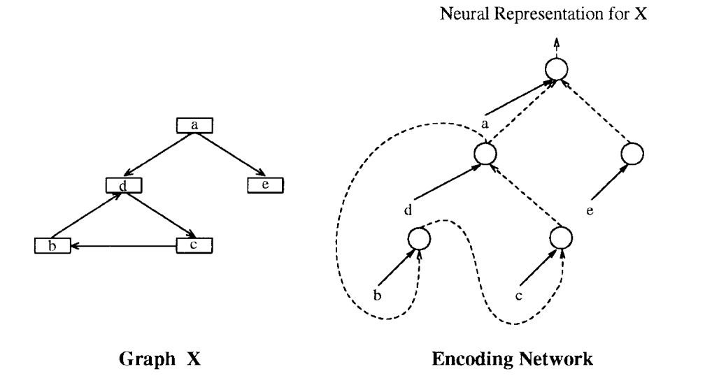

[原文](https://sci-hub.se/https://ieeexplore.ieee.org/abstract/document/572108)

## Abstract

到目前为止，神经网络已经被用于对非结构化模式和序列进行分类。然而，由于其基于特征的方法，通常认为标准神经网络和统计方法在处理复杂结构时是不充分的。事实上，基于特征的方法通常无法给出令人满意的解决方案，因为该方法对特征的先验选择非常敏感，并且无法表示结构各组成部分之间关系的任何特定信息。

然而，我们证明了神经网络实际上可以表示和分类结构化模式。支持我们方法的关键思想是使用所谓的“广义递归神经元”，它本质上是对递归神经元结构的推广。通过使用广义递归神经元，所有用于序列分类的有监督网络，如时间反向传播网络、实时递归网络、简单递归网络、递归级联相关网络和神经树，总体上都可以推广到结构。文中给出了上述几种网络对逻辑项分类的结果。

##  INTRODUCTION

结构域以复杂模式为特征，这些模式通常表示为大小和复杂度可变的列表、树和图。识别和分类这些模式的能力对于一些应用至关重要，如医学和技术诊断、分子生物学和化学自动推理、软件工程、几何和空间推理、语音和文本处理以及其他使用、生成或操纵结构的应用。

虽然神经网络能够对静态信息或时间序列进行分类，但目前的技术水平不允许对不同大小的结构进行有效分类。虽然神经网络能够对静态信息或时间序列进行分类，但目前的技术水平不允许对不同大小的结构进行有效分类。最近在[33]中介绍了该领域的一些进展，其中报告了以有向标记图表示的逻辑术语分类的初步工作。在这种情况下，其目的是实现一个混合定理证明器，其中连接主义部分必须学习特定领域的启发式，以加快对证明的搜索。处理结构化模式的其他相关技术可以在[21]和[27]-[29]中找到。

本文的目的是证明，至少在原则上，神经网络可以处理结构化领域。给出了一些基本概念，我们认为这些概念对于将神经网络的计算能力扩展到结构化领域非常有用。具体来说，我们提出了递归神经元的一种推广——广义递归神经元，它能够构建从结构域到实集合的映射。这种新定义的神经元允许对一些结构的监督模型进行形式化，这些结构非常自然地来源于众所周知的模型，例如通过时间网络的反向传播、实时递归网络、简单递归网络、递归级联相关网络和神经树。

本文的组织结构如下。在第二节中，我们介绍了结构化域以及一些关于图和神经网络的初步概念。第三节讨论了如何对标记图进行编码以进行分类的一般问题。第四节定义了广义递归神经元，其中讨论了一些相关概念。第五节介绍了由标准和知名学习技术衍生的几种监督学习算法。第六节报告了拟议算法子集的模拟结果，第七节给出了结论。

## STRUCTURED DOMAINS

本文讨论可表示为有向标记图的结构化模式。图中展示出了这些类型的图案的一些示例。1-4，报告了结构化领域的一些典型示例，如表示医学概念的概念图（图1）

化学结构（图2）

气泡室事件（图3）

逻辑术语（图4）。

所有这些结构也可以使用基于特征的方法来表示。然而，基于特征的方法对选择用于表示的特征非常敏感，并且无法表示有关组件之间关系的任何特定信息。标准的神经网络，以及统计方法，通常都与这类表示相联系，因此通常认为不足以处理结构化数据域。然而，我们将展示神经网络实际上可以表示和分类结构化模式。

### A.预备工作

图：我们考虑有限有向顶点标记图，没有多个边。

对于一组标签集合$\sum$，图X由一组有限的顶点Vx、一个由Vx*Vx的有序对组成的Ex（称为边集）和一个从Vx到$\sum$的函数$\phi{x}$ （称为标签函数）。请注意，图形可能有循环，并且标签不限于二元。具体地说，标签也可以是实值向量。

图$X’$是X的子图,$V_{X’}\in{V_X}$，$E_{X'}\in{E_X}$。

对于有限集V，#V表示其基数。给定一个图X和一些顶点$x\in{V_X}$，函数$outdegree(x)$ 的值表示从x离开的边数，比如$outdegree(x)=\#\{(x,z)|(x,z)\in{E_X},z\in{V_X}\}$。

而函数$indegree(x)$的返回值表示向x输入的边数。

给定从x离开的边的总顺序，Vx中的顶点y是第j个从x离开时指向的顶点。

图的价定义为集合Vx中outdegree(x)最大的个数。

标记的有向无环图是如上所定义的没有环的图。

如果X中的每个顶点都可以通过从s开始的路径到达，则顶点s被称为X的超源。

树的根（有向图的特例）始终是树的（唯一）超源。

### 结构化领域，目标函数和训练集：

我们将结构化域D定义为任何一组图。域D的阶定义为D图中outdegree(x)中的最大值。由于我们正在处理学习，我们需要定义我们想要学习的目标函数。在近似任务中，D上的目标函数f定义为任意函数$f:D->R^k$，其中k是输出维度，在二项分类任务中，我们有$f:D->\{0,1\}^k$

域D上的训练集T被定义为一组（X，f(X)），其中$X\in{D}$，$f()$是定义在D上的目标函数。

### 标准神经元和循环神经元：

标准神经元的输出由下式给出
$$
o^{(s)}=f(\sum_iw_iI_i)
$$
其中$f()$是输入I的加权和的非线性挤压函数。

具有单个自循环连接的循环神经元按如下方式计算其输出o：
$$
o^{(r)}(t)=f(\sum_iw_iI_i(t)+w_so^{(r)}(t-1))
$$
其中$f()$是输入I的加权和+自权重ws乘以之前的输出。

考虑到多个相互连接的递归神经元和输出的延迟版本可以扩展。为了便于演示，我们将跳过这些扩展。

##  THE ENCODING PROBLEM

在本文中，我们面临的问题是设计用于结构化模式分类的神经网络结构和学习算法，即标记图。我们得到了一个在$\sum$上的结构化域D和一个表示分类任务的训练集T。

图5报告了使用标准神经网络处理该问题的标准方法。每个图X被编码为一个固定大小的向量，然后作为前馈神经网络的输入进行分类。这种方法的动机是神经网络只有固定数量的输入单元，而图的大小是可变的。

编码过程通常是预先定义的，不依赖于分类任务。例如，在分子生物学和化学中，化合物表示为标记图，编码过程通过定义拓扑索引]来执行，拓扑索引是通过非常昂贵的试错方法设计的。

编码过程的先验定义有两个主要缺点。

1.  对于不同的学习任务，图形不同特征的相关性可能会发生显著变化。
2.  由于编码过程必须适用于任何分类任务，因此每个图形必须具有不同的表示形式；这可能导致矢量表示非常难以分类。

为了克服上述困难，我们建议调整编码过程以适应手头的特定分类任务。

这可以通过一个额外的神经网络来实现编码过程，该神经网络沿着执行分类的神经网络进行训练，以学习为给定分类任务编码图形的最佳方法。不幸的是，标准神经元和重复神经元的功能都不足以用于这样的网络。这是因为前者是为处理非结构化模式而设计的，而后者只能自然地处理序列。因此，在下一节中，我们需要定义一个递归神经元的泛化，它允许我们正式定义标记有向图如何被神经网络编码。

### THE FIRST-ORDER GENERALIZED RECURSIVE NEURON

**一阶广义递归神经元**

标准神经元和复发神经元不适合处理标记结构。事实上，使用这类神经元的神经网络只能通过使用复杂且非常不自然的编码方案来处理结构化域中的近似和分类问题，该编码方案将结构映射到固定大小的非结构化模式或序列上。我们建议通过引入广义递归神经元来解决目前神经网络技术的不足。

广义递归神经元是递归神经元的扩展，而不是只考虑前一个时间步长中单元的输出，我们考虑由当前输入顶点所指向的所有顶点的单位输出（参见图6）。

图6。不同输入域的神经元模型。标准神经元适用于处理非结构化模式，递归神经元适用于处理模式序列，最后提出的广义递归神经元可以非常自然地处理结构化模式。

图的顶点的广义递归神经元的输出o定义为：公式（3）
$$
o^{(g)}(x)=f(\sum_{i=1}^{N_L}w_il_i+\sum_{j=1}^{outdegree(x)}w_jo^{(g)}(out(x,j)))
$$
其中，f是一个sigmoid函数，$N_L$是对当前输入x的标签l进行编码的单位数，wj是递归连接上的权重。因此，一个顶点x的神经元输出是在它所指向的所有顶点的输出上递归计算的。

请注意，如果所考虑的域的阶为n，则广义递归神经元将具有递归连接，即使不是所有这些连接都将用于用outdegree(x)计算顶点x的输出。

为了阐明广义递归神经元是如何工作的，展示它与递归神经元的关系可能是有用的。

递归神经元可以看作是应用于列表的广义递归神经元，即具有价1的标记图；在这种情况下，列表中顶点的位置对应于处理时间；比如
$$
x_k\rightarrow x_{k-1}\rightarrow...\rightarrow x_1
$$
其中$\phi(x_i)=l^{(i)},i=1,...,k$，由（3）的递归应用导出的方程组为
$$
o(x_1)=f(\sum_{j=1}^{N_L}w_jl_j^1)
\\
o(x_i)=f(\sum_{j=1}^{N_L}w_jl_j^{i}+w_1o(x_i-1)),i=2,...,k
$$
式中，w为循环连接上的权重；通过明确处理时间，可以将上述方程改写为以下形式：
$$
o(t=1)=f(\sum_{j=1}^{N_L}w_jl_j^1)
\\
o(t)=f(\sum_{j=1}^{N_L}w_jl_j^{t}+w_1o(t-1)),t=2,...,k
$$
对应于使用递归神经元得到的方程；

从上面的方程可以清楚地看出，返回神经元在时间上的输出只取决于在时间上的输出；这是因为列表不包含循环；然而，一般来说，图包含循环，广义递归神经元必须处理它们。具体地说，对于属于一个循环的顶点，广义递归神经元的输出是作为相互依赖方程组的解来获得的；

比如图：

其中$out(x_2,1)=x_1,out(x_2,2)=x_4$,$\phi(x_i)=l^{(i)}$,产生以下方程组：

其中循环中涉及的顶点的输出是相互依赖的；这意味着，虽然可以很容易地计算出o(x1)，但o(x6)只能在参考循环的方程子集求解后计算。

在下一节中，我们将介绍编码网络的概念，这将使我们能够给出有向图的自适应编码问题的一般解决方案。然而，在继续之前，让我们看看（3）在考虑N个互连的广义递归神经元时是如何定义的。

公式（3）：
$$
o^{(g)}(x)=f(\sum_{i=1}^{N_L}w_il_i+\sum_{j=1}^{outdegree(x)}w_jo^{(g)}(out(x,j)))
$$
变为：
$$
o^{(g)}(x)=F(Wl+\sum_{j=1}^{outdegree(x)}w_jo^{(g)}(out(x,j)))
$$
其中$F_i(v)=f(v_i),l\in R^{N_L},W\in R^{N_gN_L}$

$o^g(x),o^g(out(x,j))\in R^{N_G},W_j\in R^{N_gN_g}$

在下文中，当涉及广义神经元的输出时，我们将删除上标。

###  *Generation of Neural Representations for Graphs*

为了理解广义递归神经元如何能有向图表示，让我们考虑一个广义递归神经元和一个单图。以下两个条件必须成立。

连接数：广义递归神经元u的递归连接数必须与图的价相同。

超级源：图形必须有一个引用超级源。请注意，如果图X没有超源，那么仍然可以定义一个约定，向图X添加一个额外的顶点s（具有最少数量的输出边），这样s就是新图的超源（有关算法，请参见附录a）。

如果满足上述条件，我们可以采用图X由o(s)表示的约定，即o(s)为超源s计算的u的输出。因此，由于（3）的递归性质，无环图的神经表示由前馈网络（编码网络）计算，前馈网络是通过复制相同的广义递归神经元u并根据结构的拓扑连接这些副本而获得的（见图7）。

图7，非循环图的编码网络。图形由编码网络的输出表示。

图8。周期图的编码网络。在这种情况下，编码网络是循环的，并且图形由编码网络在网络动力学的固定点处的输出表示。

如果结构包含循环，则产生的编码网络是循环的（参见图8）并且仅当o（s）收敛到平稳值时，才认为神经表示形式良好。

编码网络充分描述了如何计算结构的表示，并将在下文中用于推导广义递归连接的学习规则。当考虑结构化域时，u的递归连接数必须等于域的价。对一组Ng广义神经元的扩展是微不足道的：如果域的价为Nv，则每个广义神经元都将有Nv组Ng递归连接。

*B. Optimized Training Set for Directed Acyclic Graph*

有向无环图的优化训练集*

当考虑DAG有向无环图时，可以组织训练集以提高简化表示和学习规则的计算效率。事实上，给定一个DAG的训练集T，如果有图$X_1，X_2\in T$共享一个公共子图X’，那么我们只需要显式表示X’一次。训练集的优化可以分两个阶段进行（参见图9的示例）。

1.  将训练集中的所有DAG合并为单个最小DAG，即顶点数最少的DAG。
2.  对最小DAG的顶点进行拓扑排序，以确定网络顶点的更新顺序。

图9。优化训练集：将结构集（在本例中为树）转换为相应的最小DAG，然后使用该DAG生成排序训练集。然后，使用标签和目标的数字代码将已排序的训练集转换为一组已排序的向量，并用作网络的训练集。

这两个阶段都可以在线性时间内完成，分别与所有DAG的大小和最小DAG的大小有关。具体而言，阶段1）可以通过一个特殊的子图索引机制（可以在线性时间内实现）删除所有重复的子图来完成。拥有排序训练集的优点是，所有的简化表示（以及它们相对于权重的导数，我们将在考虑学习时看到）都可以通过训练集的单个有序扫描来计算。
此外，使用最小DAG可以大大降低空间复杂度。在某些情况下，这种减少甚至可以是指数级的。

### *C. Well-Formedness of Neural Representations*

神经表征的良形性

在考虑循环图时，为了保证每个编码图通过编码网络得到适当的表示，我们必须保证对于每个初始状态，编码网络的轨迹收敛到平衡，否则就不可能处理非平稳表示。这在考虑循环图时尤为重要。事实上，由于生成的编码网络是前馈的，而循环图是使用递归网络编码的，因此可以保证无环图得到收敛表示。因此，可以通过定义保证编码网络收敛的条件来获得表示的良好形式。关于这个问题，众所周知，如果权重矩阵是对称的，则具有一阶连接的可加网络具有Lyapunov函数并且是收敛的（[5]，[15]）。此外，Almeida[1]证明了一个比权重矩阵的对称性更一般的对称条件，并保证了它也具有一个Lyapunov函数。另一方面，如果权重矩阵的范数（不一定对称）足够小，对于给定的输入（[2]），网络的动力学可以显示为达到唯一的平衡。

当编码网络是静态的时，上述结果就足够了，但是我们将看到在一些情况下，例如在分类任务中，编码网络随着学习而变化。在这些情况下，可以利用这些结果定义初始权重矩阵，但不能保证学习将保持编码网络的稳定性。

## V.监督模型

在本节中，我们将讨论如何将神经网络的几种标准监督算法扩展到结构。

### *A. Backpropagation Through Structure*
