## Gene Database

[NCBI网站](https://www.ncbi.nlm.nih.gov)

选择Gene，是以基因为单位的数据库，其中包含了基因结构、同源基因、RNA-seq Expression等信息。

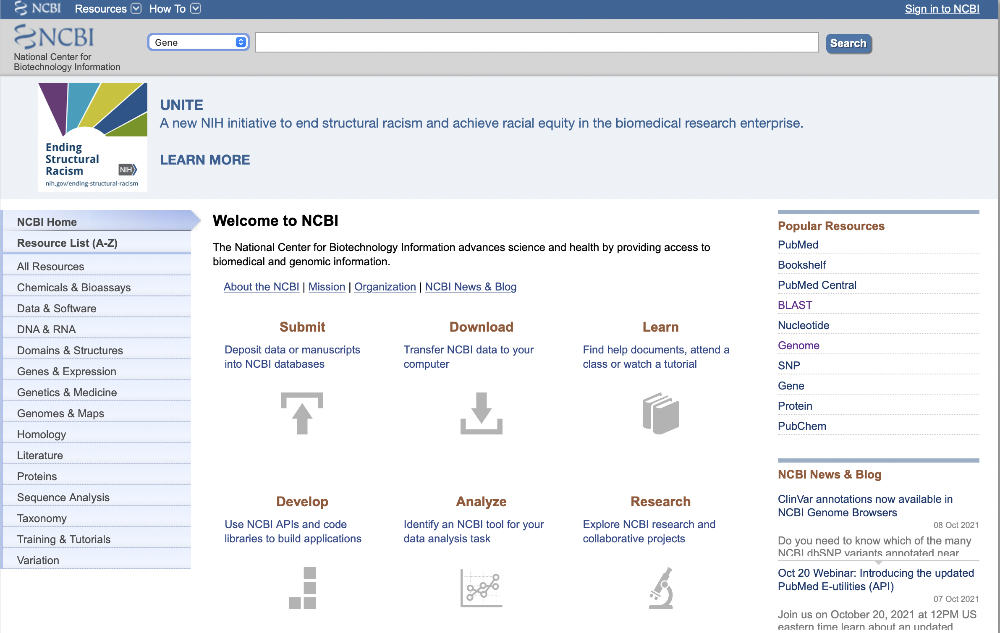

可以在搜索框中输入，来限定基因名symbol和物种porganism

```
xxx[symbol] AND yyy[organism] NOT zzz
xxx[sym] AND yyy[orgn]
```

### 通过Gene数据库，可以获得哪些信息？

**1、该基因处在染色体的哪个位置？**

**2、该基因有多少个外显子？**

**3、该基因的参考基因组、转录本和蛋白序列是什么？**

**4、该基因有哪些突变位点，与疾病是否相关？**

**5、该基因的表达情况如何？**

**6、该基因的功能是什么？**

**7、研究该基因的文献有哪些？**

### example

假设我们要看一下人类的基因，可以搜索**human[orgn]**，得到下图。

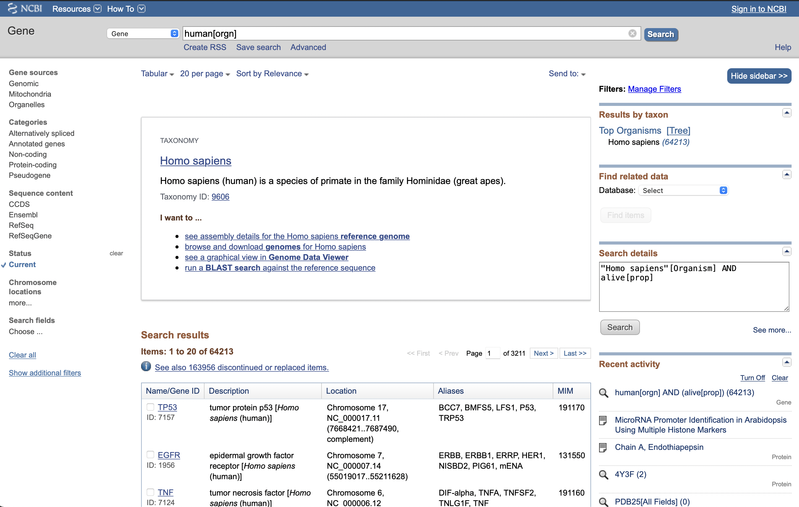

可以从图中得到的信息有：

-   items：64213：表明人类这个物种已经有6w+个基因，其中包含蛋白编码基因和非编码的基因

-   左侧的Chromosome locations：可以用来限定染色体的位置，查看某个区域中有哪些基因。

点击chromosome locations下方的more，如下图。

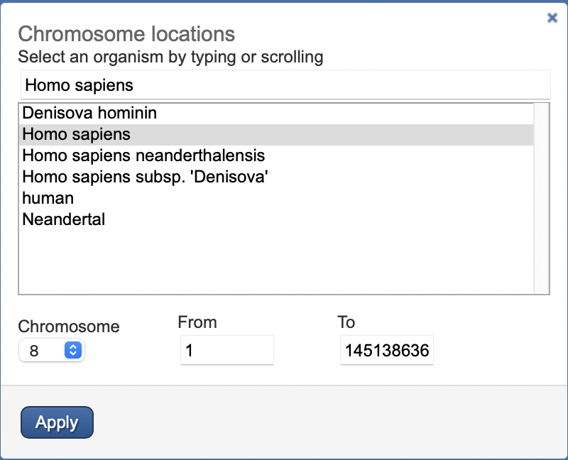

可以看到：

[参考资料](https://www.zhihu.com/question/65673615)

在Homo(人属) sapiens(智人种)选择organism(生物体)

-   denisova hominin：丹尼索瓦人，是人属的一个古人类化石。
-   homo sapiens：智人
-   homo sapiens neanderthalensis：尼安德特人
-   homo sapiens subsp.’Denisova’：智人种内的亚种丹尼索瓦人（不清楚和第一个有什么区别）
-   human：人类
-   Neandertal：尼安德特人（不清楚和第三个的区别）

下面的chromosome选择哪条染色体，from to选择染色体上哪段区域

我们搜索第8条染色体上区域127712951-127762951，可以搜到下图。

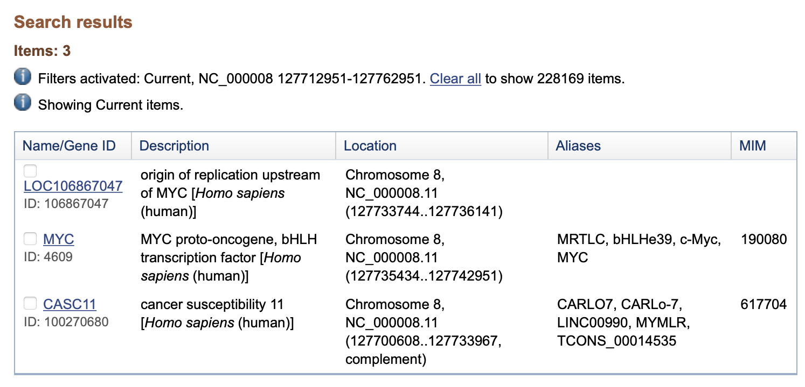

在这个区域内有这三条基因。

这是通过限定区域的方法寻得想要的基因。

如果我们直接搜索基因MYC。可以看到。

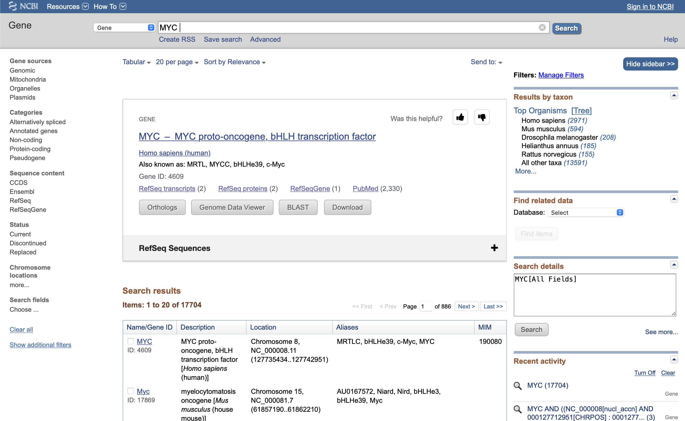

他会显示不止一个物种的情况。我们可以通过组合symbol和物种来搜索如下。

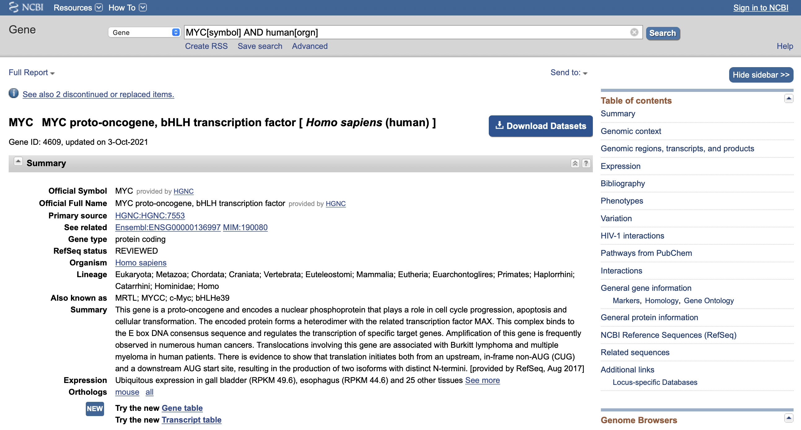

可以准确的搜索到目标基因。

Summary总结，可以得到的信息：

-   Gene ID：基因的id号。
-   Primary source：主要来源
-   Gene type：基因类型。编码蛋白。
-   RefSeq status：REVIEWED，审核过的，其他的可能是预测的基因。
-   Organism：物种，智人。
-   Lineage：记录某个物种的分类地位，即它属于哪个门，哪个纲等等。
-   Also known as：曾用名。要找以前关于这个基因的文献，可以尝试用曾用名搜索文献。
-    Summay：对基因功能的总结归纳。
-    该基因是一个原癌基因，编码一种核磷蛋白，在细胞周期进展、凋亡和细胞转化中发挥作用。编码蛋白与相关转录因子MAX形成异二聚体。该复合物与E盒DNA共有序列结合并调节特定靶基因的转录。在许多人类癌症中经常观察到该基因的扩增。涉及该基因的易位与人类伯基特淋巴瘤和多发性骨髓瘤相关。有证据表明，翻译起始于上游、帧内非AUG（CUG）和下游AUG起始位点，导致产生两种具有不同N-末端的异构体。[由RefSeq提供，2017年8月]
-    Expression：表达，在胆囊、食管和25个其他组织中普遍表达。
-   Orthologs：直系同源物种。

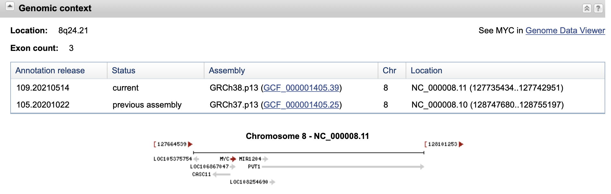

Genomic context：基因背景，查看基因在哪个染色体上在8号染色体，q24.21上。

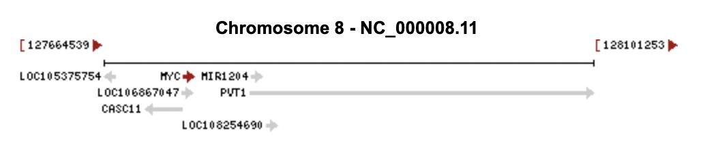

MYC后面的箭头指向右边代表他是**正向转录**的，旁边的MIR1204和下面的表示他的临近基因。

往下。

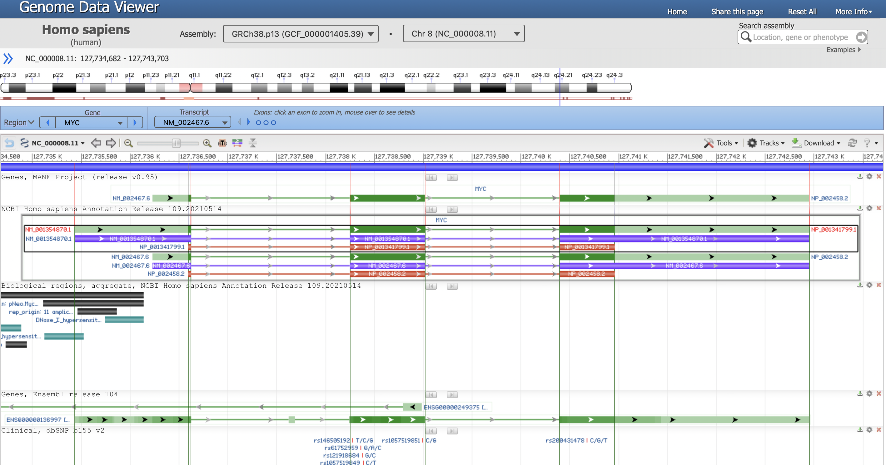

这个序列中绿色的方框是外显子区域，拼接起来就是cDNA序列。方框中浅绿色的部分是不编码氨基酸，常存在于首个外显子的前半部分及末尾外显子的后半部分，方框中绿色部分拼接起来就是开放阅读框即ORF。

可以看到其中绿色、紫色、橙色的部分，绿色是基因片段，紫色是mRNA序列，橙色是CDS编码序列。

| Accession            | Molecule | Note                                                         |
| -------------------- | -------- | ------------------------------------------------------------ |
| AC_123456            | Genomic  | 一些可供选择的注释的基因组序列，用来标记病毒和原核生物       |
| AP_123456            | Protein  | AC标记序列对应的蛋白产物                                     |
| AY_123456            |          | DNA？？？                                                    |
| NC_123456            | Genomic  | 完整的基因组分子序列，标记的类别包括基因组、染色体、细胞器、质粒 |
| NG_123456            | Genomic  | 不完整的基因组区域，提供NCBI基因注释途径。比如不转录的假基因或者很难自行注释的基因组簇 |
| NM123456;NM123456789 | mRNA     | 转录产物序列；成熟mRNA转录本序列                             |
| NP123456;NP123456789 | Protein  | 蛋白产物。主要是全长转录氨基酸序列，但也有一些只有部分蛋白质的部分氨基酸序列 |
| NR_123456            | RNA      | 非编码的转录子序列，包括结构RNAs，假基因转子等               |
| NT_123456            | Genomic  | BAC或者鸟枪测序法还未完全注释的测序序列                      |
| NW123456;NW123456789 | Genomic  | BAC或者鸟枪测序法还未完全注释的测序序列                      |
| NZ_ABCD12345678      | Genomic  | 收集的各种利用鸟枪法测序的测序计划，ABCD代表的是计划的名称   |
| XM123456;XM123456789 | mRNA     | 转录产物，m RNA来自基因组注释，序列相当于基因组重叠群        |
| XP123456;XP123456789 | Protein  | 蛋白产物，序列相当于基因组重叠群                             |
| XR_123456            | RNA      | 转录产物，非编码区来自基因组注释，序列相当于基因组重叠群     |
| YP123456;YP123456789 | Protein  | 蛋白产物，不涉及到转录，主要用来标记细菌、病毒、线粒体       |
| ZP_12345678          | Protein  | 蛋白产物，主要是电脑自动注释                                 |
| NS_123456            | Genomic  | 未知生物分子基因组序列                                       |

其中，Biological regions这个部分。可以左右拖动查看。

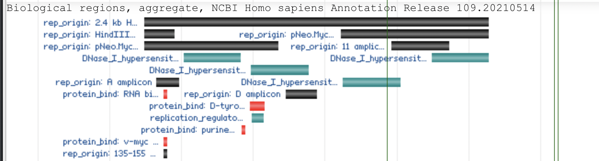

代表了基因组元件（片段、DNasel信号富集位点、蛋白结合位点等），对应上方的DNA区域可能会受到转录因子或是表观遗传修饰等的调节

下面。

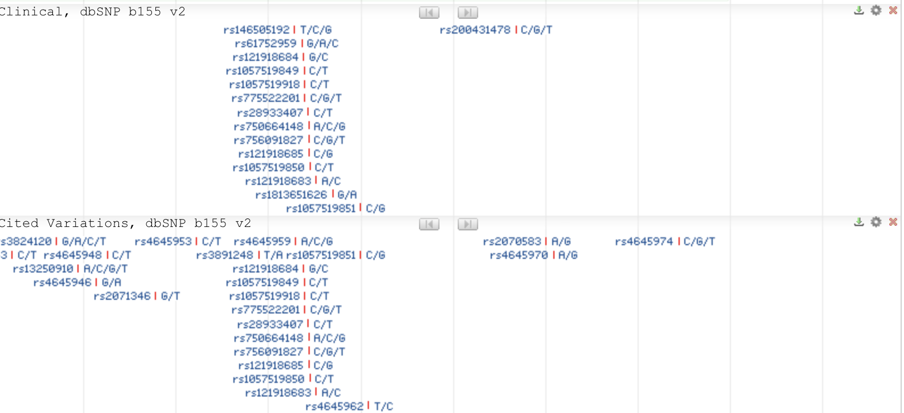

红色的条条，Variation Type:	SNV，单核苷酸变异。

往下。

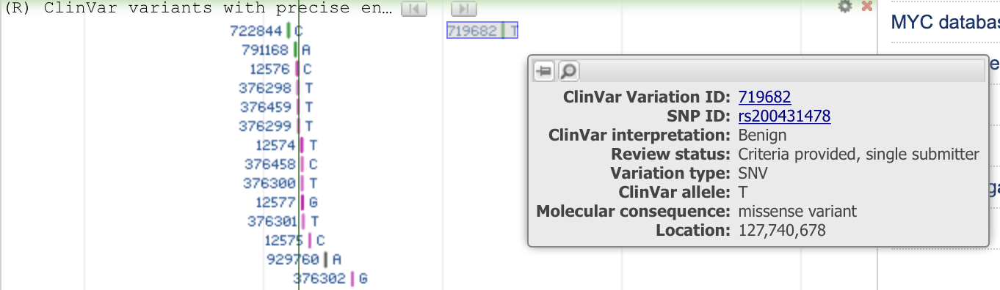

SNP，单核苷酸多态性。

点击右上方的Tracks，在推荐的Track sets里可以看到

-   Assembly Support
-   Clinical
-   Comparative Genomics
-   Epigenomics
-   Express
-   Gene Support
-   Genes
-   Genetics and Variation

选择NCBI Recommended Track Sets中的Epigenomics，表观基因组学，可以看到如下

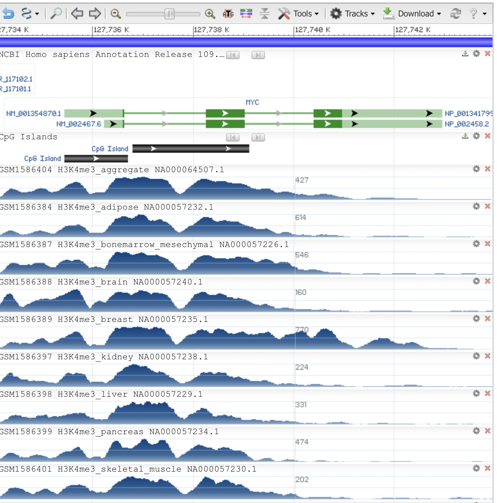

可以看到这个基因的表观遗传修饰的信息，比如哪里有CpG岛（黑色的），H3K4me3修饰的信号情况（蓝色部分），其中信号较强的地方，说明MYC基因表达水平可能较高。

再往下，可以看到。

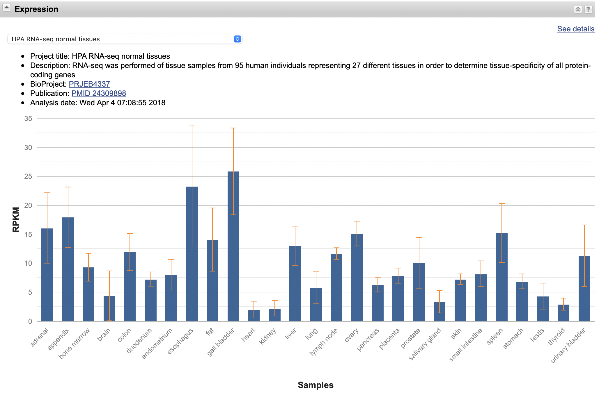

表达谱，可以观察到在不同组织中基因的表达大小，

再往下，可以看到。

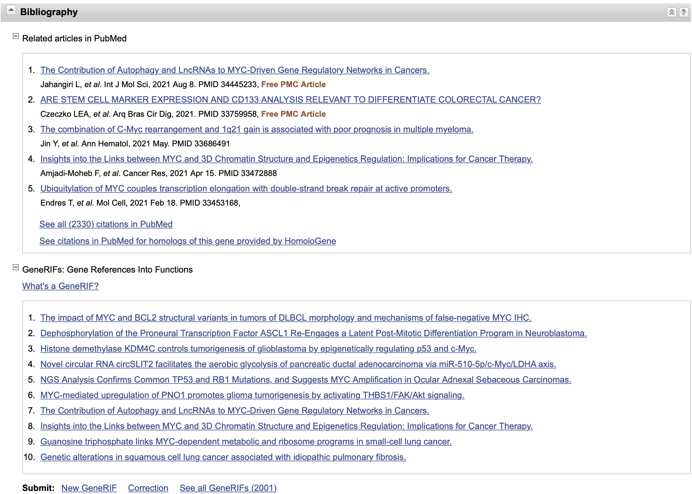

基因相关参考文献，可以看到这里有2330篇相关参考文献，下半部分总结了文献中对基因主要研究的一些功能。

往下，可以看到。 

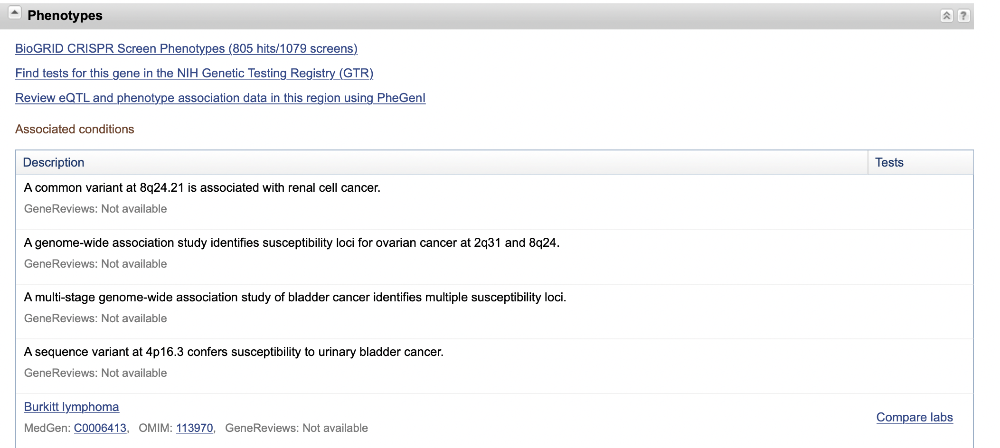

与这个基因可能相关的疾病

再往下。

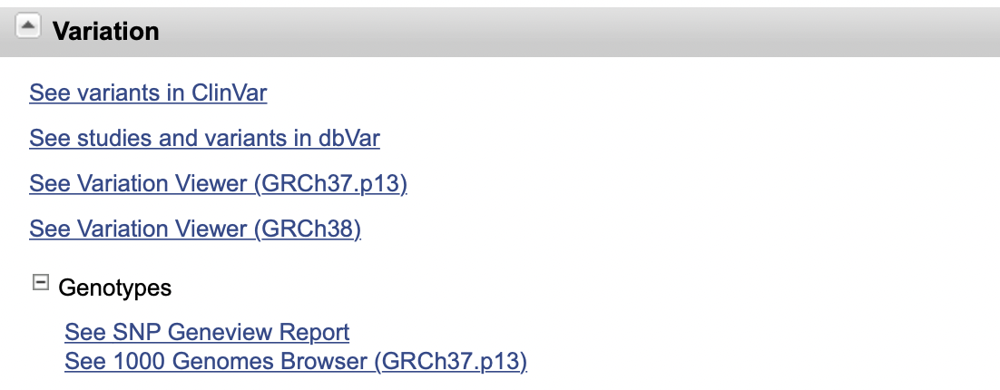

Variation突变，可以看到有哪些突变。

再往下。

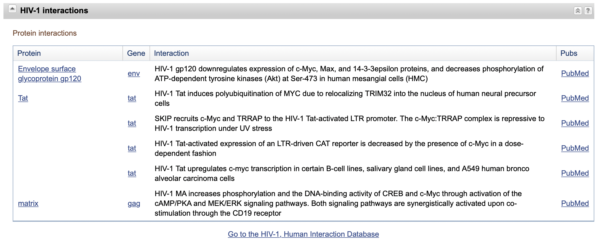

与hiv-1相互作用的相关文献。

往下。

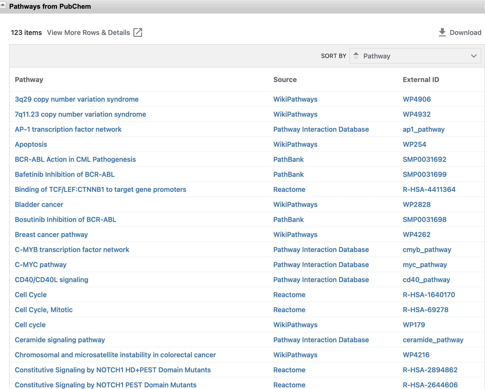

基因的通路。pathway主要描述了一种机理或者现象，可以有信号通路、代谢通路等等，它的结果由点(nodes)和线(edges)组成，目的是描述某些现象、相互作用和依赖性。Pathway是一种描述细胞、组织或个体内的基因、蛋白或代谢产物互作关系的模型，并不是简单地基因列表。

往下。

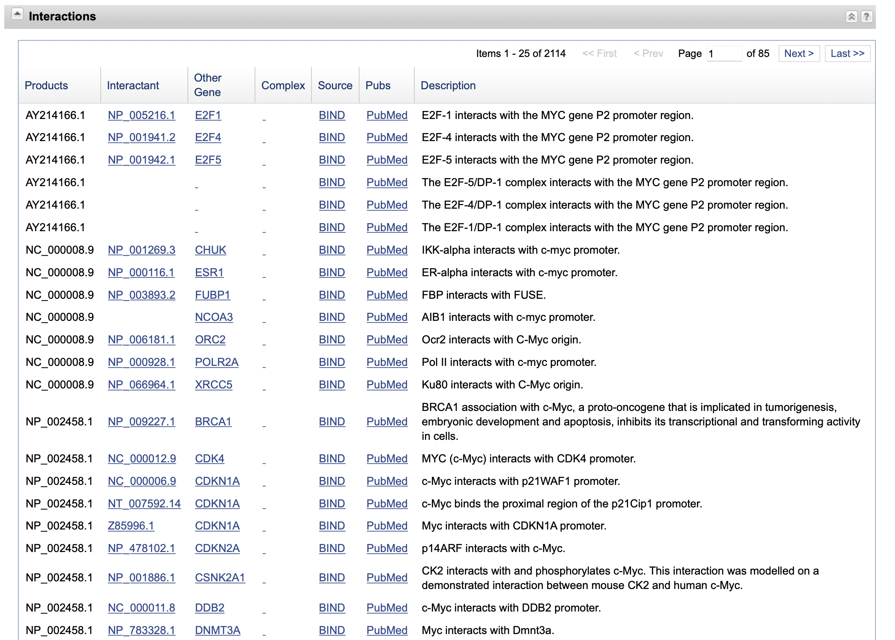

Products，AY表示MYC的DNA与E2F1基因有相互作用，NP表示MYC蛋白与其他蛋白的相互作用。

往下。

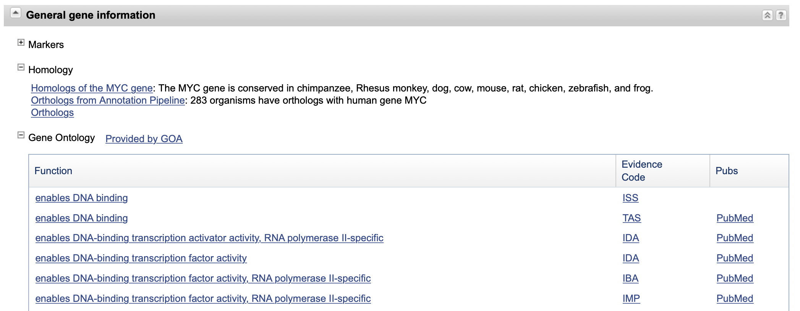

homology，这个基因同源的物种。

Gene Ontology，其中包含function，有什么功能。process，参与的生物过程。component，处在哪个亚细胞定位等。

往下。

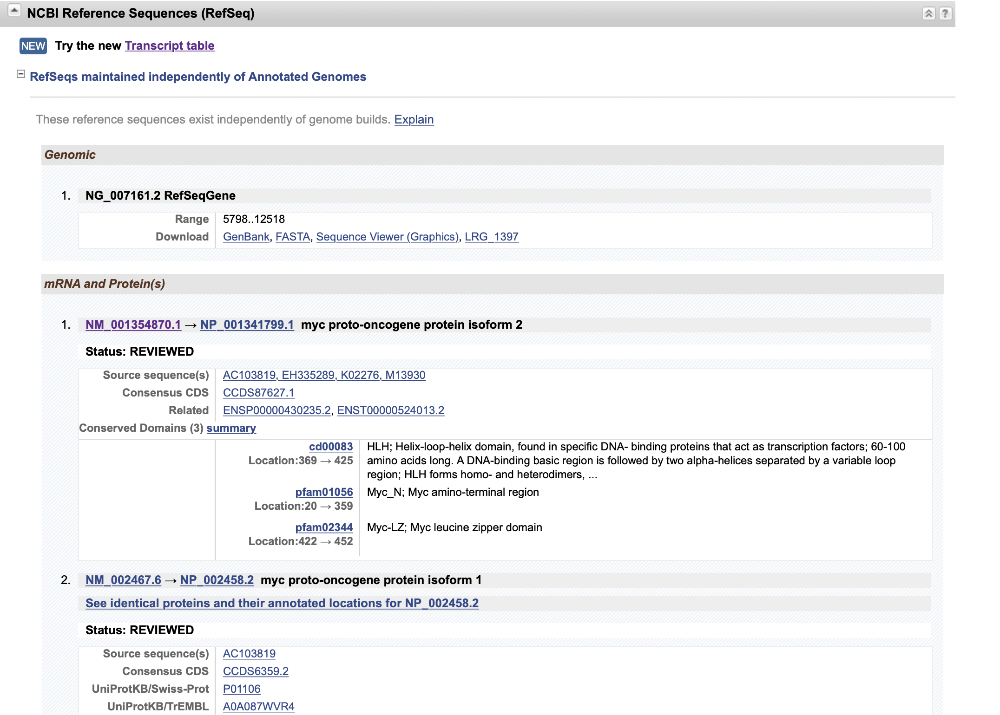

可以看到基因对应的序列有哪些，点击其中的NM_001354870，会跳转到GenBank数据库

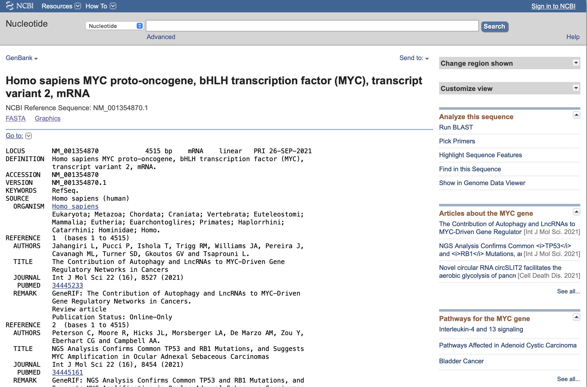

------

### 关于MYC的总结

-   **MYC位于8号染色体q24.21上：**在Genomic context的location:8q24.21
-   **有两个转录本，每个转录本均有3个外显子：**
    1.  在 Genomic regions, transcripts, and products中的模式图，可以在NCBI Homo sapiens Annotation Release中看到两条Transcript ID：NM_001354870.1和NM_002467.6，其中三段带箭头的绿色矩形代表了他的Exon外显子
    2.  在NCBI Reference Sequence（RefSeq）的mRNA and Protein(s)中有两个Transcript ID：NM_001354870.1和NM_002467.6
-   **正向转录：**在Genomic context的图中看到MYC的箭头朝右是正向转录
-   **临近基因有CASC11、PVT1等：**在Genomic context的图中可以看到
-   **MYC基因在启动子区域有多个DNase信号富集，可能受到其他转录因子或表观遗传修饰的调节：**可以在基因组元件对应部分看到
-   **H3K4me3信号较强，表达水平可能较高，在第一个内含子和前两个外显子区域存在两个CpG岛，可能与DNA甲基化有关，在食道、胆囊表达水平较高，在肾、心脏、甲状腺表达水平较低：**可以在模式图中点击Tracks，选择NCBI Recommended Track Sets中的Epigenomics，看到
-   **文献上看，多与癌症有关，OMIM显示MYC与淋巴瘤有关，GWAS显示多在癌症中发生变异：**可以在Bibliography和Phenotypes中看到
-   **参与癌症的信号通路，与细胞周期、凋亡等生物过程有关：**Pathways

