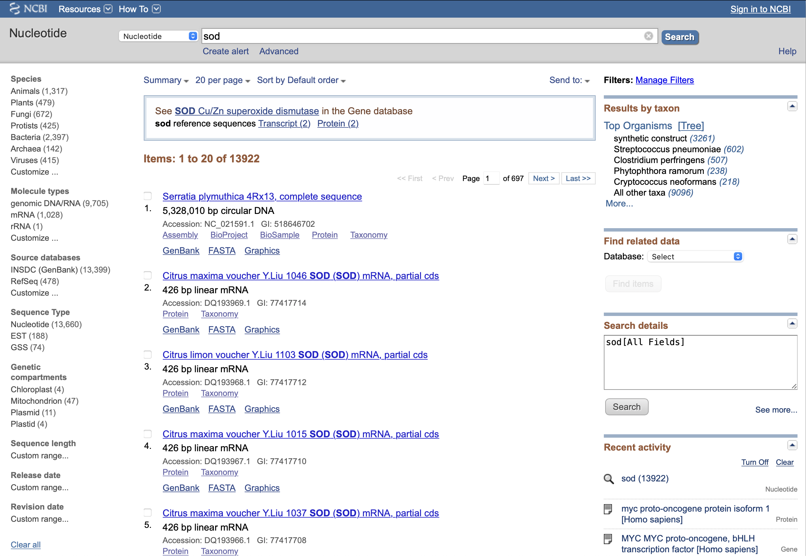
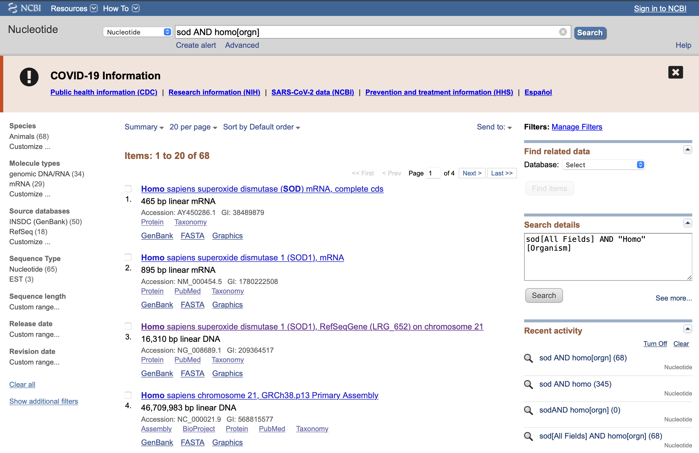
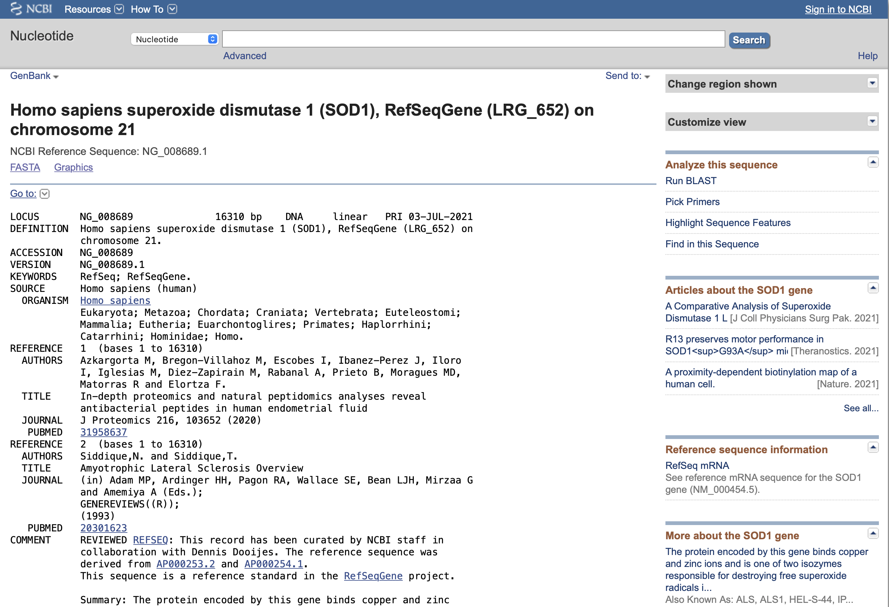
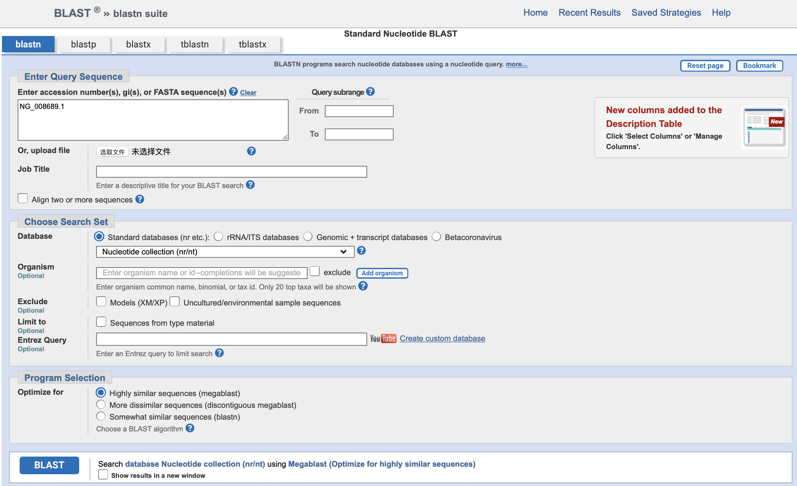
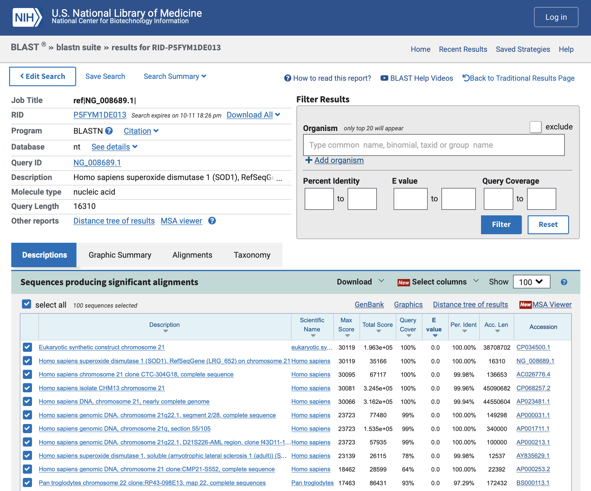

## Nucleotide Database

[NCBI网站](https://www.ncbi.nlm.nih.gov)

[官方教程](https://www.ncbi.nlm.nih.gov/books/NBK44863/)

选择Nucleotide，核苷酸序列数据库，是来自多个来源的序列的集合，包括GenBank、RefSeq、TPA和PDB。

------

### example

[视频资料](https://www.bilibili.com/video/BV1AW411S7yB/?spm_id_from=333.788.recommend_more_video.2)

搜索sod，超氧化物歧化酶。可以看到。



可以看到有很多不同物种编码的sod序列，通过使用sod AND homo[orgn]，可以筛选人类的sod基因序列。



点开第三个，人的SOD1的序列。



会跳转到他的GenBank，可以看到在这里他的检索号和版本如下

```
ACCESSION   NG_008689
VERSION     NG_008689.1
```

点击右侧Run BLAST，可以使用BLAST查找此序列和其他序列之间的相似区域。



因为是直接从序列中进入BLAST，所以自动填写了序列的accession number检索号。点击BLAST。



显示了整个数据库中和他相似的基因序列，可以得出两个物种或两个序列之间的亲缘关系。

