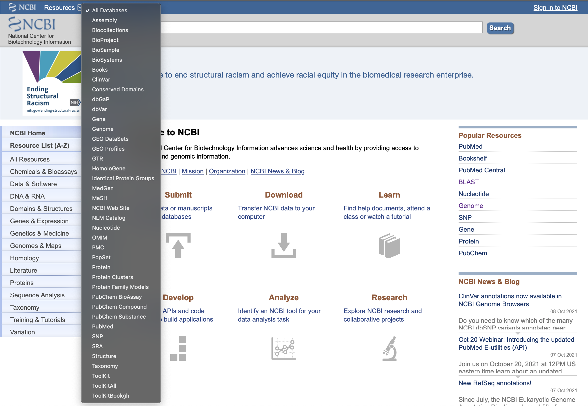
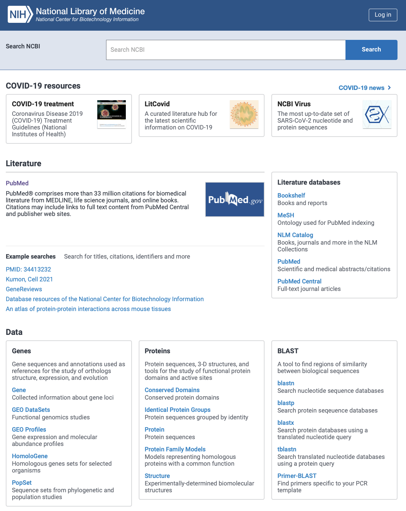

## NCBI

[网站](https://www.ncbi.nlm.nih.gov)

美国国立生物技术信息中心，National Center for Biotechnology Information

建立关于分子生物学、生物化学和遗传学知识的存储和分析的自动系统

------

可以看到其中有很多数据库，选择all database点击右侧search，可以看到。

他们的作用如下。

| Literature                                              | 文献数据库                                                   |
| ------------------------------------------------------- | ------------------------------------------------------------ |
| [Bookshelf](https://www.ncbi.nlm.nih.gov/books/)        | 可直接搜索或从其他NCBI数据库中的链接数据搜索的生物医学书籍集合。 |
| [MeSH](https://www.ncbi.nlm.nih.gov/mesh/)              | MeSH（医学主题词）是美国国家医学图书馆用于索引MEDLINE / PubMed文章的受控词汇表。 MeSH术语提供了一种一致的方法来检索可能对相同概念使用不同术语的信息。 |
| [NLM Catalog](https://www.ncbi.nlm.nih.gov/nlmcatalog/) | 图书馆馆藏中所有期刊，书籍，视听，计算机软件，电子资源和其他资料的书目数据。 |
| [PubMed](https://www.ncbi.nlm.nih.gov/pubmed/)          | MEDLINE和其他生命科学期刊的生物医学文献引文和摘要数据库。    |
| [PubMed Central](https://www.ncbi.nlm.nih.gov/pmc/)     | 公共医学中心，提供生物医学和生命科学期刊文献，包括临床医学和公共卫生。 |

| Genes                                                     | 基因序列和注释，用作研究正交学结构、表达和进化的参考         |
| --------------------------------------------------------- | ------------------------------------------------------------ |
| [Gene](https://www.ncbi.nlm.nih.gov/gene/)                | 整合各类别信息，包括命名法、参考序列、定位、通路、变异、表型，提供基因序列注释和检索服务 |
| [GEO DataSets](https://www.ncbi.nlm.nih.gov/gds/)         | 存储从Gene Expression Omnibus（GEO）数据库组装的基因表达和分子丰度数据集。数据集每个记录包含其他资源，包括集群工具和差异表达式查询。 |
| [GEO Profiles](https://www.ncbi.nlm.nih.gov/geoprofiles/) | 存储从Gene Expression Omnibus（GEO）数据库组装的单个基因表达和分子丰度配置文件。 基于基因注释或预先计算的轮廓特征搜索感兴趣的特定配置。 |
| [HomoloGene](https://www.ncbi.nlm.nih.gov/homologene/)    | 在20个完全测序的真核生物基因组中自动检索同源基因的系统。     |
| [PopSet](https://www.ncbi.nlm.nih.gov/popset/)            | 来自比较研究的相关DNA序列的数据库：系统发育，种群，环境以及在较小程度上的突变。 数据库中的每个记录都是一组DNA序列。 例如，群体集提供有关生物体内遗传变异的信息，而系统发育集可以包含从几个相关生物获得的单个基因的序列及其比对。 |

| Proteins                                                     | 蛋白质序列、3D结构和用于研究功能蛋白域和活性位点的工具       |
| ------------------------------------------------------------ | ------------------------------------------------------------ |
| [Conserved Domains](https://www.ncbi.nlm.nih.gov/cdd/)       | 是一种蛋白质注释资源，由一系列经过充分注释的古代结构域和全长蛋白质序列比对模型组成。 |
| [Identical Protein Groups](https://www.ncbi.nlm.nih.gov/ipg/) | 描述在GenBank和RefSeq中注释的编码区中鉴定的蛋白质，以及SwissProt和PDB蛋白质序列的综合记录集合。 该资源允许研究人员获得更有针对性的搜索结果并快速识别感兴趣的蛋白质。 |
| [Protein](https://www.ncbi.nlm.nih.gov/protein/)             | 包含来自各种来源的蛋白质序列记录的数据库，包括GenPept，RefSeq，Swiss-Prot，PIR，PRF和PDB。 |
| [Protein Family Models](https://www.ncbi.nlm.nih.gov/protfam/) | 代表具有共同功能的同源蛋白质的模型                           |
| [Structure](https://www.ncbi.nlm.nih.gov/structure/)         | 包含源自蛋白质数据库的大分子3D结构，以及用于可视化和比较分析的工具。 |

| BLAST                                                        | 一种在生物序列之间找到相似区域的工具                         |
| ------------------------------------------------------------ | ------------------------------------------------------------ |
| [blastn](https://blast.ncbi.nlm.nih.gov/Blast.cgi?PROGRAM=blastn&PAGE_TYPE=BlastSearch&LINK_LOC=gquery) | 搜索核苷酸序列数据库                                         |
| [blastp](https://blast.ncbi.nlm.nih.gov/Blast.cgi?PROGRAM=blastp&PAGE_TYPE=BlastSearch&LINK_LOC=gquery) | 搜索蛋白质序列数据库                                         |
| [blastx](https://blast.ncbi.nlm.nih.gov/Blast.cgi?PROGRAM=blastx&PAGE_TYPE=BlastSearch&LINK_LOC=gquery) | 使用翻译的核苷酸查询搜索蛋白质数据库                         |
| [tblastn](https://blast.ncbi.nlm.nih.gov/Blast.cgi?PROGRAM=tblastn&PAGE_TYPE=BlastSearch&LINK_LOC=gquery) | 使用蛋白质查询搜索翻译的核苷酸数据库                         |
| [Primer-BLAST](https://blast.ncbi.nlm.nih.gov/Blast.cgi?PROGRAM=blastx&PAGE_TYPE=BlastSearch&LINK_LOC=gquery) | Primer-BLAST工具使用Primer3设计序列模板的PCR引物。 然后通过针对用户指定数据库的BLAST搜索自动分析潜在产品，以检查对目标的特异性。 |

| Genomes                                                      | 基因组序列组件、大规模功能基因组数据和源生物样本             |
| ------------------------------------------------------------ | ------------------------------------------------------------ |
| [Assembly](https://www.ncbi.nlm.nih.gov/assembly/)           | 提供有关基因组组装结构，装配名称和其他元数据，统计报告以及基因组序列数据链接等信息的数据库。 |
| [BioCollections](https://www.ncbi.nlm.nih.gov/biocollections/) | 有关培养物、动植物样本和其他自然样本的精选元数据集。 记录显示样本状态，有关馆藏的机构的信息，以及NCBI中相关数据链接。 |
| [BioProject](https://www.ncbi.nlm.nih.gov/bioproject/)       | 基因组学，功能基因组学和遗传学研究的集合以及其结果数据集的链接。 此资源描述项目范围，材料和目标，并提供一种机制来检索由于注释不一致，多个独立提交以及通常存储在不同数据库中的各种数据类型的不同性质而经常难以找到的数据集。 |
| [BioSample](https://www.ncbi.nlm.nih.gov/biosample/)         | 包含实验测定中使用的生物来源材料的描述。                     |
| [Genome](https://www.ncbi.nlm.nih.gov/genome/)               | 包含来自1000多种生物的全基因组的序列和比对数据。 基因组代表完全测序的生物和正在进行测序的生物， 三个主要领域（细菌，古细菌和真核生物），以及许多病毒，噬菌体，类病毒，质粒和细胞器。 |
| [Nucleotide](https://www.ncbi.nlm.nih.gov/nuccore/)          | 来自多个来源的核苷酸序列的集合，包括GenBank，RefSeq，第三方注释（TPA）数据库和PDB。 |
| [SRA](https://www.ncbi.nlm.nih.gov/sra/)                     | 存储来自下一代测序平台的测序数据。                           |
| [Taxonomy](https://www.ncbi.nlm.nih.gov/taxonomy/)           | 包含NCBI数据库中具有分子数据的160,000多种生物的名称和系统发育谱系。 |

| Clinical                                                     | 遗传DNA变异、与人类病理学的联系以及临床诊断和治疗            |
| ------------------------------------------------------------ | ------------------------------------------------------------ |
| [ClinicalTrials.gov](https://www.ncbi.nlm.nih.gov/clinicaltrials/) | 世界各地公开和私人支持的临床研究的登记和结果数据库。         |
| [ClinVar](https://www.ncbi.nlm.nih.gov/clinvar/)             | 储存人类变异与观察到的健康状况之间关系的记录以及支持证据的数据库。 |
| [dbGaP](https://www.ncbi.nlm.nih.gov/gap/)                   | 储存基因型和表型相互作用研究结果和描述的数据库，这些研究包括全基因组关联（GWAS）、医学重测序、分子诊断，以及基因型与非临床性状之间的关联。 |
| [dbSNP](https://www.ncbi.nlm.nih.gov/snp/)                   | 包含单核苷酸突变、微卫星和小规模插入和缺失信息。             |
| [dbVar](https://www.ncbi.nlm.nih.gov/dbvar/)                 | 储存了大规模基因组变异相关的信息，包括大插入，缺失，易位和倒位。 除了分类突变之外，dbVar还存储已定义突变与表型信息的关联。 |
| [GTR](https://www.ncbi.nlm.nih.gov/gtr/)                     | 基因测试和实验室记录，包括测量的详细信息，如测量和分析以及临床有效性。 GTR也是遗传条件信息的纽带，并提供与各种资源的特定背景相关的链接，包括实践指南，已发表的文献和遗传数据/信息。 GTR的最初范围包括孟德尔疾病的单基因测试，以及阵列，小组和药物遗传学测试。 |
| [MedGen](https://www.ncbi.nlm.nih.gov/medgen/)               | 医学遗传学信息门户，MedGen包含来自多个来源的术语列表，并将它们组织成概念分组和层次分组。 |
| [OMIM](https://www.ncbi.nlm.nih.gov/medgen/)                 | 人类基因和遗传疾病的数据库。 NCBI维护当前内容并继续支持其与其他NCBI数据库的搜索和集成。 但是，OMIM现在在omim.org上有一个新主页，用户可以直接访问该站点进行全面显示。 |

| PubChem                                                 | 化学信息、分子路径和生物活性筛选工具的存储库                 |
| ------------------------------------------------------- | ------------------------------------------------------------ |
| [BioAssays](https://www.ncbi.nlm.nih.gov/pcassay/)      | 由沉积的生物活性数据和用于筛选PubChem物质数据库中包含的化学物质的生物活性测定的描述组成，包括筛选程序特有的条件和读数（生物活性水平）的描述。 |
| [Compounds](https://www.ncbi.nlm.nih.gov/pccompound/)   | 包含可以使用名称，同义词或关键词搜索的，经过验证的唯一化学结构（小分子）。 如果不同的研究者提供相同的结构，则复合记录可以链接到多个PubChem物质记录。 这些化合物记录反映了用于描述PubChem物质中物质的经过验证的化学描述信息。 |
| [Pathways](https://www.ncbi.nlm.nih.gov/biosystems/)    | 与基因、蛋白质和化学品相关的分子通路                         |
| [Substances](https://www.ncbi.nlm.nih.gov/pcsubstance/) | PubChem物质记录包含提交人提交给PubChem的物质信息，这包括提交的任何化学结构信息，以及化学名称，评论和提交人网站的链接。 |

