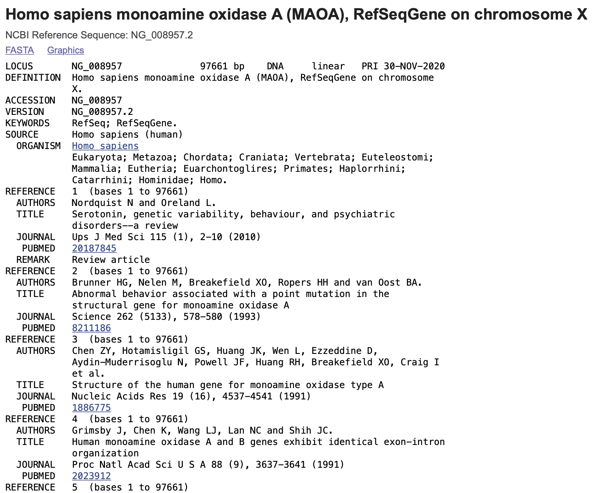
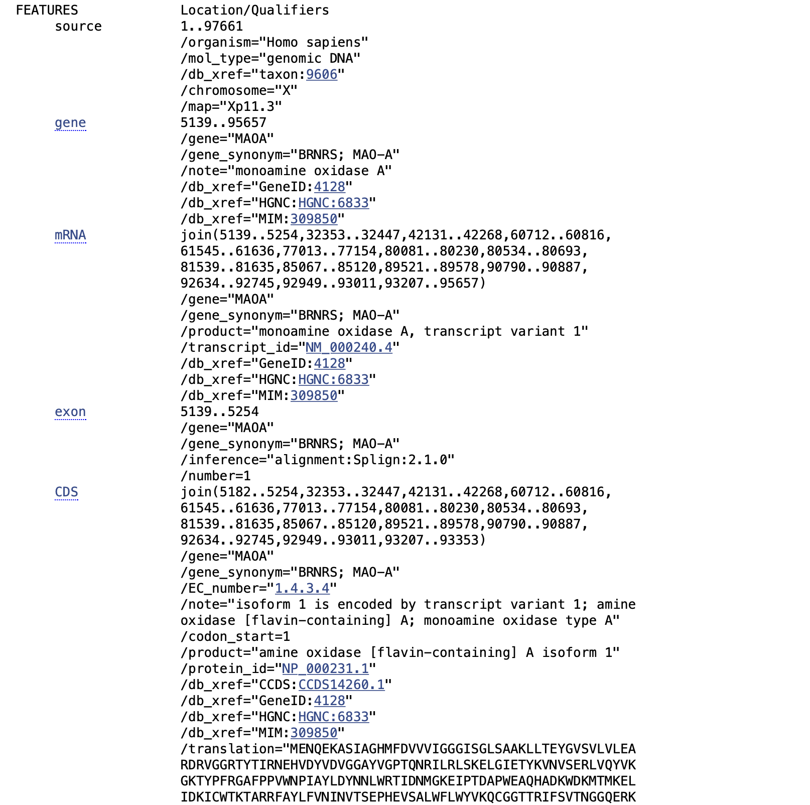
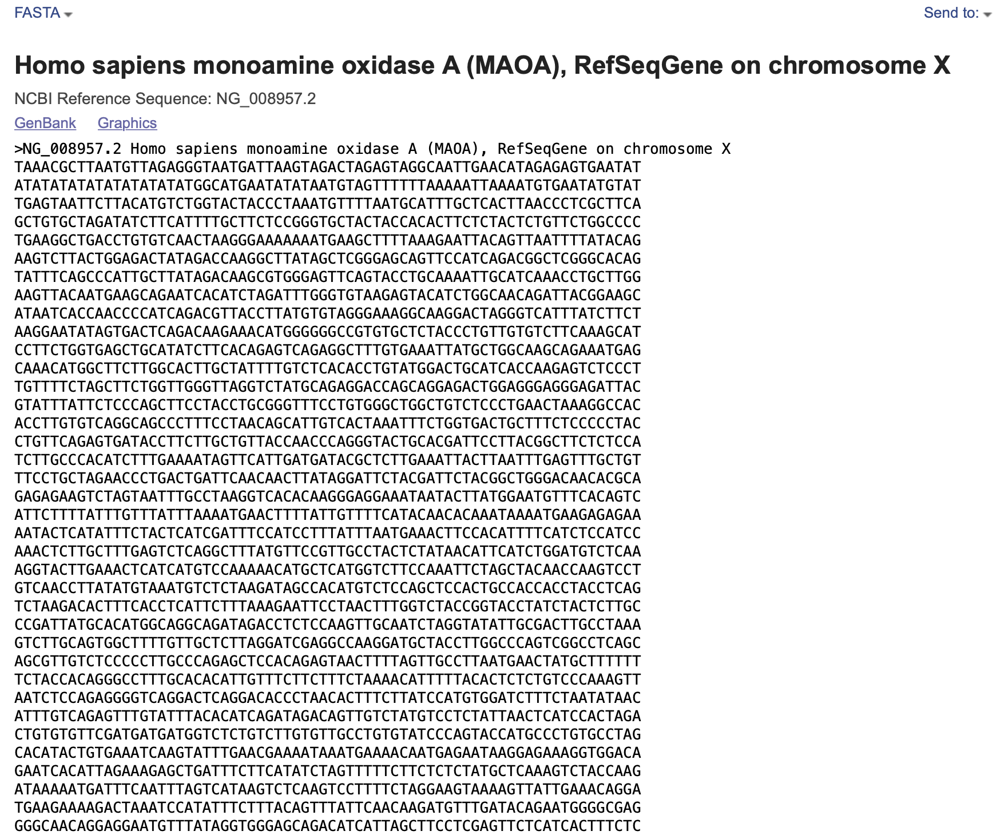

Genbank

------

### example

[视频资料](https://www.bilibili.com/video/BV1gR4y1p7Fk?from=search&seid=15401893481535071285&spm_id_from=333.337.0.0)

以[NG_008957](https://www.ncbi.nlm.nih.gov/nuccore/NG_008957)为例。



其中

-   LOCUS   NG_008957(位点名)   97661 bp(序列长度)  DNA(分子类型)    linear   PRI(物种分支) 30-NOV-2020(修改日期)
-   DEFINITION  Homo sapiens monoamine oxidase A (MAOA), RefSeqGene on chromosome X.(Title)
-   ACCESSION   NG_008957(检索号)
-   VERSION     NG_008957.2(版本号)
-   KEYWORDS    RefSeq; RefSeqGene.
-   SOURCE      Homo sapiens (human(序列来源)
    -   ORGANISM  Homo sapiens)(物种名称)
                    Eukaryota; Metazoa; Chordata; Craniata; Vertebrata; Euteleostomi;
                    Mammalia; Eutheria; Euarchontoglires; Primates; Haplorrhini;
                    Catarrhini; Hominidae; Homo.
-   REFERENCE   1  (bases 1 to 97661)(相关文献)
    -   AUTHORS   Nordquist N and Oreland L.
    -   TITLE     Serotonin, genetic variability, behaviour, and psychiatric disorders--a review
    -   JOURNAL   Ups J Med Sci 115 (1), 2-10 (2010)
    -   PUBMED   20187845
    -   REMARK    Review article

**物种分支organismal divisions**

| 缩写 | 全称                   |
| ---- | ---------------------- |
| PRI  | 灵长类序列             |
| ROD  | 啮齿类序列             |
| HAM  | 其他哺乳类序列         |
| VRT  | 其他脊椎动物序列       |
| INV  | 无脊椎动物序列         |
| PLN  | 植物、真菌、海藻类序列 |
| BCT  | 细菌序列               |
| VRL  | 病毒序列               |
| PHG  | 噬菌体序列             |
| ENV  | 环境微生物混合测序     |
| SYN  | 人工合成序列           |

**功能分支functional divisions**

| 缩写 | 全称                     |
| ---- | ------------------------ |
| EST  | 表达序列标签             |
| STS  | 序列标签位点             |
| GSS  | 基因组勘测序列           |
| HTG  | 高通量基因组序列         |
| HTC  | 高通量cDNA序列           |
| WGS  | 全基因组鸟枪法测序序列   |
| TSA  | 转录组鸟枪法测序拼接序列 |
| CON  | 重叠群                   |
| PAT  | 已申请专利的序列         |

往下。



-   FEATURES             Location/Qualifiers

    -   source（生物学来源及信息）
        -   1..97661
        -   /organism="Homo sapiens"
        -   /mol_type="genomic DNA"
        -   /db_xref="taxon:9606"
        -   /chromosome="X"
        -   /map="Xp11.3"
    -   gene
        -   5139..95657
        -   /gene="MAOA"
        -   /gene_synonym="BRNRS; MAO-A"
        -   /note="monoamine oxidase A"
        -   /db_xref="GeneID:4128"
        -   /db_xref="HGNC:HGNC:6833"
        -   /db_xref="MIM:309850"
    -   mRNA
        -   join(5139..5254,32353..32447,42131..42268,60712..60816,
            61545..61636,77013..77154,80081..80230,80534..80693,
            81539..81635,85067..85120,89521..89578,90790..90887,
            92634..92745,92949..93011,93207..95657)
        -   /gene="MAOA"
        -   /gene_synonym="BRNRS; MAO-A"
        -   /product="monoamine oxidase A, transcript variant 1"
        -   /transcript_id="NM_000240.4"
        -   /db_xref="GeneID:4128"
        -   /db_xref="HGNC:HGNC:6833"
        -   /db_xref="MIM:309850"
    -   exon（外显子）
        -   5139..5254
        -   /gene="MAOA"
        -   /gene_synonym="BRNRS; MAO-A"
        -   /inference="alignment:Splign:2.1.0"
        -   /number=1
    -   CDS（编码区）
        -   join(5182..5254,32353..32447,42131..42268,60712..60816,(编码区)
            61545..61636,77013..77154,80081..80230,80534..80693,
            81539..81635,85067..85120,89521..89578,90790..90887,
            92634..92745,92949..93011,93207..93353)
        -   /gene="MAOA"
        -   /gene_synonym="BRNRS; MAO-A"
        -   /EC_number="1.4.3.4"
        -   /note="isoform 1 is encoded by transcript variant 1; amine
            oxidase [flavin-containing] A; monoamine oxidase type A"
        -   /codon_start=1
        -   /product="amine oxidase [flavin-containing] A isoform 1"
        -   /protein_id="NP_000231.1"
        -   /db_xref="CCDS:CCDS14260.1"
        -   /db_xref="GeneID:4128"
        -   /db_xref="HGNC:HGNC:6833"
        -   /db_xref="MIM:309850"
        -   /translation
    -   ORIGIN（序列）
        -   1 taaacgctta atgttagagg gtaatgatta agtagactag agtaggcaat tgaacataga
        -   61 gagtgaatat atatatatat atatatatat ggcatgaata tataatgtag ttttttaaaa
        -   121 attaaaatgt gaatatgtat tgagtaattc ttacatgtct ggtactaccc taaatgtttt
        -   181 aatgcatttg ctcacttaac cctcgcttca gctgtgctag atatcttcat tttgcttctc
        -   241 cgggtgctac taccacactt ctctactctg ttctggcccc tgaaggctga cctgtgtcaa
        -   301 ctaagggaaa aaaatgaagc ttttaaagaa ttacagttaa ttttatacag aagtcttact
                  

------

[FASTA格式](https://www.ncbi.nlm.nih.gov/nuccore/NG_008957.2?report=fasta)

点击左上角的FASTA



```
>NG_008957.2 Homo sapiens monoamine oxidase A (MAOA), RefSeqGene on chromosome X
TAAACGCTTAATGTTAGAGGGTAATGATTAAGTAGACTAGAGTAGGCAATTGAACATAGAGAGTGAATAT
ATATATATATATATATATATGGCATGAATATATAATGTAGTTTTTTAAAAATTAAAATGTGAATATGTAT
TGAGTAATTCTTACATGTCTGGTACTACCCTAAATGTTTTAATGCATTTGCTCACTTAACCCTCGCTTCA
GCTGTGCTAGATATCTTCATTTTGCTTCTCCGGGTGCTACTACCACACTTCTCTACTCTGTTCTGGCCCC
TGAAGGCTGACCTGTGTCAACTAAGGGAAAAAAATGAAGCTTTTAAAGAATTACAGTTAATTTTATACAG
AAGTCTTACTGGAGACTATAGACCAAGGCTTATAGCTCGGGAGCAGTTCCATCAGACGGCTCGGGCACAG
TATTTCAGCCCATTGCTTATAGACAAGCGTGGGAGTTCAGTACCTGCAAAATTGCATCAAACCTGCTTGG
AAGTTACAATGAAGCAGAATCACATCTAGATTTGGGTGTAAGAGTACATCTGGCAACAGATTACGGAAGC
ATAATCACCAACCCCATCAGACGTTACCTTATGTGTAGGGAAAGGCAAGGACTAGGGTCATTTATCTTCT
```

第一行：>序列名称，注释信息

第二及以后：具体序列

