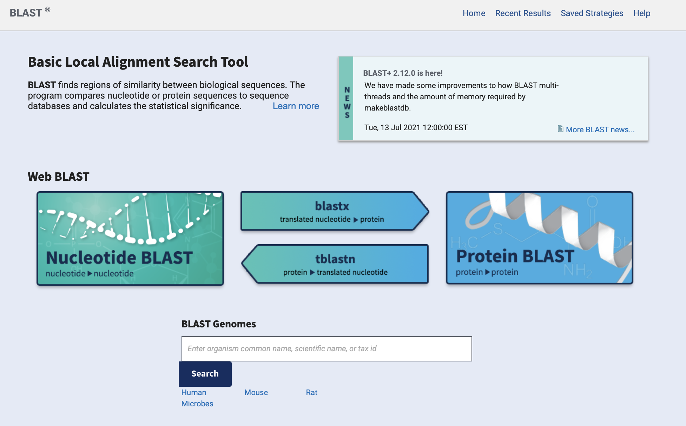
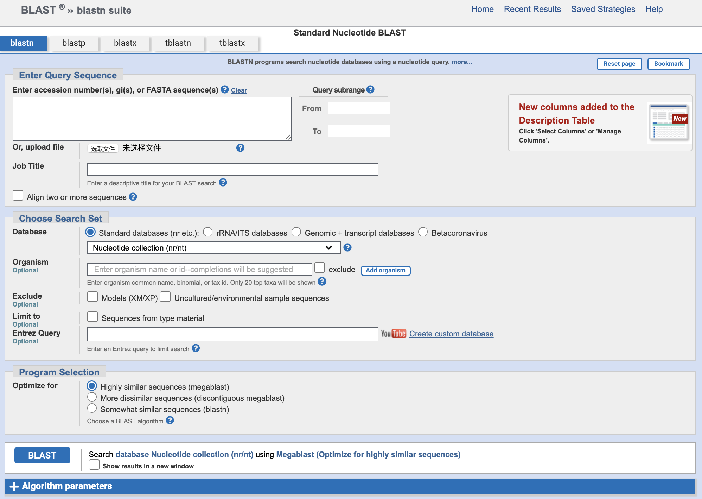
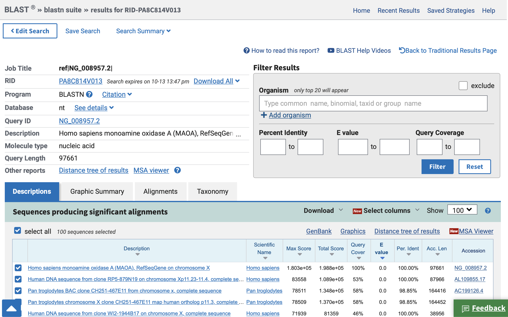
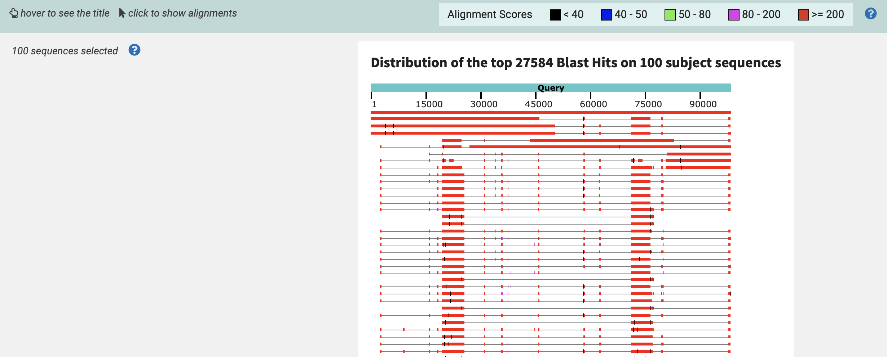
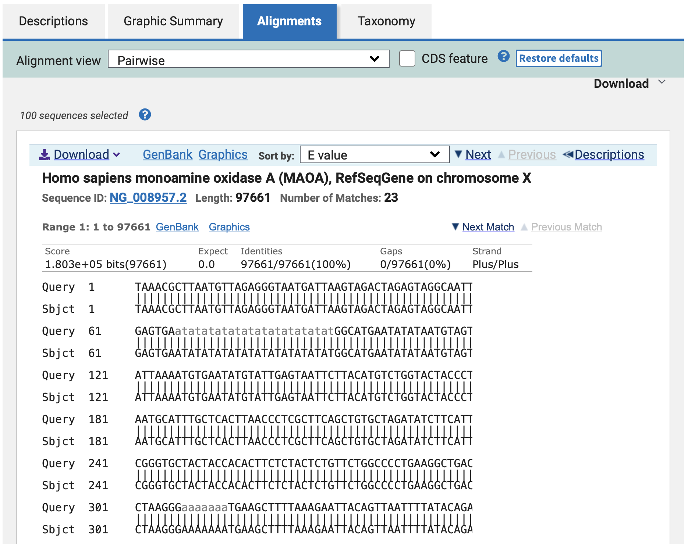
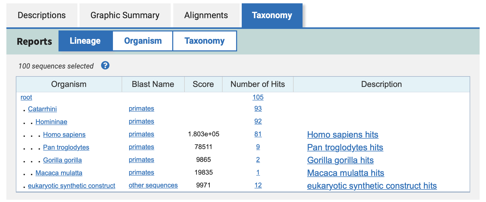
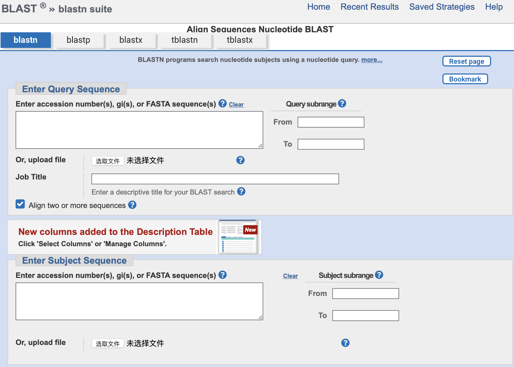

BLAST

[网站](https://blast.ncbi.nlm.nih.gov/Blast.cgi)

------

Nucleotide BLAST，blastn，核酸序列与核酸序列进行比对

Protein BLAST，blastp，蛋白质与蛋白质序列进行比对

blastx，将核酸序列按照六种不同的方式翻译成蛋白质序列后，在蛋白质序列数据库中进行比对

tblastn，将蛋白质序列转换成核酸序列后，在核酸序列数据库中进行比对

点击核酸序列比对。

------

## 单序列比对

输入NG_008957.2

在整个核酸数据库中搜索与他相似的序列，可以在

-   Database中选择数据库
-   Organism中选择物种，exclude除去某个物种
-   Program Selection，将使用的不同的比对方法
    -   Highly similar sequences，megablast，主要是用来在非常相似的序列之间（来自同一物种）比对同源性的。
    -   More dissimilar sequences, discontiguous megablast，更好地用于查找不同物种的相似的核酸序列。
    -   Somewhat similar sequences, blastn，比对的速度慢，但允许更短序列的比对

点击BLAST。

第一块，Description，展示所有比对的序列，显示得分

-   Description，描述
-   Scientific Name，学名
-   Max Score，匹配分值
-   Total Score，总体分值
-   Query Coverage，覆盖率
-   E value，E（Expect）值，表示随机匹配的可能性。E值越大，随机匹配的可能性也越大。 E值接近零或为零时，具本上就是完全匹配了。E值越小越好。
-   Per.Ident，percent identity，P值，匹配一致性，即匹配上的碱基数占总序列长的百分数。P值越大越好。
-   Acc.Len，accession length，序列长度
-   Accession，检索号，点击显示该检索号对应序列的全部信息。如果从Alignment的Genbank，可以自动筛选该序列和输入序列对应匹配的那一段的信息。

第二块，Graphic Summary，比对结果示意图

上方青色的Query是我们输入的序列，Alignment score，匹配程度>=200是红色

第三块，Alignments

-   Identities：匹配度
-   Gaps：空格数

点击GenBank，可以显示到该序列与输入序列对应的信息。

第四块，Taxonomy，分类。

显示在比对的结果中，大部分是什么属什么物种的。

------

## 多序列比对

在blastn中，勾选align two or more sequences

