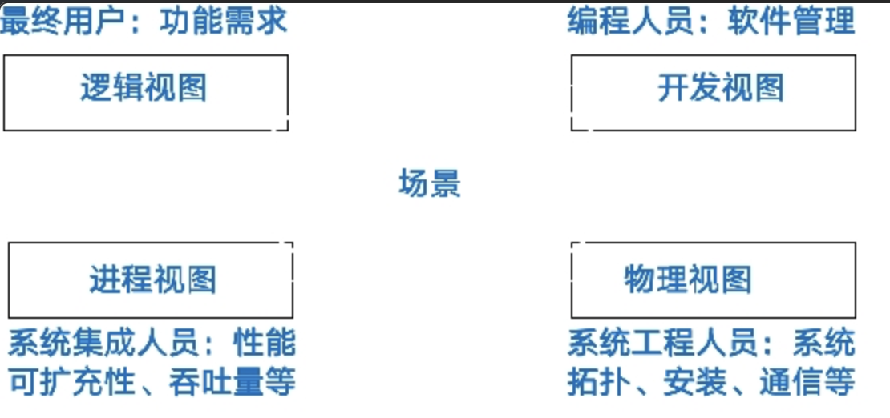

闭卷考试

题型：

填空15空30分

简答题3个15分

分析题5个55分前四个10分，后一个15分

## 内容：

-   [x] 软件构件、构建分类组织方法（有几种法，具体怎么做）
-   [x] 软件体系结构核心的几个要素
-   [x] 体系结构重用和代码重用的区别
-   [ ] 体系结构风格（哪些种，各自适用条件，各自特点），原理、特点、几部分组成，重点，cfs bfs 管道过滤器 正交风格过胶风格
-   [x] 中间件分为几种
-   [x] 体系结构描述语言（和需求语言描述区别、描述的什么空间）
-   [x] 构件的组织方法、获取方法几种
-   [x] 软件体系结构是什么，定义，怎么理解
-   [x] 4+1模型是什么样的，模型的原理、各部分的侧重点，比如逻辑视图关注什么，其他视图关注什么
-   [x] 服务构件（服务构件和传统构件的区别）

## 知识点

------

## 软件体系结构核心要素

构件、连接件、体系结构配置

------

## 软件体系结构

### 定义

软件体系结构为软件系统提供了一个**结构、行为和属性**的高级抽象，由**构成系统的元素的描述、这些元素的相互作用、指导元素集成的模式以及这些模式的约束**组成。

软件体系结构不仅指定了系统的组织结构和拓扑结构，并且显示了系统需求和构成系统的元素之间的对应关系，提供了一些设计决策的基本原理。

### 意义，理解？

1、**体系结构是风险承担者进行交流的手段**

-   软件体系结构代表了系统的公共的高层次的抽象。这样，系统的大部分有关人员能把它作为建立一个互相理解的基础，形成统一认识，互相交流。 
-   体系结构提供了一种共同语言来表达各种关注和协商，进而对大型复杂系统能进行理智的管理。这对项目最终的质量和使用有极大的影响。 

2、**体系结构是早期设计决策的体现** 

-     软件体系结构明确了对系统实现的约束条件
-     软件体系结构决定了开发和维护组织的组织结构
-     软件体系结构制约着系统的质量属性
-     通过研究软件体系结构可能预测软件的质量
-     软件体系结构使推理和控制更改更简单
-     软件体系结构有助于循序渐进的原型设计
-     软件体系结构可以作为培训的基础

3、**软件体系结构是可传递和可重用的模型**

-   软件体系结构级的重用意味着体系结构的决策能在具有相似需求的多个系统中发生影响，这比代码级的重用要有更大的好处。

------

## 构件

构件是指**语义完整、语法正确和有可重用价值的单位软件**，是软件重用过程中**可以明确辨识的系统**。结构上，它是**语义描述、通讯接口和实现代码的复合体**。

### 构件分类组织方法：

1.  **关键字分类法**

    适用于构件功能存粹或特征明显。适合一个构件只完成一个小功能。

2.  **刻面分类法**

    从不同的方面去描述构件，比如使用环境、应用领域、功能层次。

3.  **超文本组织方法**

    几个构件之间相互有逻辑上的连接关系，可以提高检索的效率。

### 构件获取

1.  从现有构件中获得符合要求的构件，直接使用或作适应性修改，得到可重用的构件。
2.  通过遗留工程，将具有潜在重用价值的构件提取出来，得到可重用的构件。
3.  从市场上购买现成的商业构件。
4.  开发新的符合要求的构件。

------

### 4+1模型

4+1视图模型从5个不同的视角包括**逻辑视图、进程视图、物理视图、开发视图和场景视图**来描述软件体系结构。每一个视图只关心系统的一个侧面，5个视图结合在一起才能反映系统的软件体系结构的全部内容。

**逻辑视图**主要支持系统的功能需求，即系统提供给最终用户的服务。在逻辑视图中，系统分解成一系列的功能抽象，这些抽象主要来自问题领域。这种分解不但可以用来进行功能分析，而且可用作标识在整个系统的各个不同部分的通用机制和设计元素。

在面向对象技术中，通过抽象、封装和继承，可以用对象模型来代表逻辑视图，用类图来描述逻辑视图。

**开发视图**主要侧重于软件模块的组织和管理。开发视图要考虑软件内部的需求，如软件开发的容易性、软件的重用和软件的通用性，要充分考虑由于具体开发工具的不同而带来的局限性。

开发视图通过系统输入输出关系的模型图和子系统图来描述。

在开发视图中，最好采用4-6层子系统，而且每个子系统仅仅能与同层或更低层的子系统通讯，这样可以使每个层次的接口既完备又精练，避免了各个模块之间很复杂的依赖关系。

设计时要充分考虑，对于各个层次，层次越低，通用性越强，这样，可以保证应用程序的需求发生改变时，所做的改动最小。开发视图所用的风格通常是层次结构风格。 

**进程视图**侧重于系统的运行特性，主要关注一些非功能性的需求。

进程视图强调并发性、分布性、系统集成性和容错能力，以及从逻辑视图中的主要抽象如何适合进程结构。它也定义逻辑视图中的各个类的操作具体是在哪一个线程中被执行的。

进程视图可以描述成多层抽象，每个级别分别关注不同的方面。在最高层抽象中，进程结构可以看作是构成一个执行单元的一组任务。它可看成一系列独立的，通过逻辑网络相互通信的程序。它们是分布的，通过总线或局域网、广域网等硬件资源连接起来。

**物理视图**主要考虑如何把软件映射到硬件上，它通常要考虑到系统性能、规模、可靠性等。解决系统拓扑结构、系统安装、通讯等问题。

当软件运行于不同的节点上时，各视图中的构件都直接或间接地对应于系统的不同节点上。因此，从软件到节点的映射要有较高的灵活性，当环境改变时，对系统其他视图的影响最小。

**场景视图**可以看作是那些重要系统活动的抽象，它使四个视图有机联系起来，从某种意义上说场景是最重要的需求抽象。在开发体系结构时，它可以帮助设计者找到体系结构的构件和它们之间的作用关系。同时，也可以用场景来分析一个特定的视图，或描述不同视图构件间是如何相互作用的。

逻辑视图和开发视图描述系统的静态结构，而进程视图和物理视图描述系统的动态结构。

对于不同的软件系统来说，侧重的角度也有所不同。例如，对于管理信息系统来说，比较侧重于从逻辑视图和开发视图来描述系统，而对于实时控制系统来说，则比较注重于从进程视图和物理视图来描述系统。 

------

## 体系结构重用和代码重用的区别

体系结构重用属于设计重用，比代码重用更抽象。由于软件体系结构是系统的高层抽象，反映了系统的主要组成元素及其交互关系，因而较算法更稳定，更适合于重用。软件重用是指软件在环境和功能发生变化后，可通过局部修改和重组，保持整体稳定性，以适应新要求。

------

## 体系结构描述语言和需求语言描述区别、描述的什么空间

ADL与需求语言的区别

ADL：解空间    需求语言：问题空间

ADL与建模语言的区别

ADL集中在构件的表示上；建模语言对整体行为的关注大于对部分的关注。

ADL与传统程序设计语言的区别

二者构成元素既有许多相同相似之处，又各有不同

------

## 服务构件（服务构件和传统构件的区别）

-   服务构件往往是粗粒度的，而传统构件以细粒度居多；
-   服务构件的接口是标准的，主要是服务描述语言接口，而传统构件常以具体API形式出现；
-   服务构件的实现与语言是无关的，而传统构件常绑定某种特定的语言；
-   服务构件可以通过构件容器提供QoS（ Quality of Service，服务质量）的服务，而传统构件完全由程序代码直接控制。

------

## 中间件分为几种

1.  数据库访问中间件。数据库访问中间件通过一个抽象层访问数据库，从而允许使用相同或相似的代码访问不同的数据库资源。
2.  远程过程调用。是一种广泛使用的分布式应用程序处理方法。一个应用程序使用RPC来“远程”执行一个位于不同地址空间内的过程，从效果上看和执行本地调用相同。 
3.  面向消息中间件。利用高效可靠的消息传递机制进行平台无关的数据交流，并可基于数据通信进行分布系统的集成。 
4.  分布式对象中间件。随着对象技术与分布式计算技术的发展，两者相互结合形成了分布式对象技术，并发展成为当今软件技术的主流方向。 
5.  事务中间件。最早出现在大型机上，为其提供支持大规模事务处理的可靠运行环境。随事务处理监控程序位于客户和服务器之问，完成事务管理与协调、负载平衡、失效恢复等任务，并提高系统的整体性能。

------

## 管道与过滤器

### 概述

每个构件都有一组输入和输出，构件读输入的数据流，经过内部处理，然后产生输出数据流。这个过程通常通过对输入流的变换及增量计算来完成，所以在输入被完全消费之前，输出便产生了。这里的构件被称为过滤器，这种风格的连接件就像是数据流传输的管道，将一个过滤器的输出传到另一过滤器的输入。

### 优点

1.  使得软件具有良好的隐蔽性和高内聚、低耦合的特点；
2.  允许设计者将整个系统的输入/输出行为看成是多个过滤器的行为的简单合成；
3.  支持软件重用。只要提供适合在两个过滤器之间传送的数据，任何两个过滤器都可被连接起来；
4.  系统维护和增强系统性能简单。新的过滤器可以添加到现有系统中来；旧的可以被改进的过滤器替换掉；
5.  允许对一些如吞吐量、死锁等属性的分析；
6.  支持并行执行。每个过滤器是作为一个单独的任务完成，因此可与其它任务并行执行。

### 缺点

1.  通常导致进程成为批处理的结构。这是因为虽然过滤器可增量式地处理数据，但它们是独立的，所以设计者必须将每个过滤器看成一个完整的从输入到输出的转换；
2.  不适合处理交互的应用。当需要增量地显示改变时，这个问题尤为严重；
3.  因为在数据传输上没有通用的标准，每个过滤器都增加了解析和合成数据的工作，这样就导致了系统性能下降，并增加了编写过滤器的复杂性。

## 数据抽象和面向对象组织

这种风格建立在数据抽象和面向对象的基础上，数据的表示方法和它们的相应操作封装在一个抽象数据类型或对象中。

这种风格的构件是对象，或者说是抽象数据类型的实例。对象是一种被称作管理者的构件，因为它负责保持资源的完整性。对象是通过函数和过程的调用来交互的。

### 优点

1.  因为对象对其它对象隐藏它的表示，所以可以改变一个对象的表示，而不影响其它的对象；
2.  设计者可将一些数据存取操作的问题分解成一些交互的代理程序的集合。

### 缺点

1.  为了使一个对象和另一个对象通过过程调用等进行交互，必须知道对象的标识。只要一个对象的标识改变了，就必须修改所有其他明确调用它的对象；
2.  必须修改所有显式调用它的其它对象，并消除由此带来的一些副作用。例如，如果A使用了对象B，C也使用了对象B，那么，C对B的使用所造成的对A的影响可能是料想不到的。

## 基于事件的隐式调用

构件不直接调用一个过程，而是触发或广播一个或多个事件。系统中的其它构件中的过程在一个或多个事件中注册，当一个事件被触发，系统自动调用在这个事件中注册的所有过程，这样，一个事件的触发就导致了另一模块中的过程的调用。

这种风格的构件是一些模块，模块既可以是一些过程，又可以是一些事件的集合。过程可以用通用的方式调用，也可以在系统事件中注册一些过程，当发生这些事件时，过程被调用。

这种风格的主要特点是事件的触发者并不知道哪些构件会被这些事件影响。这样不能假定构件的处理顺序，甚至不知道哪些过程会被调用，因此，许多隐式调用的系统也包含显式调用作为构件交互的补充形式。

### 优点

1.  为软件重用提供了强大的支持。当需要将一个构件加入现存系统中时，只需将它注册到系统的事件中。
2.  为改进系统带来了方便。当用一个构件代替另一个构件时，不会影响到其它构件的接口。

### 缺点

1.  构件放弃了对系统计算的控制。一个构件触发一个事件时，不能确定其它构件是否会响应它。而且即使它知道事件注册了哪些构件的构成，它也不能保证这些过程被 调用的顺序。
2.  数据交换的问题。有时数据可被一个事件传递，但另一些情况下，基于事件的系统必须依靠一个共享的仓库进行交互。在这些情况下，全局性能和资源管理便成了问题。
3.  既然过程的语义必须依赖于被触发事件的上下文约束，关于正确性的推理存在问题。

## 分层系统

层次系统组织成一个层次结构，每一层为上层服务，并作为下层客户。连接件通过决定层间如何交互的协议来定义，拓扑约束包括对相邻层间交互的约束。

这种风格支持基于可增加抽象层的设计。允许将一个复杂问题分解成一个增量步骤序列的实现。

由于每一层最多只影响两层，同时只要给相邻层提供相同的接口，允许每层用不同的方法实现，同样为软件重用提供了强大的支持。 

### 优点

1.  支持基于抽象程度递增的系统设计，使设计者可以把一个复杂系统按递增的步骤进行分解；
2.  支持功能增强，因为每一层至多和相邻的上下层交互，因此功能的改变最多影响相邻的上下层；
3.  支持重用。只要提供的服务接口定义不变，同一层的不同实现可以交换使用。这样，就可以定义一组标准的接口，而允许各种不同的实现方法。

### 缺点

1.  并不是每个系统都可以很容易地划分为分层的模式，甚至即使一个系统的逻辑结构是层次化的，出于对系统性能的考虑，系统设计师不得不把一些低级或高级的功能综合起来；
2.  很难找到一个合适的、正确的层次抽象方法。

## 仓库系统

在仓库风格中，有两种不同的构件：中央数据结构说明当前状态，独立构件在中央数据存贮上执行，仓库与外构件间的相互作用在系统中会有大的变化。

控制原则的选取产生两个主要的子类。若输入流中某类事件触发进程执行的选择，则仓库是一传统型数据库；另一方面，若中央数据结构的当前状态触发进程执行的选择，则仓库是一黑板系统。

## C2风格

-   系统中的构件和连接件都有一个顶部和一个底部；
-   构件的顶部应连接到某连接件的底部，构件的底部则应连接到某连接件的顶部，而构件与构件之间的直接连接是不允许的；
-   一个连接件可以和任意数目的其它构件和连接件连接；
-   当两个连接件进行直接连接时，必须由其中一个的底部到另一个的顶部。

### 特点

1.  系统中的构件可实现应用需求，并能将任意复杂度的功能封装在一起；
2.  所有构件之间的通讯是通过以连接件为中介的异步消息交换机制来实现的；
3.  构件相对独立，构件之间依赖性较少。系统中不存在某些构件将在同一地址空间内执行，或某些构件共享特定控制线程之类的相关性假设。

## C/S

C/S软件体系结构是基于资源不对等，且为实现共享而提出来的，是20世纪90年代成熟起来的技术，C/S体系结构定义了工作站如何与服务器相连，以实现数据和应用分布到多个处理机上。 

C/S体系结构有三个主要组成部分：数据库服务器、客户应用程序和网络。

### 优点

1.  C/S 体系结构具有强大的数据操作和事务处理能力，模型思想简单，易于人们理解和接受。
2.  系统的客户应用程序和服务器构件分别运行在不同的计算机上，系统中每台服务器都可以适合各构件的要求，这对于硬件和软件的变化显示出极大的适应性和灵活性，而且易于对系统进行扩充和缩小。
3.  在C/S体系结构中，系统中的功能构件充分隔离，客户应用程序的开发集中于数据的显示和分析，而数据库服务器的开发则集中于数据的管理，不必在每一个新的应用程序中都要对一个DBMS进行编码。将大的应用处理任务分布到许多通过网络连接的低成本计算机上，以节约大量费用。 

### 缺点

1.  开发成本较高
2.  客户端程序设计复杂
3.  信息内容和形式单一
4.  用户界面风格不一，使用繁杂，不利于推广使用
5.  软件移植困难
6.  软件维护和升级困难
7.  新技术不能轻易应用

## 三层C/S

### 优点

1.  允许合理地划分三层结构的功能，使之在逻辑上保持相对独立性，能提高系统和软件的可维护性和可扩展性。
2.  允许更灵活有效地选用相应的平台和硬件系统，使之在处理负荷能力上与处理特性上分别适应于结构清晰的三层；并且这些平台和各个组成部分可以具有良好的可升级性和开放性。
3.  应用的各层可以并行开发，可以选择各自最适合的开发语言。
4.  利用功能层有效地隔离开表示层与数据层，未授权的用户难以绕过功能层而利用数据库工具或黑客手段去非法地访问数据层，为严格的安全管理奠定了坚实的基础。

### 注意问题

1.  三层C/S结构各层间的通信效率若不高，即使分配给各层的硬件能力很强，其作为整体来说也达不到所要求的性能。
2.  设计时必须慎重考虑三层间的通信方法、通信频度及数据量。这和提高各层的独立性一样是三层C/S结构的关键问题。

## 三层B/S

浏览器/服务器（B/S）风格就是上述三层应用结构的一种实现方式，其具体结构为：浏览器/Web服务器/数据库服务器。

B/S体系结构主要是利用不断成熟的WWW浏览器技术，结合浏览器的多种脚本语言，用通用浏览器就实现了原来需要复杂的专用软件才能实现的强大功能，并节约了开发成本。从某种程度上来说，B/S结构是一种全新的软件体系结构。

### 优点

1.  基于B/S体系结构的软件，系统安装、修改和维护全在服务器端解决。用户在使用系统时，仅仅需要一个浏览器就可运行全部的模块，真正达到了“零客户端”的功能，很容易在运行时自动升级。
2.  B/S体系结构还提供了异种机、异种网、异种应用服务的联机、联网、统一服务的最现实的开放性基础。

### 缺点

1.  B/S体系结构缺乏对动态页面的支持能力，没有集成有效的数据库处理功能。
2.  B/S体系结构的系统扩展能力差，安全性难以控制。
3.  采用B/S体系结构的应用系统，在数据查询等响应速度上，要远远地低于C/S体系结构。
4.  B/S体系结构的数据提交一般以页面为单位，数据的动态交互性不强，不利于在线事务处理(OLTP)应用。

## CORBA

### 接口定义语言

-   CORBA利用IDL统一地描述服务器对象（向调用者提供服务的对象）的接口。IDL本身也是面向对象的。它虽然不是编程语言，但它为客户对象（发出服务请求的对象）提供了语言的独立性，因为客户对象只需了解服务器对象的IDL接口，不必知道其编程语言。
-   IDL语言是CORBA规范中定义的一种中性语言，它用来描述对象的接口，而不涉及对象的具体实现。
-   CORBA中定义了IDL语言到C、C++、SmallTalk和Java语言的映射。

### 接口池

CORBA的接口池包括了分布计算环境中所有可用的服务器对象的接口表示。它使动态搜索可用服务器的接口、动态构造请求及参数成为可能。

### 动态调用接口

CORBA的动态调用接口提供了一些标准函数以供客户对象动态创建请求、动态构造请求参数。客户对象将动态调用接口与接口池配合使用可实现服务器对象接口的动态搜索、请求及参数的动态构造与动态发送。当然，只要客户对象在编译之前能够确定服务器对象的IDL接口，CORBA也允许客户对象使用静态调用机制。显然，静态机制的灵活性虽不及动态机制，但执行效率却胜过动态机制。 

### 对象适配器

在CORBA中，对象适配器用于屏蔽ORB内核的实现细节，为服务器对象的实现者提供抽象接口，以便他们使用ORB内部的某些功能。这些功能包括服务器对象的登录与激活、客户请求的认证等。 

### 特点

1.  引入中间件作为事务代理，完成客户机向服务对象方提出的业务请求。
2.  实现客户与服务对象的完全分开，客户不需要了解服务对象的实现过程以及具体位置。
3.  提供软总线机制，使得在任何环境下、采用任何语言开发的软件只要符合接口规范的定义，均能够集成到分布式系统中。
4.  CORBA规范软件系统采用面向对象的软件实现方法开发应用系统，实现对象内部细节的完整封装，保留对象方法的对外接口定义。 

## 正交软件体系结构

正交软件体系结构由组织层和线索的构件构成。层是由一组具有相同抽象级别的构件构成。线索是子系统的特例，它是由完成不同层次功能的构件组成（通过相互调用来关联），每一条线索完成整个系统中相对独立的一部分功能。每一条线索的实现与其他线索的实现无关或关联很少，在同一层中的构件之间是不存在相互调用的。

如果线索是相互独立的，即不同线索中的构件之间没有相互调用，那么这个结构就是完全正交的。 

### 特点

1.  正交软件体系结构由完成不同功能的n（n > 1）个线索（子系统）组成；
2.  系统具有m（m > 1）个不同抽象级别的层；
3.  线索之间是相互独立的（正交的）；
4.  系统有一个公共驱动层（一般为最高层）和公共数据结构（一般为最低层）。 

### 优点

1.  结构清晰，易于理解
2.  易修改，可维护性强
3.  可移植性强，重用粒度大

## 异构风格

-   不同的结构有不同的处理能力的强项和弱点，一个系统的体系结构应该根据实际需要进行选择，以解决实际问题。
-   关于软件包、框架、通信以及其他一些体系结构上的问题，目前存在多种标准。即使在某段时间内某一种标准占统治地位，但变动最终是绝对的。
-   实际工作中，我们总会遇到一些遗留下来的代码，它们仍有效用，但是却与新系统有某种程度上的不协调。然而在许多场合，将技术与经济综合进行考虑时，总是决定不再重写它们。
-   即使在某一单位中，规定了共享共同的软件包或相互关系的一些标准，仍会存在解释或表示习惯上的不同。
