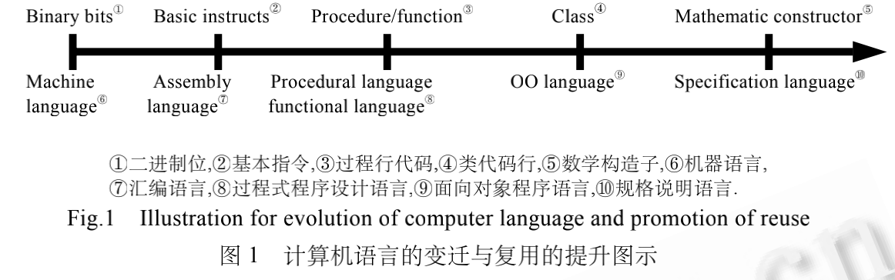

## 软件体系结构研究综述-2002-孙昌爱,金茂忠,刘超

### 摘要

近年来,软件体系结构逐渐成为软件工程领域的研究热点以及大型软件系统与软件产品线开发中的关键技术之一.归纳了**软件体系结构技术发展过程**及其**主要研究方向**.在分析了典型的软件体系结构概念之后,给出了软件体系结构的定义.通过总结软件体系结构领域的若干研究活动,提出了软件体系结构研究的两大思路,并从7个方面介绍了软件体系结构研究进展.探讨了软件体系结构研究中的不足之处,并分析其原因.作为总结,给出了软件体系结构领域最有前途的发展趋势

### 软件体系结构起源与发展

NATO于1968年提出软件工程概念以来,软件工程界已经提出了一系列的理论、方法、语言和工具,解决了软件开发过程中的若干问题.但是,软件固有的复杂性、易变性和不可见性,使得软件开发周期长、代价高和质量低的问题依然存在.

大量实践统计表明:大系统软件开发中70％的错误是由需求和软件设计阶段引入的;而且错误在系统中存在的时间愈长则愈难发现,解决这些错误的代价也愈高.

为了提高软件需求和软件设计的质量,软件工程界提出了需求分析工程技术和各种软件建模技术.

但是在需求与设计之间仍存在一条很难逾越的鸿沟,即缺乏能够反映做决策的中间过程,从而很难有效地将需求转换为相应的设计.

为此,软件体系结构概念应运而生,并试图在软件需求与软件设计之间架起一座桥梁,着重解决**软件系统的结构和需求向实现平坦地过渡的问题**.从机器语言、汇编语言、过程式程序设计语言、面向对象程序设计语言、形式化(半形式化)规格说明语言(如体系结构描述语言)发展过程中,可以发现:计算机语言越来越适合于开发人员的思维活动模型,代码复用的级别也在不断地提升,如图1所示.**体系结构技术的研究,使软件复用从代码复用**发展到**设计复用和过程复用**.鉴于软件体系结构的重要性,D.E.Perry将软件体系结构视为软件开发中第1类重要的设计对象，而BarryBoehm明确指出:“**在没有设计出体系结构及其规则时,那么整个项目不能继续下去,而且体系结构应该看做是软件开发中可交付的中间产品**”.由此可见,**体系结构在软件开发中为不同的人员提供了共同交流的语言,体现并尝试了系统早期的设计决策,并作为系统设计的抽象,为实现框架和构件的共享与复用、基于体系结构的软件开发提供了有力的支持.**

### 软件体系结构的发展史

软件系统的规模在迅速增大的同时,软件开发方法也经历了一系列的变革.在此过程中,软件体系结构也由最初模糊的概念发展到一个渐趋成熟的技术.

-   20世纪70年代以前,软件开发基本上都是汇编程序设计.此阶段系统规模较小,很少明确考虑系统结构,一般不存在系统建模工作.
-   70年代中后期,由于结构化开发方法的出现与广泛应用,软件开发中出现了概要设计与详细设计,而且主要任务是数据流设计与控制流设计.因此,此时软件结构已作为一个明确的概念出现在系统的开发中.
-   20世纪80年代初到90年代中期,是面向对象开发方法兴起与成熟阶段.由于对象是数据与基于数据之上操作的封装,因而在面向对象开发方法下,数据流设计与控制流设计则统一为对象建模,同时,面向对象方法还提出了一些其他的结构视图.如在OMT方法中提出了功能视图、对象视图与动态视图(包括状态图和事件追踪图);而BOOCH方法中则提出了类视图、对象视图、状态迁移图、交互作用图、模块图、进程图;而1997年出现的统一建模语言UML则从功能模型(用例视图)、静态模型(包括类图、对象图、构件图、包图)、动态模型(协作图、顺序图、状态图和活动图)、配置模型(配置图)描述应用系统的结构.
-   90年代以后则是基于构件的软件开发阶段,该阶段以过程为中心,强调软件开发采用构件化技术和体系结构技术,要求开发出的软件具备很强的自适应性、互操作性、可扩展性和可重用性.此阶段中,软件体系结构已经作为一个明确的文档和中间产品存在于软件开发过程中,同时,软件体系结构作为一门学科逐渐得到人们的重视,并成为软件工程领域的研究热点,因而Perry和Wolf认为,“未来的年代将是研究软件体系结构的时代!”[3].

纵观软件体系结构技术发展过程,从最初的“无结构”设计到现行的基于体系结构软件开发,可以认为经历了4个阶段:

1.  “无体系结构”设计阶段:以汇编语言进行小规模应用程序开发为特征
2.  萌芽阶段:出现了程序结构设计主题,以控制流图和数据流图构成软件结构为特征
3.  初期阶段:出现了从不同侧面描述系统的结构模型,以UML为典型代表
4.  高级阶段:以描述系统的高层抽象结构为中心,不关心具体的建模细节,划分了体系结构模型与传统的软件结构的界限,该阶段以Kruchten提出的“4+1”模型为标志.

由于概念尚不统一、描述规范也不能达成一致认识、在软件开发实践中软件体系结构尚不能发挥重要作用,因此,我们认为软件体系结构技术达到成熟还需一段时日.

### 体系结构的主要研究方向

在基于构件和体系结构的软件开发方法下,程序开发模式也相应地发生了根本变化.软件开发不再是“算法+数据结构”,而是“构件开发+基于体系结构的构件组装”.

那么,**如何描述、表示、设计体系结构**?**如何验证一个体系结构是否符合期望的系统需求**?**如何基于体系结构开发实例化的软件系统**?将是基于构件和体系结构的软件开发方法所必须研究和解决的核心问题.

归纳现有体系结构的研究活动,主要包括如下几个方面:

1.  **体系结构理论模型**的研究;
2.  **体系结构描述**研究,主要研究体系结构描述语言及其支持环境、体系结构描述规范;
3.  **体系结构设计**研究:包括体系结构设计方法、体系结构风格、体系结构设计空间等内容;
4.  **体系结构分析与验证**:研究如何将软件的非功能特性转化为体系结构的需求,如何分析体系结构满足期望的需求的属性,对体系结构的语法、语义、类型失配等进行检查与验证的研究;
5.  **体系结构演化与复用**研究:研究产品线中软件体系结构演进的理论与方法,从已有文档、系统设计和代码中逆向提取软件体系结构、体系结构复用等;
6.  **动态体系结构**研究:研究软件系统由于特殊需要必须在连续运营情况下的体系结构变化与支撑平台;
7.  **基于体系结构的软件开发**:研究引入体系结构后的软件开发过程、基于体系结构开发与中间技术集成、基于体系结构的程序框架自动生成技术等.

### 软件体系结构的研究现状

### 软件体系结构的有关定义

若干软件体系结构学者提出了自己的概念与定义,我们将介绍几个具有代表性的定义,并分析其共同点.然后,根据我们对软件体系结构的理解,给出能够反映软件体系结构基本特征的定义. 

1.  定义 1. Garlan & Shaw 模型[7]: 
    SA={components, connectors, constrains}. 
    构件(component)可以是一组代码,如程序的模块;也可以是一个独立的程序,如数据库的 SQL 服务器.连接器(connector)表示构件之间的相互作用.它可以是过程调用、管道、远程过程调用等.一个软件体系结构还包括某些限制(constrain).该模型视角是程序设计语言,构件主要是代码模块. 
2.  定义 2. Perry & Wolf 模型[1]: 
    SA={elements, form, rational}. 
    软件体系结构是由一组元素(elements)构成.这组元素分成 3 类:处理元素(processing elements)、数据元素(data elements)和连接元素(connecting elements).软件体系结构形式(form)是由专有特性(properties)和关系 (relationship)组成.专有特性用于限制软件体系结构元素的选择,关系用于限制软件体系结构元素组合的拓扑结 构.而在多个体系结构方案中选择合适的体系结构方案往往基于一组准则(rational). 
3.  定义 3. CFRP 模型[8]: 
    SA={elements, interfaces, connections, connection semantics}. 
    软件系统由一组元素构成(elements).这组元素分成处理元素和数据元素.每个元素有一个接口(interface),一组元素的互连(connection)构成系统的拓扑.元素互连的语义是:静态互连语义(如数据元素的互连),描述动态连接的信息转换的协议(如过程调用,管道等). 
4.  定义 4. Vestal 模型[9]: 
    SA={component, idioms/styles, common patterns of interaction}. 
    软件由构件(component)组成,构件之间通过通用的互操作模式相连.体系结构风格(style)描述了一种通用的设计模式,可满足特定系列的应用需求. 
5.  定义 5. IEEE 610.12-1990 软件工程标准词汇中的定义[10]: 
    Architecture={component, connector, environment, principle}. 
    体系结构是以构件、构件之间的关系、构件与环境之间的关系为内容的某一系统的基本组织结构,以及指导上述内容设计与演化的原理. 
6.  定义 6. Boehm 模型[11]: 
    SA={components, connections, constraints, stakeholders’ needs, rationale}. 
    软件体系结构包含系统构件、连接件、约束的集合;反应不同人员需求的集合;以及能够展示由构件、连接件和约束所定义的系统在实现时如何满足系统不同人员需求的原理的集合. 

比较上述各种体系结构的定义可以发现:

-   定义 1和定义 3 都强调了体系结构是由构件、连接件及其约束(或连接语义),即从构造的角度来审视软件体系结构.
-   定义 2 和定义 4 侧重于从体系结构风格、模式和规则等角度来考虑软件体系结构,采用的是一种俯瞰的视角.
-   定义 5 不仅强调了体系结构系统的基本构成,同时还强调了体系结构的环境即与外界的交互.
-   定义 6 则强调了软件体系结构是一组概念以及关于软件系统结构的设计决策,用来使待开发的系统在体系结构上满足重要的功能与质量需求.

尽管各种定义都从不同的角度关注软件体系结构,但其核心内容都是软件系统的结构,并且都涵盖了如下一些实体:**构件、构件之间的交互关系、限制、构件和连接件构成的拓扑结构、设计原则与指导方针**.

根据我们对软件体系结构的理解,将软件体系结构定义为**“在软件密集的大规模系统或具有类似需求和结构的软件产品线的开发中,必须从一个较高的层次来考虑组成系统的构件、构件之间的交互,以及由构件与构件交互形成的拓扑结构,这些要素应该满足一定的限制,遵循一定的设计规则,能够在一定的环境下进行演化.而且,软件体系结构应能反映系统开发中具有重要影响的设计决策,便于各种人员的交流,反映多种关注,据此开发的系统能完成系统既定的功能和性能需求.”**

### 软件体系结构研究的不同思路

实践表明:一个好的体系结构是系统开发成功的重要因素.但由于对软件体系结构的不同见解,不仅导致了上节讨论的软件体系结构的概念分歧,也使得研究内容和研究途径呈现很大的差异. 归纳起来,目前体系结构研究可以分为典型的两种派别:学院派与实用派.

-   学院派研究者侧重于软件体系结构形式化理论研究.
-   实用派研究者将软件体系结构设计、描述与表示同传统的软件系统建模视为一体.

因此,将软件建模技术直接用来描述软件体系结构.典型的思路是:将 UML 可视化建模技术直接用来表示软件体系结构.两种体系结构研究思路的比较见表 1.

| 学院派研究思路               | 实用派研究思路                   |
| ---------------------------- | -------------------------------- |
| 关注体系结构模型的解析与评估 | 关注广泛范围内的开发问题         |
| 单个模型                     | 多个模型集                       |
| 严格的建模符号               | 强调的是实践可行性而非精确性     |
| 强有力的分析技术             | 将体系结构看成是开发中的一幅蓝本 |
| 专门目标的解决方案           | 通用目的的解决方案               |
| 与实现无关                   | 考虑实现.                        |

### 软件体系结构研究的主要内容与进展

目前,软件体系结构研究活动主要集中在如下几个领域: 

**(1) 软件体系结构描述语言 ADL** 

提出了若干适用于特定领域的ADL.典型的有:

-   C2是一种基于构件和消息的ADL,适用于大型频繁交互的层次型图形用户界面的软件的体系结构描述;Darwin和Wright分别将π演算和CSP作为其数学基础,适用于分布、并发类型的体系结构描述;
-   ACME是一种体系结构互换语言,支持从一种ADL向另一种ADL规格说明转换.
-   其他比较有影响的ADL,如Aesop,Unicon,Rapide,SADL,MetaH,Weaves等.

在体系结构描述语言研究方面,国内的一些学者则相应地提出了几种比较有特色的体系结构描述语言,

-   如基于框架和角色模型的软件体系结构规约FRADL,
-   多智能体系统体系结构描述语言A-ADL,
-   可视化体系结构描述语言XYX/ADL,
-   基于主动连接件的体系结构描述语言Tracer等.

Shaw和Garlan则倡导将连接件作为ADL中第一类实体,同时还提出一个好的ADL的框架应具备如下几个方面的特点,即组装性、抽象性、重用性、可配置、异构性、可分析.

在此基础上,Medvidovic提出了一种ADL的分类和比较框架,详细分析了多种典型的ADL的优点与不足.我们认为Medvidovic的工作应该算是对当前ADL研究的最全面的总结,并为将来的ADL的开发提供了很有价值的参考建议.

**(2) 体系结构描述构造与表示**

按照一定的描述方法,用体系结构描述语言对体系结构进行说明的结果则称为体系结构的表示,而将描述体系结构的过程称为体系结构构造.在体系结构描述方面,

-   Kruchten 提出的“4+1”模型是当前软件体系结构描述的一个经典范例,**该模型由逻辑视图、开发视图、过程视图和物理视图组成,并通过场景将这 4 个视图有机地结合起来,比较细致地描述了需求和体系结构之间的关系**.
-   而 Booch 则从 UML 的角度给出了一种由设计视图、过程视图、实现视图和布署视图,再加上一个用例视图构成的体系结构描述模型.
-   Medvovonic 则总结了用 UML 描述体系结构的 3 种途径:不改变 UML 用法而直接对体系结构建模;利用 UML 支持的扩充机制扩展 UML 的元模型实现对体系结构建模概念的支持;对 UML 进行扩充,增加体系结构建模元素.
-   于卫等人研究了其中的第 2 种方案,其主要思路是提炼 5 个软件体系结构的核心部件,利用 UML 的扩充机制中的一种给出了相应的 OCL 约束规则的描述,并且给出了描述这些元素之间关系的模型[20]. 
-   IEEE 于 1995 年成立了体系结构工作组(AWG),综合了体系结构描述研究成果,并参考业界的体系结构描述的实践,起草了体系结构描述框架标准即 IEEE P1471.
-   Rational 从资产复用的角度提出了体系结构描述的规格说明框架(architectural description specification),该建议草案已经提交给 OMG,可望成为体系结构描述的规范.
-   IEEE P1471 和 Rational RAS 中的 ADS,都提出了体系结构视点(viewpoint)的概念,并从多个视点描述体系结构的框架.

但问题在于:一个体系结构应该从哪几个视点进行考虑?每个视点由哪些视构成?各种视点应当使用哪种体系结构描述语言,以及采用哪些体系结构建模和分析技术等问题都未解决.

综上所述,虽然 UML 作为一个工业化标准的可视化建模语言,支持多角度、多层次、多方面的建模需求, 支持扩展,并有强大的工具支持,确实是一种可选的体系结构描述语言,但是根据 Medvovonic 给出的体系结构语言的框架,UML 不属于体系结构描述语言的范畴.事实上,判断一个语言是否适合用作体系结构描述语言的关键在于,它能否表达体系结构描述语言应该表达的概念与抽象,如果需要转化,其复杂性如何. 
**(3) 软件体系结构分析、设计与验证**

-   体系结构是对系统的高层抽象,并只对感兴趣的属性进行建模.
-   由于体系结构是在软件开发过程之初产生的,因此设计优质的体系结构可以减少和避免软件错误的产生和维护阶段的高昂代价.
-   体系结构是系统集成的蓝本、系统验收的依据,体系结构本身需要分析与测试,以确定这样的体系结构是否满足需求.

体系结构分析的内容可分为结构分析、功能分析和非功能分析.而在进行非功能分析时,可以采用定量分析方法与推断的分析方法.

在非功能分析的途径上,则可以采用单个体系结构分析与体系结构比较的分析方法.

-   Kazman 等人提出了一种非功能分析的体系结构分析方法 SAAM,并运用场景技术,提出了基于场景的体系结构分析方法
-   而Barbacci 等人则提出了多质量属性情况下的体系结构质量模型、分析与权衡方法 ATAM. 

体系结构测试着重于仿真系统模型,解决体系结构层的主要问题.由于测试的抽象层次不同,体系结构测试策略可以分为单元/子系统/集成/验收测试等阶段的测试策略.

在体系结构集成测试阶段

-   Debra 等人提出一组针对体系结构的测试覆盖准则,如构件覆盖准则等;
-   文献[27]给出了基于霍尔公理的构件设计正确性验证技 术,
-   Paola Inveradi 则提出一种基于 CHAM 的体系结构动态语义验证技术.

生成一个满足软件需求的体系结构的过程即为体系结构设计.体系结构设计过程的本质在于:将系统分解成相应的组成成分(如构件、连接件);并将这些成分重新组装成一个系统.具体说来,体系结构设计有两大类方法:过程驱动方法和检查列表驱动方法.

前者包括:(a) 面向对象方法,与 OOA/OOD 相似,但更侧重接口与交互;(b) “4＋1”模型方法[5];(c) 基于场景的迭代方法.

应该说,基于过程驱动的体系结构设计方法适用范围广,易于裁剪,具备动态特点,通用性与实践性强.

而问题列表驱动法,其基本思想就是枚举设计空间、并考虑设计维的相关性,以此来选择体系结构的风格.显然,该方法适用于特定领域,是静态的,并可以实现量化体系结构设计空间.如 Allen 博士的论文专门研究了用户界面类的量化设计空间,提出了 19 个功能维,26 个结构维,622 条设计规则[29].

体系结构设计研究的重点内容之一就是体系结构风格或者说是体系结构模式,体系结构模式在本质上反映了一些特定的元素、按照特定的方式组成一个特定的结构,该结构应有利于上下文环境下的特定问题的解决.体系结构模式分为两个大类:固定术语和参考模型.

已知的固定术语类的体系结构模式包括管道过滤器、客户服务器、面向对象、黑板、分层、对等模式(基于事件调用方法,隐式调用,基于推模式)、状态转换,以及一些派生的固定术语类的体系结构模式,包括 GenVoca,C2,REST;

而参考模型则相对较多,常常与特定领域相关,如编译器的顺序参考模型和并行参考模型、信息系统的参考模型、航空模拟环境系统的参考模型等等.

尚未解决的一个问题是:体系结构风格(模式)与领域之间的关系是什么?即是不是特定的领域就必须采用某种体系结构风格.我们认为,体系结构在某个领域的成功应用标志着这个领域的相对成熟. 应该说,体系结构分析、设计和验证已经取得了很丰富的研究成果.但是这些方法存在着一个普遍缺点:可操作性差,难于实用化,因此并没有取得很好的实践效果. 

**(4) 软件体系结构发现、演化与复用**

软件体系结构发现解决 如何从已经存在的系统中提取软件的体系结构,属于逆向工程范畴.

文献提出了一种类似于“盲人摸象”的迭代式体系结构发现过程,即由不同的人员对系统进行描述,然后对这些描述进行分类并融合,发现并解除冲突,将体系结构新属性加入到已有的体系结构模型中,并重复该过程直至体系结构描述充分. 

由于系统需求、技术、环境、分布等因素的变化而最终导致软件体系结构的变动,称之为软件体系结构演化.软件系统在运行时刻的体系结构变化称为体系结构的动态性,而将体系结构的静态修改称为体系结构扩展.

体系结构扩展与体系结构动态性都是体系结构适应性和演化性的研究范畴.可以用多值代数或图重写理论来解释软件体系结构的演化,

文献[32]专门研究系统的动态可配置特性,提出了电信软件体系结构动态修改的方案.

体系结构的动态性分为有约束的和无约束的以及结构动态性和语义动态性.

Darwin 和 C2 都直接支持结构动态性,而 CHAM,Wright,Rapide 支持语义动态性.在 C2 中定义有专门支持体系结构修改的描述语言 AML,而Darwin 对体系结构的修改则采用相应的脚本语言,CHAM 是通过多值演算实现系统体系结构的变换,Wright 是通过顺序通信进程 CSP 描述构件的交互语义.

体系结构复用属于设计复用,比代码复用更抽象.一般认为易于复用的标准包括:**领域易于理解,变化相对慢,内部有构件标准,与已存在的基础设施兼容,在大规模系统开发时体现规模效应**.

由于软件体系结构是系统的高层抽象,反映了系统的主要组成元素及其交互关系,因而较算法更稳定,更适合于复用.鉴于软件体系结构是应大系统开发和软件产品线技术而出现的,在其二者之间,我们认为:产品线中的体系结构复用将更有现实意义,并具有更大的相似性.

体系结构模式就是体系结构复用研究的一个成果,而体系结构参考模型则是特定域软件体系结构的复用的成熟的象征.

文献[33]采用扩展数据流技术 EDFG,并通过 EDFG 的细化与规格说明,实现了系统与构件的构造过程,得出相应的体系结构是易于复用的结论. 总之,复用技术作为软件工程领域倡导的有效技术之一,在基于构件与体系结构的软件开发时代,软件体系结构复用将是一个重要的主题. 

**(5) 基于体系结构的软件开发方法研究**

本质上,软件体系结构是对软件需求的一种抽象解决方案.在引入了体系结构的软件开发之后,应用系统的构造过程变为“问题定义→软件需求→软件体系结构→软件设计→软件实现”,可以认为软件体系结构架起了软件需求与软件设计之间的一座桥梁.而在由软件体系结构到实现的过程中,借助一定的中间件技术与软件总线技术,软件体系结构将易于映射成相应的实现.

-   Bass 等人提出了一种基于体系结构的软件开发过程[34].
-   而文献[35]则提出了基于体系结构的开发模型中软件体系结构的生命周期模型
-   文献[36]讨论了一种以 6 个体系结构视图为中心的软件开发方式. 

在基于构件和基于体系结构的软件开发逐渐成为主流的开发方法的情况下,已经出现了基于构件的软件工程.但是,对体系结构的描述、表示、设计和分析以及验证等内容的研究还相对不足,随着需求复杂化及其演 进,切实可行的体系结构设计规则与方法将更为重要. 

**(6) 特定领域的体系结构**

DSSA鉴于特定领域的应用具有相似的特征,因而经过严格设计,并将直觉的成分减少到最少程度,可以有效地实现复用,并可借鉴领域中已经成熟的体系结构.

Rick Hayes-Roth 和 Will Tracz 分别对特定域的体系结构给出了不同的定义.Rick Hayes-Roth 更侧重于 DSSA 的特征,强调系统有构件组成,适用于特定领域,有利于开发成功应用程序的标准结构;

Will Tracz 更侧重于 DSSA 的组成要素,指出 DSSA 应该包括领域模型、参考需求、参考体系结构、相应的支持环境或设施、实例化、细化或评估的方法与过程.

两种 DSSA 定义都强调了参考体系结构的重要性. 特定领域的体系结构是将体系结构理论应用到具体领域的过程.常见的 DSSA 有:电信软件的体系结构研究[37]、CASE 体系结构、CAD 软件的参考模型、测试环境的体系结构[38]、信息系统的参考体系结构、网络体系结构 DSSA、机场信息系统的体系结构、信号处理 DSSA 等. 

**(7) 软件体系结构支持工具**

基本上,每种体系结构都有相应的原型支持工具,如 UniCon,Aesop 等体系结构支持环境,C2 的支持环境ArchStudio,支持主动连接件的 Tracer 工具.另外,支持体系结构分析的工具,如支持静态分析的工具、支持类型检查的工具、支持体系结构层依赖分析的工具、支持体系结构动态特性仿真工具、体系结构性能仿真工具等.但与其他成熟的软件工程环境相比,软件体系结构设计的支持工具还很不成熟,难于实用化.

### 软件体系结构研究存在的不足

尽管自 1994 年召开了首届软件体系结构国际研讨会以来,软件体系结构研究领域取得了上述的若干成果,但在应用方面,软件体系结构仍然很不成熟.Medvovonic 认为,目前对软件体系结构的理解还仅限于直观、或当作稀奇事、或当作民间传说;语义丰富但不严紧.

而第 2 届产品线系统的体系结构开发与演化国际研讨会的总结报告认为,体系结构似乎没有解决实际问题[5].由此可见,若要有效地指导软件工程实践、为软件开发提供一个好的结构及其设计结构的指导原则,软件体系结构研究还有若干问题需要解决. 总结对软件体系结构的研究,我们认为存在如下不足: 

1.  缺乏统一的软件体系结构的概念,导致体系结构的研究范畴模糊.例如,学院派研究者着重考虑体系结 构强大的分析能力,而实用派研究者则过多强调体系结构应该直接支持系统的实现.概念的不统一导致设计人员交流上的困难,不利于支持工具的研制,不利于软件体系结构的应用. 
2.  ADL 繁多,缺乏统一的 ADL 的支持.尽管 Shaw 等人提出了体系结构互换语言 ACME,但没有统一的体系结构描述语言框架与定义,不同体系结构描述语言所描述的体系结构规格说明难以互换.N.Medvovonic 在分析现存的多种典型 ADL 基础上尝试提出 ADL 的定义与分类框架,基于该定义与分类框架可以研究并提出统一的 ADL.
3.  软件体系结构研究缺乏统一的理论模型支持.尽管提出了若干体系结构语言与其相应的理论模型,但还不能系统地解释软件体系结构中的重要概念. 
4.  在体系结构描述方面,尽管出现了多种标准规范或建议标准,但仍很难操作.例如必要的视图、视点集、或视图之间的映射关系还没有完全解决. 
5.  有关软件体系结构性质的研究尚不充分.不能明确给出一个良体系结构的属性或判定标准,没有给出良软件体系结构的设计指导原则,因而对于软件开发实践缺乏有力的促进作用. 
6.  缺乏有效的支持环境,软件体系结构理论研究与环境支持不同步,缺乏有效的体系结构分析、设计、仿真和验证工具支持,导致体系结构应用上的困难.例如,提出了体系结构描述语言,但往往是复杂的形式化规约且没有开发出相应的支持工具;即使有了支持工具,也无法与其他开发工具有效地集成,导致这种体系结构构造活动在软件开发中是孤立的,也就失去了体系结构的应用意义. 
7.  缺乏有效的体系结构复用方案,尽管体系结构是一种高层的系统抽象,并且具有相对的稳定性,但是体系结构又是经验与设计知识的体现,如何说明体系结构,重用已有体系结构的过程、体系结构演化等问题,尚未很好地解决. 
8.  体系结构发现方法研究相对欠缺.由于系统维护、系统演进、环境变化等因素,因此有必要从那些尚不存在体系结构规格说明的系统中逆向提取和恢复系统的体系结构规格说明,即体系结构逆向发现.我们认为,该领域研究很不成熟,基本上鲜有研究,尚未发现比较可行的体系结构发现方法.

### 总 结

软件体系结构研究作为软件工程中一个正在兴起的基础研究领域,将软件系统的结构信息独立于算法与数据,创建满足系统需要的结构,定义系统结构方面的重要方面(如系统的负荷等),并提供系统开发的框架.同时,试图在系统开发的早期阶段研究系统实现时的若干重要的质量属性. 

目前,软件体系结构领域研究依然非常活跃.如 Barry Bohem 在南加州大学专门成立了软件体系结构研究组,曼彻斯特大学专门成立了软件体系结构研究所.同时,业界许多著名企业的研究中心也将软件体系结构作为重要的研究内容.如由 IBM,Nokia,ABB 等企业联合一些大学研究嵌入式系统的体系结构项目[5].国内也有不少的机构在从事软件体系结构方面的研究,如北京大学软件工程研究所一直从事基于体系结构软件组装的工业化生产方法与平台的研究,北京邮电大学则研究了电信软件的体系结构[37],国防科学技术大学推出的 CORBA规范实现平台为体系结构研究提供了基础设施所需的中间件技术. 

针对软件体系结构发展趋势,Clements 预测在未来的 5~10 年内软件体系结构研究将围绕如下 5 个方向展开:体系结构创建与选择;体系结构表示;体系结构分析;基于体系结构开发;体系结构演化.

而 Perry 在 IFIP2000 年世界计算机大会主题演讲中认为,最为重要的3个研究方向是:体系结构风格、体系结构连接件和动态体系结构.

此外,我们认为:基于体系结构的实用软件开发方法及相应的支撑环境将是软件体系结构研究的一个重要方向.

