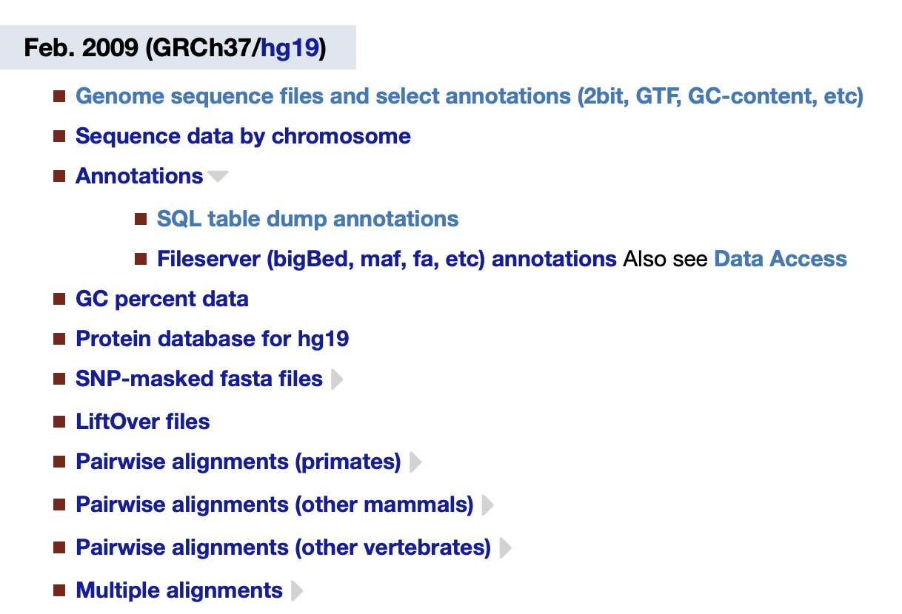
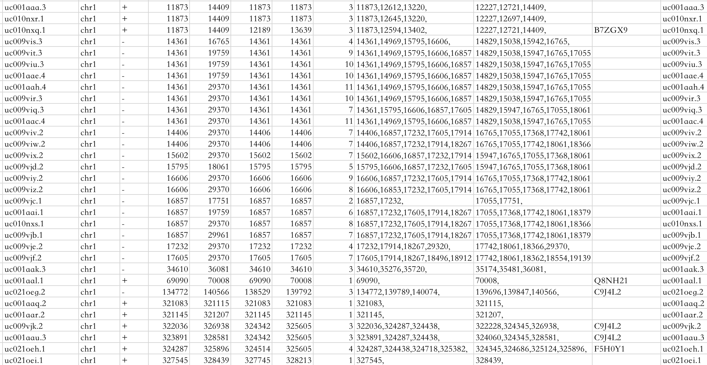
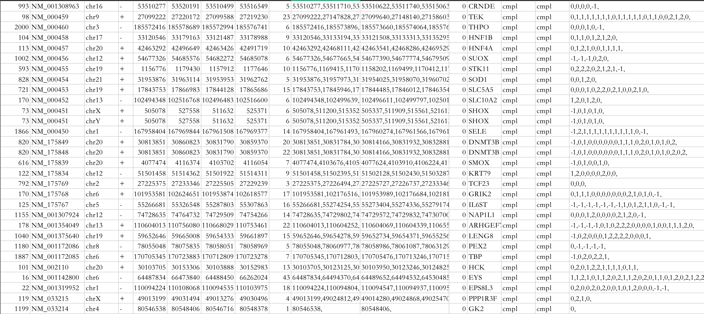
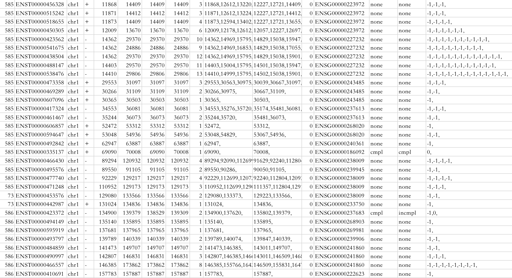

[UCSC地址](https://genome.ucsc.edu/index.html)

可以在[UCSC Genome Data](https://hgdownload.soe.ucsc.edu/downloads.html)中下载数据。

通常人类基因使用hg19，因为hg19的注释信息比hg38更全。

Genome sequence files and select annotaions可以下载序列数据。

annotations可以下载注释信息。

可以通过[table browser](http://genome.ucsc.edu/cgi-bin/hgTables)查询每个表的字段含义。

------

# UCSC中不同数据来源的注释表

## UCSC Gene annotation

filename：knownGene.txt.gz，[下载地址](https://hgdownload.soe.ucsc.edu/goldenPath/hg19/database/)

Database：hg19，用mySQL存储，数据库名

Primary Table：knownGene，数据表名

Row Count：82962，总共有82962行注释

Format description：Genes based on RefSeq，GenBank，Uniport。结合这三个数据库对基因进行注释。

### 信息

| example            | description                  |
| ------------------ | ---------------------------- |
| uc010nxq.1         | name，基因名                 |
| chr1               | chromosome，位于一号染色体上 |
| +                  | strand，处于正链或反链       |
| 11873              | txStart，转录起始位置        |
| 14409              | txEnd，转录终止位置          |
| 12189              | cdsStart，翻译起始位置       |
| 13639              | cdsEnd，翻译终止位置         |
| 3                  | exonCount，外显子数量        |
| 11873,12594,13402, | exonStart，外显子的起始位置  |
| 12227,12721,14409, | exonEnd，外显子的终止位置    |
| B7ZGX9             | uniport或refseq的ID          |
| uc010nxq.1         | 序列ID                       |

转录起始位置到翻译起始位置之间的区域，叫5‘端的不翻译区域

翻译终止位置到转录终止位置之间的区域，叫3’端的不翻译区域

两个外显子之间的区域，就是内含子的区域

------

## RefGene annotation

filename：refGene.txt.gz，[下载地址](https://hgdownload.soe.ucsc.edu/goldenPath/hg19/database/)

Database：hg19，用mySQL存储，数据库名

Primary Table：refGene，数据表名

Row Count：81407，总共有81407行注释

Format description：A gene prediction with some additional info。带有一些附加信息的基因预测。

### 信息

| example                                       | description                                                |
| --------------------------------------------- | ---------------------------------------------------------- |
| 993                                           | index，索引号                                              |
| NM_001308963                                  | name，基因名                                               |
| chr16                                         | chromosome，位于16号染色体上                               |
| -                                             | strand，处于正链或反链                                     |
| 53510277                                      | txStart，转录起始位置                                      |
| 53520191                                      | txEnd，转录终止位置                                        |
| 53510499                                      | cdsStart，翻译起始位置                                     |
| 53516549                                      | cdsEnd，翻译终止位置                                       |
| 5                                             | exonCount，外显子数量                                      |
| 53510277,53511710,53514997,53516513,53519906, | exonStart，外显子的起始位置                                |
| 53510622,53511740,53515063,53516626,53520191, | exonEnd，外显子的终止位置                                  |
| 0                                             | score                                                      |
| CRNDE                                         | name2，别名                                                |
| cmpl                                          | cdsStartStat，CDS起始注释的状态（无、未知、不完整或完整）  |
| cmpl                                          | cdsEndStat，CDS 结束注释的状态                             |
| 0,0,0,0,-1,                                   | exonFrames,外显子框架 {0,1,2}，如果没有外显子框架，则为 -1 |

------

## Ensemble Gene annotation

filename：ensGene.txt.gz，[下载地址](https://hgdownload.soe.ucsc.edu/goldenPath/hg19/database/)

Database：hg19，用mySQL存储，数据库名

Primary Table：ensGene，数据表名

Row Count：204,940，总共有204,940行注释

Format description：A gene prediction with some additional info。带有一些附加信息的基因预测。

### 信息

| example            | description                                                |
| ------------------ | ---------------------------------------------------------- |
| 585                | index，索引号                                              |
| ENST00000456328    | name，基因名                                               |
| chr1               | chromosome，位于16号染色体上                               |
| +                  | strand，处于正链或反链                                     |
| 11868              | txStart，转录起始位置                                      |
| 14409              | txEnd，转录终止位置                                        |
| 14409              | cdsStart，翻译起始位置                                     |
| 14409              | cdsEnd，翻译终止位置                                       |
| 3                  | exonCount，外显子数量                                      |
| 11868,12612,13220, | exonStart，外显子的起始位置                                |
| 12227,12721,14409, | exonEnd，外显子的终止位置                                  |
| 0                  | score                                                      |
| ENSG00000223972    | name2，别名                                                |
| none               | cdsStartStat (none, unknown, incomplete, or complete)      |
| none               | cdsEndStat，CDS 结束注释的状态                             |
| -1,-1,-1,          | exonFrames,外显子框架 {0,1,2}，如果没有外显子框架，则为 -1 |

