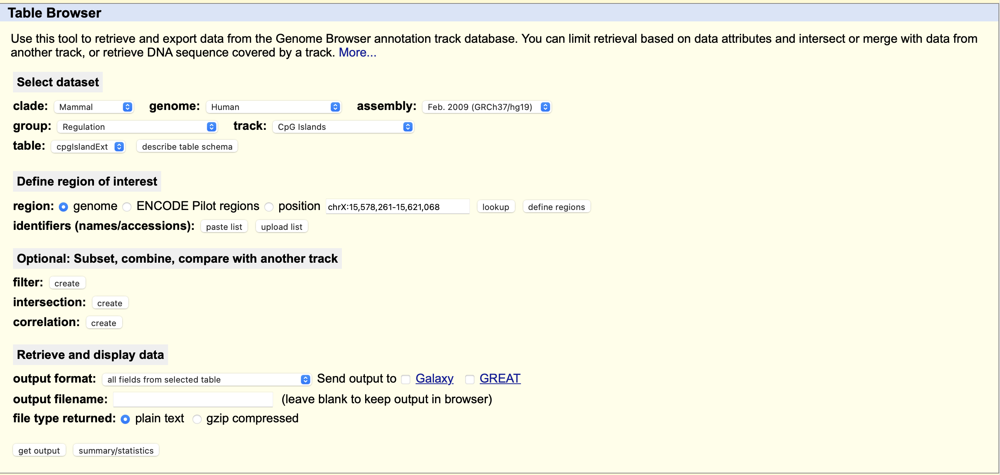
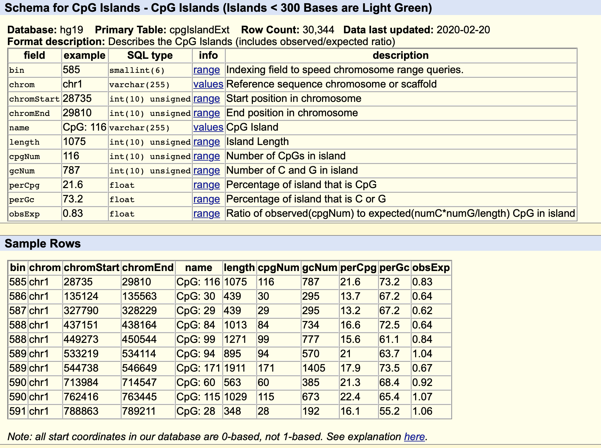

UCSC的[table browser](http://genome.ucsc.edu/cgi-bin/hgTables)中，regulation，CpG islands

点击 describe table schema，注释了3w多个CpG岛

### 信息

| example  | description                            |
| -------- | -------------------------------------- |
| 585      | bin，索引号                            |
| chr1     | chromosome，位于一号染色体上           |
| 28735    | chromStart，染色体中的起始位置         |
| 29810    | chromEnd，染色体中的终止位置           |
| CpG：116 | name，CpG岛名                          |
| 1075     | length，岛长度                         |
| 116      | cpgNum，岛上的CpG数量                  |
| 787      | gcNum，岛中C和G的数量                  |
| 21.6     | perCpG，CpG的岛屿百分比                |
| 73.2     | perGC，C或G岛的百分比                  |
| 0.83     | obsExp，岛屿中观察到的与预期CpG 的比率 |

正链是个CpG岛的话反链也是一个CpG岛。所以和Gene的不同，不用标正反链。

一般CpG岛都有转录因子去结合，在生物进化中，CpG岛都会被保护起来，因为他的功能比较重要。

一开始ATCG含量差不多，但随着进化，大量C变成了T，剩下的C被保留下来，说明这个功能非常重要，不会变成T。

 

 CpG 岛通常在转录起始位点附近很常见，并且可能与启动子区域相关。通常，C（胞嘧啶）碱基后紧跟 G（鸟嘌呤）碱基（CpG）在脊椎动物 DNA 中很少见，因为这种排列中的 Cs 往往会被甲基化。这种甲基化有助于区分新合成的 DNA 链和母链，这有助于复制后 DNA 校对的最后阶段。然而，随着进化时间的推移，由于自发脱氨基作用，甲基化的 Cs 倾向于变成 Ts。结果是 CpG 相对稀少，除非有选择压力来保留它们，或者某个区域由于某些其他原因没有被甲基化，可能与基因表达的调节有关。 CpG 岛是指 CpG 以显着高于整个基因组典型水平的水平存在的区域。

CpG 岛是通过一次搜索一个碱基的序列来预测的，对每个二核苷酸进行评分（CG 为 +17，其他为 -1）并识别最大评分片段。然后根据以下标准评估每个部分：

1.  GC含量≥50%
2.  长度大于 200 bp
3.  基于片段中 Gs 和 Cs 的数量，观察到的 CG 二核苷酸数量与预期数量的比率大于 0.6
