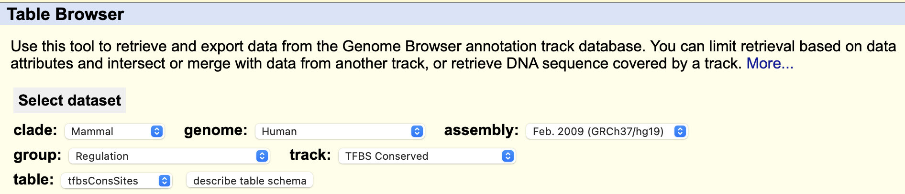
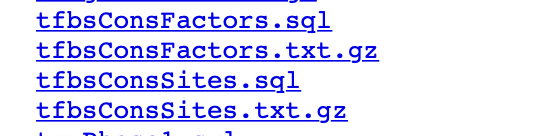
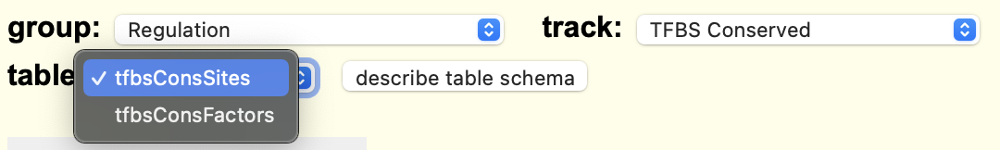
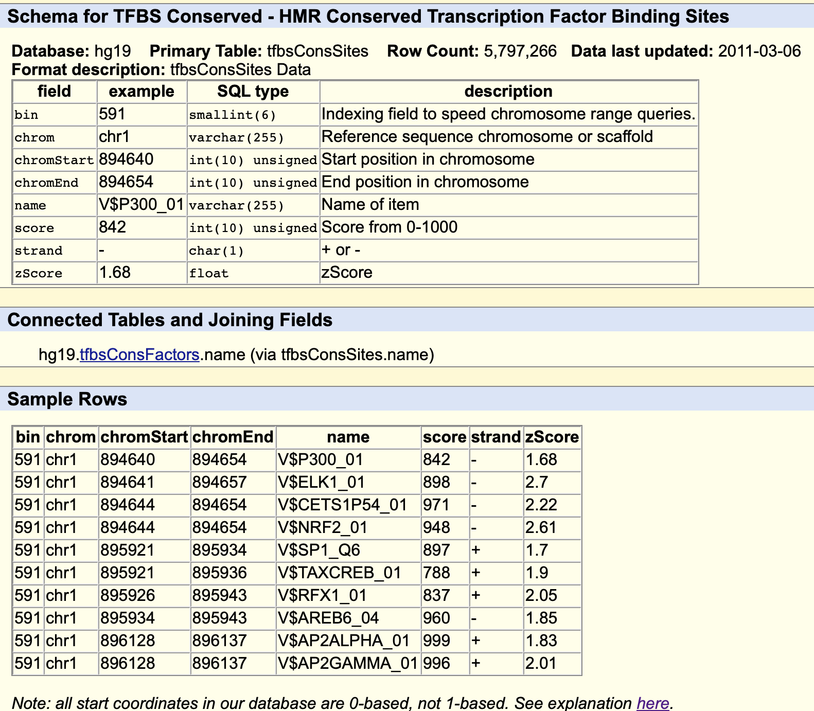
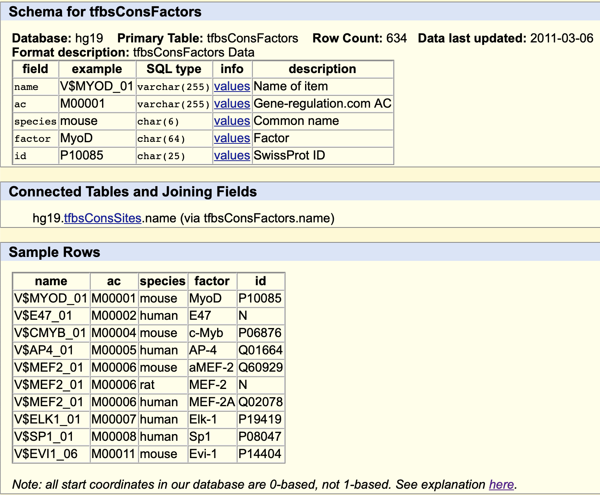

[Table Browser](http://genome.ucsc.edu/cgi-bin/hgTables)中

可以下载文件，在[download](https://hgdownload.soe.ucsc.edu/goldenPath/hg19/database/)中，ctrl+f 搜索 TFBScon

可以看到有转录因子和转录因子结合位点两个文件。

看一下table browser中，track选择TFBS Conserved，有两个table。

转录因子和转录因子结合位点。

保守的TFBS 转录因子结合位点的schema如下。

### 信息

| example   | description                    |
| --------- | ------------------------------ |
| 591       | bin，索引号                    |
| chr1      | chromosome，位于一号染色体上   |
| 894640    | chromStart，染色体中的起始位置 |
| 894654    | chromEnd，染色体中的终止位置   |
| V$P300_01 | name，转录因子名               |
| 842       | score，得分，0-1000            |
| -         | strand，正链或反链             |
| 1.68      | zScore                         |

这个Track包含在人/小鼠/大鼠比对中保守的转录因子结合位点的位置和得分。

如果一个结合位点的分数在所有 3 个物种中都满足其结合矩阵的阈值分数，则认为该结合位点在整个比对中是保守的。

在图形显示中，每个框代表一个保守的推定 tfbs。单击一个框会显示有关结合位点的详细信息，即其 Transfac ID、其 Transfac 矩阵的链接、其在人类基因组中的位置（染色体、起点、末端和链）、其碱基长度、原始分数和 Z 分数。

------

这是转录位点对应转录因子的表格。

### 信息

| example   | description                |
| --------- | -------------------------- |
| V$MYOD_01 | name，transfac结合矩阵id   |
| M00001    | ac，transfer结合矩阵索引号 |
| mouse     | species，物种名            |
| MyoD      | factor，转录因子名         |
| P10085    | id，SwissPort索引号        |

如果一个结合矩阵已知不止一种转录因子，则每个转录因子都出现在自己的行上，因此一个结合矩阵可以存在多行。
