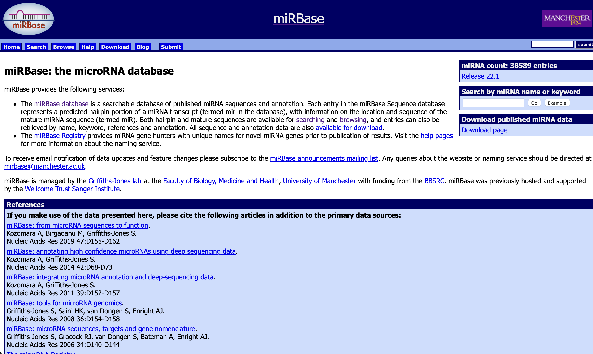
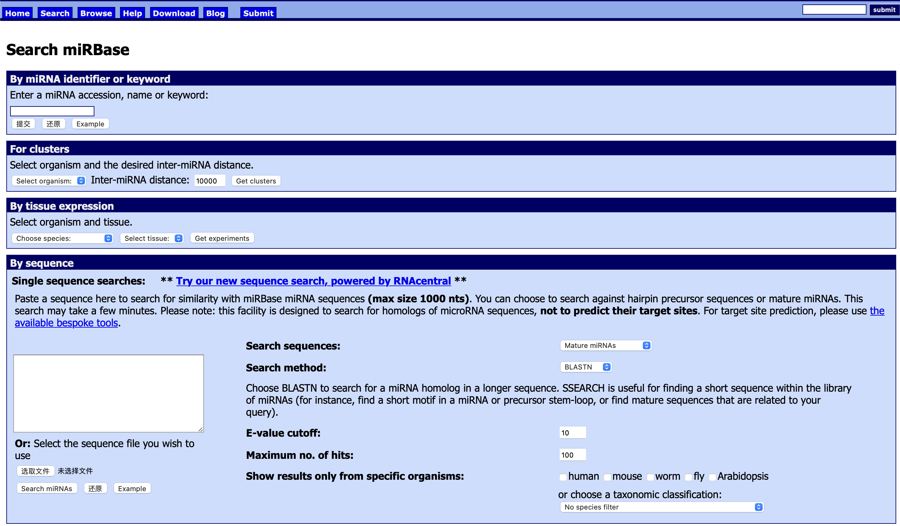
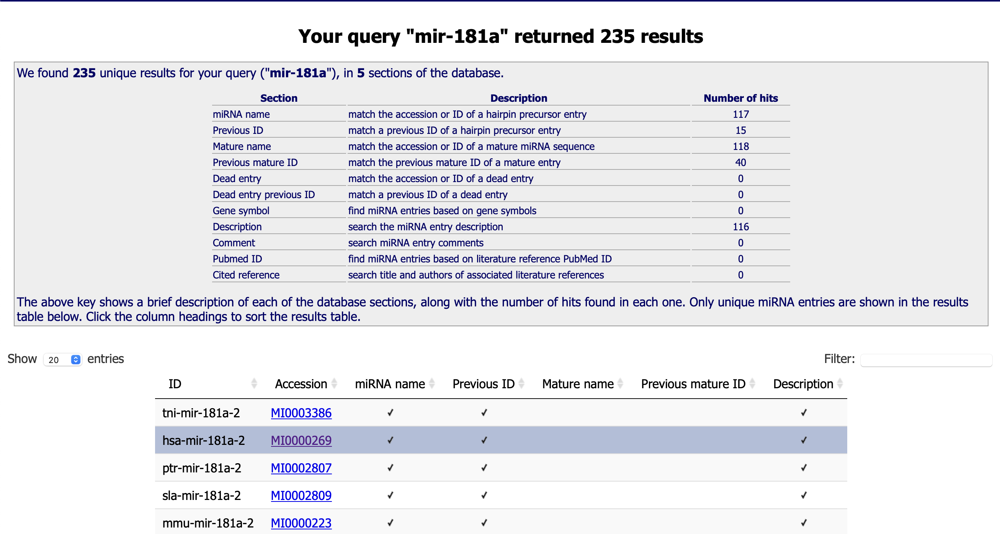
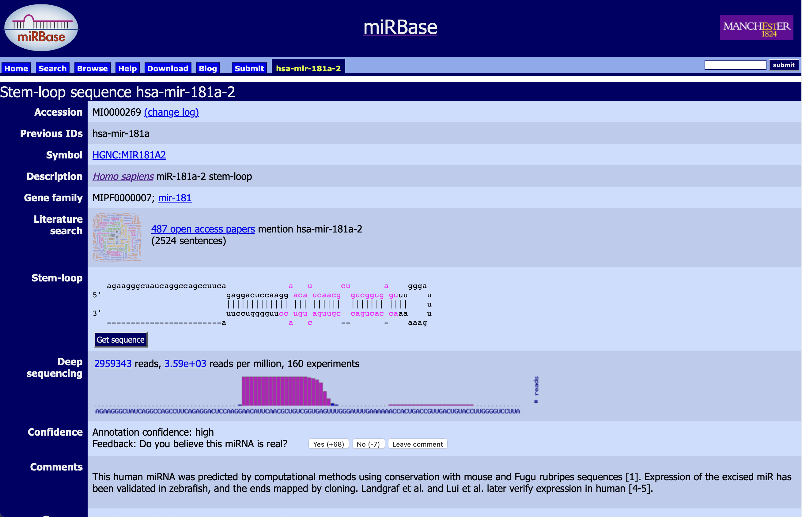
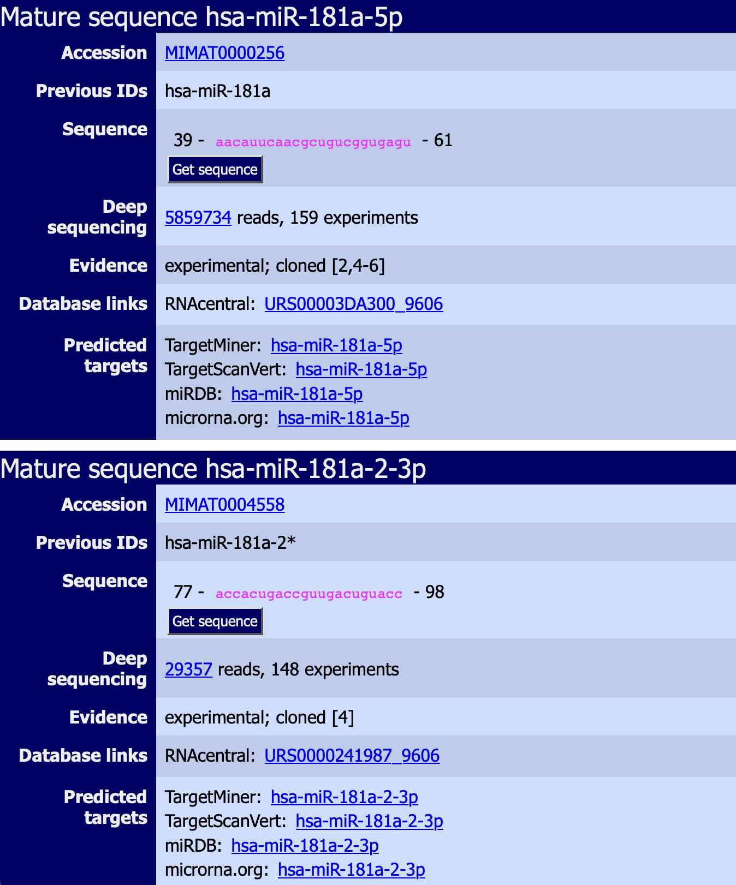

[miRBase](https://www.mirbase.org)

[targetscan](http://www.targetscan.org/vert_80/)

------

miRBase

记录了miRNA前体序列及mi RNA成熟体序列，其中：

-   miRNA前体

    发夹状结构的mi RNA前体转录本以mir命名，以MI编号

    如人的mi RNA 122 的前体ID为hsa-mir-122，accession为MI0000442

-   miRNA成熟体

    miRNA成熟体以miR命名，以MIMAT编号

    如人的miR-122有两个成熟体，其中之一ID为hsa-miR-122-5p，accession为MIMAT0000421，另一个ID为hsa-miR-122-3p，accession为MIMAT0004590

点击search。

搜索mir-181a，不指定物种会有很多。

点击hsa人类

可以看到，Stem-loop sequence，这是个前体miRNA的茎环序列。

往下可以看到成熟体miRNA。mature sequence

