[UCSC](http://genome.ucsc.edu)

[学习资料](https://www.bilibili.com/video/BV19f4y1s78y?p=3)

------

UCSC Genome Browser是由University of California Santa Cruz 加州大学圣克鲁兹分校创立和维护。包含人类、小鼠、大鼠等多个物种的基因组草图，并包含一系列网页分析工具。

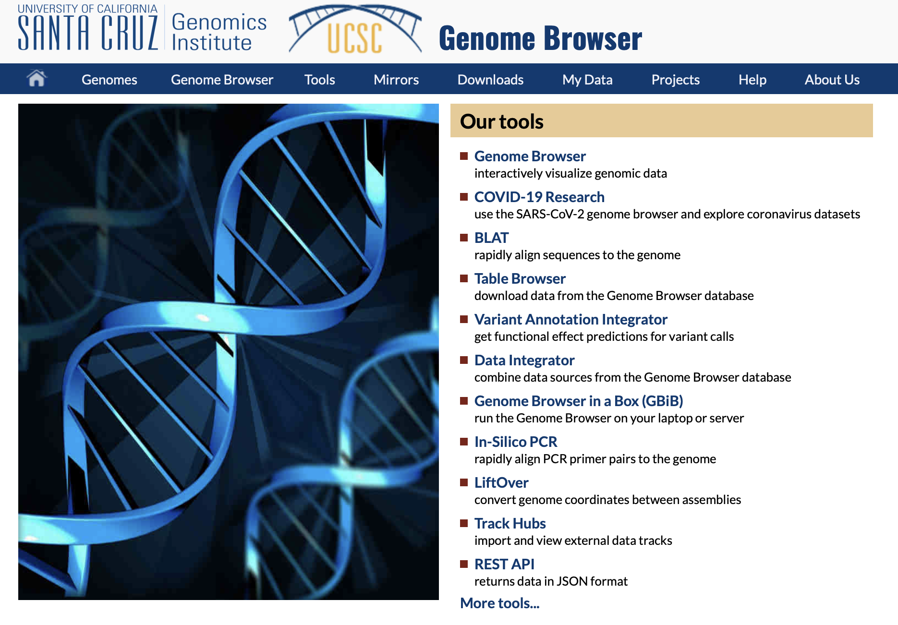

点击 Genome Browser，如下。

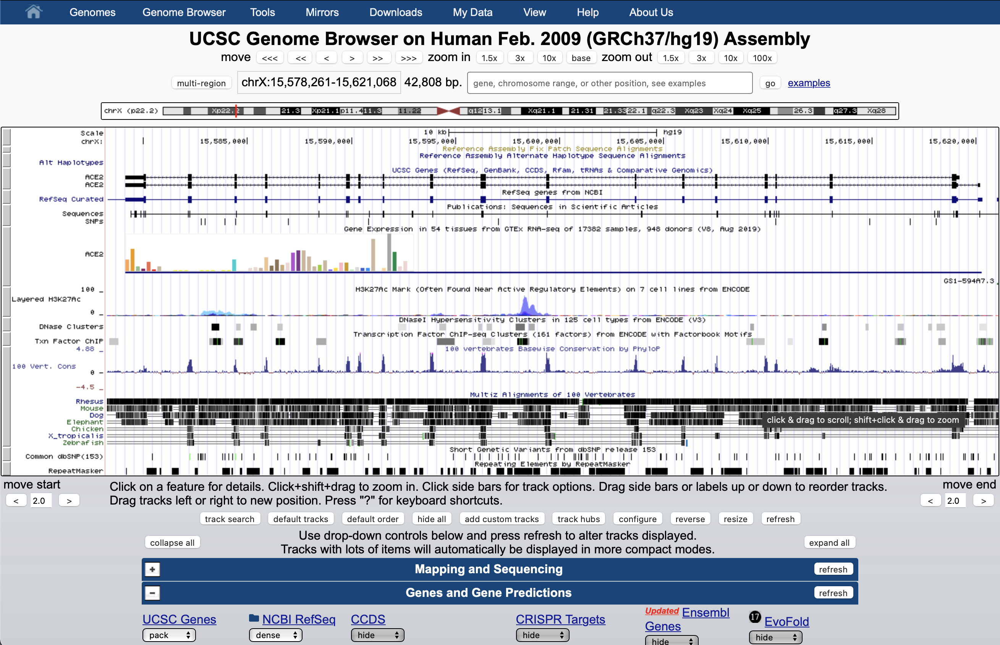

在这个search中我们输入myc，可以看到。

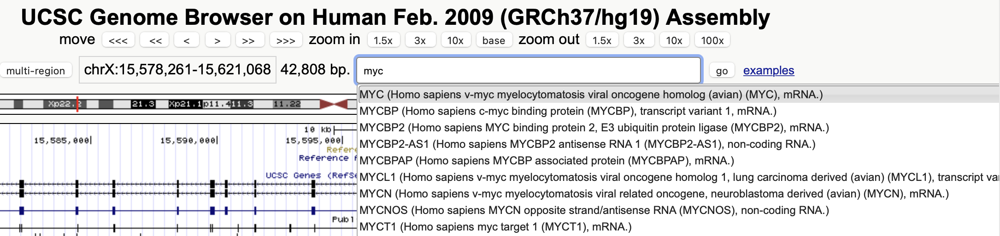

选择第一个，可以看到。

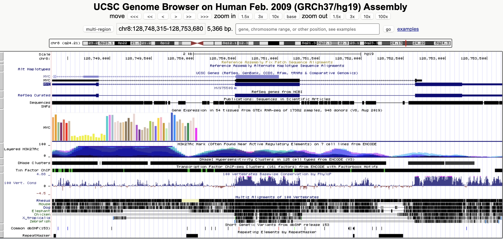

chr8:128,748,315-128,753,680 5,366 bp.

是8号染色体的128,748,315-128,753,680位置之间，长度为5,366 bp.

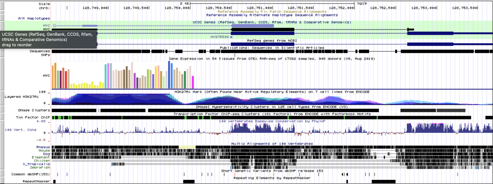

其中这一行一行的，称为Track，每个Track是数据库中对这个基因的注释。

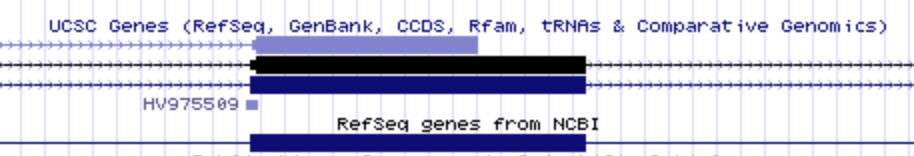

可以看到，每个track上方，都有这个track的title。

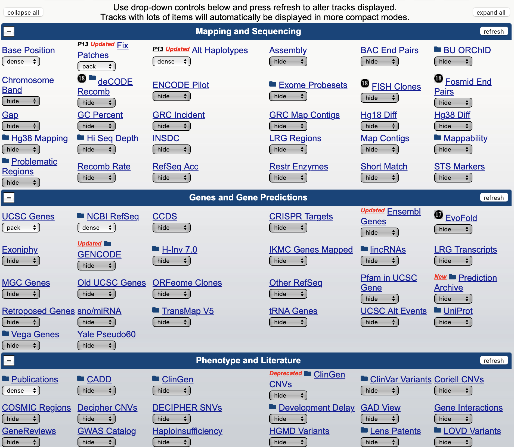

点击UCSC Genes的下拉框，可以看到。

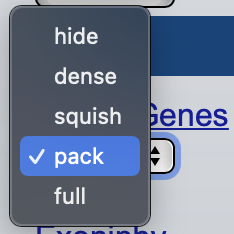

-   hide：隐藏信息
-   dense：所有信息复合在一行上，用颜色深浅表示区域信息多少
-   squish：紧密排列，没有label信息
-   pack：合理安排信息使其尽量节省空间，每一行可以显示多个记录
-   full：每条信息一行

dense的效果：

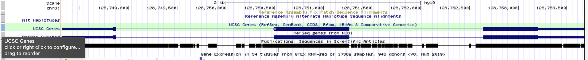

squish的效果：

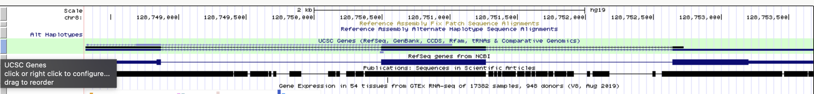

pack的效果：

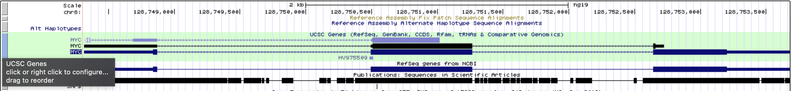

full的效果：

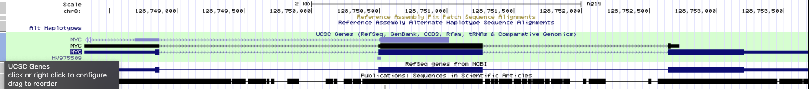

在UCSC Gene的track中可以看到。

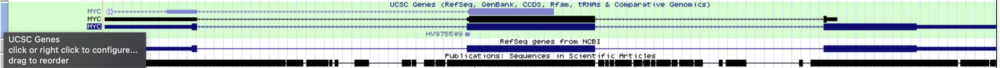

矩形是外显子，线条是内含子，箭头是他的转录方向

位于第一个外显子前端的，和最后一个外显子后端的，细一点的矩形是不翻译区域（UTR）。

这个上方的move、zoom in、zoom out可以控制图形的移动和放大缩小。

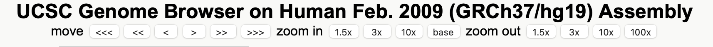

放大之后可以看到

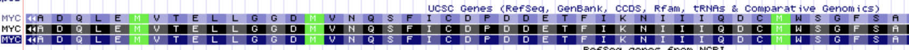

绿色的部分是起始密码子

------

### 汪国华

有很多基因组

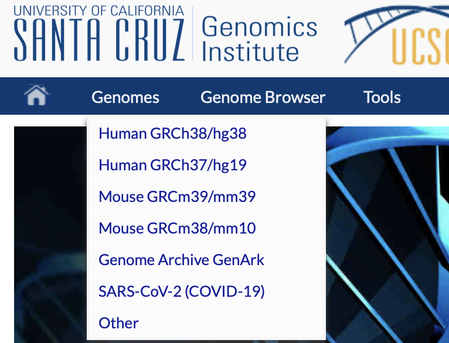

点击other

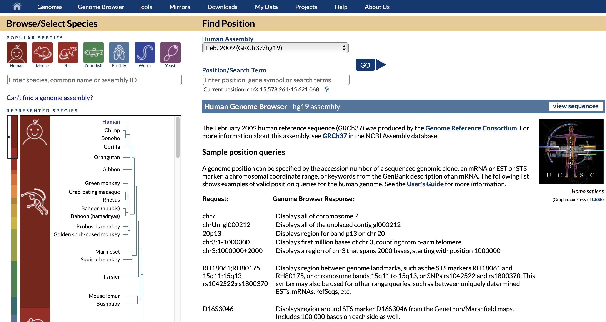

可以看到左上角，有很多基因组，人类的，大鼠、小鼠、斑马鱼、果蝇、线虫、酵母等等

左下角可以看到有很多基因组

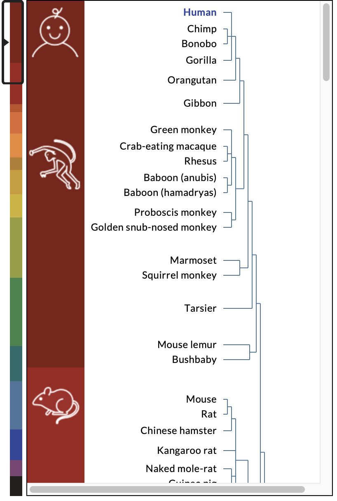

human人类、chimp黑猩猩、bonobo倭黑猩猩、gorilla大猩猩、orangutan猩猩、gibbon长臂猿。

选择human，右上方可以看到

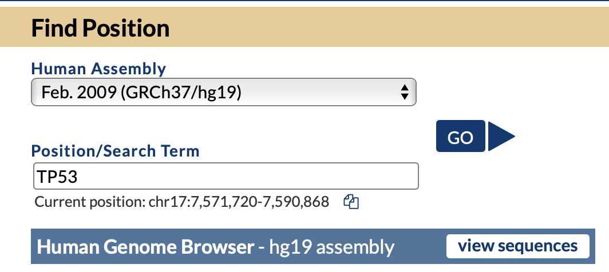

human assembly中2003年是人类基因组测序刚完成，最常用的是hg19，最新的是hg38

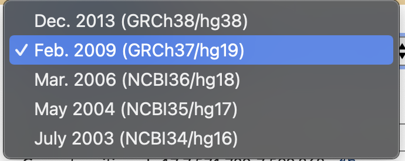

position/search term，可以输入在哪个染色体上的哪个区间或输入基因名，chr17:7,571,720-7,590,868或TP53，点击Go就打开genome browser。

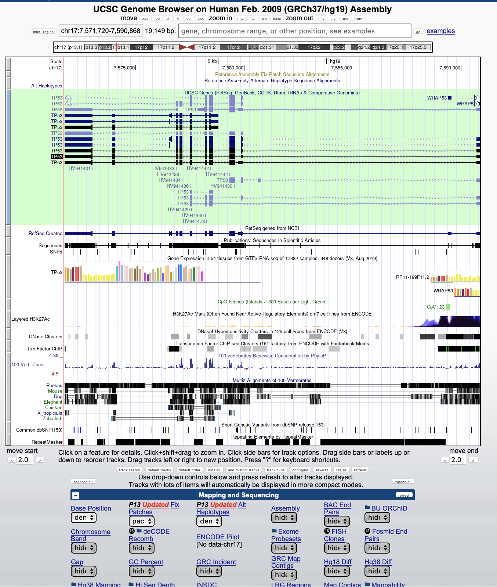

genome browser分为两个大部分，第一个是上半部分的图形界面，显示了所有选择的注释信息，

下半部分是Tracks，首先hide all，隐藏所有tracks

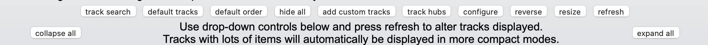

打开UCSC Genes，NCBI RefSeq，CpG island。

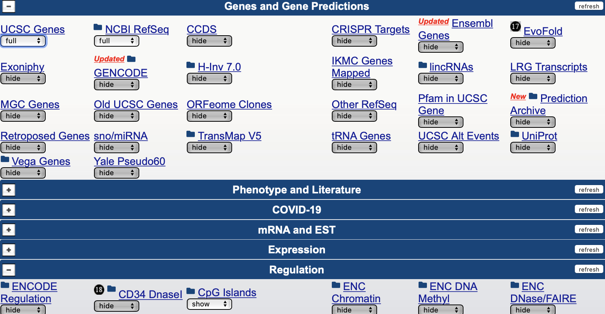

可以看到，只有三条track，

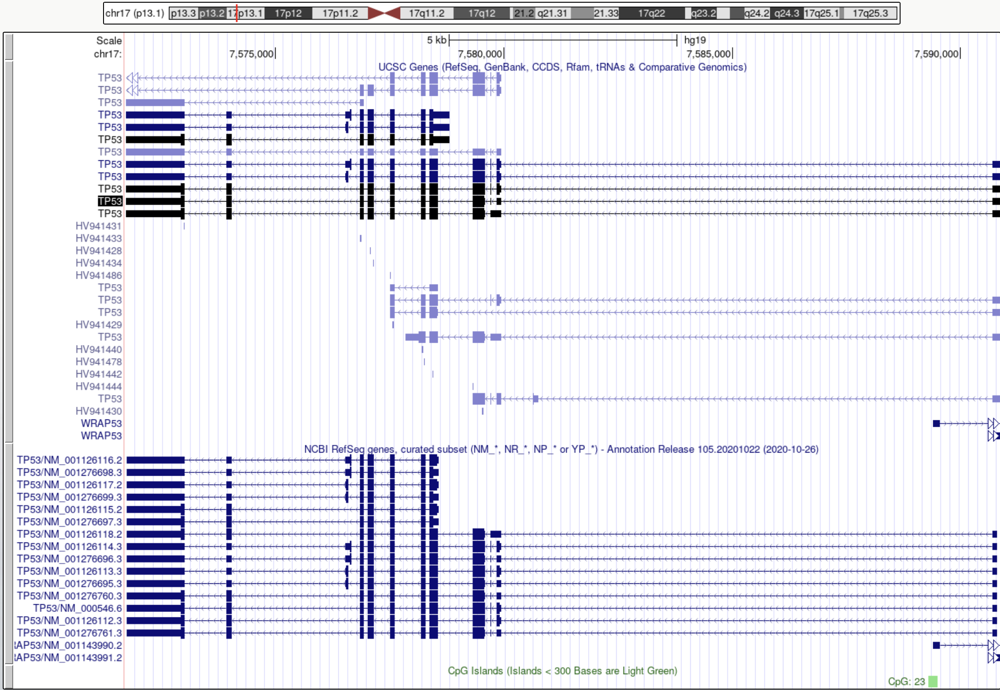

TP53所在位置上有很多条亚型，一个基因会有多个不同的亚型，表达的蛋白是不同的。

粗的是他的翻译区域，细的是不翻译区，箭头向左是反向转录，点击zoom in放大。

黑色的是PDB entry，在蛋白质数据库中有相应信息的

深蓝色是NCBI人工验证的序列，浅蓝色是NCBI 预测的序列

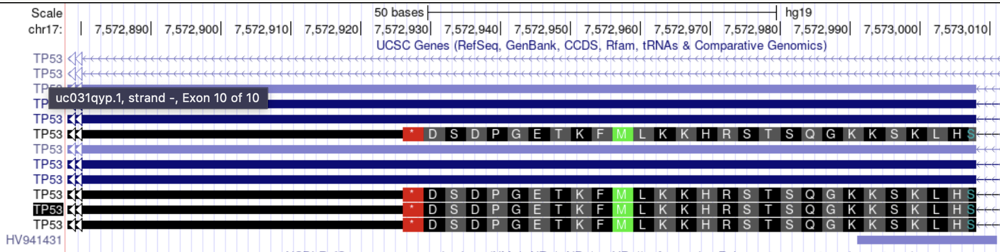

可以看到氨基酸，绿色的M是起始编码区

在放大。

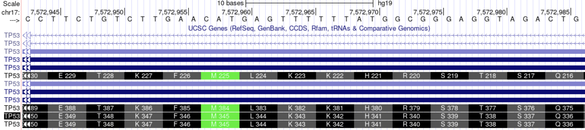

上方可以看到核苷酸序列。

将他zoom out 缩小。

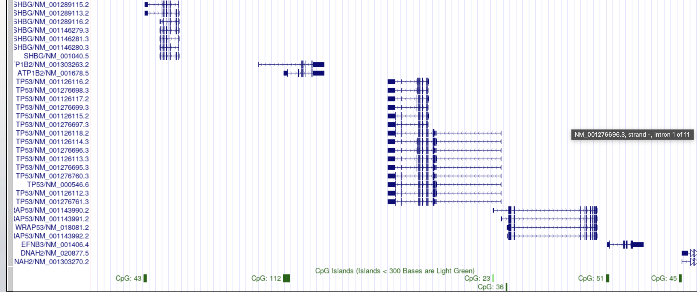

可以看到CpG岛都是在转录起始位点附近

