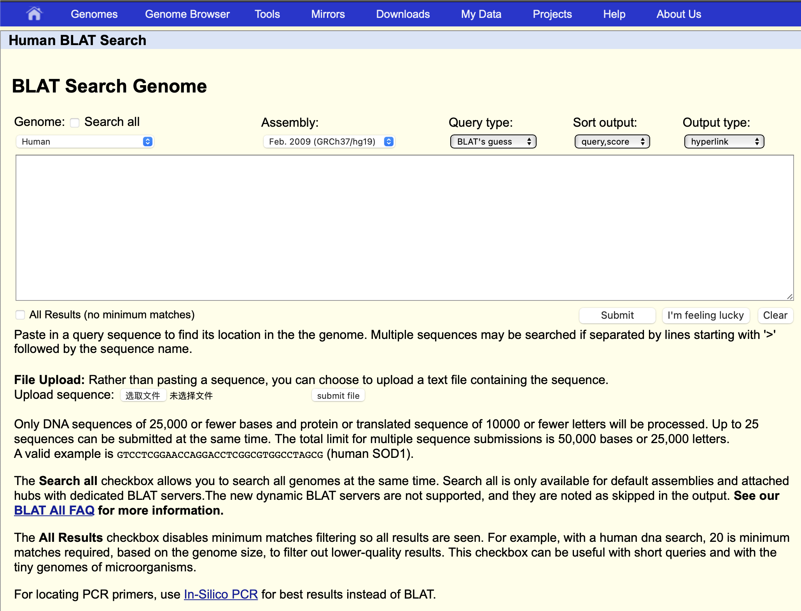
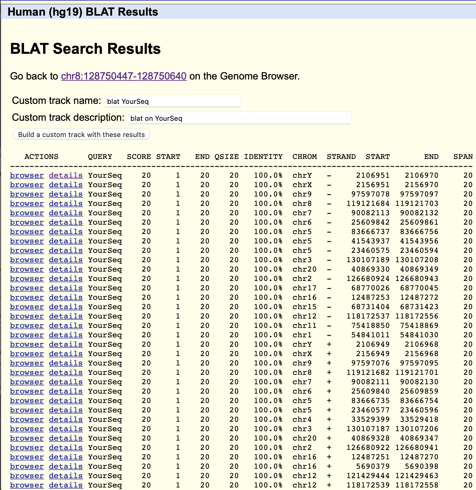
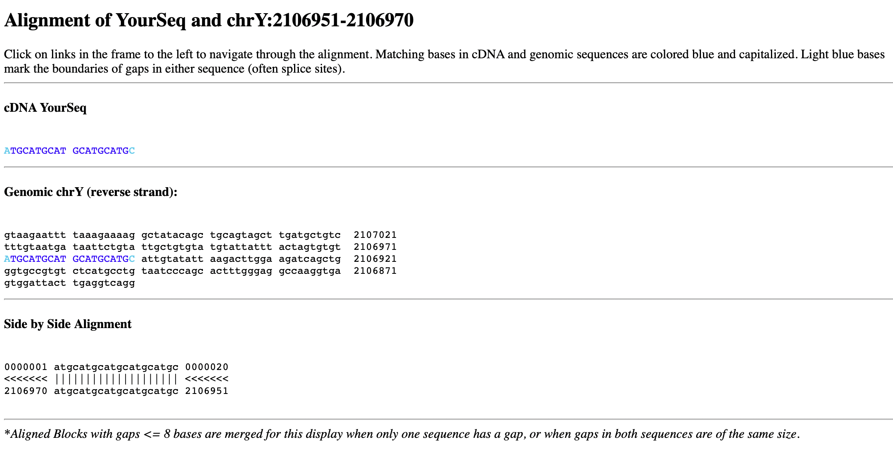

[BLAT Search Genome](http://genome-asia.ucsc.edu/cgi-bin/hgBlat?hgsid=758398680_XtMCzPucbilM7FwYpal6S0ELggbE&command=start)

BLAT = BLAST - like Alignment Tool

类似于blast 的比对软件

输入序列 ATGCATGCATGCATGCATGC

点击submit

score，得分越高比对越好

点击 details 可以看到

可以看到ATGCATGCATGCATGCATGC具体在基因的哪个位置
