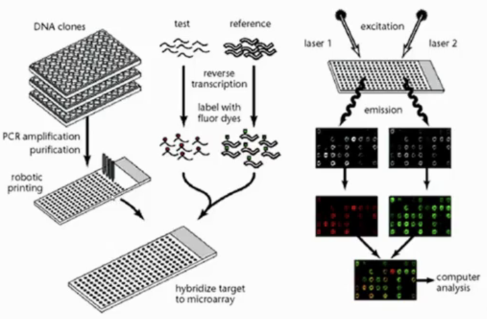
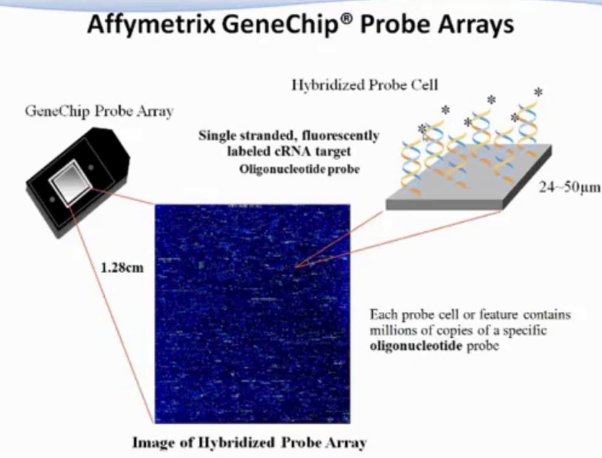
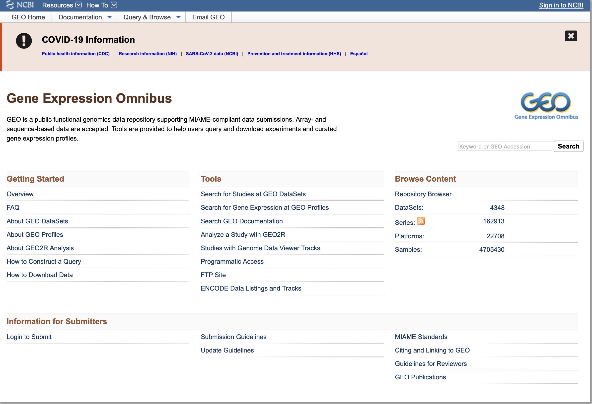

# 基因芯片及其数据分析

## 什么是基因芯片（Gene Chip）？

### 什么是DNA microarray？

芯片是一个二维矩阵，每个芯片有若干个信号量，芯片上不同颜色代表基因表达量的高低。

### 芯片分类

1.  从技术和探针角度
    -   cDNA array（Brown/Botstein）
    -   Short oligonucleotide array（Affymetrix）
    -   long oligo array（Agilent）
2.  从实验角度
    -   Single Channel 单通道芯片（one color array）
    -   Dual Channel 双通道芯片（two color array）
3.  从生物问题角度
    -   Expression array 表达谱芯片测量mRNA表达
    -   Tiling array 测量DNA甲基化
    -   SNP array 测量SNP
    -   microRNA microarray 
    -   Exon array 测量选择性剪切

### 芯片实验步骤

1.  实验和数据获取
    1.  Chip manufacturing 设计芯片或购买商品化芯片
    2.  Sampling and labeling 对样本进行染色准备
    3.  Hybridization 将样本和芯片进行杂交
    4.  Image scaling 获取图像，对图像进行识别
    5.  Data acquisition 数据采集
2.  数据标准化
3.  数据分析
4.  生物解释

### cDNA芯片实验

从 mRNA 逆转录成的DNA，这个DNA叫cDNA，是人为创造的。

此时人类基因组计划还没测完，只能从生物的mRNA中逆转录，cDNA array技术已经不用了。

实验和数据获取

1.  Chip manufacturing 芯片的每个位置用点阵的方法放一个基因的cDNA
2.  Sampling and labeling 用cy5酶（红色）对样本cDNA A进行染色，cy3酶（绿色）对样本cDNA B进行染色准备。
3.  Hybridization 将样本cDNA  A、B和芯片上所有的基因的cDNA进行杂交
4.  Image scaling 获取图像，对图像进行识别，某个地方呈现红色，说明这个地方A基因的表达量高，绿色说明这个地方B基因表达量高
5.  Data acquisition 数据采集

如果样本cDNA和芯片cDNA没有反应，说明样本中没有这个基因表达，如果呈现了不同颜色，说明基因是表达的。

### DNA chip

DNA芯片分为short oligo、long oligo（寡核苷酸）。

**short oligo**，Affymetrix

-   一个probe（探针）上有人工合成25bp的oligo，用20对oligo（40个探针）来测量一个基因的表达。
-   一般是一种颜色的
-   一个芯片有764,000个探针，大约能测量1.9w个基因
-   芯片大小1.7cm*1.7cm，每个探针5um。

**long oligo**

-   一个探针上有40-70bp的oligo

## Gene Expression Omnibus（GEO）

[GEO数据库](https://www.ncbi.nlm.nih.gov/geo/)中有四种文件的类型

-   Platform（GPL），测序文件的注释
-   Sample（GSM），每个样本的文件
-   Series（GSE），GSM的集合
-   DataSets（GDS），相似实验的数据集合

## 基因芯片数据标准化和全局处理

### 芯片数据分析流程

1.  生物问题实验设计
2.  买芯片、设计芯片
3.  将样本和芯片进行杂交
4.  图像分析，得到原始芯片信号，用R包将每个基因的表达量取出
5.  标准化
6.  对表达量进行计算，比较不同基因表达数据，找到差异表达的基因，进行统计分析
7.  对分析结果进行生物解释

### 图像处理

-   栅格化：确定点的位置
-   图像分割：将点从背景中分离出来
-   抽提亮度：各个像素亮度的平均值或中位数
-   背景校正：局部或全局

### 标准化分析

对于双通道芯片，会有两组不同颜色的数据

每个样本会有背景信息和前景信息

### 数据偏差的来源

-   生物样本间的偏差
-   扫描和图像分析
-   DNA杂交过程（温度、时间、混合均匀程度）
-   探针的标记
-   RNA的抽提
-   加样

### 标准化方法

1.  scaling normalization：所有信号值乘上个参数k，位移变化，将芯片的中值相同
2.  quantile normalization： 分位数标准化，将所有分布变一样
3.  intensity-dependent normalization：信号依赖的标准化方法，双通道芯片上

## 如何识别差异表达基因

### fold change

实验样品的测量值与对照样品的测量值之比

-   有病和没病的
-   经过药物刺激和没经过药物刺激的

x = measured value，y=control value，fold change=x/y

fold change是倍数关系，没有统计学上的意义，只是看样本之间有没有差异

只是衡量了哪些基因有变化，但没有看这个变化在样本中的方差是什么样的，只考虑了均值，不是一个好的看变化的量。

比如，x=30，y=60，fold change=0.5

但，如果有random noise，使得x+15=45，y-15=45，此时fold change=1.0

比如，x=500，y=1000，fold change=0.5

有random noise，使得x+15=515，y-15=985，此时fold change=0.52

对大的信号量影响不大，但对小信号量影响特别大

### t-test

用统计学来看两个样本之间是否有差异

-   standard t-test
-   welch’s t-test
-   Mann-whitney
-   the permutation test

## ANOVA

多样本分析

## 聚类

## ChIP-chip 和 Tiling Array

## Alternative splicing 和 Exon Array

### 外显子芯片

### 选择性剪切

会对外显子选择性的剪切

------

# 听不清

------

### 序列比对，Alignment

把两条序列最大化的比对到一起，找到公共的序列。

-   全局比对，从头到尾全部进行比对，寻找到最小的比对位置
-   局部比对，找到局部最优比对，最优公共子串

首先对序列进行打分

-   match=1
-   mismatch=0
-   gap 罚3分
-   gap extension 罚0.1分

全局比对算法

needleman

局部比对算法

smith waterman（BLAT）

###  三代测序拼接方法

### 欧拉图
