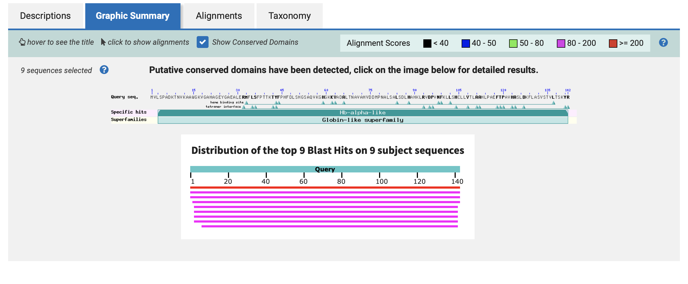
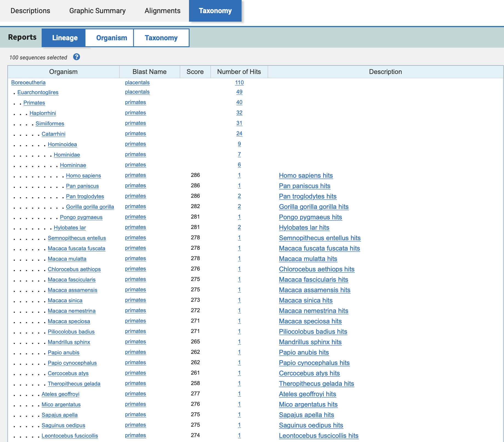

[课程](https://www.bilibili.com/video/BV13t411G7oh?p=5)

## 序列比对

### 序列比对背后的生物学问题

给定两个序列，怎么来判定他们之间有多像。

How can we determine the similarity between two sequences?

### 为什么序列比对是重要的

-   功能上来看
    -   相似的序列，就可能会有相似的结构，就有可能会有相似的功能
    -   因此，一个新序列可以通过它和已知的序列的相似性，来推断他可能的功能
-   演化上看
    -   不同物种中的相似序列，往往意味着他们有着共同的祖先，就是同源
    -   序列之间的相似性是用来构建演化树的重要依据之一

### 序列比对的目的

从生物学角度来讲，通过检测序列之间相似性，来发现序列之间的功能或演化关系。

### 序列比对工具

[Pairwise Sequence Alignment](https://www.ebi.ac.uk/Tools/psa/)

看到有全局比对、局部比对、基因组比对


选择全局比对的第一个


Step 1，在两个框中，输入两个要比对的序列

人类血红蛋白alpha亚基和beta亚基，蛋白质序列，由20种氨基酸构成

-   [sp|P69905.2|HBA_HUMAN](https://www.ncbi.nlm.nih.gov/protein/P69905.2?report=fasta)

```
>sp|P69905.2|HBA_HUMAN
MVLSPADKTNVKAAWGKVGAHAGEYGAEALERMFLSFPTTKTYFPHFDLSHGSAQVKGHGKKVADALTNAVAHVDDMPNALSALSDLHAHKLRVDPVNFKLLSHCLLVTLAAHLPAEFTPAVHASLDKFLASVSTVLTSKYR
```

-   [sp|P68871.2|HBB_HUMAN](https://www.ncbi.nlm.nih.gov/protein/P68871.2?report=fasta)

```
>sp|P68871.2|HBB_HUMAN
MVHLTPEEKSAVTALWGKVNVDEVGGEALGRLLVVYPWTQRFFESFGDLSTPDAVMGNPKVKAHGKKVLGAFSDGLAHLDNLKGTFATLSELHCDKLHVDPENFRLLGNVLVCVLAHHFGKEFTPPVQAAYQKVVAGVANALAHKYH
```


Step3，点击submit


最下面的这一块，两条序列之间的这一行称为标记行

-   竖线，相同的残基
-   冒号，可以替换，表示相似程度，表示比较相似
-   点，可以替换，表示不太相似
    -   冒号和点，根据替换矩阵来衡量
    -   可以看到这里的matrix用的是 BLOSUM62
-   空格，（indel）对应序列的插入或删除
    -   可以看到gap_open_penalty:10,gap_extend_penalty:0.5
    -   也就是产生空位罚10，如果是两个空位，就是一个空位之后延伸一个空位，罚10+0.5*1
    -   penalty=d+(n-1)*e，仿射型罚分
    -   Score = sum of substitution score + (-1)*(sum of gap penalty)
    -   比对得分等于各个单独残基比对分数之和

### 全局序列比对的过程

1.  输入数据
    -   两条序列 s1、s2
2.  指定参数
    -   打分函数F
3.  输出
    -   最优比对结果

一个残基的比对方式只有两种

1.  对应一个残基
2.  对应一个空位

最好的比对=之前最好比对+当前位置最好的比对

就是动态规划
$$
F(0,0)=0\\\\
F(i,j)=max
\begin{cases}
F(i-1,j-1)+s(x_i,y_j)\\
F(i-1,j)+d\\
F(i,j-1)+d
\end{cases}
\\
\\
F(i,j)-score\ of\ the\ best\ alignment\ between\ x_{1...i}\ to\ y_{1...j}\\
s(A,B)-score\ for\ substituting\ A\ with\ B\\
d-gap\ penalty
$$


### example，全局比对，线性空位罚分


首先填最靠边的两排，因为F(0,0)=0，所以左上角是0

因为d=-5，空位罚5分，根据公式的下两个，可以得出-5、-10、-15

也就是图左下角的，F(1,0)由上方的F(0,0)+d(空位罚分)=-5

F(0,1)由左方的F(0,0)+d(空位罚分)=-5


F(1,1)由三者的最大值决定，也就是

-   F(0,0)+s(A,A)(替换矩阵中对应的得分)
-   F(1,0)+d(空位罚分)
-   F(0,1)+d(空位罚分)

因为s(A,A)=2,所以F(1,1)由最大值F(0,0)+2=2得出

以此类推

可以得到两条序列的最优比对结果是-6


从F(3,3)向前回溯，因为F(1,2)可以同时由F(1,1)和F(0,1)得到，所以会有两个比对结果，都是最优比对。这是从头到尾的比对，就是全局比对。

------

### 局部比对

以上算法是Needleman-Wunsch算法，针对用户指定的打分函数，确定性的找出两条序列的最优比对。

早期获得广泛应用，然而随着越来越多序列数据的产生，Needleman-Wunsch算法对两条序列所有残基进行比对的特点也碰到了问题

-   首先，随着越来越多的蛋白序列被测定，发现功能相关的蛋白之间虽然可能在整体序列上相差甚远，却常会具有相同的功能域，这些序列片段，能独立发挥特定的生物学功能，且在不同蛋白之间相当保守，所以仅靠全局比对算法是无法发现这些片段的。
-   其次，70年代内含子的发现，在做核酸水平的序列比对时，需要正确处理内含子导致的大片段的差异

因而，需要有新的方法，来发现相似的局部序列，也就是做local alignment，局部序列比对。

1981年Smith and Waterman改进了Needleman-Wunsch算法

### Smith-Waterman算法

-   global alignment：

$$
F(0,0)=0\\\\
F(i,j)=max
\begin{cases}
F(i-1,j-1)+s(x_i,y_j)\\
F(i-1,j)+d\\
F(i,j-1)+d
\end{cases}
\\
\\
$$

-   Local alignment:

$$
F(0,0)=0\\\\
F(i,j)=max
\begin{cases}
F(i-1,j-1)+s(x_i,y_j)\\
F(i-1,j)+d\\
F(i,j-1)+d\\
0
\end{cases}
\\
\\
$$

和之前的全局比对算法相比，局部比对方法多了个0，也就是在迭代的时候，给分数加了下限。

### example，局部比对，线性空位罚分


首先可以看到，添加了0之后，第一行和第一列就全为0了，也就是虽然有空位罚分，但是限制了最低的分数，所以之前的-5、-10、-15，就变成了0


可以看到回溯是局部的，得到的比对也是局部的。因此可以得到最优的局部比对和次优的局部比对

-   AG-AG
-   A-A

在全局比对中，两个完全相等的序列的最优路径，就是他的主对角线，在局部比对中，最优路径平行于主对角线

------

### 仿射型空位罚分序列比对

之前的两种算法例子没有区分gap open和gap extension，统一记为d，要正确区分open和extending就要引入状态的概念，来记录gap之前是否有open

一对残基之间可能的比对关系有

1.  M（两个残基彼此对应，不一定相等）
2.  X（表示序列X的残基对应一个空位，也叫X上发生一次插入）
3.  Y（表示序列Y的残基对应一个空位，也叫Y上发生一次插入）

利用有限状态机，将序列比对描述为在不同状态之间的转移


-   d：gap open
-   e：gap extension

进而，可以定义动态规划迭代公式


M(i,j)表示xi对应到yj，也就是两个残基对应时，序列x从第一位到第i位，序列y从第1位到第j位，最好的比对分数

X(i,j)表示残基xi比对到空位时，序列x从第一位到第i位，序列y从第1位到第j位，最好的比对分数

Y(i,j)表示残基yi比对到空位时，序列x从第一位到第i位，序列y从第1位到第j位，最好的比对分数

公式1，M(i,j)

-   第一个M(i-1,j-1)+s(xi,yj)，表示残基xi-1，yj-1对在一起
-   第二个X(i-1,j-1)+s(xi,yj)，表示残基xi-1对应空位
-   第三个Y(i-1,j-1)+s(xi,yj)，表示残基yj-1对应空位

公式2,X(i,j)

-   第一个M(i-1,j)-d，表示残基xi-1和残基yj对应，但xi对应空位，也就是gap open，要减去d
-   第二个X(i-1,j)-e表示残基xi-1已经对应一个空位，也就是gap extending，要减去e

公式3Y(i,j)，同理

-   第一个M(i,j-1)-d，表示残基xi和残基yj-1对应，但yj对应空位，也就是gap open，要减去d
-   第二个Y(i,j-1)-e，表示残基ji-1已经对应一个空位，也就是gap extending，要减去e

可以用三种矩阵将动态规划迭代关系，表示为在三个平面的单元格填充，值得注意的是，这时的回溯关系既可能来自本平面，也可能来自其他平面。

------

## 序列数据库

### BLAST

Basic Local Alignment Search Tool

NCBI的BLAST工具，选择blastp

[protein BLAST](https://blast.ncbi.nlm.nih.gov/Blast.cgi?PROGRAM=blastp&PAGE_TYPE=BlastSearch&LINK_LOC=blasthome)

### 物种内搜索


填入人类血红蛋白alpha亚基序列

```
>sp|P69905.2|HBA_HUMAN
MVLSPADKTNVKAAWGKVGAHAGEYGAEALERMFLSFPTTKTYFPHFDLSHGSAQVKGHGKKVADALTNAVAHVDDMPNALSALSDLHAHKLRVDPVNFKLLSHCLLVTLAAHLPAEFTPAVHASLDKFLASVSTVLTSKYR
```


选择数据库

-   nr：所有已知蛋白的去冗余集合，通常用在第一步筛选中，以确定查询序列之前是否被别人研究过，因此，虽然内容很丰富，但不一定每条序列都有详尽的注释

因为我们想要对序列进行详细对注释，所以选择swissprot数据库

swissprot包含功能、结构、修饰等方面的全面信息，以及包含到其他数据库全面的链接。通常在想要详细准确的研究新序列时，通常选用swissprot数据库。


物种选择human

点击BLAST


上方显示了查询序列和被搜索数据库的基本情况

 

-   对查询序列功能域的分析
-   对hits（比对的片段）的总结，有很多hits覆盖了查询序列的全长，也有只覆盖了查询序列部分的片段


hits的具体列表


可以看到这是人类血红蛋白beta亚基的序列，可以为查询序列的功能和注释提供线索

### 物种间搜索

重新搜索，去除物种限制。


可以看到，找到的hits分布在不同的物种里，找到了很多同源序列


点击上方的Taxonomy，可以按照物种查看



进而，可以生成物种进化树，点击上方distance tree of results


------

### BLAST算法

Homology is the central concept for all of biology. --David Wake

需求：研究序列同源性

目的：通过数据库搜索，来查询研究序列的功能、结构在其他序列中的情况，对后期分析序列提供基础

权衡：Needleman-Wunsch算法和Smith-Waterman算法基于动态规划算法，准确性非常高，但在数据库搜索时占用的资源和时间就不太行，为了解决这个问题，就产生了FASTA和BLAST，应用启发式的近似算法，在保证准确度不会降低太高的情况下，速度得到了提高。

思路：Seeding and extending

1.  找到两条序列之间高度相似的小片段
2.  以此为基础，向两端延伸并构建比对
3.  为了避免可能的假阳性，计算统计显著性

### Seeding


1.  Seeding，给定一个长度w，将输入序列切分为若干小段，称为seed words，通常核酸序列设置11，氨基酸序列设置3
2.  Scanning，两种方法
    1.  通过事先建立好的索引表，在数据库中快速定位相关的候选序列，以及在候选序列中的具体位置
    2.  有限状态自动机，通过转换状态来搜索数据库，速度更快
3.  通过对所有seed 重复上述操作，可以得到查询序列与候选序列的hit map

### extending


1.  因为最优比对对应的路径平行于主对角线，因此可以去掉零散的hits，只留下沿对角线方向，两个或两个以上连续的hit cluster，以便进一步缩小搜索空间
2.  根据hit cluster 向前后两个方向延伸扩展，直到总分数的下降超过一个给定值x之后停止，保留延伸的片段，称为HSP
3.  在扩展后的区域，可以应用动态规划算法，来确定最终的比对，从而显著降低了计算量

### Speedup，filter隐藏低复杂度序列


-   屏蔽重复性的低复杂度区域，避免产生假阳性hit

### example


### search word hits

为了提高灵敏度，BLAST在Seeding的时候，除了考虑由查询序列分解而成的seed word 之外还会考虑与seed word相似的邻居单字

具体来说，对seed words的所有可能变形，根据替代矩阵来计算分数

### example


比如DKT 和DRT的分数是13，其余分数如图，为了避免假阳性，应该只考虑高度相似的邻居单字，高于阈值分数保留

###  评估统计显著性

得到了最终的比对之后，要计算统计显著性，以确保比对不是由随机因素引起的，在BLAST中用E-value来度量，Evalue是随机情况下获得比当前比对分数相等或更高分数的可能比对条数。

E值越小越好，如果E值大于1，说明这个序列是随机发生的事件，不可靠，小于0.1或0.05有统计学意义，小于10^-5，高度一致性。

如果一个比对的Evalue=10，意味着会有10个随机的匹配会获得比当前匹配相等或更高的分数。
$$
E=kmne^{-\lambda S}
$$

-   m：查找序列的长度
-   n：数据库的大小
-   e：自然对数
-   S：HSP的分数
-   k、lambda：和打分矩阵相关，相当于归一化因子？？修正值，平衡不同打分矩阵和搜索空间对结果的影响

E值的大小和数据库大小n成正比，数据库越大，随机匹配可能性越大

E值与查询序列长度m成正比，是因为BLAST是局部比对，不需要全长的匹配

E值与分数S负相关，就是分数越高随机匹配的可能性越小


$$
p=1-e^{-E}
$$
p值可以和E值相互转换，在小于0.1的时候，p值和E值几乎相等，当p取0.05，E值等于0.0513

BLAST是启发式算法，应用Seeding和extending，在有限区域内应用动态规划算法，从而有效降低计算量，提高计算速度，然而速度提高是以灵敏度下降为代价的

------

1997提出BLAST2.0，对BLAST进行改进，提高速度和灵敏度，加入gapped BLAST和PSI BLAST 两个功能

gapped BLAST允许gap的存在，

psiblast，位置特异性迭代的blast，在第一轮blast之后根据高度相似的序列进行一个位置特异性的打分矩阵，以重新设定的打分矩阵进行第二轮blast，以此类推，重新搜索，重新blast，重新打分的过程。

psi-blast主要用在比对蛋白质序列，如果一个高度保守的蛋白序列，得分比较高，保守度低的得分趋近于0

问题：统计结果不能代表有无生物学意义

相似度低不代表有无同源性

------

### 从状态到马尔可夫链

马尔可夫链，基于概率的随机过程模型，用来刻画一组之间存在关联的随机事件，具体说，马尔可夫链用来描述一组离散状态之间在不同时刻的转移关系，转移关系不需要唯一确定的，只需要有概率描述分布即可。

t时刻状态的概率分布，由且只由之前有限个m时刻状态的概率分布来确定，称为m阶马尔可夫链


一阶马尔可夫链：当前状态由且只由前一个状态相关。

引入转移概率的概念


由 akl 描述在 t 时刻从 k 状态转移到 l 状态的概率，进而构成转移矩阵

akl和alk不一定相等，因此这个矩阵是沿对角线不对齐的

通常会假定转移概率与t无关，也就是所谓的齐次马尔可夫链，符合空位线性组合罚分的情况

要正确区分gap open 和gap extending 只需要记住前一个状态就可以了。

在之前有限状态机的基础上，对每个可能的转移分配一个概率


M到X、Y：gap open，对应的概率设置为delta

X、Y到自身：gap extending，对应的概率设置为epsilon

根据全概率公式，可以导出其他情况的概率，进而得到完整的转移概率矩阵

因此，可以计算出任何一个比对的概率值

比如


------

### 隐马尔可夫链

问题：现有的状态模型只是区分了空位状态X、Y以及match状态M，没有考虑具体的残基

因此需要进一步引入隐马尔可夫模型

所谓隐马尔可夫模型，是指在状态的基础上，增加了符号的概念，每个状态可以以不同的概率，产生一组可以观测到的符号，也就是说，除了状态转移概率之外，隐马尔可夫模型进一步引入了生成概率的概念，每个状态都有自己的生成概率的分布，可以根据不同概率产生一组可以被观测到的符号。

状态路径是无法看到的，也就是隐马尔可夫链中hidden的含义


相反，需要根据观测到的符号，来推测对应的状态

例如


当我们观测到字符串aabc时，对应的状态路径可能是1123或1233、1333，因为每个状态都有可能产生abc，但不同状态产生abc的概率不同，进而不同的状态路径产生最终被观测到的字符串aabc的概率也不同。

理论上说，我们可以将所有可能路径穷尽出来，可以算出每个路径的概率，概率最大的就是最可能的路径

比如状态路径1233产生aabc的概率等于

状态1是a的概率0.8，乘以转换到状态2的概率0.3，乘状态2是a的概率0.2，乘转换到状态3的概率0.5，乘以状态3是b的概率0.3，乘转移到自身概率1，乘状态3产生c的概率0.1，=0.0072

按照

这个办法可以计算产生所有aabc的可能性，其中概率最大的路径，也就是最可能产生这个字符串的状态路径


之前给出akl转移概率，在给出ekb生成概率，标识在状态Sk的时候，产生符号b的概率，这样可以利用乘法原理，把状态路径X中观测符号串Y的概率简单的写成两者的乘积


### 引入隐马尔可夫链

问题：现有的状态模型只是区分了空位状态X、Y以及match状态M，没有考虑具体的残基

我们用生成概率来处理残基，


M状态生成的符号是所有可能的残基替代，生成概率是Pab

X、Y状态生成的符号是所有可能插入的残基，生成概率是qa

这样就可以同时考虑状态和具体的残基，进而将序列比对问题重新描述为针对隐马尔可夫模型与符号串，寻找最可能状态路径的问题。


我们可以应用动态规划的思想来动态求解：

-   定义PM(i,j)，表示Xi比对到Yj时，第一条序列X从第1位到第i位，第二条序列Y从第1位到第j位，所能得到的最大的概率
-   PX(i,j)，表示在Xi比对到空位的时候，序列X从第1位到第i位，所能得到的最大的概率
-   PY(i,j)，表示在Yj比对到空位的时候，序列Y从第1位到第j位，所能得到的最大的概率

根据状态转换图，定义每一步的迭代函数，并进一步利用动态规划的back tracing来得到最终的比对


### 引入隐马尔可夫链的好处

有效的给出了序列比对的概率解释


-   这里的delta可以理解为在生物演化过程中，出现DNA片段插入与删除的概率或者说，产生一个空位的概率
-   M状态生成的概率，可以直观的定义于，演化过程中相应替代发生的频率

同时，概率模型的引入可以帮助我们利用概率论的知识做更多的分析，例如，我们可以在不引入具体比对的情况下，来计算两条序列之间最大可能相似性

隐马尔可夫模型中，同一个观察序列，可以来自许多不同的状态路径，因此，当我们将所有可能的状态路径所对应的概率求和，就得到了相应观察序列所对应的全概率。在序列比对的问题上，我们也就得到了两条序列之间所有可能的比对概率之和，或者说两条序列之间最大可能的相似性


在具体操作上，将之前迭代的求最大值，变为求和，再将最后的求最大值，变为求和


这个方法是将所有可能的比对概率来求和，不依赖于特定的比对，对于曾经提到的，存在多个最优比对的情形尤其重要

隐马尔可夫模型，通过符号观测序列，来反推隐状态，不止可以用在序列比对，现代生信更多用在预测器来使用。

------

## 隐马尔可夫模型建立预测模型

隐马尔可夫模型，将状态和观测分离的特点，使同一个观测到的序列，可能来自多个不同的状态路径，而每个状态都有自己的生成概率分布，可以按照不同的概率产生一组可以被观测到的符号，从而可以从观测到的符号，反推对应的状态路径。

具体来说，我们可以对每个可能的状态路径计算他产生观测符号串的可能性，而其中概率最大的状态路径也就是最可能产生这个字串的状态路径

### 最简单的基因预测，The most simple gene predictor，MSGP

给定一串基因组序列，预测其中的编码区。

根据隐马尔可夫模型，我们先要区分不能观测到的隐状态和可以直接观测到的显符号


给定的DNA基因序列是可以观测到的符号串，而编码/非编码则是不能直接观测到的隐状态

因此，我们可以画出状态转换图，


首先，我们有编码和非编码两个状态，因为基因组会同时包含编码和非编码两个区域，因此这两个状态之间可以相互转换，每个状态也可以转换到自己，表示连续的编码或非编码区域。这样我们可以得到一个转移矩阵

接下来，我们要写生成概率，


无论是编码还是非编码状态，都有可能产生ACGT碱基，因此可以分别有两个矩阵。

接下来，需要训练集，将这三个矩阵填上具体的数值，具体说，需要事先注释过的，正确标记编码/非编码区域的DNA序列。


假设我们通过对训练集的分析，分别填好了转移概率矩阵和生成概率矩阵，我们需要根据这些数据，来对一个未知的给定基因组序列，反推出，最可能的状态路径，也就是概率最大的状态路径


根据动态规划算法，写出迭代公式，以及最后的终止点公式

因为公式中有大量的乘法，计算慢且随着连乘次数增加可能数字过小出现下溢的问题，因此通常引入对数计算，将乘法转换为加法。具体来说，就是将转移和生成概率都取log10


### sample,MSGP

Testing Sequence：CGAAAAAATCG


首先，左上角转移矩阵，n是非编码状态，c是编码状态

接下来，设定边界条件，也就是这两个状态默认的分布比例，为了计算方便，分别为0.8和0.2，经过log10转换后就是-0.097和-0.699


根据动态规划公式

第一步

-   n->C，由生成矩阵可得c的概率-0.523，-0.523+-0.097=-0.62
-   c->C,-0.699+-0.699=-1.4

第二步，前进一个碱基，需要进行状态转换

-   情况1，非编码状态n->非编码状态n，n->n概率-0.097，n状态下G概率-0.523，-0.097+-0.523+-0.62=-1.24
-   情况2，编码状态c->非编码状态n，c->n概率-0.398，n状态下G概率-0.523m，-0.398+-0.523+-1.4=-2.32，比情况1小，不会被保留
-   情况3，非编码状态n->编码状态c，n->c概率-0.699，c状态下G概率-0.699，-0.699+-0.699+-0.62=-2.02
-   情况4，编码状态c->编码状态c，c->c概率-0.222，c状态下G概率-0.699，-0.222+-0.699+-1.4=-2.32，比情况3小，不会被保留

以此类推，不断迭代，填满矩阵


进行回溯

首先选出最终概率最大的值-7.774，以他为起点进行回溯，得到回溯路径，得出最终结果

CGAAAAAATCG->NNCCCCCCNNN

------

MSGP非常简单，但是可以很容易的被扩展，只需要引入更多状态，限制是不同状态所对应的生成概率之间需要存在显著的差异，才可能从观测序列反推出状态路径。

Chris Burge 1996 提出GenScan，针对外显子，内含子，UTR等等都设定了独立的状态，从而大大提升预测准确率，是最成功的基因预测工具之一，在模型基础上就是隐马尔可夫模型

还可以用隐马尔可夫模型进行5‘端剪切位点的预测等等

