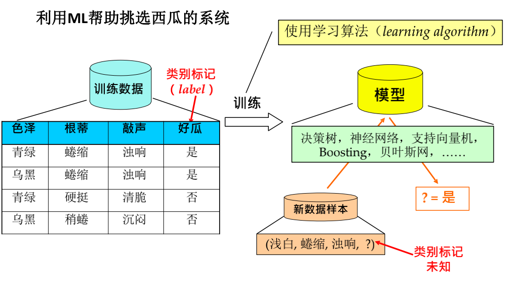

# 章1 绪论

## 1.1 机器学习的概念

### 什么是机器学习？

机器学习是从人工智能中产生的一个重要学科分支，是实现智能化的关键

**经典定义：**

-   利用经验改善系统自身的性能

**1959年ARTHUR SAMUEL给出定义：**

-   机器学习是这样的领域，它赋予计算机学习的能力，那么这种学习能力不是通过显著式编程获得的。

**Tom Mitshell给出定义：**

-   对于某给定的*任务T*，在合理的性能度量*方案P*的前提下，某计算机程序可以自主学习*任务T*的*经验E*；随着提供合适、优质、大量的*经验E*，该程序对于*任务T*的性能逐步提高。
-   这里最重要的是机器学习的对象： 

1.  任务T：要完成的一个或多个任务，比如图片识别。
2.  经验E：他是一些样本、案例、规则，比如一堆图片。
3.  性能P：它是用来衡量任务T完成的好或不好的评价标准，比如正确率。

-   即：随着任务T的不断执行，经验E的累计会带来计算机性能P的提升。

### 典型的机器学习过程

### 机器学习与数据挖掘的区别

数据挖掘就是试图从海量数据中找出有用的知识。

数据挖掘可以视为机器学习和数据库的交叉，它主要利用机器学习界提供的技术来分析海量数据，利用数据库界提供的技术来管理海量数据。

二者既有区别又有联系，整体来说，机器学习偏理论，数据挖掘偏应用。

### 机器学习能做什么

小数据上：画作鉴别（艺术）、古文献修复（文化）

大数据上：帮助奥巴马胜选（政治）

### 机器学习的发展简史

1.  第一阶段：推理期

    出发点：数学家最聪明！

    主要成就：自动定理证明系统。

    通用问题求解程序失败，机器翻译失败，研究者们意识到，仅有逻辑推理能力是不够的

2.  第二阶段：知识期

    出发点：知识就是力量！

    主要成就：专家系统

    研究者们发现，先总结知识再交给系统太难了

3.  第三阶段：学习期

    出发点：让系统自己学！

    机器学习

### 大数据时代的关键技术

奥巴马提出“大数据计划”后，美国NSF进一步加强资助加州大学研究如何整合将”数据”转变为”信息”的三大关键技术

-   机器学习
-   云计算
-   众包(crowd sourcing)

收集、传输、存储大数据的目的，是为了利用大数据，没有机器学习技术分析大数据， 利用无从谈起

## 1.2 机器学习基本概念

1.  **样本：**关于一个事件或对象的描述，称为样本或记录或示例。 

2.  **数据集：**所有记录的集合称为数据集。 

3.  **数据集表示**：一般，令D={x1,x2…xm}表示包含m个样本的数据集，每个样本由d个属性描述，则每个样本xi=(xi1,xi2…xid)是d维样本空间X中的一个向量，其中xij是xi在第j个属性上的取值。

4.  **属性（特征）**：反映事件或对象在某方面的表现或性质的事项，称为属性或特征。属性上的取值称为属性值。

5.  **属性空间（样本空间、输入空间）：**属性张成的空间。

6.  **特征向量**：样本空间中的每个点对应一个坐标向量。

7.  **维数**：一个样本的特征数。

8.  **标记（label）：**这里关于样本结果的信息，称为标记。

9.  **样例：**拥有了标记信息的样本，称为样例。 

10.  **标记空间（输出空间）：**用(xi,yi)表示第i个样例，其中yi是xi的标记，Y是所有标记的集合，称“标记空间”或“输出空间”。

11.  **训练（学习）：**通过执行某个学习算法，从数据中学得模型的过程称为训练或学习。

12.  **训练样本**：训练过程中使用的数据称为训练数据，其中每个样本称为一个训练样本。

13.  **训练集：**训练样本组成的集合称为训练集。

14.  **测试：**学得模型后，使用其进行预测的过程称为测试 。 

15.  **测试样本：**在训练好模型后，希望使用新的样本来测试模型的效果，则每一个新的样本称为一个测试样本。 

16.  **测试集：**所有测试样本的集合。 

     ------

     

17.  **分类：**若预测的是离散值，此类学习任务称为分类，比如预测是晴天或雨天。对只涉及两个类别的称为二分类任务涉及多个类别时，则称为多分类任务。 

18.  **回归：**若预测的是连续值，此类学习任务称为“回归”，比如明天多少度。

19.  **监督学习：**训练数据有标记信息的学习任务为监督学习。 

20.  **无监督学习**：训练数据没有标记信息的学习任务为无监督学习，常见的有聚类和关联规则。

21.  **泛化能力**：机器学习出来的模型适用于新样本的能力，即从特殊到一般。一般而言，训练样本越多，我们得到的关于D的信息越多，这样就越有可能通过学习获得具有强泛化能力的模型。

22.  **分布：**通常假设样本空间中全体样本服从一个未知“分布”

23.  **独立同分布：**我们获得的每个样本都是独立地从这个分布D上采样获得的，即独立同分布（简称I.I.D. ）independently identically distribution。

## 1.3 机器学习主要分类

1.  监督学习：从给定的训练数据集中学习出一个函数，当输入新数据时，可以根据这个函数预测结果。预测问题
2.  无监督学习：输入数据没有标签，样本数据类别未知，需要根据样本间的相似性对样本集进行划分，聚类问题
3.  强化学习：不同于监督学习和无监督学习，强化学习不要求预先给定任何数据，而是通过接受环境对动作的反馈获得学习学习并更新模型参数

# 章2 模型的评估与选择

## 2.1 误差与过拟合

1.  **误差：**指模型输出与真值（labels）的偏离程度，通常定义一个损失函数（loss function）来衡量误差的大小

2.  **错误率：**把分类错误的样本数占样本总数的比例称为错误率，即如果有m个样本中有a个样本分类错误，则错误率E=a/m。

3.  **精度：**1 - a/m称为精度，即精度=1-错误率。

4.  **经验误差**：在训练集上的误差，经验误差的大小反映了模型在训练数据上拟合效果的好坏

5.  **测试误差**：在测试集上的误差称为测试误差。经验误差的大小反映了模型在训练数据上拟合效果的好坏。

6.  **泛化误差：**模型在未知样本上的误差，通常将测试误差作为泛化误差的近似值，泛化误差用于衡量训练好的模型对未知数据的预测能力。

    ------

    

7.  **过拟合：**学习能力太强，把训练样本中不太一般的特性都学了。

8.  **欠拟合：**学习能力太差，训练样本的一般特性都没学好。

-   在过拟合问题中，训练误差十分小，但测试误差较大。
-   在欠拟合问题中，训练误差和测试误差都比较大。
-   欠拟合问题比较容易克服，例如增加迭代次数等；
-   但过拟合问题还没有很好的解决方案，是机器学习面临的关键障碍。

### 模型选择

**模型选择中存在的问题：**

1.  在现实任务中，有多种学习算法可供选择。
2.  对同一个学习算法，当使用不同的参数配置时，也会产生不同的模型。

该选用哪一个学习算法、使用哪一种参数配置呢? 

**理想的解决方案：**

1.  对候选模型的泛化误差进行评估
2.  选择泛化误差最小的那个模型

然而，无法直接获得**泛化误差**，而训练误差又由于过拟合现象的存在而不适合作为标准；

### 模型选择的三个关键问题：

1.  如何获得测试结果：评估方法
2.  如何评估性能优劣：性能度量
3.  如何判断实质差别：比较检验

**评估方法：**

对初始数据集进行有效划分，数据集= 训练集 + 测试集，划分要互斥。

采用一个**测试集**来测试学习器对**新样本**的判别能力，然后以测试集上的**测试误差**为**泛化误差**的近似。

有一个包含m个样例的数据集D={(x1,y1),(x2,y2)...(xm,ym)}，既要训练，又要测试，怎样才能做到呢?

通过对D进行适当的处理，从中产生出训练集S和测试集T，训练集与测试集互斥。

**常见方法：**

1.  留出法
2.  交叉验证法
3.  自助法

### 留出法

以二分类任务为例，假定D包含1000个样本，将其划分为训练集S包含700个样本，测试集T包含300个样本。用S进行训练后，如果模型在T上有90个样本分类错误，那么其

**错误率** = (90/300) x 100%=30%， 

**精度** = 1-30%=70% 。

划分要尽可能**保持数据分布的一致性**

**分层采样**：如果D包含500正例，500反例，则分层采样得到的S应该包含350个正例，350个反例，T包含150个正例，150个反例。

### 交叉验证法

**基本思想是**： 

将数据集D划分为k个大小相同的互斥子集，尽可能保持数据分布一致性，采用分层抽样获得这些子集

1.  每次用k-1个子集的并集作为训练集，余下的那个子集作为测试集， 
2.  这样就有K种训练集/测试集划分的情况，从而可进行k次训练和测试，最终返回k次测试结果的均值。

交叉验证法也称“k折交叉验证”， k最常用的取值是5，10，20等。

k=m时，称为留一法

### 自助法

基于“自助采样”亦称有放回采样、可重复采样

**基本思想是：** 

给定包含m个样本的数据集D， 

1.  每次随机从D 中挑选一个样本
2.  将其拷贝放入D’
3.  然后再将该样本放回初始数据集D 中，使得该样本在下次采样时仍有可能被采到。
4.  重复执行m 次，就可以得到了包含m个样本的数据集D’。

-   训练集= D’，测试集= D - D’

### 调参与最终模型

**算法参数：**一般人工设定，称为超参数

**模型参数：**一般学习确定

**调参过程：**

1.   先产生若干模型
2.  然后基于某种评估方法进行选择

**训练集、测试集、验证集的区别**

验证集：模型评估与选择中用于评估测试的数据集常称为“验证集”

算法参数选定后，要用“训练集+验证集”重新训练最终模型

