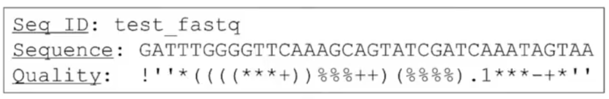

[生物信息2](https://www.bilibili.com/video/BV13t411G7oh?p=18)

## 新一代测序

FASTQ格式

除了具体的序列之外，还包含了每个碱基对应的质量信息

p=the probability of a base calling is wrong
$$
Quality= -10 *log_{10}(p)
$$
也就是测试质量为20时，q=0.01

在此基础上，

q值按照转换表，被编码成ASCII码字符，保存在FASTQ文件中

通过质量信息，可以判断对应碱基字符的可靠程度

根据经验规则，在实际分析工作中，常常将质量分数小于20，即错误概率大于0.01的碱基认为是不可靠的，如果这样的碱基超过Reads长度的20%，就会考虑将此条Read丢弃掉

另一方面，为了克服Reads过短带来的问题，新一代测序广泛运用Paired-End Reads

也就是同时对较长片段两端进行测序，会在最后加/1 /2 来区分

除了DNA，新一代测序技术还用来研究表冠遗传修饰，RNA转录组，以及蛋白DNA相互作用等重要生物学问题
